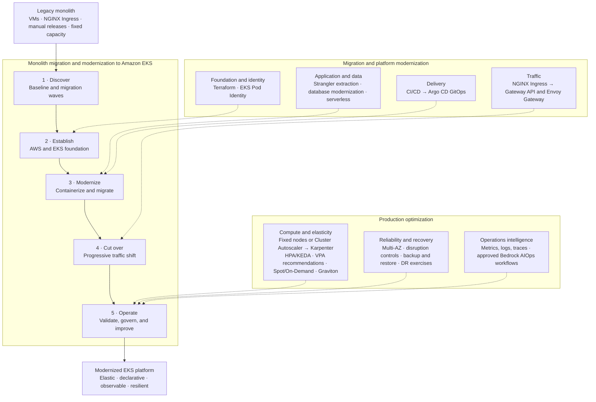

# Professional Experiences

## Solutions

- [Legacy Application Migration and Modernization to Amazon EKS](docs/solutions/migrate-modernize-to-eks/README.md) — the end-to-end journey from discovery and platform foundation through migration, cutover, validation, handoff, and 21 decision-gated migration and modernization extensions.
  - **Foundation and delivery:** [Secure Enterprise AWS Foundation and IaC Delivery](docs/solutions/aws-foundation-iac/README.md) and [GitOps Platform Modernization with Argo CD](docs/solutions/gitops-platform-modernization/README.md)
  - **Application, data, and traffic:** [Database Migration and Modernization](docs/solutions/database-migration-modernization/README.md), [Serverless Application Modernization](docs/solutions/serverless-application-modernization/README.md), and [NGINX Ingress to Kubernetes Gateway API and Envoy Gateway](docs/practices/k8s/envoy-gateway.md)
  - **Reliability, cost, and recovery:** [Amazon EKS Reliability and Cost Optimization](docs/solutions/eks-reliability-cost-optimization/README.md) and [Resilient Amazon EKS Disaster Recovery](docs/solutions/eks-disaster-recovery/README.md)
  - **Operations intelligence:** [Agentic AIOps on Amazon Bedrock and Amazon EKS](docs/solutions/agentic-aiops-bedrock/README.md)

## Architecture & Engineering Practices

### AWS Cloud

- Cloud foundations: [IAM Roles for Service Accounts](docs/practices/aws/use-iam-roles-for-service-account.md), [Terraform Architecture and Best Practices](docs/practices/aws/terraform-architecture-best-practices.md), and [Enterprise AWS Networking and Security](docs/practices/aws/enterprise-networking-security.md)
- Application platforms and operations: [Serverless and Event-Driven Architecture](docs/practices/aws/serverless-event-driven-architecture.md), [AWS Observability and Operational Automation](docs/practices/aws/observability-operational-automation.md), and [Customer Delivery and Handoff](docs/practices/aws/customer-delivery-handoff.md)

#### EKS Best Practices

- Reliability and elastic capacity: [Reliability](docs/practices/aws/eks-bpg/eks-bp-reliability.md), [Scalability](docs/practices/aws/eks-bpg/eks-bp-scalability.md), and [Autoscaling](docs/practices/aws/eks-bpg/eks-bp-autoscaling.md)
- Secure networking and lifecycle operations: [Security](docs/practices/aws/eks-bpg/eks-bp-security.md), [Networking](docs/practices/aws/eks-bpg/eks-bp-networking.md), [Upgrades](docs/practices/aws/eks-bpg/eks-bp-upgrades.md), and [Rollback](docs/practices/aws/eks-bpg/eks-bp-rollback.md)
- Workload economics and deployment models: [Cost Optimization](docs/practices/aws/eks-bpg/eks-bp-cost-optimization.md), [Hybrid Deployments](docs/practices/aws/eks-bpg/eks-bp-hybrid.md), and [AI/ML](docs/practices/aws/eks-bpg/eks-bp-aiml.md)

### Kubernetes Platform Engineering

- Core platform: [Kubernetes Architecture](docs/practices/k8s/architecture.md), [Networking](docs/practices/k8s/networking.md), [Storage](docs/practices/k8s/storage.md), and [Cluster Administration](docs/practices/k8s/admin.md)
- Workload operations: [Observability](docs/practices/k8s/observability.md), [Scheduling, Preemption, and Eviction](docs/practices/k8s/scheduling.md), [Cluster Scalability and High Availability](docs/practices/k8s/k8s-cluster-scalability-ha-bp.md), and [Envoy Gateway](docs/practices/k8s/envoy-gateway.md)
- Security and delivery: [Kubernetes Security](docs/practices/k8s/security.md), [Resource Governance and PID Protection](docs/practices/k8s/policy.md), [Secure Configuration and Secrets](docs/practices/k8s/k8s-secure-config-secret-bp.md), [Pod Security Standards](docs/practices/k8s/k8s-pod-security-standards-bp.md), [PKI and Certificates](docs/practices/k8s/k8s-pki-certificate-bp.md), [Helm Chart Best Practices](docs/practices/k8s/helm-bp.md), and [Dockerfile Best Practices](docs/practices/k8s/dockerfile-best-practices.md)

### DevSecOps

- Security scanning: [Layered Trivy Security Scanning with GitLab CI/CD](docs/practices/devsecops/trivy-security-scanning-with-gitlab-ci.md)
- Delivery and GitOps: [CI/CD Pipeline Best Practices](docs/practices/devsecops/cicd-pipeline-best-practices.md) and [Argo CD GitOps Best Practices](docs/practices/devsecops/gitops-argocd.md)

### Performance Engineering

- Performance analysis: [Percentile-Based Performance Optimization](docs/practices/performance/percentile-based-performance-optimization.md) and [Latency Lags Bandwidth](docs/practices/performance/latency-lags-bandwidth.md)
- Engineering perspectives: [Why Discord Is Switching from Go to Rust](docs/practices/performance/why-discord-is-switching-from-go-to-rust.md)

### Style

- Writing and documentation: [Google Technical Writing](docs/practices/style/google-technical-writing.md), [JSON Style Guide](docs/practices/style/json-style-guide.md), [Markdown Style Guide](docs/practices/style/markdown-style-guide.md), and [Resume Guide](docs/practices/style/resume-guide.md)
- Programming languages and design: [SOLID Principle](docs/practices/style/SOLID-Java.md), [Go Style Guide](docs/practices/style/go-style-guide.md), [Java Style Guide](docs/practices/style/java-style-guide.md), [Oracle Secure Coding Guidelines for Java](docs/practices/style/oracle-secure-coding-guidelines-for-java.md), and [Python Style Guide](docs/practices/style/python-style-guide.md)
