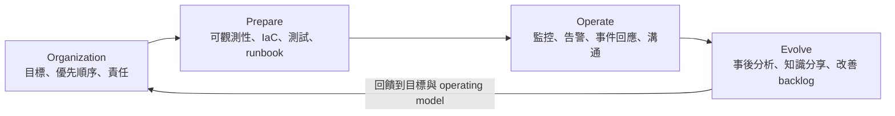
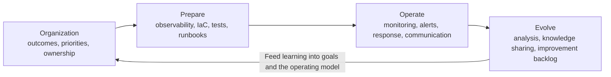

# AWS Well-Architected Framework：卓越營運支柱

卓越營運（Operational Excellence）是讓團隊持續、可靠地交付客戶成果的能力。它不只包含監控與 incident response，也涵蓋組織責任、變更安全、operational readiness，以及從每次營運事件中持續學習。

## 營運生命週期

## 設計原則

- 依 business outcomes 組織團隊，讓 ownership、KPI 與優先順序一致。
- 建立能產生 actionable insights 的 observability，而非只有 dashboards。
- 在 guardrails、rate limits、error thresholds 與 approvals 下安全自動化。
- 採用小型、頻繁、可逆的變更，降低 blast radius。
- 經常驗證並改善 runbooks、playbooks 與 operating procedures。
- 預期失敗，透過演練確認系統與人員能正確回應。
- 從所有 operational events 與 metrics 學習，不只檢討重大 incidents。
- 適當採用 managed services，將人力集中在差異化的 customer outcomes。

## Review map

| AWS 問題群組 | Review 重點 | 應具備的證據 |
|---|---|---|
| OPS01 - Priorities | 外部與內部客戶需求、governance、compliance、threats、trade-offs | 已核准的 outcomes、KPI、risk register、決策紀錄 |
| OPS02 - Operating model | Application 與 platform 的 engineering/operations ownership 與交接 | RACI、service ownership、on-call 與 escalation model |
| OPS03 - Culture | Executive sponsorship、授權、溝通、實驗、技能與資源 | Training plan、改善時間、blameless escalation 與 leadership review |
| OPS04 - Observability | Application、user experience、dependency telemetry 與 distributed tracing | SLI/SLO、metrics、logs、traces、synthetics、correlation IDs |
| OPS05 - Design for operations | Version control、configuration management、CI/CD、patching、standards、多環境 | IaC、pipeline evidence、artifact provenance、environment promotion records |
| OPS06 - Deployment risk | 失敗計畫、安全 deployment strategy、自動測試與 rollback | Canary/blue-green criteria、rollback trigger、rehearsal result |
| OPS07 - Readiness | 人員能力、operational readiness review、runbooks、playbooks、support plan | ORR sign-off、support coverage、tested procedures |
| OPS08 - Workload observability | 分析 metrics/logs/traces，建立 actionable alerts 與 dashboards | Alert owner、business impact、runbook、dashboard、noise review |
| OPS09 - Operational health | 衡量營運 KPI、溝通趨勢並排定改善優先順序 | Operations review、trend report、owned improvement backlog |
| OPS10 - Event response | Event、incident、problem management、escalation 與客戶溝通 | Incident timeline、status templates、automation audit trail |
| OPS11 - Evolve | Post-incident analysis、feedback loops、knowledge management、改善時間 | Action owners、due dates、驗證結果、跨團隊 lessons learned |

## 個別 best practices

### OPS01 - Organization priorities

#### OPS01-BP01 Evaluate external customer needs

**目的與預期成果**

讓 business、development 與 operations 等關鍵利害關係人共同判斷應優先處理哪些 external customer needs。團隊應從 customer outcomes 反推工作，理解 operational practices 如何支援 business outcomes，納入所有相關角色，並建立持續收集外部客戶需求的機制。

**常見反模式**

- 未檢視歷史 support requests，就決定核心營業時間以外不提供 customer support，因此無法判斷對客戶的影響。
- 未與客戶確認需求、期望形式或透過 experiment 驗證，就直接開發新功能。

**建立此實務的效益**

理解外部客戶真正需要的 outcomes 與 operational support，可讓團隊把有限資源優先投入最能交付 business value 的工作，也能提高客戶持續使用服務的可能性。

**Implementation guidance**

1. **Understand business needs：** 以共同目標及共同理解作為 business success 的基礎，讓 business、development 與 operations 對預期成果形成一致認知。
2. **Review business goals, needs, and priorities of external customers：** 由上述關鍵利害關係人共同討論外部客戶的目標、需求與優先順序，據此完整理解達成 business 與 customer outcomes 所需的 operational support。
3. **Establish a shared understanding：** 明確說明 workload 的 business functions、各團隊在營運 workload 時的角色，以及這些職責如何共同支援內外部客戶與共享的 business goals。

#### OPS01-BP02 Evaluate internal customer needs

**目的與預期成果**

讓 business、development 與 operations 共同理解 internal customers 對 platform、process 與 service 的需求，並依已建立的 priorities，把改善投入最有影響力的項目，例如技能、workload performance、cost、runbook automation 或 monitoring。需求改變時，priorities 也要同步更新。

**常見反模式**

- 未諮詢 product teams 就更改 IP address allocation，只因為這樣較容易管理 network。
- 未確認 internal customers 是否需要、是否符合既有 practices，就導入新的 development tool。
- 未先收集 internal customers 的 monitoring 與 reporting needs，就建置新的 monitoring system。

**建立此實務的效益**

把內部客戶的實際工作方式與需求納入決策，可避免 provider team 自行猜測，並使改善工作更直接地支援 business value。

**Implementation guidance**

1. **Understand business needs：** 讓 business、development 與 operations 以共享目標及共同理解建立合作基礎。
2. **Review business goals, needs, and priorities of internal customers：** 與關鍵利害關係人討論 internal customers 的目標、需求和優先順序，確認為達成 business 與 customer outcomes 所需的 operational support。
3. **Establish shared understanding：** 對 workload 的 business functions、各團隊的營運角色，以及這些角色如何支援內外部客戶的共同 business goals 建立一致認知。

#### OPS01-BP03 Evaluate governance requirements

**目的與預期成果**

識別組織內部為達成 business goals 所制定的 policies、rules 與 frameworks，將適用的 governance requirements 納入 workload，並能以持續、可稽核的證據證明 conformance。

**常見反模式**

- 不清楚 organization-wide governance requirements，或只在 architecture review 前臨時確認。
- 以手動檢查或文件聲明 conformance，卻未持續偵測不符合要求的 resources。
- 未與 centralized governance teams 協作，使技術或營運選擇違反組織政策。

**建立此實務的效益**

提早納入治理需求可降低 rework、exception 與 audit failure，並讓 workload 設計和營運持續符合組織目標。

**Implementation guidance**

1. 識別 workload 的所有利害關係人，包括 centralized teams。
2. 與利害關係人合作，盤點會影響 workload 的 governance requirements。
3. 對盤點出的 improvement items 排定優先順序並納入 workload；可使用 AWS Config 將治理要求實作為 code 並持續驗證，也可在 AWS Organizations 中使用 service control policies (SCPs) 落實組織層級限制。
4. 保存可證明要求已實作且持續有效的文件與技術證據。

#### OPS01-BP04 Evaluate compliance requirements

**目的與預期成果**

在 architecture design process 中納入適用的 industry、regulatory 與 internal compliance frameworks。團隊成員必須理解這些要求，並依 framework 持續驗證 workload，而不是假設採用 AWS service 就自動 compliant。

**常見反模式**

- workload 完成後才檢查 compliance，造成 architecture 與 data handling 大幅返工。
- 團隊不知道適用 framework，或未把要求納入 architecture 與 technology choices。
- 稽核開始後才人工蒐集 evidence，沒有可重複的 validation 與 reporting process。

**建立此實務的效益**

將 compliance 內建於設計、交付和營運流程，可降低違規與 audit failure，並縮短持續驗證及產生 evidence 的時間。

**Implementation guidance**

1. 與 security 和 governance teams 確認 workload 必須遵循的 industry、regulatory 或 internal frameworks，並將要求納入 workload；可使用 AWS Security Hub CSPM 等服務持續檢查 AWS resources 的 compliance posture。
2. 教育團隊成員，使其能依 compliance requirements 營運及演進 workload，並在 architecture 與 technology decisions 中主動考量這些要求。
3. 依 framework 所需建立 audit 或 compliance reporting process，並儘可能自動化；可使用 AWS Audit Manager 驗證與產生報告，並透過 AWS Artifact 取得 AWS security 與 compliance documents。

#### OPS01-BP05 Evaluate threat landscape

**目的與預期成果**

持續評估 competition、business liabilities、operational risks 與 information security threats 等威脅，理解已知 threats 的可能性、影響與修補狀態，採取適當 mitigations，並把決策與背景傳達給相關人員。

**常見反模式**

- 使用過時 software library，卻未追蹤可能影響 workload 的 security updates。
- 只在年度 review 更新風險資料，沒有因 vulnerability、service 或 business change 調整 priorities。
- 已知 threat 沒有 owner、mitigation 或 residual-risk decision。

**建立此實務的效益**

比較 threat probability、potential harm、recovery cost 與 prevention cost，可讓團隊在威脅成為 incident 前投入適當防護。

**Implementation guidance**

1. **Evaluate the threat landscape：** 定期評估競爭、business risk and liabilities、operational risks 與 information security threats，並將其 business impact 納入工作優先順序；持續檢視 AWS security bulletins、AWS Trusted Advisor 及相關情報。
2. **Maintain a threat model：** 建立並維護 threat model，記錄 potential threats、已規劃與已實作的 mitigations 及其 priority；比較事件發生機率、復原成本、預期損害與預防成本，並在 threat model 改變時重新排序工作。

#### OPS01-BP06 Evaluate trade-offs while managing benefits and risks

**目的與預期成果**

由適當的 governing body 定義 benefits 與 risks 的衡量方式，根據可靠資料及 cost-benefit analysis 排定決策優先順序。決策權要在 centralized control 與 decentralized authority 之間取得平衡，並清楚理解每個 trade-off 對 strategy 與 business outcomes 的影響。

**常見反模式**

- 所有決策都必須經過相同而繁重的中央流程，使可逆的小型決策也被延誤。
- 只強調 time-to-market，卻未量化 reliability、security、performance 或 cost risk。
- 接受 risk 時沒有共同 decision framework、unblock owner 或可追溯依據。

**建立此實務的效益**

一致且分級的 decision framework 能加速可逆決策、集中管理不可逆決策，並使 benefits、risks 與 organizational priorities 的關係透明。

**Implementation guidance**

1. 在整體 cloud governance framework 中正式建立 benefits measurement practices；平衡中央控制與分散決策權，避免所有決策都套用過度沉重的流程，並納入 compliance 等 external factors。
2. 建立各層級一致同意的 decision-making framework，明確指定利益衝突時由誰解除阻礙；集中處理難以逆轉的 one-way-door decisions，允許較低層級 leaders 處理可逆的 two-way-door decisions。
3. 根據 business goals、needs 與 priorities 識別 benefits 和 risks；評估 benefit value、風險發生機率及 impact cost，再由 business、development 與 operations 共同做出 informed decision。
4. 對關鍵決策使用 programmatic controls，自動執行 compliance requirements。
5. 使用 Value Stream Analysis、LEAN 等已知 frameworks 建立 current-state performance 與 business metrics baseline，再以 iterations 推動可衡量的改善。

### OPS02 - Operating model

#### OPS02-BP01 Resources have identified owners

每個 application、platform component、account、data set 與 operational resource 都要有可聯絡且有權決策的 owner。將 ownership registry 與 catalog、tags、on-call 和 escalation 整合；避免 shared mailbox 或離職者仍是 owner。抽查 resource-to-owner mapping 與 response evidence。

**Implementation guidance**

1. 先定義 ownership 在組織中代表 risk、change、troubleshooting support、financial 或 administrative accountability 中的哪些責任。
2. 使用 AWS Organizations 集中管理 accounts 與 alternate contacts；Billing、Security、Operations contacts 應指向組織控制的 group addresses，而不是個人。
3. 使用 tags 記錄 AWS resource owner 與 contact information，並以 AWS Config rules 檢查必要 ownership tags。
4. 將 enterprise knowledge sources 接入可搜尋的介面，例如 Amazon Q Business，協助人員查找 owner。
5. 對其他 resources、platforms 與 infrastructure，也要在全體 team members 可存取的位置記錄 ownership。

#### OPS02-BP02 Processes and procedures have identified owners

每個 runbook、playbook、change、backup、incident 與 access process 都有人對正確性、更新和 adoption 負責。文件要有 owner、review date、approver 與 consumers；避免無 owner 的 stale wiki。以 version history、exercise result 與 review record 驗證。

**Implementation guidance**

1. 文件化現有 processes/procedures，定期 review，指定 owner，納入 version control，並在相同 architecture 的 workloads/environments 間共用。
2. 建立 review frequency、reviewer/approver、issue 或 ticket queue 等 feedback mechanism；適用時取得 CAB pre-approval 與 risk classification。
3. 透過 tags、明確 error/event messages、wiki 或 document management，讓程序可被需要的人搜尋與存取。
4. 將 enterprise data sources 連接至 Amazon Q Business 等知識介面，改善程序查找與問答。
5. 當 service 提供 API 時，把已充分理解的 procedure 轉為 Systems Manager Automation、Lambda 或 IaC，並量測 automation 的使用與結果。

#### OPS02-BP03 Operations activities have identified owners responsible for their performance

monitoring、patching、backup、capacity、security response 與 service review 等 recurring activities 必須有 accountable owner、schedule、SLA 和 completion evidence。避免假設其他 team 會處理；以 control dashboard、job record 與 overdue escalation 驗證。

**Implementation guidance**

1. 從 responsibility matrices、processes/procedures、roles、tools 與 automation 盤點 documented responsibilities。
2. 與執行團隊比對文件和實際工作的差異，並與 internal customers 確認 service expectation gaps。
3. 找出高頻且耗資源的 activities，採用 patterns 與 prescriptive guidance 加以簡化、標準化，並追蹤改善至完成。
4. 把適合的 procedures 轉為 Lambda、CloudFormation 或 Systems Manager Automation 等 code，納入 version control 與 ownership tags。
5. 明確記錄 activity performance owner，並監控 automation 的啟動、成功、效能和 desired outcome。

#### OPS02-BP04 Mechanisms exist to manage responsibilities and ownership

ownership 必須可查詢、接受、轉移、recertify 與 escalate。以 service-catalog workflow 在 reorganization、leave 或 lifecycle change 時更新；避免口頭交接。測試 orphan detection、new-owner acknowledgement 與 fallback escalation。

**Implementation guidance**

1. 從 RACI、team definitions、service offerings 與 role descriptions 等既有文件開始。
2. 與 teams review documented responsibilities 和實際工作是否一致，並向 internal customers 確認 expectations gaps。
3. 分析並處理差異。
4. 識別高頻、耗資源的改善機會，參考 best practices 與 patterns 進行簡化和標準化，追蹤至完成。
5. 指定 team 或 person 管理 responsibility assignment 與 tracking。
6. 建立簡單的 clarification process，包含 escalation owner、effectiveness metrics、feedback 與 periodic review。
7. 將 ownership 資訊發布在可搜尋、可存取的 wiki 或 documentation portal。

#### OPS02-BP05 Mechanisms exist to request additions, changes, and exceptions

提供一致 intake channel，要求 context、risk、approver、SLA、status 與 expiry，讓 teams 可請求 service、standard 或 policy 變更。避免私下繞過 controls；分析 repeated exceptions 並驗證 expired exceptions 已關閉。

**Implementation guidance**

1. 盤點 workload 的 resources、processes 與 procedures，並在 knowledge management system 記錄 owner；若 ownership 尚未建立，先完成 OPS02-BP01 至 BP03。
2. 與利害關係人共同建立涵蓋 additions、changes 與 exceptions 的輕量 change management process；可使用 Systems Manager Change Manager 管理 workload resource changes。
3. 在 knowledge management system 中發布並維護流程，使所有人都能找到和使用。

#### OPS02-BP06 Responsibilities between teams are predefined or negotiated

application、platform、security、network、data 與 support teams 要對 interfaces、SLO、handoff、change notice 與 escalation 達成共識。避免 ticket ping-pong 或未協商就增加 dependency；以 service contracts、RACI、handoff timing 與 dispute outcomes 驗證。

**Implementation guidance**

1. 與跨組織 stakeholders 依 shared processes 與 procedures 建立 team agreements。
2. 若兩個 teams 共用 procedure，建立說明合作方式的 runbook；若存在 dependency，協議 request response SLA。
3. 在 knowledge management system 記錄 responsibilities、agreements 與 communication channels。

### OPS03 - Organizational culture

#### OPS03-BP01 Provide executive sponsorship

指定 executive sponsor，提供 authority、funding 與跨組織阻礙排除，並在 business reviews 檢視 operational outcomes。避免只口頭支持卻讓 feature delivery 排擠 resilience、training 與 improvement；以 budget、decisions 和 KPI review 驗證。

**Implementation guidance**

1. 建立 single-threaded leadership，指派主要 executive sponsor 領導 transformation。
2. 定義清楚的 business outcomes、ownership、accountability 與 measurement。
3. 由 sponsor 廣泛且一致地溝通 strategy、business objectives 與 key metrics。
4. 建立 communication matrix，定義 audience、message、sender、channel 與 frequency；持續執行、收集 feedback 並調整。
5. Leadership 持續參與各 initiative，確認所有受影響 teams 理解 priority 且有能力交付。
6. 在 status reviews 主動找出 blockers、檢查 metrics、提供資源並追蹤 incremental goal achievement。

#### OPS03-BP02 Team members are empowered to take action when outcomes are at risk

最接近問題的人可在 guardrails 內 stop deployment、shift traffic、rollback 或 escalate。定義 decision rights、safe actions、limits 與 after-action review；避免等待 unreachable manager。以 simulations、incident timeline 和 action audit 驗證。

**Implementation guidance**

1. 建立預期 failures 可能發生的文化。
2. 定義並廣泛溝通各 functional areas 的 ownership 與 accountability。
3. 區分 one-way-door 與 two-way-door decisions，說明何時需要 escalation 或 approval。
4. 讓人員知道自己在不同風險層級可採取哪些 action。
5. 透過 safe environments 與 exercises 練習 response skills，並用 permissions/access 實作授權邊界。
6. 分享 operational successes 與 failures，並讓 teams 挑戰 status quo、追蹤改善結果。

#### OPS03-BP03 Escalation is encouraged

建立 psychological safety，讓人員提早揭露 uncertainty、risk 與 near misses。提供 severity criteria、multiple escalation paths 和 leadership response expectations；避免 seniority 壓制意見或懲罰 bad news。以 survey、near-miss reports 與 escalation timing 驗證。

**Implementation guidance**

1. 定義並廣泛傳達 organization policies、standards 與 expectations。
2. 訓練並授權人員在標準無法達成或 outcome 有風險時及早 escalation。
3. 建立正式 mechanism，例如 Andon cord，並文件化 trigger、method、authority chain 與各層級可採取的 action。
4. escalation 應持續到提出者確認風險已處理；記錄 context、impact 與 requested action，並以 policy 防止 retaliation。
5. 將 escalation 納入 continuous-improvement feedback loops。
6. 由 leadership 定期重申 policies、mechanisms 與對 early escalation 的支持。

#### OPS03-BP04 Communications are timely, clear, and actionable

不同 stakeholders 應在正確時間收到符合角色的 impact、status、action、owner 與 next update。建立 templates、audience map、single source of truth 和 cadence；避免 conflicting channels 或 raw-alert dumps。以 timestamps、acknowledgement 與 feedback 驗證。

**Implementation guidance**

1. 建立負責 communication strategy 與 standards 的 core team，並指定 single-threaded owner 提供 oversight。
2. 與 stakeholders 協議 message format、channels、cadence、urgency 與 required context。
3. 讓 communication team 與 organization/program leaders 持續協作。
4. 建立 strategic mechanisms，例如 announcements 與 shared goals，以及 tactical tools，例如 chat、email 與 knowledge systems。
5. 提供必要 context、details 與可行的反應時間，使接收者能判斷 action。
6. 量測 communication 是否產生預期理解與 action，並用 feedback loop 改善 message、channel 與 timing。

#### OPS03-BP05 Experimentation is encouraged

以 bounded、reversible、measurable experiments 驗證 assumptions。每次試驗要有 hypothesis、success metric、blast radius、stop condition、rollback 和 learning review；避免無界 production 試驗或把 failed hypothesis 當個人失敗。

**Implementation guidance**

1. 取得 organization leadership 對 experimentation 的支持，讓 team members 有時間與權限安全試驗。
2. 提供不影響 production 的 environment；可使用獨立 AWS account 建立具 cost、security 與 access guardrails 的 sandbox。
3. 使用 feature flags 與 A/B testing 控制 exposure 並蒐集 feedback，例如 AWS AppConfig Feature Flags，或以 Lambda versions 提供 beta testing。

#### OPS03-BP06 Team members are encouraged to maintain and grow their skill sets

以 role-based skill matrix、learning time、labs、pairing、certification 與 game days 維持 current skills 並降低 key-person risk。避免只靠個人下班自學或單一 SME；以 coverage、exercise performance 和 succession evidence 驗證。

**Implementation guidance**

1. 使用 structured cloud advocacy program，例如 AWS Skills Guild。
2. 提供專用學習時間，以及 training、labs、events、documentation 與 practice environments。
3. 鼓勵使用 AWS Support、AWS re:Post 與 AWS documentation 等 expert resources。
4. 建立並持續更新可搜尋的 knowledge repository。
5. 規劃 continuing education、pairing、cross-team engagement 與 knowledge transfer。
6. 支援取得與維持適合角色的 industry certifications。

#### OPS03-BP07 Resource teams appropriately

依 demand、toil、incident load、roadmap、leave 與 support hours 做 staffing/capacity planning。避免長期 overtime、on-call burnout 或讓 improvement 永遠被 feature work 中斷；以 staffing gaps、toil ratio、on-call load 與 backlog age 驗證。

**Implementation guidance**

1. 以 staffing、skill coverage、toil、on-call load、paging 與 outcome metrics 定義 team success criteria。
2. 建立 resource capacity planning 與定期 inspection，平衡 internal teams、partners、managed services 與 automation。
3. 使用定期 survey 或其他 mechanism 了解 workload、skills、support burden 與 team sentiment。
4. 與 teams 檢視趨勢，及早發現 burnout、on-call fatigue、knowledge gaps 與 transition risk。
5. 定期重新評估現有人力是否足夠，必要時補充、重新配置、訓練或調整 scope。

### OPS04 - Implement observability

#### OPS04-BP01 Identify key performance indicators

從 critical customer journeys 與 failure modes 定義少量可決策的 business/operational KPI、SLI/SLO、threshold、owner 與 action。避免 vanity metrics 或沒有決策的 dashboard；以 KPI-to-outcome mapping、review cadence 和 resulting actions 驗證。

**Implementation guidance**

1. 先確認 desired business outcomes，例如 sales、engagement 或 response time。
2. 找出真正影響 business objectives 的 technical metrics，並優先使用能直接顯示問題的 business KPI。
3. 使用 CloudWatch 定義和監控代表 KPI 的 metrics。
4. 隨 workload 與 business 演進，定期 review 並更新 KPI。
5. 讓 technical 與 business stakeholders 共同定義和 review KPI。

#### OPS04-BP02 Implement application telemetry

applications 要發出 structured metrics、logs 與 events，涵蓋 traffic、errors、latency、saturation、correctness、domain transactions、version 和 correlation IDs。避免只收 host metrics 或 free-text logs；以 telemetry coverage、schema、retention 和 incident queries 驗證。

**Implementation guidance**

1. 識別能說明 workload health、performance 與 behavior 的必要 metrics、logs 和 traces。
2. 部署 CloudWatch agent，收集 application 與 underlying infrastructure 的 system/application metrics 和 logs。
3. 在 application code 中加入 domain、transaction、error 與 correlation context，而不只依賴 infrastructure telemetry。
4. 使用 AWS X-Ray 或 OpenTelemetry 產生 traces，並分析 service maps、latency distributions 與 trace timelines。
5. 建立 dashboards、queries 和 alerts，定期檢查 telemetry coverage、quality、retention 與 sensitive-data handling。

#### OPS04-BP03 Implement user experience telemetry

從 end-user perspective 量測 availability、latency、errors 與 journey completion，結合 RUM、synthetics、frontend/mobile telemetry 和 support signals。避免 backend green 就假設 customer healthy；以 region/device segmentation、privacy controls 與 journey dashboards 驗證。

**Implementation guidance**

1. 定義需要觀察的 critical user journeys、success criteria 與 user segments。
2. 使用 CloudWatch RUM 收集真實使用者的 page load、client errors、performance、device、browser 與 location signals。
3. 使用 CloudWatch Synthetics canaries 模擬重要流程，在沒有真實 traffic 時也能持續驗證 endpoint 與 journey。
4. 將 RUM、synthetics 與 X-Ray traces 關聯，從 user symptom 追查 backend dependency。
5. 設定 privacy、sampling、retention 與 alert thresholds，並依新 journeys 和 customer feedback 更新 coverage。

#### OPS04-BP04 Implement dependency telemetry

建立 internal、AWS、SaaS 與 partner dependency map，收集 client-side latency、errors、timeouts、quota、circuit state 與 provider status。避免只依 provider dashboard；為每個 dependency 設 owner/fallback，並以 failure tests 和 traces 驗證。

**Implementation guidance**

1. 與 stakeholders 完整盤點 external dependencies，例如 databases、third-party APIs、network paths 與 DNS。
2. 依每個 dependency 的 criticality、expected behavior、SLA/SLT 建立 monitoring strategy 與 proactive alerts。
3. 使用 CloudWatch Internet Monitor 與 Network Monitor 觀察 internet/network conditions，辨識 outages、disruptions 或 degradation。
4. 建立 dependency dashboards 與 failure signals，並隨 priorities、goals 與新 insights 定期更新 strategy。

#### OPS04-BP05 Implement distributed tracing

跨 services、queues 與 data stores 傳遞 trace/correlation context，標記 service、operation、version、tenant 與 error，並連結 logs/metrics。避免 async boundaries 遺失 context 或洩漏 sensitive data；以 representative journeys 與 trace completeness 驗證。

**Implementation guidance**

1. 將 AWS X-Ray 整合至 application，使用 X-Ray Insights 分析 behavior、performance 與 bottlenecks。
2. Instrument 每個 service，包括 Lambda、EC2、containers 與 asynchronous components。
3. 將 CloudWatch RUM 與 synthetic monitoring 連結 traces，結合 real-user 和 simulated journeys。
4. 使用 CloudWatch agent 傳送 X-Ray 或 OpenTelemetry traces。
5. 使用 Amazon DevOps Guru 關聯 X-Ray、CloudWatch、AWS Config 與 CloudTrail，產生 actionable recommendations。

### OPS05 - Design for operations

#### OPS05-BP01 Use version control

將 application、infrastructure、configuration、policy 與 procedures 納入 protected repositories，透過 review 與 immutable history 追蹤。避免 console-only changes 或未版控 runbooks；以 commit-to-deployment trace、approval 與 drift detection 驗證。

**Implementation guidance**

1. 識別需要 version control 的 assets，包括 source、IaC、configuration、documents、runbooks 與 binary definitions。
2. 使用 protected repositories、branch/review policy 與 traceable history 管理變更。
3. 將 configuration-management systems 的 version-control capability 整合到 operational procedures。
4. 確認 deployment 可追溯到版本，能偵測未授權變更，並可回復 known-good version。

#### OPS05-BP02 Test and validate changes

在 promotion 前以 unit、integration、contract、security、performance、resilience 與 policy tests 驗證功能和 operability。避免只測 happy path 或把 deployment success 當 business success；保留 results、approvals 和 runtime verification。

**Implementation guidance**

1. 建立適用於 application code、infrastructure 與 configuration 的 organization testing standard。
2. 在 CI 中自動執行 unit、integration、security、regression、performance、policy、boundary 與 failure-condition tests。
3. 發布 test results 以提供快速 feedback，並阻擋未達標的 change。
4. 在 production-like environment 驗證 operability 與 recovery。
5. 可使用 Amazon Q Developer 輔助產生 tests 和找出 vulnerabilities，但輸出仍須 review 與 pipeline validation。

#### OPS05-BP03 Use configuration management systems

以 declarative desired state、schema validation、policy、GitOps/IaC 與 audit 管理 configuration，並分離 secrets。避免 manual snowflakes 或多個 owners 寫同一設定；以 drift report、controlled promotion 與 reproducible rebuild 驗證。

**Implementation guidance**

1. 指定 configuration owners，並讓他們理解 compliance、governance 與 regulatory requirements。
2. 盤點 deployment 影響的 application/environment configuration items 與 deliverables。
3. 將 configuration 納入 version control、review、validation 與 promotion process，並分離 sensitive values。
4. 使用 AWS Config 記錄 resource configuration history、relationships 與 conformance。
5. 對 dynamic configuration 使用 AWS AppConfig 進行 validation、staged rollout、monitoring 與 rollback。

#### OPS05-BP04 Use build and deployment management systems

以 standardized pipelines、artifact repositories、provenance、gates、status 與 rollback 建立 repeatable delivery，並 promotion 同一 immutable artifact。避免 per-environment rebuild 或手動 copy；以 digest、pipeline record 和 deployment inventory 驗證。

**Implementation guidance**

1. 使用 version-control system 儲存 documents、source code 與 binary definitions。
2. 使用 CodeBuild 或等效 builder 編譯、執行 unit tests 並產生 immutable artifacts。
3. 使用 CodeDeploy 或等效 service 自動部署至 EC2、on-premises、Lambda、ECS 或其他 targets。
4. 監控 deployment status、health、validation 與 rollback，保存 artifact-to-environment traceability。

#### OPS05-BP05 Perform patch management

維護 OS、runtime、container、library、appliance 與 managed-service version inventory，依 vulnerability/lifecycle 使用 test rings、windows 與 exception expiry。避免 emergency-only patching；以 patch SLA、coverage、rollback 和 unsupported assets 驗證。

**Implementation guidance**

1. 依 vulnerabilities、features、governance 與 vendor support 定義 patch policy、priority 和 schedule。
2. 對 mutable systems 自動 patch；對 immutable systems 建立含正確 patch set 的新 image 後重新部署。
3. 使用 EC2 Image Builder 建立 image pipeline，定義 schedule、dependencies、recipe、base image、components、registry 與 infrastructure settings。
4. promotion 前測試 image，保留 previous known-good image 與 rollback path。
5. 定期更新 recipes、components 和 base images，追蹤 coverage 與 exceptions。

#### OPS05-BP06 Share design standards

發布可版本化的 reference architectures、templates、golden paths、examples 與 exception process，涵蓋 architecture、security、observability 和 operations。避免 standards 只存在 slide；以 adoption、exceptions、design reviews 和 outcome metrics 驗證。

**Implementation guidance**

1. 指定 cross-functional team 負責建立和更新 design standards。
2. 發布可搜尋的 standards、checklists、operating procedures、guidance、templates 與 examples。
3. 將 standards 嵌入 reusable patterns 和 delivery workflows，並讓 teams 知道如何取得。
4. 建立 additions、changes 與 exceptions 的 request mechanism。
5. 依新 services、best practices、feedback 與 outcomes 定期 review 和更新。

#### OPS05-BP07 Implement practices to improve code quality

採用 coding standards、peer review、static analysis、tests、complexity/dependency controls 與 refactoring capacity。避免只追 coverage percentage；將 production findings 回饋開發，並以 defect escape、maintainability 和 incident trend 驗證。

**Implementation guidance**

1. 將 test-driven development、code review 與 pair programming 納入 CI/CD。
2. 以 coding standards、automated tests、static analysis、security scanning 和 dependency checks 建立 merge gates。
3. 可使用 Amazon Q Developer 輔助 tests、code generation、vulnerability/secret/IaC scanning 與 documentation，但須 human review。
4. 可使用 CodeGuru Reviewer 等工具提供 code recommendations。
5. 依 production defects、maintainability、review findings 與 incident trends 持續改善 practices。

#### OPS05-BP08 Use multiple environments

定義 dev/test/staging/production purposes、promotion rules、test data、isolation 與 parity，並以 IaC 建立 ephemeral environments。避免 shared mutable tests 或 secrets reuse；以 environment parity、cleanup 和 promotion trace 驗證。

**Implementation guidance**

1. 為 development、sandbox、test、staging 與 production 定義 purpose、owners、data 和 controls。
2. 提供 controls 較少但仍具安全和成本 guardrails 的 sandbox，讓 developers 平行實驗。
3. 越接近 production，逐步提高 approval、security、data 與 change controls。
4. 使用 IaC 和 configuration management 重複建立 environments，維持 production 關鍵設定 parity。
5. 自動管理 ephemeral environment lifecycle 和 cleanup。

#### OPS05-BP09 Make frequent, small, reversible changes

縮短 branches 與 batch size，使用 feature flags、backward-compatible schema、canary 和 automated rollback。避免 big-bang release、同時改太多 variables 或 irreversible migration；以 lead time、change failure rate、batch size 和 rollback time 驗證。

**Implementation guidance**

1. 將 change 分解為可獨立 test、deploy 與 observe 的小單位。
2. 使用 backward-compatible API、schema 和 configuration transitions，避免 big-bang cutover。
3. 使用 feature flags、branch by abstraction 或 incremental rollout，將 deployment 與 release 解耦。
4. 每個 change 都具 clear rollback 或 safe fix-forward path。
5. 以 change size、lead time、frequency、failure rate 和 recovery time 檢查成效。

#### OPS05-BP10 Fully automate integration and deployment

以 pipeline-as-code 自動 integration、tests、quality/security gates、immutable artifact promotion、progressive deployment、post-deploy checks 與 rollback。避免 copy/paste 和 bypassed gates；以 end-to-end audit、manual-step count 和 recovery drill 驗證。

**Implementation guidance**

1. 將 check-in、build、tests、artifact publication、deployment 與 post-deployment validation 串成一致 pipeline。
2. 只 promotion 同一 immutable artifact，不在各 environment 重新 build。
3. 以 automated policies 和 quality gates 阻擋不合格 change，僅在需要 business/risk decision 時保留 approval。
4. 自動保存 provenance、test results、approvals、deployment status 與 environment inventory。
5. pipeline failure 必須能安全 stop、retry 或 rollback，並向 owner 提供 actionable feedback。

### OPS06 - Mitigate deployment risks

#### OPS06-BP01 Plan for unsuccessful changes

在 change 前定義 code、configuration、schema、data、dependency 與 capacity failure scenarios、stop conditions、rollback/roll-forward 和 decision owner。避免失敗後才設計 rollback；以 pre-change review、backup、compatible versions 與 timed rehearsal 驗證。

**Implementation guidance**

1. 建立一致且文件化的 release policy，定義何時 rollback、何時允許 fix forward。
2. production deployment 前完成 plan，包含 triggers、decision owner、steps、dependencies 與 communication。
3. 確認 application、infrastructure、configuration 與 data changes 具 compatibility 或有效 recovery path。
4. 在 production-like environment 測試 recovery procedure 並量測 recovery target。
5. 將 deployment outcomes 與 lessons 回饋至 policy 和 procedure。

#### OPS06-BP02 Test deployments

在 production-like environment 以同一 pipeline 測試 permissions、quota、timeout、dependency、schema、retry、partial state 與 rollback。避免只測 application binary；以 idempotency、interrupted-deployment result 和 rollback evidence 驗證。

**Implementation guidance**

1. 執行 pre-install checks，使 pre-production 與 production 的關鍵條件一致。
2. 使用 CloudFormation drift detection 找出 IaC 外變更，並以 change sets 確認實際 actions 符合 intent。
3. 在 pipeline 中設定必要 approval，授權部署至 pre-production。
4. 使用 CodeDeploy AppSpec 或等效 configuration 定義 deployment 與 validation steps。
5. 執行 health、functional、security、regression、integration、load 與 recovery tests 後再 promotion。

#### OPS06-BP03 Employ safe deployment strategies

依 workload 選 rolling、canary、linear、blue/green 或 feature flags，定義 cohort、bake time、health metrics、alarm 和 traffic rollback。避免同時更新所有 failure domains；以 rollout timeline、gate decisions 和 customer metrics 驗證。

**Implementation guidance**

1. 依 architecture、change risk、state/data compatibility 與 recovery capability 選擇 strategy。
2. 使用 one-box/canary、linear 或 waves 先暴露少量 traffic/capacity，經 bake time 後再擴大。
3. 使用 blue/green、immutable deployment 或 traffic shifting 支援快速切換。
4. 使用 feature flags 將 code deployment 與 customer release 分離。
5. 為每個 stage 定義 health criteria、automatic stop、rollback 與 maximum blast radius。

#### OPS06-BP04 Automate testing and rollback

將 pre/post-deploy tests、synthetics、SLO/error-budget gates、alarms 與 rollback workflow 整合；data changes 必須有 safe roll-forward。避免只靠 operator 目測 dashboard；以 injected failures、rollback time 和 false-positive review 驗證。

**Implementation guidance**

1. 優先自動化每次 change 都需執行、且能降低最大風險的 test cases。
2. 將 functional、integration、security、performance、synthetic 與 business-outcome checks 整合至 pipeline。
3. 為 success、failure 與 inconclusive result 預先定義 thresholds 和 decision logic。
4. 未達 predefined outcomes 時，自動停止 rollout 並回復 previous known-good state。
5. 依 false positives、missed failures、rollback duration 與 manual intervention 改善 tests 和 triggers。

### OPS07 - Operational readiness and change management

#### OPS07-BP01 Ensure personnel capability

production support roles 必須有足夠 staffing、skills、access、on-call coverage 與 context，包含 vendors 和 time zones。避免 go-live 依賴 unavailable builder；以 roster、skill matrix、access test、shadowing 和 incident simulation 驗證。

**Implementation guidance**

1. 配置足夠人力支援 normal operations、on-call、security issues 與 certificate rotation/end-of-support 等 lifecycle events。
2. 針對 workload 所用 software 和 platforms 提供 training，搭配 AWS Training and Certification、events 或 webinars。
3. 定期重新評估 team size 和 skills，依 operating conditions/workload changes 調整，並確認能處理 planned lifecycle events 與 AWS Health 通知的 unplanned events。

#### OPS07-BP02 Ensure a consistent review of operational readiness

以一致且 risk-tiered 的 ORR 在 production 前 review ownership、telemetry、alarms、capacity、security、backup/restore、runbooks、support 與 rollback。避免 evidence-free checklist；以 sign-off、exceptions、accepted risk 和 re-review triggers 驗證。

**Implementation guidance**

1. 召集 security、operations、development 等 key stakeholders。
2. 每個 stakeholder 至少提出一項 requirement；第一版 checklist 先限制在約 30 項以內。
3. 將 requirements 集中管理；可用 AWS Well-Architected Tool custom lens 建立並跨 accounts/Organization 分享 ORR。
4. 選一個 pre-launch 或 internal workload 試行 ORR。
5. 執行 checklist，記錄 discoveries；已有 mitigation 者可接受，沒有 mitigation 者須加入 backlog 並在 launch 前處理。
6. 持續加入新 best practices、governance、lessons learned 與 requirements，並逐步以 AWS Config、Security Hub CSPM 或 Control Tower controls 自動檢查。

#### OPS07-BP03 Use runbooks to perform procedures

runbook 要包含 prerequisites、permissions、steps、expected output、stop/rollback、validation、owner 與 last-tested date，並優先安全 automation。避免 stale screenshots 或 tacit knowledge；以 execution logs 和 drills 驗證。

**Implementation guidance**

1. 若沒有 repository，先建立 version-controlled documentation repository 或 wiki。
2. 選擇一個半定期執行、步驟少且 failure impact 低的 process 作為第一份 runbook。
3. 使用 template 記錄 ID、目的、desired outcome、tools、permissions、author、last updated 與 escalation contact。
4. 寫出逐步 procedure、expected results、error handling 與 escalation。
5. 讓另一位 team member 實際執行以驗證清楚度，修正缺漏。
6. 發布並通知 stakeholders，依 change management 維護版本。
7. 隨 library 和 maturity 成長，使用 Systems Manager Automation 等工具逐步自動化。

#### OPS07-BP04 Use playbooks to investigate issues

以 symptom/failure mode 組織 hypothesis-driven playbooks，連結 dashboards、queries、dependency checks、decision tree、escalation 和 evidence preservation。避免把不確定調查寫成僵硬命令；以 novel-scenario exercise 和 update history 驗證。

**Implementation guidance**

1. 建立 version-controlled playbook repository。
2. 先選擇常見、root cause 範圍有限且 resolution risk 低的 investigation scenario。
3. 使用 template 記錄 purpose、tools、permissions、author、escalation POC、stakeholders 與 communication plan。
4. 撰寫清楚的 troubleshooting actions 和應調查範圍，保留 evidence 與 decision points。
5. 由另一位 team member 依 playbook 驗證並修正。
6. 發布並通知 teams/stakeholders。
7. library 成長後以 scripts、notebooks 或 Systems Manager Automation 逐步半自動或自動化，並保持 playbook 與 automation 同步。

#### OPS07-BP05 Make informed decisions to deploy systems and changes

go/no-go 依 readiness、risk、customer impact、change window 與 recovery capability，而非 schedule pressure。定義 criteria、evidence、approver、risk acceptance、conflict check 和 abort path；避免在 unresolved alarms 或 staffing gaps 下上線。

**Implementation guidance**

1. 建立並定期 review successful deployment criteria、rollback triggers 與 benefit-versus-risk decision。
2. 確認所有 changes 符合 governance policies。
3. 使用 pre-mortem 模擬 unsuccessful change、文件化 mitigations，並透過 tabletop exercise 驗證 rollback procedures。

#### OPS07-BP06 Create support plans for production workloads

定義 support scope、hours、severity、response、service desk/on-call paths、AWS/vendor plans、contacts、access 與 major-incident process。避免不清楚誰能開 vendor case；以 contact tests、SLA reviews 和 support simulations 驗證。

**Implementation guidance**

1. 與 stakeholders 盤點 workload 依賴的 software 和 service vendors。
2. 定義 workload service-level needs，選擇相符的 support plan。
3. 為 commercial dependencies 建立 vendor support plan；production AWS accounts 應評估 AWS Business Support 或更高級別，若未採用則需替代 action plan。
4. 在 knowledge system 文件化如何 request support、通知誰、incident 中如何 escalate，並建立機制持續更新 contacts 和 process。

### OPS08 - Utilizing workload observability

#### OPS08-BP01 Analyze workload metrics

用 baselines、percentiles、dimensions、anomaly/trend analysis 和 metric math 找出 customer impact、capacity 與 failure progression，並關聯 deployments。避免 averages 或孤立 resource metrics；以 investigation examples 和 threshold tuning 驗證。

**Implementation guidance**

1. 定期 review 和解讀 metrics，優先分析 business outcomes，理解 spike、drop 與 pattern 的意義。
2. 使用 CloudWatch dashboards、percentiles、anomaly detection、cross-account observability、Metric Insights 和 metric math 集中分析。
3. 使用 Amazon DevOps Guru 的 anomaly detection 找出早期 operational issues。
4. 將分析結果轉為 workload、capacity、threshold 或 process 的具體改善。

#### OPS08-BP02 Analyze workload logs

以 structured schema、timestamps、request IDs、severity、version 和 centralized queries 支援 cross-service investigation，並控制 secrets/PII、retention 與 access。避免 free text 或 clock drift；以 saved queries、incident reconstruction 和 access audit 驗證。

**Implementation guidance**

1. 將 application/service logs 集中送至 CloudWatch Logs。
2. 使用 Logs anomaly detection 主動辨識異常 patterns。
3. 使用 Logs Insights queries、pattern analysis 與 compare/diff 找出趨勢和 change impact。
4. 使用 Live Tail 即時觀察 operations，並用 Contributor Insights 找出 high-cardinality top contributors。
5. 使用 metric filters 將 log events 轉為 metrics 和 alarms。
6. 以 cross-account observability 分析跨 accounts 的 application。
7. 定期 review log strategy、schema、retention、access 和 sensitive-data controls。

#### OPS08-BP03 Analyze workload traces

利用 service maps、span attributes、sampling 與 exemplar links 分析 critical path、dependencies、latency 和 errors，並比較 versions/Regions/tenants。避免只保存成功 samples 或缺 root span；以 slow/error journeys 和 trace completeness 驗證。

**Implementation guidance**

1. 將 X-Ray 整合至 applications 並確認 trace capture。
2. 分析 latency、request rate、fault rate、response-time distribution 和 service map。
3. 使用 ServiceLens 關聯 traces、metrics、logs、alarms 和 health information。
4. 啟用 X-Ray Insights 和 Analytics，使用 groups 過濾 high-latency 或 error traces。
5. 結合 DevOps Guru、CloudWatch Synthetics 和 RUM 分析 anomaly 與 end-user path。
6. 將 trace 與相關 logs 關聯，並使用 cross-account observability 支援跨 account workload。

#### OPS08-BP04 Create actionable alerts

alerts 必須代表需要人或 automation 處理的 customer/business risk，包含 severity、owner、impact、dashboard、runbook、dedup 與 escalation。避免每個 threshold 都 page；以 precision、action rate、acknowledgement 和 missed incidents 驗證。

**Implementation guidance**

1. 將 alerts 連結到 application KPIs 和 business impact。
2. 使用 CloudWatch anomaly detection、X-Ray Insights 與 DevOps Guru 辨識真正 anomalies。
3. 在 alert 中提供立即可行動的 context，並透過 EventBridge/AWS Health API 自動處理 AWS Health events。
4. 減少 non-critical alerts，使用 CloudWatch composite alarms 做 consolidation。
5. 與 PagerDuty、Opsgenie 或 Amazon Q Developer in chat applications 等 response tools 整合。
6. 以 CloudWatch log metric filters 對特定 log events 告警。
7. 定期 review、去除 noise 並調整 alerts。

#### OPS08-BP05 Create dashboards

為 executive、service、operations 與 incident roles 建立 views，呈現 SLO、traffic、errors、latency、saturation、deploy annotations 與 drill-down。避免大量無 owner widgets；以 user review、incident usage、freshness 和 stale-dashboard cleanup 驗證。

**Implementation guidance**

1. 建立具描述性名稱的 CloudWatch dashboard，平衡 business KPIs 和 technical metrics。
2. 用 Markdown widgets 說明 scope、metric meaning 並連結其他 dashboards 和 troubleshooting tools。
3. 使用 dashboard variables 提供 dynamic views。
4. 加入 metric widgets、Logs Insights queries、alarms 和 Contributor Insights。
5. 必要時建立 custom widgets，並納入 AWS Health authoritative status。
6. 隨 application、audience 與 business needs 演進，持續 review 和精簡 dashboard。

### OPS09 - Understanding operational health

#### OPS09-BP01 Measure operations goals and KPIs with metrics

定義 operations targets、formula、data owner、cadence 與 segmentation，例如 change failure rate、MTTR、ticket age 和 automation rate。避免 activity-only counts 或 metric gaming；以 trend、customer outcome correlation 和 corrective action 驗證。

**Implementation guidance**

1. 與 business leaders 和 stakeholders 確認 service goals、operations team tasks 與可能面臨的 challenges。
2. 共同定義能反映 goals 的 KPI，例如 customer satisfaction、concept-to-deploy time、issue resolution time 或 cost efficiency。
3. 為每個 KPI 找出最能代表 outcome 的 metrics 和 data sources，必要時組合多個 signals。
4. 明確定義公式、owner、target 和 review cadence，避免只量測 activity volume。

#### OPS09-BP02 Communicate status and trends to ensure visibility into operation

以 service reviews、scorecards 與 risk narrative 呈現 target、current state、trend、confidence、capacity 和 owner。避免只在 outage 溝通或隱藏 bad trend；以 stakeholder acknowledgement、decisions 和 follow-up 驗證。

**Implementation guidance**

1. 建立 operations dashboards，向 operations leaders 和 management 顯示 current key metrics。
2. 建立可快速更新的 status page，顯示 incident、owner、response coordinator、user actions 和 workarounds。
3. 產出 operational health trend reports，向 leaders/decision-makers 說明工作、challenges 和 needs。
4. 跨 teams 分享能反映 goals、KPIs 和已促成改變的 metrics/reports，並安排固定 review 時間。
5. 將 AWS Health 與自己的 dashboard/status data 關聯。

#### OPS09-BP03 Review operations metrics and prioritize improvement

由 business、development 與 operations 共同 review KPI、incidents、toil、cost、feedback 和 risks，依 impact/effort 排 improvement backlog。避免 review 後無 action；以 owner、due date、expected outcome 和 post-change measurement 驗證。

**Implementation guidance**

1. 安排 stakeholders 和 operations teams 定期 review metrics 與 reports。
2. 將數據放回 organization goals/objectives 判斷是否達成，並找出 ambiguous 或 conflicting expectations。
3. 識別需要投入的 time、people 和 tools，說明會改善哪些 KPI 及 success target。
4. 排定有 owner、priority 和 expected outcome 的 improvements。
5. 定期重新 review，確認 operations resources 仍足以支援 line of business。

### OPS10 - Responding to events

#### OPS10-BP01 Use a process for event, incident, and problem management

一致定義 event intake/classification、incident severity/command/timeline/handoff/closure，以及 problem analysis 和 improvement linkage。避免把所有 alerts 都當 incident 或恢復後不處理 recurrence；以 records、timelines 和 repeat-issue trend 驗證。

**Implementation guidance**

1. **Events：** 使用 observability、CloudTrail、EventBridge 和 AWS Config 監看 actions、state changes 與 configuration；定義 significant event、normal/abnormal threshold 和升級為 incident 的 criteria，並定期調整。
2. **Incidents：** 建立 roles、severity、communication 與 resolution steps；使用 CloudWatch/X-Ray 分析，可用 OpsCenter 或 Incident Manager 集中管理，並針對不同 severity 建立 response plans。
3. **Incident learning：** 每次事件後分析 contributing factors 和 response effectiveness，更新 plans 並分享 lessons。
4. **Problems：** 從 recurring incidents 識別 systemic issues，由 cross-functional teams 執行 RCA，更新 policies、procedures 和 infrastructure，以 long-term solution 防止 recurrence。
5. **Continuous improvement and support：** 定期 review event/incident/problem processes，跨組織分享 insights，並適當使用 AWS Support、Trusted Advisor 或 critical-event support。

#### OPS10-BP02 Have a process per alert

每個 production alert 都要有 symptom、customer impact、owner、urgency、diagnostic context、runbook/playbook、safe actions、success/stop criteria 和 escalation。避免無人知道如何處理的 page；以 alert catalog、response outcomes 和 retired noise 驗證。

**Implementation guidance**

1. 使用 CloudWatch composite alarms 聚合 related alarms、降低 noise。
2. 透過 AWS Health、User Notifications、EventBridge 或 AWS Health API 接收和追蹤 current service events 與 planned lifecycle events；Organizations 可啟用 organization view。
3. 將 CloudWatch alarms 與 Systems Manager Incident Manager 整合，自動建立 incidents。
4. 使用 EventBridge rules 依 event 啟動已定義 response plan。
5. 為每類 alert 建立 Incident Manager response plan、chat channel 和 Systems Manager Automation runbook。

#### OPS10-BP03 Prioritize operational events based on business impact

用 customer、revenue、safety、data、compliance 與 reputation impact 決定 severity，並在影響變化時 reassess。避免只依 affected server count；以 severity matrix、classification consistency、time-to-prioritize 和 business review 驗證。

**Implementation guidance**

1. 建立 impact classification，考量受影響 customers/staff、financial、reputation 和 safety。
2. 建立 urgency levels，考量 damage growth、time-sensitive work、imminent escalation、VIP users 和 SLA。
3. 以 impact × urgency matrix 產生 Critical/Urgent/High/Normal/Low 等 priority，並讓 responders 可取得和理解。
4. 訓練 teams 並向 stakeholders 溝通 prioritization process。
5. 將 matrix 整合到 incident plans/tools，能自動化時自動分類和排序。
6. 定期依 feedback 與 business change review 和調整。

#### OPS10-BP04 Define escalation paths

維護 technical、management、security、legal、vendor 與 executive 的 role-based contacts、time-zone coverage、triggers、authority 和 secondary paths。避免依個人手機或 stale list；以 automated paging、drill、acknowledgement time 和 fallback success 驗證。

**Implementation guidance**

1. 使用 CloudWatch alarms 等 prompts 建立 Incident Manager incident。
2. 建立符合 escalation path 的 on-call schedules，確保人員具 permissions 和 tools。
3. 定義 escalation conditions、plans、contacts/schedules 及每層 roles 和 responsibilities。
4. 預先核准 anticipated mitigation actions，並以 Systems Manager Automation 加速執行。
5. 為 escalation 每一步指定 internal owner。
6. 文件化 vendor SLA、communication protocol、contacts 和 third-party escalation，並納入 drills。
7. 訓練和演練 escalation plan。
8. 依 post-incident lessons 和 continuous feedback 持續改善。

#### OPS10-BP05 Define a customer communication plan for service-impacting events

預先定義 audiences、channels、approvals、templates、cadence、localization、status page 與 final summary。避免等完整 root cause 才更新或 technical/customer messages 不一致；以 exercises、timestamps、message consistency 和 feedback 驗證。

**Implementation guidance**

1. 指定 major incident manager、communications manager 和 support manager 的責任。
2. 選擇在 service-impacting event 中仍可用的 chat、email、SMS、social、in-app 和 status-page channels。
3. 快速、清楚、定期更新，使用包含 impairment、impact、next update 和 estimated resolution 的 templates；可用 Amazon Pinpoint、SNS 和 public CloudWatch dashboards。
4. 使用 Amazon Q Developer in chat applications 和 CloudWatch dashboards 協調 internal communication。
5. 用 Incident Manager、chat channels 和 runbooks orchestration 通知；必要時加入 external-message approval workflow。
6. 透過 training、game days 和 feedback 評估 channel 與 message effectiveness 並持續改善。

#### OPS10-BP06 Communicate status through dashboards

以 live incident dashboard 共享 impact、SLO、affected scope、deployments、dependency status、actions、owners 和 next update。避免 conflicting spreadsheets 或 stale data；以 incident usage、freshness、access control 和 single-source adoption 驗證。

**Implementation guidance**

1. 分析 technical teams、leadership 與 customers 各自需要的資訊。
2. 選擇 CloudWatch dashboards、Amazon QuickSight 與 AWS Health 等適當工具。
3. 同時設計 high-level 和 detailed views，呈現 system/business KPI、alarms、thresholds 和 goals。
4. 整合 CloudWatch metrics、Logs Insights 和 AWS Health events/API，形成 unified status。
5. 提供易取得且即時的 self-service dashboard access。
6. 依 business needs 和 stakeholder feedback 定期更新。

#### OPS10-BP07 Automate responses to events

對已知重複事件使用 idempotent、least-privilege automation，具 preconditions、rate limit、timeout、stop/rollback、audit 與 manual override。避免 autonomous destructive action；先小範圍 pilot，並以 success rate、false actions、rollback 和 toil reduction 驗證。

**Implementation guidance**

1. 找出 remediation、ticket enrichment、capacity、scaling、deployment 和 testing 等 repetitive opportunities。
2. 定義 CloudWatch alarm actions、EventBridge events、log entries、metric thresholds 或 resource state changes 等 triggers。
3. 使用 Systems Manager Automation、Incident Manager、Quota Monitor、Auto Scaling、delivery pipelines 和 synthetic monitoring 實作 event-driven automation。
4. 以 automated security response、Systems Manager State Manager 和 AWS Config remediation 降低 security/configuration risk。
5. 為 automation 保留 guardrails、audit、manual override 和 outcome monitoring。

### OPS11 - Learn, share, and improve

#### OPS11-BP01 Have a process for continuous improvement

建立 recurring intake、triage、impact scoring、owner、capacity、due date、measurement 與 closure review，將 events/data/feedback 轉成 funded work。避免無限 backlog 或無 owner actions；以 throughput、age、outcome 和 recurrence reduction 驗證。

**Implementation guidance**

1. 以約定 cadence 對 production workload 執行 architecture review，使用 internal standard 或 AWS Well-Architected Framework。
2. 可在 AWS Well-Architected Tool 建立 internal best-practice custom lens 並進行 review。
3. 適當時與 AWS Solutions Architect 或 Technical Account Manager 進行 guided review。
4. 將 review 發現的 improvement opportunities 排入 software-development cadence，而不是留在獨立清單。

#### OPS11-BP02 Perform post-incident analysis

以 blameless、evidence-based review 重建 impact、timeline、detection、decisions、recovery、what worked/failed 與 latent conditions。避免只找單一 root cause 或責怪 operator；指派 measurable actions 並驗證 timely closure 和 recurrence。

**Implementation guidance**

1. 收集 deployment/configuration changes、incident start、alarm、engagement、mitigation start 和 resolution timestamps。
2. 建立關鍵事件 timeline。
3. 檢查是否能改善 time to detect、metrics/alarms、time to diagnose、response/escalation engagement、time to mitigate、runbooks/playbooks 和 recurrence prevention。
4. 建立具 owner 的 checklists/actions，追蹤並交付所有項目。

#### OPS11-BP03 Implement feedback loops

定義 customer、operations、security、support 與 delivery signals 的 owner、routing、cadence、acknowledgement 和 outcome tracking，讓它們回到 design、backlog、standards 與 training。避免 feedback 被困在 tickets；以 cycle time 和 closed-loop evidence 驗證。

**Implementation guidance**

1. **Immediate feedback：** 建立 customer/team feedback 和 automated operational feedback mechanism；定期 review、決定改善並排程，加入 development process，並回覆 submitter。可使用 OpsCenter OpsItems 追蹤。
2. **Retrospective analysis：** 在 development cycle、固定 cadence 或 major release 後召集 stakeholders。
3. 使用 Stop/Start/Keep 方式收集要停止、開始和保留的 practices。
4. 排定 feedback、指定 actions 和 owners，加入 development process，並持續向 stakeholders 更新狀態。

#### OPS11-BP04 Perform knowledge management

建立 searchable taxonomy、service catalog、runbook/playbook links、decision records、owners、review dates 與 archival rules。避免多個衝突 truth 或知識只留在 chat；以 findability test、usage、staleness 和 onboarding time 驗證。

**Implementation guidance**

1. 與 stakeholders 選定 central content-management system；若沒有，可從 self-hosted wiki 或 version-control repository 開始。
2. 建立新增、更新與封存資訊的 runbooks，並教育團隊。
3. 定義應保存的 knowledge，先從 daily runbooks/playbooks 開始，再共同排定內容優先順序。
4. 定期找出 stale information，更新或 archive。

#### OPS11-BP05 Define drivers for improvement

以 customer impact、risk、cost、toil、quality、capacity 與 strategic goals 定義 quantifiable priority drivers，納入 incidents、SLO、support、audit 和 team feedback。避免 loudest voice 排 backlog；以 scoring rationale、portfolio balance 和 outcome review 驗證。

**Implementation guidance**

1. 只有在 change 支援 desired outcome 時才列為 improvement。
2. 以 desired features/capabilities 作為 driver，持續檢視 AWS service evolution。
3. 將 unacceptable issues、bugs、vulnerabilities、rightsizing 和 optimization opportunities 納入 priority。
4. 將 regulation、policy、third-party support 與其他 compliance changes 納入 improvement drivers。

#### OPS11-BP06 Validate insights

對 telemetry、incident 或 feedback insight 明確定義 hypothesis、data quality、confounders、expected outcome 與 test，再用 small reversible change 驗證。避免把 correlation 當 causation 或 cherry-pick data；保留 analysis、experiment 和 decision record。

**Implementation guidance**

1. 讓 business owners 和 subject-matter experts 一起檢查 collected data 的 meaning。
2. 確認各方對 insight 有共同理解和同意。
3. 識別 additional concerns、potential impacts 和 data limitations。
4. 共同決定 course of action 與驗證方式。

#### OPS11-BP07 Perform operations metrics reviews

以 fixed cadence、pre-read、metric definitions、variance explanation、decision log 和 action tracking 進行 cross-functional review。避免 status-only meeting；邀請 business/dependency owners，並以 decisions、closed actions 和 changed outcomes 驗證。

**Implementation guidance**

1. 固定由不同 business areas 的 cross-team participants retrospective review operations metrics。
2. 讓 business、development 和 operations stakeholders 驗證 immediate feedback 與 retrospective findings。
3. 分享 lessons learned，並用 stakeholder insights 找出 improvement opportunities 和可行 actions。

#### OPS11-BP08 Document and share lessons learned

將 incidents、experiments、migrations 與 routine work 的 context、decision、result、applicability、anti-pattern 和 reusable assets 發布到 searchable forum 並更新 standards/templates。避免 email-only sharing；以 readership、reuse 和 downstream changes 驗證。

**Implementation guidance**

1. 建立 procedures，文件化 operations activities 和 retrospective analysis 的 lessons，讓其他 teams 可使用。
2. 在 accessible wiki 分享更新的 procedures、guidance、governance 和 best practices。
3. 透過 common repository 分享 scripts、code 和 libraries。
4. 可使用 AWS re:Post Private 等 knowledge service 支援 organization-wide collaboration。

#### OPS11-BP09 Allocate time to make improvements

在 planning 中保留受保護的 improvement capacity 處理 debt、toil、risk 與 learning actions，並讓 leadership 看見 deferred risk。避免每個 sprint 都取消改善；以 allocated/used capacity、backlog age、toil 和 incident trend 驗證。

**Implementation guidance**

1. 在 delivery process 中正式保留 time 和 resources，進行 continuous incremental improvements。
2. 實作 change 並量測結果是否達成目標。
3. 若結果不符目標但 improvement 仍重要，採用其他 course of action，而不是直接放棄。
4. 透過 game days 模擬 production workload，將學習轉成改善工作。

## 實作與驗證

1. 從 customer outcomes 定義 measurable business 與 operational KPI，並為每個 service 指派 owner。
2. 將 application、infrastructure、configuration 與 procedures 納入 version control，建立小批次、自動測試且可 rollback 的 delivery path。
3. 在 production 前完成 operational readiness review，驗證 alarms、dashboards、runbooks、support coverage、capacity、security 與 rollback。
4. 依 business impact 分級 incidents；每個 alert 都應有 owner、action、escalation 與 customer communication path。
5. 將 incidents、near misses、deployment results 與 operational metrics 轉成有 owner 和期限的 improvement backlog，並確認改善是否有效。

## Checklist

- [ ] Business、application、platform 與 operations ownership 已明確定義。
- [ ] Critical customer journeys 有 SLI/SLO、telemetry、actionable alerts 與 dashboards。
- [ ] Production changes 經過測試，且具備明確 rollback trigger 與 rollback owner。
- [ ] Runbooks 執行標準程序；playbooks 支援不確定情境的調查。
- [ ] Incident escalation、stakeholder communication 與 support plan 已演練。
- [ ] Post-incident actions 可追蹤，並在 operations review 中驗證成效。

---

# AWS Well-Architected Framework: Operational Excellence Pillar

Operational excellence is the ability to continually and reliably deliver customer outcomes. It includes organizational accountability, safe change, operational readiness, incident response, and learning from every operational event - not monitoring alone.

## Operating lifecycle

## Design principles

- Organize teams around business outcomes so ownership, KPIs, and priorities align.
- Implement observability that produces actionable insights, not dashboards alone.
- Automate safely with guardrails, rate limits, error thresholds, and approvals.
- Make frequent, small, reversible changes to reduce blast radius.
- Refine runbooks, playbooks, and operating procedures frequently.
- Anticipate failure and exercise both system and human responses.
- Learn from all operational events and metrics, not only major incidents.
- Use managed services where appropriate so teams can focus on differentiated customer outcomes.

## Review map

| AWS question group | Review focus | Expected evidence |
|---|---|---|
| OPS01 - Priorities | External and internal customer needs, governance, compliance, threats, and trade-offs | Approved outcomes, KPIs, risk register, decision records |
| OPS02 - Operating model | Engineering and operations ownership across applications and platforms | RACI, service ownership, on-call and escalation model |
| OPS03 - Culture | Executive sponsorship, empowerment, communication, experimentation, skills, and staffing | Training plan, improvement time, escalation culture, leadership review |
| OPS04 - Observability | Application, user experience, dependency telemetry, and distributed tracing | SLIs/SLOs, metrics, logs, traces, synthetics, correlation IDs |
| OPS05 - Design for operations | Version control, configuration, CI/CD, patching, standards, and multiple environments | IaC, pipeline evidence, artifact provenance, promotion records |
| OPS06 - Deployment risk | Failure planning, safe deployment strategies, automated testing, and rollback | Canary or blue-green criteria, rollback trigger, rehearsal result |
| OPS07 - Readiness | Personnel capability, operational readiness reviews, runbooks, playbooks, and support | ORR sign-off, support coverage, tested procedures |
| OPS08 - Workload observability | Analysis of metrics, logs, traces, alerts, and dashboards | Alert owner, business impact, runbook, dashboard, noise review |
| OPS09 - Operational health | Operations KPIs, trend communication, and improvement prioritization | Operations review, trend report, owned improvement backlog |
| OPS10 - Event response | Event, incident, and problem management; escalation and customer communication | Incident timeline, status templates, automation audit trail |
| OPS11 - Evolve | Post-incident analysis, feedback loops, knowledge management, and improvement capacity | Action owners, due dates, validation results, shared lessons |

## Individual best practices

### OPS01 - Organization priorities

#### OPS01-BP01 Evaluate external customer needs

**Purpose and desired outcome**

Involve key stakeholders from business, development, and operations to decide where to focus on external customer needs. Teams work backward from customer outcomes, understand how operational practices support business outcomes, engage all relevant parties, and maintain mechanisms for capturing external customer needs.

**Common anti-patterns**

- Ending support outside core business hours without reviewing historical requests or understanding customer impact.
- Developing a feature without asking customers whether it is needed, what form it should take, or validating it through an experiment.

**Benefits**

Understanding customer outcomes and required operational support helps prioritize work that delivers business value and makes satisfied customers more likely to remain customers.

**Implementation guidance**

1. **Understand business needs:** Build shared goals and understanding across business, development, and operations stakeholders.
2. **Review external customer goals, needs, and priorities:** Have those stakeholders discuss customer goals and priorities so they understand the operational support required for the intended business and customer outcomes.
3. **Establish a shared understanding:** Document the workload's business functions, each team's operating role, and how those responsibilities support shared goals for internal and external customers.

#### OPS01-BP02 Evaluate internal customer needs

**Purpose and desired outcome**

Involve business, development, and operations stakeholders when deciding where to focus on internal customer needs. Use established priorities to direct improvements toward the greatest impact, such as skills, workload performance, cost, runbook automation, or monitoring, and update priorities when needs change.

**Common anti-patterns**

- Changing IP allocations without consulting product teams.
- Introducing a development tool without confirming need or compatibility with existing practices.
- Building a monitoring system without gathering internal monitoring and reporting needs.

**Benefits**

Evaluating internal customer needs prevents provider-only assumptions and directs improvements toward business value.

**Implementation guidance**

1. **Understand business needs:** Create shared goals and understanding across business, development, and operations stakeholders.
2. **Review internal customer goals, needs, and priorities:** Discuss them with key stakeholders to understand the operational support required for business and customer outcomes.
3. **Establish shared understanding:** Align on workload business functions, each team's operating role, and how those roles support shared goals for internal and external customers.

#### OPS01-BP03 Evaluate governance requirements

**Purpose and desired outcome**

Identify the policies, rules, and frameworks the organization uses to achieve business goals. Incorporate applicable governance requirements into the workload and maintain evidence that demonstrates conformance.

**Common anti-patterns**

- Discovering governance requirements only during an architecture review.
- Claiming conformance through manual checks without continuous detection.
- Designing independently of centralized governance teams.

**Benefits**

Early governance integration reduces rework, exceptions, and audit failures and keeps workload operation aligned with organizational goals.

**Implementation guidance**

1. Identify all workload stakeholders, including centralized teams.
2. Work with those stakeholders to identify applicable governance requirements.
3. Prioritize the resulting improvement items and implement them in the workload. AWS Config can express and validate governance as code, while AWS Organizations service control policies can enforce organization-level restrictions.
4. Maintain documentation and technical evidence that demonstrate implementation and continuing conformance.

#### OPS01-BP04 Evaluate compliance requirements

**Purpose and desired outcome**

Incorporate applicable industry, regulatory, and internal compliance frameworks into the architecture design process. Team members understand the requirements and continuously validate the workload against them; using an AWS service does not automatically make the workload compliant.

**Common anti-patterns**

- Checking compliance only after the workload is complete.
- Failing to teach the team which frameworks apply or include them in architecture decisions.
- Collecting evidence manually only when an audit begins.

**Benefits**

Building compliance into design, delivery, and operations reduces regulatory and audit risk and shortens continuous validation and evidence generation.

**Implementation guidance**

1. Work with security and governance teams to identify the industry, regulatory, and internal frameworks the workload must follow and incorporate them into the workload. Services such as AWS Security Hub CSPM can help continuously assess the compliance posture of AWS resources.
2. Educate team members so they operate and evolve the workload in line with those requirements and include compliance in architectural and technology decisions.
3. Establish the audit or compliance reporting process required by the framework and automate it where possible. AWS Audit Manager can assess and generate reports, and AWS Artifact provides AWS security and compliance documents.

#### OPS01-BP05 Evaluate threat landscape

**Purpose and desired outcome**

Continuously evaluate competition, business liabilities, operational risks, information security threats, and other threats to the business. Understand known threats and patch status, apply appropriate mitigations, and communicate the actions and their context.

**Common anti-patterns**

- Using an outdated library without monitoring relevant security updates.
- Updating risks only annually rather than when vulnerabilities, services, or business conditions change.
- Leaving a known threat without an owner, mitigation, or residual-risk decision.

**Benefits**

Comparing threat probability, potential harm, recovery cost, and prevention cost improves prioritization before a threat becomes an incident.

**Implementation guidance**

1. **Evaluate the threat landscape:** Regularly assess competition, business risks and liabilities, operational risks, and information security threats, and include their impact in prioritization. Review sources such as AWS security bulletins and AWS Trusted Advisor.
2. **Maintain a threat model:** Record potential threats, planned and implemented mitigations, and priorities. Compare incident probability, recovery cost, expected harm, and prevention cost, and revise priorities whenever the threat model changes.

#### OPS01-BP06 Evaluate trade-offs while managing benefits and risks

**Purpose and desired outcome**

Have an appropriate governing body define how benefits and risks are measured, then prioritize decisions using accurate information and cost-benefit analysis. Balance centralized control with decentralized authority and understand how each trade-off affects strategy and desired business outcomes.

**Common anti-patterns**

- Sending every decision, including reversible ones, through the same heavy central process.
- Optimizing time-to-market without quantifying reliability, security, performance, or cost risk.
- Accepting risk without a common framework, unblock owner, or traceable rationale.

**Benefits**

A consistent tiered framework accelerates reversible decisions, centralizes irreversible ones, and makes benefits, risks, and priorities transparent.

**Implementation guidance**

1. Formalize benefit measurement within a holistic cloud governance framework. Balance central control with decentralized authority, avoid unnecessarily burdensome processes, and include external factors such as compliance.
2. Establish an agreed decision framework for different decision levels and identify who resolves conflicts. Centralize hard-to-reverse one-way-door decisions and let lower-level leaders make reversible two-way-door decisions.
3. Identify benefits and risks from business goals, needs, and priorities. Evaluate benefit value against risk probability and impact cost, with business, development, and operations stakeholders making the informed decision.
4. Programmatically enforce key decisions that implement compliance requirements.
5. Use established approaches such as Value Stream Analysis and LEAN to baseline current performance and business metrics, then improve them iteratively.

### OPS02 - Operating model

#### OPS02-BP01 Resources have identified owners

Give every application, platform component, account, dataset, and operational resource a reachable owner with decision authority. Integrate ownership with catalogs, tags, on-call, and escalation. Avoid shared mailboxes or departed owners; sample mappings and response evidence.

**Implementation guidance**

1. Define whether ownership includes risk, change, troubleshooting support, financial, or administrative accountability.
2. Manage accounts and alternate contacts centrally with AWS Organizations; use organization-controlled group addresses for Billing, Security, and Operations.
3. Tag AWS resources with owner and contact information and use AWS Config rules to check required ownership tags.
4. Connect enterprise knowledge sources to a searchable interface such as Amazon Q Business.
5. Document ownership for other resources, platforms, and infrastructure in an accessible location.

#### OPS02-BP02 Processes and procedures have identified owners

Assign an owner accountable for correctness, currency, and adoption of every runbook, playbook, change, backup, incident, and access process. Record owner, review date, approver, and consumers. Avoid ownerless stale wikis; verify version history, exercises, and reviews.

**Implementation guidance**

1. Document, review, assign owners to, and version existing procedures; share them across common architectures where possible.
2. Define review frequency, reviewers, approvers, and feedback tracking; obtain CAB pre-approval and risk classification where appropriate.
3. Make procedures discoverable through tags, meaningful error/event messages, wikis, or document management.
4. Connect enterprise sources to a knowledge interface such as Amazon Q Business.
5. When APIs exist, automate well-understood procedures with Systems Manager Automation, Lambda, or IaC and measure their use and outcomes.

#### OPS02-BP03 Operations activities have identified owners responsible for their performance

Recurring monitoring, patching, backup, capacity, security response, and service reviews need accountable owners, schedules, SLAs, and completion evidence. Avoid assuming another team will act. Verify control dashboards, job records, and overdue escalation.

**Implementation guidance**

1. Inventory documented responsibilities from matrices, procedures, roles, tools, and automation.
2. Compare documentation with actual team work and discuss service-expectation gaps with internal customers.
3. Simplify and standardize frequent resource-intensive activities using proven patterns, then track improvements to completion.
4. Turn suitable procedures into versioned, tagged code such as Lambda, CloudFormation, or Systems Manager Automation.
5. Record the performance owner and monitor automation initiation, success, performance, and desired outcomes.

#### OPS02-BP04 Mechanisms exist to manage responsibilities and ownership

Make ownership discoverable, accepted, transferable, recertified, and escalatable. Use service-catalog workflows during reorganizations, departures, and lifecycle changes; avoid verbal-only handoffs. Test orphan detection, new-owner acknowledgement, and fallback escalation.

**Implementation guidance**

1. Start from RACI matrices, team definitions, service offerings, and role descriptions.
2. Review documented versus actual responsibility with teams and service expectations with internal customers.
3. Analyze and resolve discrepancies.
4. Simplify and standardize frequent, resource-intensive opportunities and track them to completion.
5. Assign a team or person to manage responsibility assignment and tracking.
6. Create a simple clarification process with escalation ownership, effectiveness metrics, feedback, and periodic review.
7. Publish ownership in a discoverable wiki or documentation portal.

#### OPS02-BP05 Mechanisms exist to request additions, changes, and exceptions

Provide a consistent intake channel with context, risk, approver, SLA, status, and expiry for service, standard, or policy changes. Avoid private control bypasses. Analyze repeated exceptions and verify that expired exceptions are closed.

**Implementation guidance**

1. Inventory resources, processes, procedures, and owners in the knowledge system; implement OPS02-BP01 through BP03 first if ownership is missing.
2. Develop a lightweight stakeholder-approved process for additions, changes, and exceptions. Systems Manager Change Manager can manage resource changes.
3. Publish and maintain the process in the knowledge-management system.

#### OPS02-BP06 Responsibilities between teams are predefined or negotiated

Application, platform, security, network, data, and support teams agree on interfaces, SLOs, handoffs, change notice, and escalation. Avoid ticket ping-pong or unnegotiated dependencies. Verify service contracts, RACI, handoff timing, and dispute outcomes.

**Implementation guidance**

1. Develop team agreements from shared processes and procedures.
2. Create a joint runbook for shared procedures and agree on response SLAs for dependencies.
3. Record responsibilities, agreements, and communication channels in the knowledge-management system.

### OPS03 - Organizational culture

#### OPS03-BP01 Provide executive sponsorship

Name an executive sponsor with authority, funding, and responsibility for removing cross-organizational blockers, and review operational outcomes in business meetings. Avoid verbal support while features displace resilience, training, and improvement. Verify budgets, decisions, and KPI reviews.

**Implementation guidance**

1. Establish single-threaded leadership and assign a primary executive sponsor.
2. Define business outcomes, ownership, accountability, and measurement.
3. Have the sponsor communicate strategy, objectives, and key metrics consistently.
4. Create and execute a communication matrix for audience, message, sender, channel, and frequency; gather feedback and adjust.
5. Keep leadership engaged so affected teams understand priorities and can deliver.
6. Use status reviews to find blockers, inspect metrics, provide resources, and track incremental achievement.

#### OPS03-BP02 Team members are empowered to take action when outcomes are at risk

Empower people closest to a problem to stop deployment, shift traffic, roll back, or escalate within guardrails. Define decision rights, safe actions, limits, and after-action review. Avoid waiting for an unreachable manager; verify simulations, timelines, and action audits.

**Implementation guidance**

1. Establish a culture that expects failures can occur.
2. Define and communicate functional ownership and accountability.
3. Distinguish one-way-door and two-way-door decisions and when escalation or approval is required.
4. Make people aware of actions they may take at different risk levels.
5. Practice in safe environments and implement authority boundaries through permissions and access.
6. Share successes and failures, challenge the status quo, and track improvements.

#### OPS03-BP03 Escalation is encouraged

Create psychological safety so people surface uncertainty, risk, and near misses early. Provide severity criteria, multiple paths, and leadership response expectations. Avoid suppressing concerns by seniority or punishing bad news. Verify surveys, near-miss reports, and escalation timing.

**Implementation guidance**

1. Define and communicate policies, standards, and expectations.
2. Train and empower people to escalate early when standards cannot be met or outcomes are at risk.
3. Create a formal mechanism such as an Andon cord and document triggers, paths, authority levels, and actions.
4. Continue until the submitter agrees risk is addressed; capture context, impact, and requested action and protect submitters from retaliation.
5. Feed escalations into continuous improvement.
6. Have leadership periodically reinforce the policy and mechanism.

#### OPS03-BP04 Communications are timely, clear, and actionable

Give each stakeholder timely, role-appropriate impact, status, action, owner, and next-update information. Use templates, audience maps, a single source of truth, and a cadence. Avoid conflicting channels or raw-alert dumps; verify timestamps, acknowledgements, and feedback.

**Implementation guidance**

1. Establish a core communications team and single-threaded owner.
2. Agree with stakeholders on formats, channels, cadence, urgency, and context.
3. Keep the team connected to organizational and program leaders.
4. Build strategic mechanisms and tactical tools such as chat, email, and knowledge systems.
5. Provide enough context, detail, and time for recipients to decide on action.
6. Measure intended understanding and action and use feedback to improve message, channel, and timing.

#### OPS03-BP05 Experimentation is encouraged

Validate assumptions through bounded, reversible, measurable experiments. Require a hypothesis, success metric, blast radius, stop condition, rollback, and learning review. Avoid unbounded production experiments or treating a disproved hypothesis as personal failure.

**Implementation guidance**

1. Obtain leadership support and give teams time and authority to experiment.
2. Provide a safe non-production environment, such as a separate sandbox account with cost, security, and access guardrails.
3. Use feature flags and A/B tests to control exposure and collect feedback, such as AppConfig Feature Flags or Lambda versions.

#### OPS03-BP06 Team members are encouraged to maintain and grow their skill sets

Maintain current skills and reduce key-person risk through role-based skill matrices, learning time, labs, pairing, certification, and game days. Avoid relying on personal after-hours study or one SME. Verify coverage, exercise performance, and succession evidence.

**Implementation guidance**

1. Use a structured cloud advocacy program such as AWS Skills Guild.
2. Provide dedicated time and access to training, labs, events, documentation, and practice environments.
3. Encourage expert resources such as AWS Support, AWS re:Post, and AWS documentation.
4. Maintain a searchable and current knowledge repository.
5. Plan continuing education, pairing, cross-team engagement, and knowledge transfer.
6. Support role-appropriate industry certifications and renewals.

#### OPS03-BP07 Resource teams appropriately

Plan staffing and capacity from demand, toil, incidents, roadmaps, leave, and support hours. Avoid sustained overtime, on-call burnout, or perpetual displacement of improvements. Verify staffing gaps, toil ratio, on-call load, and backlog age.

**Implementation guidance**

1. Define success criteria with staffing, skill coverage, toil, on-call load, paging, and outcome metrics.
2. Establish capacity planning and review across internal teams, partners, managed services, and automation.
3. Use surveys or similar mechanisms to understand workload, skills, support burden, and sentiment.
4. Review trends to detect burnout, fatigue, knowledge gaps, and transition risk.
5. Reassess sufficiency regularly and add, reallocate, train, or reduce scope as needed.

### OPS04 - Implement observability

#### OPS04-BP01 Identify key performance indicators

Derive a small set of decision-driving business and operational KPIs, SLIs/SLOs, thresholds, owners, and actions from critical journeys and failure modes. Avoid vanity metrics or dashboards without decisions. Verify outcome mapping, review cadence, and resulting actions.

**Implementation guidance**

1. Start with desired business outcomes such as sales, engagement, or response time.
2. Correlate technical metrics with business objectives and prefer business KPIs that expose impact directly.
3. Use CloudWatch to define and monitor KPI metrics.
4. Review and update KPIs as the workload and business evolve.
5. Include technical and business stakeholders in definition and review.

#### OPS04-BP02 Implement application telemetry

Applications emit structured metrics, logs, and events for traffic, errors, latency, saturation, correctness, domain transactions, version, and correlation IDs. Avoid host-only metrics or free-text logs. Verify coverage, schemas, retention, and incident queries.

**Implementation guidance**

1. Identify the metrics, logs, and traces needed to explain workload health, performance, and behavior.
2. Deploy the CloudWatch agent for system and application metrics and logs.
3. Add domain, transaction, error, and correlation context in application code.
4. Use X-Ray or OpenTelemetry and analyze service maps, latency distributions, and trace timelines.
5. Build dashboards, queries, and alerts and review coverage, quality, retention, and sensitive-data handling.

#### OPS04-BP03 Implement user experience telemetry

Measure availability, latency, errors, and journey completion from the user's perspective using RUM, synthetics, frontend/mobile telemetry, and support signals. Avoid assuming customers are healthy because backends are green. Verify segmentation, privacy controls, and journey dashboards.

**Implementation guidance**

1. Define critical user journeys, success criteria, and segments.
2. Use CloudWatch RUM for page load, client error, performance, device, browser, and location signals.
3. Use CloudWatch Synthetics canaries to exercise important journeys without live traffic.
4. Correlate RUM and synthetics with X-Ray traces from symptoms to backend dependencies.
5. Set privacy, sampling, retention, and alert controls and update coverage as journeys change.

#### OPS04-BP04 Implement dependency telemetry

Map internal, AWS, SaaS, and partner dependencies and collect client-side latency, errors, timeouts, quotas, circuit state, and provider status. Avoid provider-dashboard-only visibility. Assign owners and fallbacks and verify with failure tests and traces.

**Implementation guidance**

1. Inventory external databases, third-party APIs, network paths, DNS, and other dependencies with stakeholders.
2. Define monitoring and proactive alerts from criticality, expected behavior, and SLA/SLT.
3. Use CloudWatch Internet Monitor and Network Monitor for internet and network degradation.
4. Build dependency dashboards and failure signals and revisit them as priorities and insights change.

#### OPS04-BP05 Implement distributed tracing

Propagate trace and correlation context across services, queues, and data stores; tag service, operation, version, tenant, and error; link logs and metrics. Avoid losing context at asynchronous boundaries or exposing sensitive data. Verify representative journeys and trace completeness.

**Implementation guidance**

1. Integrate X-Ray and use X-Ray Insights for behavior, performance, and bottleneck analysis.
2. Instrument every service, including Lambda, EC2, containers, and asynchronous components.
3. Link CloudWatch RUM and synthetic monitoring to traces.
4. Use the CloudWatch agent to send X-Ray or OpenTelemetry traces.
5. Use DevOps Guru to correlate X-Ray, CloudWatch, Config, and CloudTrail into actionable findings.

### OPS05 - Design for operations

#### OPS05-BP01 Use version control

Store applications, infrastructure, configuration, policy, and procedures in protected repositories with review and immutable history. Avoid console-only changes or unversioned runbooks. Verify commit-to-deployment traceability, approval, and drift detection.

**Implementation guidance**

1. Inventory source, IaC, configuration, documents, runbooks, and binary definitions that require version control.
2. Use protected repositories, review policy, and traceable history.
3. Integrate configuration-management versioning into operational procedures.
4. Trace deployments to versions, detect unapproved change, and restore a known-good version.

#### OPS05-BP02 Test and validate changes

Before promotion, validate function and operability with unit, integration, contract, security, performance, resilience, and policy tests. Avoid happy-path-only testing or equating deployment with business success. Retain results, approvals, and runtime verification.

**Implementation guidance**

1. Establish an organization testing standard for code, infrastructure, and configuration.
2. Automate unit, integration, security, regression, performance, policy, boundary, and failure tests in CI.
3. Publish results for fast feedback and block changes that do not pass.
4. Validate operability and recovery in a production-like environment.
5. Amazon Q Developer can assist test generation and vulnerability detection, but outputs still require review and pipeline validation.

#### OPS05-BP03 Use configuration management systems

Manage configuration as declarative desired state with schema validation, policy, GitOps/IaC, audit, and separate secrets. Avoid manual snowflakes or multiple writers. Verify drift reports, controlled promotion, and reproducible rebuilds.

**Implementation guidance**

1. Assign configuration owners and make them aware of compliance, governance, and regulatory needs.
2. Inventory application and environment configuration affected by deployment.
3. Version, review, validate, and promote configuration while separating sensitive values.
4. Use AWS Config for history, relationships, and conformance.
5. Use AppConfig to validate, stage, monitor, and roll back dynamic configuration.

#### OPS05-BP04 Use build and deployment management systems

Use standardized pipelines, artifact repositories, provenance, gates, status, and rollback for repeatable delivery, promoting the same immutable artifact. Avoid per-environment rebuilds or manual copies. Verify digests, pipeline records, and deployment inventory.

**Implementation guidance**

1. Store documents, source code, and binary definitions in version control.
2. Use CodeBuild or an equivalent builder to compile, test, and create immutable artifacts.
3. Use CodeDeploy or an equivalent service for automated deployment to supported targets.
4. Monitor status, health, validation, and rollback and retain artifact-to-environment traceability.

#### OPS05-BP05 Perform patch management

Inventory OS, runtime, container, library, appliance, and managed-service versions and use risk-based test rings, windows, and expiring exceptions. Avoid emergency-only patching. Verify patch SLAs, coverage, rollback, and unsupported assets.

**Implementation guidance**

1. Define patch policy, priority, and schedule from vulnerabilities, features, governance, and vendor support.
2. Orchestrate mutable-system patching; rebuild immutable systems from a patched image.
3. Use EC2 Image Builder pipelines with schedules, recipes, base images, components, registries, and infrastructure settings.
4. Test before promotion and retain a known-good image and rollback path.
5. Maintain recipe hygiene and track coverage and exceptions.

#### OPS05-BP06 Share design standards

Publish versioned reference architectures, templates, golden paths, examples, and exception processes covering architecture, security, observability, and operations. Avoid slide-only standards. Verify adoption, exceptions, design reviews, and outcome metrics.

**Implementation guidance**

1. Assign a cross-functional team to own design standards.
2. Publish searchable standards, checklists, procedures, guidance, templates, and examples.
3. Embed standards in reusable patterns and delivery workflows and make teams aware of them.
4. Provide a request route for additions, changes, and exceptions.
5. Review standards against new services, best practices, feedback, and outcomes.

#### OPS05-BP07 Implement practices to improve code quality

Use coding standards, peer review, static analysis, tests, complexity/dependency controls, and refactoring capacity. Avoid coverage-only goals. Feed production findings into development and verify defect escape, maintainability, and incident trends.

**Implementation guidance**

1. Incorporate test-driven development, code review, and pair programming into CI/CD.
2. Use standards, automated tests, static analysis, security scanning, and dependency checks as merge gates.
3. Amazon Q Developer can assist testing, code generation, scanning, and documentation, subject to human review.
4. CodeGuru Reviewer or equivalent tools can provide recommendations.
5. Improve practices using production defects, maintainability, review findings, and incident trends.

#### OPS05-BP08 Use multiple environments

Define purposes, promotion rules, test data, isolation, and parity for dev/test/staging/production, using IaC for ephemeral environments. Avoid shared mutable tests or secret reuse. Verify parity, cleanup, and promotion traceability.

**Implementation guidance**

1. Define purpose, owners, data, and controls for development, sandbox, test, staging, and production.
2. Provide guarded sandboxes for parallel experimentation.
3. Increase approval, security, data, and change controls closer to production.
4. Use IaC and configuration management for repeatability and production parity.
5. Automate ephemeral environment lifecycle and cleanup.

#### OPS05-BP09 Make frequent, small, reversible changes

Shorten branches and batch size and use feature flags, backward-compatible schemas, canaries, and automated rollback. Avoid big-bang releases, too many simultaneous variables, or irreversible migrations. Verify lead time, failure rate, batch size, and rollback time.

**Implementation guidance**

1. Decompose changes into independently testable, deployable, and observable units.
2. Use backward-compatible API, schema, and configuration transitions.
3. Decouple deployment from release with feature flags, branch by abstraction, or incremental rollout.
4. Give every change a clear rollback or safe fix-forward path.
5. Review change size, lead time, frequency, failure rate, and recovery time.

#### OPS05-BP10 Fully automate integration and deployment

Use pipeline-as-code for integration, tests, quality/security gates, immutable promotion, progressive deployment, post-deploy checks, and rollback. Avoid copy/paste and bypassed gates. Verify end-to-end audit, manual-step count, and recovery drills.

**Implementation guidance**

1. Automate check-in through build, tests, publication, deployment, and post-deployment validation.
2. Promote the same immutable artifact across environments.
3. Use automated policy and quality gates, retaining approval only for real business or risk decisions.
4. Preserve provenance, results, approvals, status, and environment inventory.
5. Make failures stop, retry, or roll back safely and provide actionable feedback.

### OPS06 - Mitigate deployment risks

#### OPS06-BP01 Plan for unsuccessful changes

Before change, define code, configuration, schema, data, dependency, and capacity failure scenarios, stop conditions, rollback/roll-forward, and decision owners. Avoid designing rollback after failure. Verify pre-change reviews, backups, compatible versions, and timed rehearsals.

**Implementation guidance**

1. Establish a documented release policy for rollback and permitted fix-forward cases.
2. Complete the plan before production, including triggers, decision owner, steps, dependencies, and communication.
3. Address application, infrastructure, configuration, and data compatibility or recovery.
4. Test recovery in a production-like environment and measure the recovery target.
5. Feed deployment outcomes and lessons back into policy and procedure.

#### OPS06-BP02 Test deployments

Use the same pipeline in production-like environments to test permissions, quotas, timeouts, dependencies, schemas, retries, partial state, and rollback. Avoid testing only the binary. Verify idempotency, interrupted deployments, and rollback evidence.

**Implementation guidance**

1. Perform pre-install checks for production parity.
2. Use CloudFormation drift detection and change sets to verify actual actions match intent.
3. Use required pipeline approval before pre-production deployment.
4. Define deployment and validation steps in CodeDeploy AppSpec or equivalent configuration.
5. Run health, functional, security, regression, integration, load, and recovery tests before promotion.

#### OPS06-BP03 Employ safe deployment strategies

Choose rolling, canary, linear, blue/green, or feature flags with cohorts, bake time, health metrics, alarms, and traffic rollback. Avoid updating all failure domains at once. Verify rollout timelines, gate decisions, and customer metrics.

**Implementation guidance**

1. Select a strategy from architecture, change risk, state/data compatibility, and recovery capability.
2. Use one-box, canary, linear, or waves with limited exposure and sufficient bake time.
3. Use blue/green, immutable deployment, or traffic shifting for rapid switching.
4. Decouple deployment and customer release with feature flags.
5. Define health criteria, automatic stop, rollback, and maximum blast radius for each stage.

#### OPS06-BP04 Automate testing and rollback

Integrate pre/post-deployment tests, synthetics, SLO/error-budget gates, alarms, and rollback workflows; provide safe roll-forward for data changes. Avoid operator-only dashboard watching. Verify injected failures, rollback time, and false-positive reviews.

**Implementation guidance**

1. Prioritize tests that run for every change and mitigate the greatest risks.
2. Integrate functional, integration, security, performance, synthetic, and business-outcome checks.
3. Predefine thresholds and logic for success, failure, and inconclusive results.
4. Stop rollout and automatically restore the previous known-good state when outcomes fail.
5. Improve tests and triggers using false positives, missed failures, rollback duration, and manual intervention.

### OPS07 - Operational readiness and change management

#### OPS07-BP01 Ensure personnel capability

Production support roles need sufficient staffing, skills, access, on-call coverage, and context across vendors and time zones. Avoid launches dependent on an unavailable builder. Verify rosters, skill matrices, access tests, shadowing, and incident simulations.

**Implementation guidance**

1. Staff normal operations, on-call, security issues, and lifecycle events such as certificate rotation and end of support.
2. Train personnel on workload software and platforms using courses, events, and practice.
3. Regularly reassess team size and skills, adjust to operating changes, and verify capacity for planned lifecycle and unplanned AWS Health events.

#### OPS07-BP02 Ensure a consistent review of operational readiness

Use a consistent risk-tiered ORR before production for ownership, telemetry, alarms, capacity, security, backup/restore, runbooks, support, and rollback. Avoid evidence-free checklists. Verify sign-off, exceptions, accepted risk, and re-review triggers.

**Implementation guidance**

1. Gather security, operations, development, and other key stakeholders.
2. Have each stakeholder contribute a requirement, limiting the first checklist to roughly 30 items.
3. Centralize requirements; an AWS Well-Architected Tool custom lens can share an ORR across accounts and the Organization.
4. Pilot the ORR on a pre-launch or internal workload.
5. Record discoveries; accept those with mitigation and put unmitigated items in the backlog for completion before launch.
6. Add practices and requirements over time and automate checks with AWS Config, Security Hub CSPM, or Control Tower controls.

#### OPS07-BP03 Use runbooks to perform procedures

Runbooks include prerequisites, permissions, steps, expected output, stop/rollback, validation, owner, and last-tested date, with safe automation preferred. Avoid stale screenshots or tacit knowledge. Verify execution logs and drills.

**Implementation guidance**

1. Create a version-controlled documentation repository or wiki.
2. Select a semi-regular, short, low-impact process for the first runbook.
3. Record ID, purpose, outcome, tools, permissions, author, last update, and escalation contact.
4. Document steps, expected results, error handling, and escalation.
5. Have another team member execute it and correct omissions.
6. Publish it, notify stakeholders, and maintain it through change management.
7. Progressively automate the library with Systems Manager Automation or equivalent tools.

#### OPS07-BP04 Use playbooks to investigate issues

Organize hypothesis-driven playbooks by symptoms and failure modes, linking dashboards, queries, dependency checks, decision trees, escalation, and evidence preservation. Avoid rigid commands for uncertain investigations. Verify novel-scenario exercises and update history.

**Implementation guidance**

1. Create a version-controlled playbook repository.
2. Start with a common issue whose possible causes are limited and whose resolution is low risk.
3. Record purpose, tools, permissions, author, escalation contact, stakeholders, and communication plan.
4. Document troubleshooting actions, investigation areas, evidence, and decisions.
5. Have another team member validate and improve it.
6. Publish it and notify teams and stakeholders.
7. Progress toward scripts, notebooks, or Systems Manager Automation while keeping automation and playbooks aligned.

#### OPS07-BP05 Make informed decisions to deploy systems and changes

Base go/no-go on readiness, risk, customer impact, change windows, and recovery capability rather than schedule pressure. Define criteria, evidence, approver, risk acceptance, conflict checks, and abort paths. Avoid launching with unresolved alarms or staffing gaps.

**Implementation guidance**

1. Define and review successful-deployment criteria, rollback triggers, and the benefit-versus-risk decision.
2. Verify every change complies with governance policy.
3. Use pre-mortems and tabletop exercises to model failure, document mitigations, and validate rollback.

#### OPS07-BP06 Create support plans for production workloads

Define support scope, hours, severity, response, service desk/on-call paths, AWS/vendor plans, contacts, access, and major-incident processes. Avoid uncertainty over who can open vendor cases. Verify contact tests, SLA reviews, and support simulations.

**Implementation guidance**

1. Inventory software and service vendors on which the workload depends.
2. Define service-level needs and select matching support plans.
3. Establish commercial-vendor plans; evaluate AWS Business Support or above for production accounts, or document an alternative action plan.
4. Document requesting, notification, and escalation procedures and keep contacts and processes current.

### OPS08 - Utilizing workload observability

#### OPS08-BP01 Analyze workload metrics

Use baselines, percentiles, dimensions, anomaly/trend analysis, and metric math to identify customer impact, capacity, and failure progression, correlated with deployments. Avoid averages or isolated resource metrics. Verify investigation examples and threshold tuning.

**Implementation guidance**

1. Review metrics regularly, prioritize business outcomes, and interpret spikes, drops, and patterns.
2. Use CloudWatch dashboards, percentiles, anomaly detection, cross-account observability, Metric Insights, and metric math.
3. Use DevOps Guru anomaly detection to identify early operational issues.
4. Turn findings into workload, capacity, threshold, or process improvements.

#### OPS08-BP02 Analyze workload logs

Use structured schemas, timestamps, request IDs, severity, version, and centralized queries for cross-service investigation, controlling secrets/PII, retention, and access. Avoid free text or clock drift. Verify saved queries, incident reconstruction, and access audits.

**Implementation guidance**

1. Centralize application and service logs in CloudWatch Logs.
2. Use Logs anomaly detection for unusual patterns.
3. Use Logs Insights queries, pattern analysis, and compare/diff for trends and change impact.
4. Use Live Tail for real-time operations and Contributor Insights for high-cardinality contributors.
5. Convert events into metrics and alarms with metric filters.
6. Use cross-account observability for distributed applications.
7. Review strategy, schemas, retention, access, and sensitive-data controls regularly.

#### OPS08-BP03 Analyze workload traces

Use service maps, span attributes, sampling, and exemplar links to analyze critical paths, dependencies, latency, and errors across versions, Regions, and tenants. Avoid success-only samples or missing root spans. Verify slow/error journeys and trace completeness.

**Implementation guidance**

1. Integrate X-Ray and verify trace capture.
2. Analyze latency, request rate, fault rate, response distributions, and service maps.
3. Use ServiceLens to correlate traces, metrics, logs, alarms, and health.
4. Enable X-Ray Insights and Analytics and use groups for targeted traces.
5. Combine DevOps Guru, CloudWatch Synthetics, and RUM for anomalies and end-user paths.
6. Correlate traces with logs and use cross-account observability where needed.

#### OPS08-BP04 Create actionable alerts

Alerts represent customer or business risk requiring action and include severity, owner, impact, dashboard, runbook, deduplication, and escalation. Avoid paging on every threshold. Verify precision, action rate, acknowledgement, and missed incidents.

**Implementation guidance**

1. Tie alerts to KPIs and business impact.
2. Use CloudWatch anomaly detection, X-Ray Insights, and DevOps Guru for genuine anomalies.
3. Include immediate-action context and automate AWS Health handling with EventBridge or the AWS Health API.
4. Reduce non-critical alerts and consolidate with CloudWatch composite alarms.
5. Integrate response tools such as PagerDuty, Opsgenie, or Amazon Q Developer in chat applications.
6. Alert on log events through CloudWatch metric filters.
7. Review, remove noise, and tune regularly.

#### OPS08-BP05 Create dashboards

Create executive, service, operations, and incident views with SLOs, traffic, errors, latency, saturation, deployment annotations, and drill-down. Avoid ownerless widget collections. Verify user reviews, incident usage, freshness, and stale-dashboard cleanup.

**Implementation guidance**

1. Create a descriptively named CloudWatch dashboard balancing business and technical metrics.
2. Add Markdown context, metric meaning, and links to related tools.
3. Use dashboard variables for dynamic views.
4. Add metric widgets, Logs Insights queries, alarms, and Contributor Insights.
5. Add custom widgets where needed and include authoritative AWS Health information.
6. Review and refine as the application, audience, and business evolve.

### OPS09 - Understanding operational health

#### OPS09-BP01 Measure operations goals and KPIs with metrics

Define operations targets, formulas, data owners, cadence, and segmentation for measures such as change failure rate, MTTR, ticket age, and automation. Avoid activity-only counts or gaming. Verify trends, customer-outcome correlation, and corrective actions.

**Implementation guidance**

1. Agree with business leaders on service goals, team tasks, and operational challenges.
2. Define KPIs such as customer satisfaction, concept-to-deploy time, resolution time, or cost efficiency.
3. Identify metrics and data sources that best represent each outcome, combining signals when necessary.
4. Define formulas, owners, targets, and review cadence and avoid activity-only measurement.

#### OPS09-BP02 Communicate status and trends to ensure visibility into operation

Use service reviews, scorecards, and risk narratives to communicate targets, current state, trends, confidence, capacity, and owners. Avoid outage-only communication or hiding adverse trends. Verify stakeholder acknowledgement, decisions, and follow-up.

**Implementation guidance**

1. Make current operations metrics accessible to operations leaders and management through dashboards.
2. Maintain a rapidly updateable status page showing incidents, owners, coordinators, user actions, and workarounds.
3. Report operational health trends, work, challenges, and needs to leaders.
4. Share influential metrics across teams and dedicate time to review them.
5. Correlate workload status with AWS Health.

#### OPS09-BP03 Review operations metrics and prioritize improvement

Have business, development, and operations jointly review KPIs, incidents, toil, cost, feedback, and risk, prioritizing improvements by impact and effort. Avoid reviews without action. Verify owners, due dates, expected outcomes, and post-change measurement.

**Implementation guidance**

1. Schedule stakeholder and operations reviews of metrics and reports.
2. Compare data with organizational goals and identify ambiguity or conflicting expectations.
3. Identify time, people, and tools needed, affected KPIs, and success targets.
4. Prioritize improvements with owners and expected outcomes.
5. Revisit resourcing regularly to ensure operations can support the business.

### OPS10 - Responding to events

#### OPS10-BP01 Use a process for event, incident, and problem management

Consistently define event intake/classification, incident severity/command/timelines/handoffs/closure, and problem analysis with improvement linkage. Avoid treating every alert as an incident or stopping after recovery. Verify records, timelines, and recurrence trends.

**Implementation guidance**

1. **Events:** Monitor actions and state/configuration changes through observability, CloudTrail, EventBridge, and AWS Config. Define significant events, normal and abnormal thresholds, and escalation criteria, and review them regularly.
2. **Incidents:** Establish roles, severity, communication, and resolution steps. Analyze with CloudWatch and X-Ray and centralize work in OpsCenter or Incident Manager with severity-specific plans.
3. **Incident learning:** Analyze contributing factors and response effectiveness, update plans, and share lessons.
4. **Problems:** Find systemic issues from recurring incidents, use cross-functional root-cause analysis, and update policies, procedures, and infrastructure for long-term prevention.
5. **Improvement and support:** Review all three processes, share insights, and use AWS Support, Trusted Advisor, or critical-event support where appropriate.

#### OPS10-BP02 Have a process per alert

Every production alert defines symptom, customer impact, owner, urgency, diagnostic context, runbook/playbook, safe actions, success/stop criteria, and escalation. Avoid pages with no known response. Verify the alert catalog, outcomes, and retired noise.

**Implementation guidance**

1. Group related signals with CloudWatch composite alarms.
2. Use AWS Health, User Notifications, EventBridge, or the AWS Health API for current and planned events; enable organization view where applicable.
3. Integrate CloudWatch alarms with Incident Manager to create incidents automatically.
4. Use EventBridge rules to start defined response plans.
5. Give each alert type an Incident Manager response plan, chat channel, and Systems Manager Automation runbook.

#### OPS10-BP03 Prioritize operational events based on business impact

Set severity from customer, revenue, safety, data, compliance, and reputation impact and reassess as impact changes. Avoid using affected server count alone. Verify the severity matrix, classification consistency, time-to-prioritize, and business review.

**Implementation guidance**

1. Classify impact from affected customers or staff, financial loss, reputation, and safety.
2. Classify urgency from damage growth, time-sensitive work, imminent escalation, VIP impact, and SLAs.
3. Cross-reference impact and urgency in an accessible priority matrix.
4. Train responders and communicate expectations to stakeholders.
5. Integrate the matrix into response plans and tools and automate classification where possible.
6. Review and adapt it from feedback and business change.

#### OPS10-BP04 Define escalation paths

Maintain role-based technical, management, security, legal, vendor, and executive contacts with time-zone coverage, triggers, authority, and secondary paths. Avoid personal-phone dependence or stale lists. Verify automated paging, drills, acknowledgement time, and fallback success.

**Implementation guidance**

1. Use CloudWatch alarms or equivalent prompts to create Incident Manager incidents.
2. Build on-call schedules aligned to escalation paths and equip responders with permissions and tools.
3. Define escalation conditions, plans, contacts, schedules, roles, and responsibilities.
4. Pre-approve anticipated mitigation actions and automate them where safe.
5. Assign an internal owner to each escalation step.
6. Document vendor SLAs, communication, contacts, and third-party escalation and include them in drills.
7. Train and rehearse escalation plans.
8. Improve them from post-incident learning and feedback.

#### OPS10-BP05 Define a customer communication plan for service-impacting events

Predefine audiences, channels, approvals, templates, cadence, localization, status pages, and final summaries. Avoid waiting for complete root cause or sending inconsistent technical and customer messages. Verify exercises, timestamps, consistency, and feedback.

**Implementation guidance**

1. Assign major-incident, communications, and support-manager responsibilities.
2. Choose resilient chat, email, SMS, social, in-app, and status-page channels.
3. Communicate quickly and regularly with templates covering impairment, impact, next update, and estimated resolution; use Pinpoint, SNS, or public CloudWatch dashboards where appropriate.
4. Coordinate internally through Amazon Q Developer in chat applications and CloudWatch dashboards.
5. Orchestrate channels and notifications with Incident Manager and runbooks, adding external-message approval where required.
6. Train, run game days, collect feedback, and improve channels and messages.

#### OPS10-BP06 Communicate status through dashboards

Use a live incident dashboard for impact, SLOs, affected scope, deployments, dependency status, actions, owners, and next update. Avoid conflicting spreadsheets or stale data. Verify incident usage, freshness, access control, and single-source adoption.

**Implementation guidance**

1. Identify the different information needs of technical teams, leadership, and customers.
2. Select CloudWatch dashboards, Amazon QuickSight, and AWS Health as appropriate.
3. Provide high-level and detailed views with system and business KPIs, alarms, thresholds, and goals.
4. Integrate CloudWatch metrics, Logs Insights, and AWS Health events or APIs.
5. Provide accessible, current self-service views.
6. Refine them with business needs and stakeholder feedback.

#### OPS10-BP07 Automate responses to events

Use idempotent, least-privileged automation for known recurring events with preconditions, rate limits, timeouts, stop/rollback, audit, and manual override. Avoid autonomous destructive actions. Pilot narrowly and verify success, false actions, rollback, and toil reduction.

**Implementation guidance**

1. Identify repetitive remediation, ticket, capacity, scaling, deployment, and testing work.
2. Define triggers from CloudWatch actions, EventBridge events, logs, metric thresholds, or resource state.
3. Implement event-driven workflows with Systems Manager Automation, Incident Manager, Quota Monitor, Auto Scaling, delivery pipelines, and synthetics.
4. Reduce security and configuration risk through automated response, State Manager, and AWS Config remediation.
5. Retain guardrails, audit, manual override, and outcome monitoring.

### OPS11 - Learn, share, and improve

#### OPS11-BP01 Have a process for continuous improvement

Use recurring intake, triage, impact scoring, owners, capacity, due dates, measurement, and closure reviews to turn events, data, and feedback into funded work. Avoid infinite backlogs or ownerless actions. Verify throughput, age, outcomes, and recurrence reduction.

**Implementation guidance**

1. Review production architecture on an agreed cadence using an internal standard or the AWS Well-Architected Framework.
2. Use AWS Well-Architected Tool custom lenses for internal practices and reviews.
3. Engage an AWS Solutions Architect or Technical Account Manager for a guided review where appropriate.
4. Put identified opportunities into the software-development cadence rather than a detached list.

#### OPS11-BP02 Perform post-incident analysis

Use blameless, evidence-based reviews of impact, timeline, detection, decisions, recovery, successes, failures, and latent conditions. Avoid single-root-cause hunts or operator blame. Assign measurable actions and verify timely closure and recurrence.

**Implementation guidance**

1. Collect deployment and configuration changes plus incident, alarm, engagement, mitigation, and resolution times.
2. Build a timeline of key events.
3. Examine detection, metrics and alarms, diagnosis, responder engagement, mitigation, runbooks/playbooks, and prevention.
4. Create owned checklists and actions and track every item to delivery.

#### OPS11-BP03 Implement feedback loops

Define owners, routing, cadence, acknowledgement, and outcome tracking for customer, operations, security, support, and delivery signals so they influence design, backlogs, standards, and training. Avoid feedback trapped in tickets. Verify cycle time and closed-loop evidence.

**Implementation guidance**

1. **Immediate feedback:** Collect customer, team, and automated operational feedback; review and schedule improvements, add them to development, and follow up with submitters. OpsCenter OpsItems can track work.
2. **Retrospectives:** Meet at the end of a cycle, on a cadence, or after a major release with workload stakeholders.
3. Gather practices under Stop, Start, and Keep.
4. Prioritize feedback, assign actions and owners, add work to development, and communicate status.

#### OPS11-BP04 Perform knowledge management

Use searchable taxonomy, service catalogs, linked runbooks/playbooks, decision records, owners, review dates, and archival rules. Avoid conflicting sources of truth or knowledge trapped in chat. Verify findability, usage, staleness, and onboarding time.

**Implementation guidance**

1. Agree on a central content system; start with a wiki or version-control repository if none exists.
2. Create and teach procedures for adding, updating, and archiving information.
3. Define what knowledge to keep, starting with daily runbooks and playbooks, and prioritize with stakeholders.
4. Periodically identify stale content and update or archive it.

#### OPS11-BP05 Define drivers for improvement

Use customer impact, risk, cost, toil, quality, capacity, and strategic goals as measurable priority drivers informed by incidents, SLOs, support, audits, and team feedback. Avoid loudest-voice prioritization. Verify scoring rationale, portfolio balance, and outcomes.

**Implementation guidance**

1. Make a system change only when it supports a desired outcome.
2. Evaluate desired features and capabilities as improvement drivers.
3. Include unacceptable issues, bugs, vulnerabilities, rightsizing, and optimization opportunities.
4. Include regulatory, policy, third-party support, and other compliance changes.

#### OPS11-BP06 Validate insights

For insights from telemetry, incidents, or feedback, state hypotheses, data quality, confounders, expected outcomes, and tests, then validate with small reversible changes. Avoid treating correlation as causation or cherry-picking. Retain analyses, experiments, and decisions.

**Implementation guidance**

1. Review the meaning of collected data with business owners and subject-matter experts.
2. Establish common understanding and agreement on the insight.
3. Identify additional concerns, potential impacts, and data limitations.
4. Agree on a course of action and how to validate it.

#### OPS11-BP07 Perform operations metrics reviews

Run cross-functional reviews with fixed cadence, pre-reads, metric definitions, variance explanations, decision logs, and action tracking. Avoid status-only meetings. Include business and dependency owners and verify decisions, closed actions, and changed outcomes.

**Implementation guidance**

1. Retrospectively review operations metrics on a cadence with participants across business areas.
2. Have business, development, and operations validate immediate and retrospective findings.
3. Share lessons and use stakeholder insight to identify improvements and actions.

#### OPS11-BP08 Document and share lessons learned

Publish context, decisions, results, applicability, anti-patterns, and reusable assets from incidents, experiments, migrations, and routine work in a searchable forum, updating standards and templates. Avoid email-only sharing. Verify readership, reuse, and downstream changes.

**Implementation guidance**

1. Define procedures for documenting lessons from operations and retrospective analysis for reuse.
2. Share updated procedures, guidance, governance, and practices through an accessible wiki.
3. Share scripts, code, and libraries through a common repository.
4. Use a knowledge service such as AWS re:Post Private where appropriate.

#### OPS11-BP09 Allocate time to make improvements

Reserve protected improvement capacity for debt, toil, risk, and learning actions and expose deferred risk to leadership. Avoid canceling improvements every sprint. Verify allocated versus used capacity, backlog age, toil, and incident trends.

**Implementation guidance**

1. Allocate time and resources in delivery processes for continuous incremental improvement.
2. Implement changes and evaluate results against goals.
3. If results miss the goal but the improvement remains important, pursue another approach.
4. Simulate production with game days and convert learning into improvements.

## Implementation and validation

1. Start with customer outcomes, define measurable business and operational KPIs, and assign an owner to every service.
2. Put applications, infrastructure, configuration, and procedures in version control. Build a small-batch delivery path with automated tests and rollback.
3. Complete an operational readiness review before production. Validate alarms, dashboards, runbooks, support coverage, capacity, security, and rollback.
4. Prioritize incidents by business impact. Every alert needs an owner, action, escalation route, and customer communication path.
5. Convert incidents, near misses, deployment results, and operational metrics into an owned, time-bound improvement backlog, then verify effectiveness.

## Checklist

- [ ] Business, application, platform, and operations ownership is explicit.
- [ ] Critical customer journeys have SLIs/SLOs, telemetry, actionable alerts, and dashboards.
- [ ] Production changes are tested and have an explicit rollback trigger and owner.
- [ ] Runbooks cover standard procedures; playbooks support investigation under uncertainty.
- [ ] Incident escalation, stakeholder communication, and support plans are exercised.
- [ ] Post-incident actions are tracked and validated in operations reviews.
