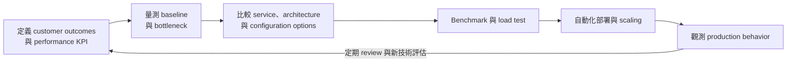
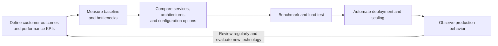

# AWS Well-Architected Framework：效能效率支柱

效能效率（Performance Efficiency）是依 workload requirements 選擇與持續調整 computing resources，使系統在需求與技術演進時仍有效率。Architecture choice 應由資料、benchmark、load test 與 customer impact 驅動，而不是沿用既有規格。

## 持續最佳化迴圈

## 設計原則

- Democratize advanced technologies：優先採用適合需求的 managed capabilities，避免團隊承擔不必要的底層營運。
- Go global in minutes：依 users、data、compliance 與 latency requirements 選擇 workload location。
- Use serverless architectures：在需求符合時移除 server management 與 idle capacity。
- Experiment more often：使用可自動建立的 environments 比較 architecture 與 configuration。
- Consider mechanical sympathy：依 compute characteristics、data access patterns 與 network behavior 選擇技術。

## Review map

| AWS 問題群組 | Review 重點 | 應具備的證據 |
|---|---|---|
| PERF01 - Architecture selection | 掌握 available services、取得 expert guidance、納入成本與 customer trade-offs、使用 reference architectures 與 benchmarks | Architecture decision record、benchmark、cost/performance comparison、service evaluation cadence |
| PERF02 - Compute and hardware | 選擇適當 compute model、configuration、right-sizing、dynamic scaling 與 accelerators | Utilization profile、scaling test、instance/runtime comparison、accelerator benchmark |
| PERF03 - Data management | 依 access pattern 選 purpose-built data store，調整 configuration、query 與 cache | Query plan、latency/throughput metrics、cache hit rate、data model decision |
| PERF04 - Networking and content delivery | 分析 latency、bandwidth、protocol、connectivity、load balancing、location 與 network configuration | Network path measurement、flow metrics、load-balancer distribution、regional latency test |
| PERF05 - Process and culture | KPI、monitoring、持續改善、load testing、自動 remediation、版本更新與定期 review | Performance budget、test report、trend review、owned optimization backlog |

## 個別 best practices

### PERF01 - Architecture selection

#### PERF01-BP01 Learn about and understand available cloud services and features

**未建立風險：高。** 持續盤點 workload architecture，研究可改善 performance、cost 與 operational effort 的 AWS services/configurations。避免把 cloud 當 colocation、只沿用既有 instance/storage 或自建已有 managed service；以 service evaluation log、prototype 與 ADR 驗證。

#### PERF01-BP02 Use guidance from your cloud provider or an appropriate partner to learn about architecture patterns and best practices

**未建立風險：中。** 利用 AWS guidance、Well-Architected reviews、reference architectures、specialists 與 qualified partners 補足 knowledge gaps。避免只依單一 engineer 的歷史經驗或未驗證 blog；記錄 recommendations、applicability、trade-offs、採用決策與測得結果。

#### PERF01-BP03 Factor cost into architectural decisions

**未建立風險：中。** 把 cost per business transaction、utilization、licensing、data transfer 與 operational labor 納入 performance choices。避免以最大規格解決問題或只看 hourly price；比較 alternatives 的 performance/cost curves，設定 budgets，並以 unit economics 與 load results 驗證。

#### PERF01-BP04 Evaluate how trade-offs impact customers and architecture efficiency

**未建立風險：高。** 明確評估 caching、compression、consistency、durability、latency、availability 與 cost trade-offs 對 customer journeys 的影響。避免為 benchmark 犧牲 correctness 或維護性；用 ADR、experiments、guardrails、reversibility 與 customer KPI 證明選擇。

#### PERF01-BP05 Use policies and reference architectures

**未建立風險：中。** 將已驗證的 performance patterns、service constraints、sizing defaults、observability 與 testing 轉成 versioned policies、templates 和 golden paths。避免每個 team 從零設計或 reference architecture 永不更新；以 adoption、exception、drift 與 outcome metrics 驗證。

#### PERF01-BP06 Use benchmarking to drive architectural decisions

**未建立風險：中。** 用可重現且代表 production 的 workload 比較 services、instances、runtimes、storage 與 configurations。避免 vendor microbenchmark、不同 test conditions 或只跑一次；固定 data set、concurrency、warm-up、duration 與 cost，記錄 percentiles 和 confidence。

#### PERF01-BP07 Use a data-driven approach for architectural choices

**未建立風險：中。** 從 telemetry、profiles、traces、access patterns 與 growth forecasts 找出 bottleneck，再做 architecture change。避免憑直覺 optimize 或只看平均值；建立 baseline、hypothesis、experiment、success criteria 和 post-change comparison，保留 decision evidence。

### PERF02 - Compute and hardware

#### PERF02-BP01 Select the best compute options for your workload

**未建立風險：高。** 依 latency、throughput、execution duration、state、portability、licensing 與 operations 選 EC2、containers、Lambda、managed compute 或 hybrid options。避免所有 workloads 使用同一 platform；以 requirements matrix、prototype、failure model、cost 和 ownership 驗證。

#### PERF02-BP02 Understand the available compute configuration and features

**未建立風險：中。** 掌握 processor architecture、instance family、burstable behavior、network/EBS limits、placement、accelerators、runtime 和 service quotas。避免只比較 vCPU/memory 或忽略 credits/NUMA/IO；以 documented constraints、compatibility tests 與 measured saturation 驗證。

#### PERF02-BP03 Collect compute-related metrics

**未建立風險：高。** 收集 utilization、load、run queue、memory working set/pressure、GC、disk/network IO、accelerator 與 application throughput/latency。避免只有 CPU average 或缺少 workload dimensions；設定 high-resolution periods、percentiles、correlation 和 retention，以 profiles 和 scaling decisions 驗證。

#### PERF02-BP04 Configure and right-size compute resources

**未建立風險：中。** 以 observed demand 和 headroom 調整 instance/pod/function size、runtime、threads、heap 與 resource requests/limits。避免 lift-and-shift oversizing 或不看 throttling/OOM；在 representative load 下比較 alternatives，建立 change/rollback 並持續 review。

#### PERF02-BP05 Scale your compute resources dynamically

**未建立風險：高。** 依 demand signals 自動水平或垂直 scaling，考慮 warm-up、cooldown、queue depth、concurrency、quota 與 downstream capacity。避免只靠 CPU、reactive scale 太慢或 scale-down 中斷工作；以 load/spike/soak tests 和 scaling timeline 驗證。

#### PERF02-BP06 Use optimized hardware-based compute accelerators

**未建立風險：中。** 對可 parallelize 的 ML、HPC、graphics、compression、crypto 或 packet workloads 評估 GPU、Trainium/Inferentia、FPGA 和 specialized processors。避免無 profiling 就使用昂貴 accelerator；驗證 software compatibility、batching、utilization、fallback、availability 和 cost per result。

### PERF03 - Data management

#### PERF03-BP01 Use a purpose-built data store that best supports your data access and storage requirements

**未建立風險：高。** 依 access patterns、consistency、transactions、query、scale、durability 與 latency 選 relational、key-value、document、graph、time-series、search、object 或 cache。避免單一 database 承擔所有模式；以 data model、benchmark、migration/operations trade-offs 和 failure behavior 驗證。

#### PERF03-BP02 Evaluate available configuration options for data store

**未建立風險：中。** 調整 instance/class、storage、IOPS、partitioning、indexes、replicas、consistency、connection limits、caching 和 maintenance settings。避免 default 永不 review 或只加硬體；以 workload-specific benchmark、query plans、saturation、failover 與 cost 驗證。

#### PERF03-BP03 Collect and record data store performance metrics

**未建立風險：高。** 觀測 query latency/throughput、connections、locks、cache hit、buffer/IO、replication lag、partition skew、queue、storage 與 throttling，並連結 application transaction。避免只看 CPU 或 provider overview；保留 baselines、percentiles、slow-query evidence 與 capacity trends。

#### PERF03-BP04 Implement strategies to improve query performance in data store

**未建立風險：中。** 先用 execution plans 和 access data 找 expensive queries，再改善 schema、indexes、partition keys、projections、batching、precomputation 或 denormalization。避免 blind indexing、N+1 queries 或 production-only tuning；用 realistic data、regression tests、write impact 與 rollback 驗證。

#### PERF03-BP05 Implement data access patterns that utilize caching

**未建立風險：中。** 在已理解 consistency、staleness 和 invalidation 的讀取路徑使用 client、edge、application、database 或 distributed cache。避免 cache-as-database、unbounded keys、stampede 或 sensitive-data leak；定義 TTL、eviction、warming、fallback，量測 hit rate、latency 和 correctness。

### PERF04 - Networking and content delivery

#### PERF04-BP01 Understand how networking impacts performance

**未建立風險：高。** 繪製 client-to-service 與 east-west paths，量測 DNS、TLS、connect、TTFB、packet loss、jitter、bandwidth、MTU 和 cross-AZ/Region hops。避免把 application latency 全歸因 compute；以 flow data、traces、path tests 和 dependency timing 驗證。

#### PERF04-BP02 Evaluate available networking features

**未建立風險：高。** 評估 CDN、Global Accelerator、load balancers、PrivateLink、Transit Gateway、enhanced networking、placement groups、VPC endpoints 與 protocol offload。避免沿用 on-prem topology 或忽略 service limits；以 requirement matrix、benchmark、failure/cost trade-offs 和 security review 驗證。

#### PERF04-BP03 Choose appropriate dedicated connectivity or VPN for your workload

**未建立風險：高。** 依 bandwidth、latency consistency、availability、encryption、sites 與 failover 選 Direct Connect、Site-to-Site VPN、Client VPN 或 internet paths。避免只用一條 circuit/tunnel 或未測 backup capacity；以 path diversity、BGP/failover test、throughput 和 SLA evidence 驗證。

#### PERF04-BP04 Use load balancing to distribute traffic across multiple resources

**未建立風險：高。** 選擇 L4/L7、algorithm、target type、health check、cross-zone、connection draining 與 session strategy，使 traffic 均衡且能排除 unhealthy targets。避免 sticky hotspots 或 shallow health checks；以 distribution、failover、scale 和 graceful-drain tests 驗證。

#### PERF04-BP05 Choose network protocols to improve performance

**未建立風險：中。** 依 traffic 選 HTTP/2、HTTP/3/QUIC、gRPC、TCP/UDP、compression、persistent connections 與 TLS settings。避免 chatty calls、過度 payload 或 protocol mismatch；量測 handshake、multiplexing、retransmission、CPU、latency 與 client compatibility。

#### PERF04-BP06 Choose your workload's location based on network requirements

**未建立風險：中。** 依 user geography、data gravity/residency、dependency location、latency、service availability 與 disaster recovery 選 Regions、AZs、edge 或 Local Zones。避免只因 team location 選 Region；用 regional latency、data movement、failure scope、cost 和 compliance evidence 驗證。

#### PERF04-BP07 Optimize network configuration based on metrics

**未建立風險：低。** 用 flow logs、load-balancer metrics、connection telemetry、retransmits、drops、NAT/endpoint utilization 和 traces 找瓶頸，再調整 routes、MTU、buffers、connections、DNS、timeouts 或 topology。避免無 baseline tuning；以 controlled change 和 before/after percentiles 驗證。

### PERF05 - Process and culture

#### PERF05-BP01 Establish key performance indicators (KPIs) to measure workload health and performance

**未建立風險：高。** 從 customer journeys 定義 latency percentiles、throughput、error/correctness、saturation、availability 和 cost-per-transaction targets，包含 owner 與 action。避免只看 averages 或 infrastructure activity；以 SLO、performance budget、dashboard 和 decision usage 驗證。

#### PERF05-BP02 Use monitoring solutions to understand the areas where performance is most critical

**未建立風險：高。** 整合 metrics、logs、traces、profiles、RUM、synthetics 和 dependency telemetry，找出 critical path 與 customer impact。避免工具各自孤立或只在 incident 才開 profiling；以 service map、correlation IDs、retention 和 bottleneck examples 驗證。

#### PERF05-BP03 Define a process to improve workload performance

**未建立風險：中。** 建立 recurring baseline、hypothesis、prioritization、experiment、review、rollback 與 knowledge-sharing process。避免 ad hoc tuning 或未評估其他 pillars；將 optimization 排入 backlog，記錄 owner、expected gain、cost、risk 和 measured result。

#### PERF05-BP04 Load test your workload

**未建立風險：低。** 使用 representative traffic mix、data volume、concurrency、arrival pattern 與 dependency behavior 執行 load、stress、spike、soak 和 failure tests。避免只測 happy path、短時間或 unrealistic data；定義 success/stop criteria、quota、observability、cleanup 和 reproducible reports。

#### PERF05-BP05 Use automation to proactively remediate performance-related issues

**未建立風險：低。** 對已知 saturation、hot partition、queue growth、cache failure 或 unhealthy target 使用 bounded scaling、traffic shift、restart 或 configuration automation。避免 destructive self-healing 或 feedback loops；設 preconditions、limits、audit、manual override，並以 injected failure 和 false-action rate 驗證。

#### PERF05-BP06 Keep your workload and services up-to-date

**未建立風險：低。** 持續評估 runtime、instance generation、database engine、protocol、SDK 和 AWS service updates，使用 test rings 與 compatibility validation。避免 unsupported versions 或永遠延後 upgrade；維護 lifecycle inventory、owner、deadline、rollback 和 benchmark，量測實際 improvement。

#### PERF05-BP07 Review metrics at regular intervals

**未建立風險：中。** 以固定 cadence review customer KPI、capacity、cost、regressions、seasonality、new services 與 forecasts，更新 targets 和 backlog。避免只有 incident review 或 dashboard 無 owner；保留 trend、anomaly explanation、decision、action 和 post-change validation。

## Architecture 決策方法

1. 先定義 business transaction、user journey、latency percentile、throughput、concurrency、data volume 與 growth assumptions。
2. 分別量測 application、compute、data store、cache、queue、network 與 downstream dependency，避免只看平均值。
3. 使用可重現的 representative workload 做 benchmark；同時記錄效能、成本、可靠性、operational burden 與 sustainability trade-offs。
4. 透過 right-sizing、horizontal scaling、caching、asynchronous processing、content delivery、purpose-built data stores 或 accelerators 改善已證實的 bottleneck。
5. 以 load、stress、soak 與 failure tests 驗證 scaling boundary、quota、degradation mode 與 recovery behavior。
6. 部署後比較 baseline 與 production percentiles，設定 regression guardrail，定期重新評估新的 AWS capabilities。

## Checklist

- [ ] Performance requirements 與 KPI 對應 customer outcomes，而非只記錄 infrastructure utilization。
- [ ] Architecture choice 有 benchmark、trade-off 與 decision record 支持。
- [ ] Compute、data、network 與 dependencies 均有 percentile-based telemetry。
- [ ] Scaling policy、quota、warm-up time 與 saturation behavior 已用 representative load 驗證。
- [ ] Cache consistency、retry、timeout、connection pool 與 queue limits 已被測試。
- [ ] Performance regressions 會阻止 promotion 或觸發可控 remediation。

---

# AWS Well-Architected Framework: Performance Efficiency Pillar

Performance efficiency is the ability to select and continually adjust computing resources to meet workload requirements as demand and technology evolve. Architecture choices should be driven by data, benchmarks, load tests, and customer impact rather than inherited sizing.

## Continuous optimization loop

## Design principles

- Democratize advanced technologies by consuming suitable managed capabilities instead of operating unnecessary low-level components.
- Go global in minutes by selecting workload locations from user, data, compliance, and latency requirements.
- Use serverless architectures when they fit the workload to remove server management and idle capacity.
- Experiment more often with environments that can be created automatically to compare architectures and configurations.
- Consider mechanical sympathy by matching technology to compute characteristics, data access patterns, and network behavior.

## Review map

| AWS question group | Review focus | Expected evidence |
|---|---|---|
| PERF01 - Architecture selection | Available services, expert guidance, cost and customer trade-offs, reference architectures, and benchmarks | Architecture decision record, benchmark, cost/performance comparison, service review cadence |
| PERF02 - Compute and hardware | Compute model, configuration, right-sizing, dynamic scaling, and accelerators | Utilization profile, scaling test, instance/runtime comparison, accelerator benchmark |
| PERF03 - Data management | Purpose-built data stores, configuration, queries, and caching based on access patterns | Query plan, latency/throughput metrics, cache hit rate, data model decision |
| PERF04 - Networking and content delivery | Latency, bandwidth, protocols, connectivity, load balancing, location, and network configuration | Network path measurements, flow metrics, load-balancer distribution, regional latency test |
| PERF05 - Process and culture | KPIs, monitoring, continuous improvement, load testing, automated remediation, updates, and review | Performance budget, test report, trend review, owned optimization backlog |

## Individual best practices

### PERF01 - Architecture selection

#### PERF01-BP01 Learn about and understand available cloud services and features

**Risk if absent: High.** Continuously inventory the workload and study AWS services and configurations that improve performance, cost, and operational effort. Avoid treating cloud as colocation, copying existing instance/storage choices, or self-managing available managed services. Verify evaluations, prototypes, and ADRs.

#### PERF01-BP02 Use guidance from your cloud provider or an appropriate partner to learn about architecture patterns and best practices

**Risk if absent: Medium.** Use AWS guidance, Well-Architected reviews, reference architectures, specialists, and qualified partners to close knowledge gaps. Avoid relying on one engineer's historical experience or unverified blogs. Record recommendations, applicability, trade-offs, decisions, and measured results.

#### PERF01-BP03 Factor cost into architectural decisions

**Risk if absent: Medium.** Include cost per business transaction, utilization, licensing, data transfer, and operational labor in performance choices. Avoid solving problems with the largest size or hourly price alone. Compare performance/cost curves, set budgets, and verify unit economics under load.

#### PERF01-BP04 Evaluate how trade-offs impact customers and architecture efficiency

**Risk if absent: High.** Explicitly evaluate how caching, compression, consistency, durability, latency, availability, and cost trade-offs affect customer journeys. Avoid sacrificing correctness or maintainability for a benchmark. Use ADRs, experiments, guardrails, reversibility, and customer KPIs.

#### PERF01-BP05 Use policies and reference architectures

**Risk if absent: Medium.** Turn validated performance patterns, service constraints, sizing defaults, observability, and testing into versioned policies, templates, and golden paths. Avoid redesigning from scratch or stale reference architectures. Verify adoption, exceptions, drift, and outcome metrics.

#### PERF01-BP06 Use benchmarking to drive architectural decisions

**Risk if absent: Medium.** Compare services, instances, runtimes, storage, and configurations with reproducible workloads representative of production. Avoid vendor microbenchmarks, unequal conditions, or one-off runs. Fix datasets, concurrency, warm-up, duration, and cost, and record percentiles and confidence.

#### PERF01-BP07 Use a data-driven approach for architectural choices

**Risk if absent: Medium.** Use telemetry, profiles, traces, access patterns, and growth forecasts to identify bottlenecks before changing architecture. Avoid intuition-only optimization or averages. Establish baselines, hypotheses, experiments, success criteria, post-change comparisons, and decision evidence.

### PERF02 - Compute and hardware

#### PERF02-BP01 Select the best compute options for your workload

**Risk if absent: High.** Choose EC2, containers, Lambda, managed compute, or hybrid options from latency, throughput, duration, state, portability, licensing, and operational needs. Avoid one platform for every workload. Verify requirements matrices, prototypes, failure models, cost, and ownership.

#### PERF02-BP02 Understand the available compute configuration and features

**Risk if absent: Medium.** Understand processor architecture, instance families, burst behavior, network/EBS limits, placement, accelerators, runtimes, and quotas. Avoid comparing only vCPU and memory or ignoring credits, NUMA, and IO. Verify documented constraints, compatibility tests, and measured saturation.

#### PERF02-BP03 Collect compute-related metrics

**Risk if absent: High.** Collect utilization, load, run queue, memory pressure, GC, disk/network IO, accelerator, and application throughput/latency. Avoid CPU averages alone or missing workload dimensions. Configure resolution, percentiles, correlation, and retention; verify with profiles and scaling decisions.

#### PERF02-BP04 Configure and right-size compute resources

**Risk if absent: Medium.** Tune instance, pod, and function sizes, runtimes, threads, heaps, and requests/limits from observed demand and headroom. Avoid lift-and-shift oversizing or ignoring throttling and OOM. Compare alternatives under representative load with change, rollback, and recurring review.

#### PERF02-BP05 Scale your compute resources dynamically

**Risk if absent: High.** Scale horizontally or vertically from demand signals, accounting for warm-up, cooldown, queue depth, concurrency, quotas, and downstream capacity. Avoid CPU-only signals, slow reactive scaling, or disruptive scale-down. Verify with load, spike, and soak tests and scaling timelines.

#### PERF02-BP06 Use optimized hardware-based compute accelerators

**Risk if absent: Medium.** Evaluate GPUs, Trainium/Inferentia, FPGAs, and specialized processors for parallel ML, HPC, graphics, compression, crypto, or packet workloads. Avoid expensive accelerators without profiling. Verify compatibility, batching, utilization, fallback, availability, and cost per result.

### PERF03 - Data management

#### PERF03-BP01 Use a purpose-built data store that best supports your data access and storage requirements

**Risk if absent: High.** Choose relational, key-value, document, graph, time-series, search, object, or cache services from access patterns, consistency, transactions, queries, scale, durability, and latency. Avoid one database for every pattern. Verify data models, benchmarks, migration/operations trade-offs, and failure behavior.

#### PERF03-BP02 Evaluate available configuration options for data store

**Risk if absent: Medium.** Tune class, storage, IOPS, partitioning, indexes, replicas, consistency, connections, caching, and maintenance settings. Avoid never reviewing defaults or adding hardware first. Verify workload-specific benchmarks, query plans, saturation, failover, and cost.

#### PERF03-BP03 Collect and record data store performance metrics

**Risk if absent: High.** Observe query latency/throughput, connections, locks, cache hits, buffer/IO, replication lag, partition skew, queues, storage, and throttling, linked to application transactions. Avoid CPU-only or overview metrics. Retain baselines, percentiles, slow-query evidence, and capacity trends.

#### PERF03-BP04 Implement strategies to improve query performance in data store

**Risk if absent: Medium.** Use execution plans and access data to find expensive queries, then improve schemas, indexes, partition keys, projections, batching, precomputation, or denormalization. Avoid blind indexing, N+1 queries, or production-only tuning. Verify realistic data, regression tests, write impact, and rollback.

#### PERF03-BP05 Implement data access patterns that utilize caching

**Risk if absent: Medium.** Use client, edge, application, database, or distributed caches where consistency, staleness, and invalidation are understood. Avoid cache-as-database, unbounded keys, stampedes, or sensitive-data leaks. Define TTL, eviction, warming, and fallback; measure hit rate, latency, and correctness.

### PERF04 - Networking and content delivery

#### PERF04-BP01 Understand how networking impacts performance

**Risk if absent: High.** Map client-to-service and east-west paths and measure DNS, TLS, connection, TTFB, packet loss, jitter, bandwidth, MTU, and cross-AZ/Region hops. Avoid attributing all latency to compute. Verify with flow data, traces, path tests, and dependency timing.

#### PERF04-BP02 Evaluate available networking features

**Risk if absent: High.** Evaluate CDNs, Global Accelerator, load balancers, PrivateLink, Transit Gateway, enhanced networking, placement groups, VPC endpoints, and protocol offload. Avoid copying on-premises topology or ignoring limits. Verify requirements matrices, benchmarks, failure/cost trade-offs, and security review.

#### PERF04-BP03 Choose appropriate dedicated connectivity or VPN for your workload

**Risk if absent: High.** Choose Direct Connect, Site-to-Site VPN, Client VPN, or internet paths from bandwidth, latency consistency, availability, encryption, sites, and failover needs. Avoid one circuit/tunnel or untested backup capacity. Verify diversity, BGP/failover tests, throughput, and SLA evidence.

#### PERF04-BP04 Use load balancing to distribute traffic across multiple resources

**Risk if absent: High.** Choose L4/L7 behavior, algorithms, targets, health checks, cross-zone settings, draining, and session strategy so traffic balances and unhealthy targets leave service. Avoid sticky hotspots or shallow checks. Verify distribution, failover, scale, and graceful draining.

#### PERF04-BP05 Choose network protocols to improve performance

**Risk if absent: Medium.** Select HTTP/2, HTTP/3/QUIC, gRPC, TCP/UDP, compression, persistent connections, and TLS settings for the traffic. Avoid chatty calls, oversized payloads, or protocol mismatch. Measure handshakes, multiplexing, retransmission, CPU, latency, and client compatibility.

#### PERF04-BP06 Choose your workload's location based on network requirements

**Risk if absent: Medium.** Choose Regions, AZs, edge, or Local Zones from user geography, data gravity/residency, dependency location, latency, service availability, and DR. Avoid choosing a Region only for team convenience. Verify regional latency, data movement, failure scope, cost, and compliance.

#### PERF04-BP07 Optimize network configuration based on metrics

**Risk if absent: Low.** Use flow logs, load-balancer metrics, connection telemetry, retransmits, drops, NAT/endpoint utilization, and traces to find bottlenecks, then tune routes, MTU, buffers, connections, DNS, timeouts, or topology. Avoid baseline-free tuning. Verify controlled changes and before/after percentiles.

### PERF05 - Process and culture

#### PERF05-BP01 Establish key performance indicators (KPIs) to measure workload health and performance

**Risk if absent: High.** Define targets for latency percentiles, throughput, errors/correctness, saturation, availability, and cost per transaction from customer journeys, with owners and actions. Avoid averages or infrastructure activity alone. Verify SLOs, performance budgets, dashboards, and decision use.

#### PERF05-BP02 Use monitoring solutions to understand the areas where performance is most critical

**Risk if absent: High.** Integrate metrics, logs, traces, profiles, RUM, synthetics, and dependency telemetry to expose critical paths and customer impact. Avoid isolated tools or incident-only profiling. Verify service maps, correlation IDs, retention, and bottleneck examples.

#### PERF05-BP03 Define a process to improve workload performance

**Risk if absent: Medium.** Use a recurring process for baselines, hypotheses, prioritization, experiments, review, rollback, and knowledge sharing. Avoid ad hoc tuning or ignoring other pillars. Track optimizations with owners, expected gain, cost, risk, and measured results.

#### PERF05-BP04 Load test your workload

**Risk if absent: Low.** Run load, stress, spike, soak, and failure tests with representative traffic mixes, data volumes, concurrency, arrival patterns, and dependencies. Avoid happy-path, short, or unrealistic tests. Define success/stop criteria, quotas, observability, cleanup, and reproducible reports.

#### PERF05-BP05 Use automation to proactively remediate performance-related issues

**Risk if absent: Low.** Use bounded scaling, traffic shifting, restart, or configuration automation for known saturation, hot partitions, queue growth, cache failures, or unhealthy targets. Avoid destructive self-healing or feedback loops. Set preconditions, limits, audit, and override; verify injected failures and false-action rates.

#### PERF05-BP06 Keep your workload and services up-to-date

**Risk if absent: Low.** Continuously evaluate runtime, instance generation, database engine, protocol, SDK, and AWS service updates with test rings and compatibility validation. Avoid unsupported versions or perpetual deferral. Maintain lifecycle inventory, owners, deadlines, rollback, and benchmarks; measure actual improvement.

#### PERF05-BP07 Review metrics at regular intervals

**Risk if absent: Medium.** On a fixed cadence, review customer KPIs, capacity, cost, regressions, seasonality, new services, and forecasts, updating targets and backlogs. Avoid incident-only review or ownerless dashboards. Retain trends, explanations, decisions, actions, and post-change validation.

## Architecture decision method

1. Define business transactions, user journeys, latency percentiles, throughput, concurrency, data volume, and growth assumptions.
2. Measure the application, compute, data store, cache, queue, network, and downstream dependencies separately; do not rely on averages alone.
3. Benchmark with a reproducible representative workload. Record performance, cost, reliability, operational burden, and sustainability trade-offs.
4. Improve verified bottlenecks through right-sizing, horizontal scaling, caching, asynchronous processing, content delivery, purpose-built data stores, or accelerators.
5. Use load, stress, soak, and failure tests to validate scaling boundaries, quotas, degradation modes, and recovery behavior.
6. Compare the baseline with production percentiles after deployment, enforce regression guardrails, and periodically reassess new AWS capabilities.

## Checklist

- [ ] Performance requirements and KPIs map to customer outcomes, not infrastructure utilization alone.
- [ ] Architecture choices are supported by benchmarks, trade-offs, and decision records.
- [ ] Compute, data, network, and dependencies have percentile-based telemetry.
- [ ] Scaling policies, quotas, warm-up time, and saturation behavior are validated with representative load.
- [ ] Cache consistency, retries, timeouts, connection pools, and queue limits are tested.
- [ ] Performance regressions block promotion or trigger controlled remediation.
