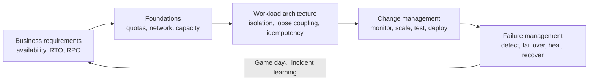

# AWS Well-Architected Framework：可靠性支柱

可靠性（Reliability）要求 workload 在需求變化與元件故障時仍能正確提供預期功能，並在 disruption 後於 business-defined recovery objectives 內恢復。高可用、backup 與 disaster recovery 是相關但不同的能力，必須分別設計與驗證。

## Reliability control loop 與 DR 選擇



```text
通常較低的 recovery cost / 較長 RTO-RPO                  通常較高的 cost 與 complexity / 較短 RTO-RPO
Backup and restore  ->  Pilot light  ->  Warm standby  ->  Multi-site active/active
```

DR strategy 必須依每個 workload 的 RTO、RPO、dependency、data consistency、regulatory obligation 與 business impact 決定，不能只依技術偏好選擇。

## 設計原則

- Automatically recover from failure：以 business KPI 偵測問題並執行已驗證的 recovery automation。
- Test recovery procedures：定期驗證 failover、restore、rollback 與 operator response。
- Scale horizontally：使用多個較小且跨 failure domains 的 resources 降低單點失效影響。
- Stop guessing capacity：觀測需求並自動調整 capacity，同時管理 quota 與 headroom。
- Manage change through automation：以 versioned、reviewed、tested automation 管理 infrastructure 與 workload changes。

## Review map

| AWS 問題群組 | Review 重點 | 應具備的證據 |
|---|---|---|
| REL01 - Service quotas | 跨 accounts/Regions 的 quotas、固定限制、監控、自動化與 failover headroom | Quota inventory、threshold alarms、increase workflow、failover capacity calculation |
| REL02 - Network topology | Public endpoint HA、hybrid connectivity、IP capacity、hub-and-spoke、non-overlapping CIDR | Network diagrams、route/failure analysis、subnet forecast、connectivity test |
| REL03 - Service architecture | 適當 segmentation、business-domain boundaries、API contracts | Dependency map、service contract、ownership 與 failure boundary |
| REL04-REL05 - Distributed systems | Loose coupling、constant work、idempotency、graceful degradation、throttling、bounded retries、timeouts、statelessness、emergency levers | Failure-mode test、retry budget、queue limit、load-shedding result |
| REL06 - Monitoring | Component metrics、aggregation、notification、automation、logs 與 end-to-end tracing | SLI/SLO、alarm route、trace evidence、automated response audit |
| REL07 - Demand changes | Automated provisioning、impairment replacement、dynamic capacity、load testing | Scaling result、quota/IP headroom、saturation and recovery result |
| REL08 - Change implementation | Runbooks、functional/resiliency tests、immutable infrastructure、自動 deployment | Pipeline evidence、deployment record、rollback test |
| REL09 - Backups | Backup scope、encryption、automation、periodic restore | Backup policy、vault controls、restore and application readback evidence |
| REL10-REL11 - Fault isolation and recovery | 多 locations、bulkheads、failover、自動 healing、data-plane recovery、static stability | Zonal/Regional failure test、health routing、cell isolation、recovery timeline |
| REL12 - Reliability testing | Playbooks、post-incident analysis、performance/chaos tests、game days | Experiment hypothesis、blast-radius control、result、follow-up action |
| REL13 - Disaster recovery | Business-defined RTO/RPO、recovery strategy、DR test、drift control、自動化 | Tier mapping、dependency-aligned plan、measured RTO/RPO、DR sign-off |

## 個別 best practices

### REL01 - Manage service quotas and constraints

#### REL01-BP01 Aware of service quotas and constraints

建立 workload 會使用之 service quotas、API limits、resource constraints 與不可調整限制 inventory，標示 account/Region、owner 和 dependency。避免等 deployment/failover 才發現限制

避免；以 architecture review、quota dashboard、forecast 與 launch checklist 驗證。

#### REL01-BP02 Manage service quotas across accounts and regions

在所有 production、shared services 與 DR accounts/Regions 一致管理 quotas，考慮 deployment waves、growth 與 failover。避免只提高 primary Region 或使用未核准 account

避免；以 centralized inventory、request status、regional parity 和 DR tests 驗證。

#### REL01-BP03 Accommodate fixed service quotas and constraints through architecture

對不可提高的 limits，以 sharding、multiple resources/accounts、request distribution、backpressure 或 alternative service 設計。避免把 fixed limit 當可申請提高

避免；以 capacity model、partition strategy、saturation test 和 controlled degradation 驗證。

#### REL01-BP04 Monitor and manage quotas

持續量測 current usage、rate of growth、approved maximum 與 headroom，接近 threshold 時通知 owner 並提前申請。避免只看 static spreadsheet

避免；以 alarms、forecast accuracy、request lead time、denied-event review 和 capacity meetings 驗證。

#### REL01-BP05 Automate quota management

用 APIs/IaC 自動 discover、compare、request、track 和 validate adjustable quotas，將 minimum headroom 納入 deployment gates。避免 automation 無 approval、重複 request 或忽略 regional differences

避免；以 audit log、idempotency 和 failed-request escalation 驗證。

#### REL01-BP06 Ensure that a sufficient gap exists between the current quotas and the maximum usage to accommodate failover

預留足以承接 peak demand、AZ/Region failover、replacement surge 和 recovery operations 的 quota gap。避免用 normal steady-state utilization 算 headroom；建立 failure-scenario capacity model，並以 failover/load tests 與 remaining margin 驗證。

### REL02 - Plan network topology

#### REL02-BP01 Use highly available network connectivity for workload public endpoints

**未建立風險：高。** public endpoints 使用 multi-AZ targets、health-based routing、DDoS protection、redundant DNS/edge/load-balancing paths 和 tested failover。避免 single-AZ origin、single appliance 或 health check 只測 port

避免；以 zonal failure、DNS behavior、TLS 和 end-user synthetics 驗證。

#### REL02-BP02 Provision redundant connectivity between private networks in the cloud and on-premises environments

hybrid connectivity 至少有獨立 devices、locations、paths 與 ideally providers，使用 BGP 動態 reroute；Direct Connect 可搭配 independent VPN。避免 multiple links 共用單點或未測 backup bandwidth

避免；以 path diversity、failover time 和 route evidence 驗證。

#### REL02-BP03 Ensure IP subnet allocation accounts for expansion and availability

CIDR/subnet plan 必須支援 multi-AZ、autoscaling、pods/endpoints、load balancers、migration coexistence 和 failover。避免 subnet 太小或無 reserved growth

避免；以 IP forecast、high-water alarms、secondary CIDR plan 和 scale/failover test 驗證。

#### REL02-BP04 Prefer hub-and-spoke topologies over many-to-many mesh

以 Transit Gateway 或 centralized routing 建立可治理、可觀測且易隔離的 hub-and-spoke network。避免大量 peering mesh 導致 route complexity、transitive gaps 與 inconsistent controls

避免；以 route ownership、segmentation、scale limits 和 failure analysis 驗證。

#### REL02-BP05 Enforce non-overlapping private IP address ranges in all private address spaces where they are connected

建立 enterprise IPAM 與 allocation approval，確保 VPC、on-prem、partners、acquisitions 和 DR ranges 不重疊。避免用 NAT workaround 隱藏長期 conflict

避免；以 automated overlap checks、registry、route simulation 與 merger/onboarding process 驗證。

### REL03 - Design workload service architecture

#### REL03-BP01 Choose how to segment your workload

依 scaling、failure isolation、data boundary、team ownership 與 change rate 決定 monolith、modular monolith、services 或 cells。避免為 trend 過度拆分或保留不可隔離的巨型 failure domain

避免；以 dependency map、failure tests、team boundaries 和 operational cost 驗證。

#### REL03-BP02 Build services focused on specific business domains and functionality

每個 service 有 cohesive business capability、清楚 data ownership、bounded dependencies 與 independent lifecycle。避免 distributed monolith、shared database tables 或 chatty synchronous calls

避免；以 domain model、API/event contracts、deployment independence 和 failure isolation 驗證。

#### REL03-BP03 Provide service contracts per API

為 API/event 定義 versioned schema、semantics、timeouts、idempotency、errors、quotas、compatibility 和 deprecation policy。避免 undocumented behavior 或 breaking change；使用 contract tests、consumer inventory、change notice、SLO 和 backward-compatibility evidence 驗證。

### REL04 - Prevent distributed-system failures

#### REL04-BP01 Identify the kind of distributed systems you depend on

**未建立風險：高。** 辨識 hard/soft、synchronous/asynchronous、stateful/stateless、control/data-plane dependencies，以及 latency、consistency 和 failure semantics。避免只畫 happy-path diagram；建立 dependency/failure map，並以 timeout、quota、ownership、fallback 和 outage exercise 驗證。

#### REL04-BP02 Implement loosely coupled dependencies

**未建立風險：高。** 以 queues、events、buffers、service discovery、contracts 與 asynchronous workflows 降低 temporal 和 deployment coupling。避免 cascading synchronous chain 或 shared mutable state；設定 durable delivery、DLQ、backpressure、replay 和 idempotent consumers，並測試 dependency unavailable。

#### REL04-BP03 Do constant work

**未建立風險：低。** 讓 request cost 和 backend work 對 input shape/absence 盡量穩定，避免 recovery 或 low-traffic path 產生 sudden load。預先計算/配置、均勻 background work 並限制 fan-out

避免；以 worst-case profile、cache-miss/recovery test 和 resource envelope 驗證。

#### REL04-BP04 Make mutating operations idempotent

重試 create/update/delete/payment 等 operations 不應造成 duplicate state 或 side effects。使用 idempotency keys、conditional writes、deduplication、transaction/outbox 和 explicit result semantics；避免 client timeout 後盲目重送。以 duplicate/reorder/replay tests 和 audit records 驗證。

### REL05 - Mitigate or withstand interaction failures

#### REL05-BP01 Implement graceful degradation to transform applicable hard dependencies into soft dependencies

**未建立風險：高。** 在非核心 dependency 失效時維持 essential customer journey，例如 stale cache、read-only、queued write 或 reduced feature。避免 optional recommendation/analytics 使整個 request 失敗；定義 degradation policy、data freshness、customer messaging，並測試 recovery/reconciliation。

#### REL05-BP02 Throttle requests

**未建立風險：高。** 在 capacity 或 quota 邊界前以 per-tenant/user/API rate limits、admission control 和 load shedding 保護系統公平性。避免 unlimited bursts 或 throttle 無 retry guidance；回傳明確 status/Retry-After，量測 rejected work、customer impact 和 recovery。

#### REL05-BP03 Control and limit retry calls

**未建立風險：高。** 為 retry 設 attempt/time budget、exponential backoff、jitter、retryable errors 與 circuit breaker，避免 amplification。不要在每層獨立 retry 或對 non-idempotent call 重試

避免；以 retry metrics、storm test、downstream load 和 end-to-end deadline 驗證。

#### REL05-BP04 Fail fast and limit queues

當 request 無法在 useful deadline 完成時快速拒絕，並為 thread/connection/queue 設 bounded limits。避免 unbounded queue 隱藏 overload、增加 latency 或耗盡 memory

避免；以 Little's Law/capacity model、queue-age alarms、overload test 和 recovery time 驗證。

#### REL05-BP05 Set client timeouts

所有 network calls 要有 connect、read、write、request 和 total deadline，且由 end-to-end latency budget 向下分配。避免 default infinite timeout 或 timeout 長於 caller deadline

避免；以 timeout inventory、dependency latency percentiles、injected delay 和 resource release 驗證。

#### REL05-BP06 Make systems stateless where possible

將 durable state 移到 resilient data services，讓 compute 可 replace、scale 和 relocate；session state 以 external store 或 signed token 管理。避免 local disk/memory 成為 hidden dependency

避免；以 instance termination、rescheduling、multi-AZ 和 cache-loss tests 驗證。

#### REL05-BP07 Implement emergency levers

預先設計 feature disable、traffic block/shift、rate reduction、read-only、dependency bypass 與 kill switch，以快速限制 impact。每個 lever 要有 owner、authorization、scope、audit、expiry、recovery 和 exercise；避免 incident 時臨時改 code 或長期忘記復原。

### REL06 - Monitor workload resources

#### REL06-BP01 Monitor all components for the workload (Generation)

**未建立風險：高。** 為 clients、edge、network、compute、storage、database、queues、dependencies 與 business transactions 產生 metrics、logs、traces 和 events。避免 observability blind spots 或只監控 AWS resources

避免；以 component inventory、telemetry coverage、failure-mode mapping 和 synthetic tests 驗證。

#### REL06-BP02 Define and calculate metrics (Aggregation)

把 raw telemetry 聚合成可決策的 SLIs，例如 availability、correctness、latency percentiles、durability、queue age 與 dependency health。避免 averages 掩蓋 tail/tenant/Region impact；明確 formula、window、missing-data behavior、dimensions 和 data quality，並用 known events 驗證。

#### REL06-BP03 Send notifications (Real-time processing and alarming)

**未建立風險：高。** 在 customer impact、SLO burn、capacity exhaustion 或 failure indicators 需要 action 時通知正確 owner。避免 noisy threshold 或無 escalation 的 alarm；設定 severity、dedup、suppression、routing、runbook 和 acknowledgement，並以 alert precision、latency 和 missed incidents 驗證。

#### REL06-BP04 Automate responses (Real-time processing and alarming)

**未建立風險：中。** 對已知 failure mode 自動 isolate、replace、scale、reroute 或 rollback，並以 guardrails 限制 blast radius。automation 要 idempotent、observable、least privilege、具 stop condition 和 manual override

避免；以 injected failure、false actions 和 recovery time 驗證。

#### REL06-BP05 Analyze logs

集中 structured application、platform、network、audit 和 dependency logs，用 correlation ID 與 accurate timestamps 重建 failures。避免 sensitive data、short retention、free text 或 clock skew；建立 saved queries、access controls、integrity 和 incident reconstruction tests。

#### REL06-BP06 Regularly review monitoring scope and metrics

**未建立風險：中。** 隨 architecture、customer journeys、incidents、services 與 failure modes 改變，定期更新 telemetry、SLI、alarm 和 dashboard。避免 retired components 仍告警或新 dependency 無監控

避免；以 coverage review、orphan/stale detection、incident gaps 和 action closure 驗證。

#### REL06-BP07 Monitor end-to-end tracing of requests through your system

跨 synchronous/asynchronous boundaries 傳遞 trace context，量測 each-hop latency、errors、retries、queues 與 critical path。避免 sampling 排除 failures 或 trace 中斷

避免；以 representative user journeys、service map、span completeness 和 incident diagnosis time 驗證。

### REL07 - Adapt to changes in demand

#### REL07-BP01 Use automation when obtaining or scaling resources

以 IaC、autoscaling 與 automated provisioning 取得 compute、storage、network、licenses 和 dependencies，避免 manual delay/inconsistency。設定 safe limits、quotas、warm-up、health gates 和 rollback

避免；以 repeatable environment、scale timeline、audit 和 failure test 驗證。

#### REL07-BP02 Obtain resources upon detection of impairment to a workload

偵測 unhealthy instance、node、AZ path 或 dependency 後，自動 replace、reroute 或 provision alternate capacity。避免只 restart 同一 broken host 或 recovery 依 control-plane action that is unavailable

避免；以 health semantics、replacement test、capacity headroom 和 recovery time 驗證。

#### REL07-BP03 Obtain resources upon detection that more resources are needed for a workload

以 demand-leading metrics 如 queue depth、concurrency、latency、scheduled events 和 forecast，在 saturation 前 scale。避免只用 lagging CPU、沒有 cooldown 或 downstream 不可承載

避免；以 spike/soak tests、scale lag、quota/IP headroom 和 customer SLO 驗證。

#### REL07-BP04 Load test your workload

用 representative traffic、data、concurrency、seasonality 與 failure states 找 scaling boundary、bottleneck、quota 和 recovery behavior。避免 short happy-path test 或 production collateral damage；定義 hypothesis、success/stop criteria、observability、isolated environment 和 reproducible report。

### REL08 - Implement change

#### REL08-BP01 Use runbooks for standard activities such as deployment

**未建立風險：高。** deployment runbook 包含 prerequisites、owners、permissions、steps/automation、expected output、validation、stop/rollback 和 communication。避免依記憶或 stale screenshots；在 production-like environment 定期演練，以 execution log、timing 和 last-tested date 驗證。

#### REL08-BP02 Integrate functional testing as part of deployment

**未建立風險：高。** pipeline 在 promotion 前後自動驗證 critical functions、contracts、data compatibility、permissions 和 customer journeys。避免 deployment green 但 application broken；使用 smoke/synthetic tests、known test data、environment parity、failure gating 和 retained results。

#### REL08-BP03 Integrate resiliency testing as part of deployment

**未建立風險：中。** 在適當階段測試 timeout、retry、dependency loss、instance/AZ failure、resource pressure 和 recovery controls，確認 change 未破壞 resilience。避免只在 annual game day 測；限制 blast radius，保留 baseline、experiment result 和 rollback。

#### REL08-BP04 Deploy using immutable infrastructure

**未建立風險：中。** 以 versioned image/artifact replace resources，而非在 place patch，讓 state 可重建、rollback 和 audit。避免 snowflake hosts、mutable SSH changes 或 latest tags

避免；以 digest、image provenance、rebuild test、drift detection 和 previous-version rollback 驗證。

#### REL08-BP05 Deploy changes with automation

以 version-controlled pipeline 一致部署 application、infrastructure、configuration 和 database changes，包含 approvals、progressive exposure、health gates 和 rollback。避免 direct production edits 或 manual ordering

避免；以 audit trail、idempotency、partial-failure test 和 recovery time 驗證。

### REL09 - Back up data

#### REL09-BP01 Identify and back up all data that needs to be backed up, or reproduce the data from sources

建立 data inventory，區分 authoritative、derived、ephemeral 與 configuration state，為每項定義 backup/rebuild method、RPO、retention 和 owner。避免只備份 database 而漏 object、keys、manifests 或 external dependencies

避免；以 restore dependency map 驗證。

#### REL09-BP02 Secure and encrypt backups

backup 使用 least privilege、encryption、separate keys/accounts、immutability、retention lock 和 protected delete，並限制 recovery access。避免 backup 與 production 同 credentials/failure domain

避免；以 access review、key recovery, tamper test、cross-account copy 和 audit logs 驗證。

#### REL09-BP03 Perform data backup automatically

依 RPO 自動 schedule/continuous backup，監控 success、freshness、coverage、copy 和 retention，failure 會 alert owner。避免 cron job 成功卻沒資料或 manual export

避免；以 backup catalog、completion SLA、sample integrity 和 failed-job remediation 驗證。

#### REL09-BP04 Perform periodic recovery of the data to verify backup integrity and processes

定期在 isolated environment restore，驗證 decrypt、schema、dependencies、application readback、data consistency 與 measured RTO/RPO。避免把 backup job success 當 recoverability；記錄 procedure gaps、traffic validation、cleanup 和 remediation closure。

### REL10 - Use fault isolation

#### REL10-BP01 Deploy the workload to multiple locations

**未建立風險：高。** 依 availability target 跨 multiple AZs，必要時跨 Regions，分散 compute、data、DNS 和 dependencies。避免 replicas 仍共用 single subnet、NAT、storage 或 control dependency

避免；以 topology evidence、zonal/Regional failure tests 和 remaining capacity 驗證。

#### REL10-BP02 Automate recovery for components constrained to a single location

對 zonal storage、singleton leader、appliance 或 location-bound components，預先自動 snapshot/replicate、recreate、reattach、promote 或 reroute。避免 incident 時手動找 artifacts

避免；以 dependency ordering、idempotent automation、data integrity 和 timed recovery test 驗證。

#### REL10-BP03 Use bulkhead architectures to limit scope of impact

以 accounts、Regions/AZs、cells、tenants、queues、pools 和 quotas 隔離 failures 與 noisy neighbors，並限制 shared blast radius。避免所有 traffic 共用 thread/connection pool 或 global mutable control

避免；以 overload/failure injection、tenant isolation 和 capacity partition 驗證。

### REL11 - Withstand component failures

#### REL11-BP01 Monitor all components of the workload to detect failures

對每個 component 定義 health semantics、customer-impact signal、dependency check 和 detection time target。避免只靠 process up/port open；結合 metrics、logs、traces、synthetics 和 business transactions，並用 injected failures 驗證 alarm routing 與 detection gap。

#### REL11-BP02 Fail over to healthy resources

**未建立風險：高。** health-based routing/load balancing 只把 traffic 送到已通過 deep checks 的 targets/locations，failback 需 gradual。避免 flapping、DNS TTL 不符或 unhealthy target 仍接流量

避免；以 failure detection、drain、state consistency、capacity 和 failback test 驗證。

#### REL11-BP03 Automate healing on all layers

在 application、container/instance、storage、network 和 service layers 自動 restart、replace、reconcile 或 reroute，並避免相互衝突 control loops。設定 attempt limits、backoff、escalation 和 stop conditions

避免；以 repeated-failure test、audit 和 recovery time 驗證。

#### REL11-BP04 Rely on the data plane and not the control plane during recovery

預先建立 traffic paths、capacity、configuration 和 credentials，使 recovery 能由 existing data-plane mechanisms 完成，不依賴可能 unavailable 的 create/update APIs。避免 outage 時才 provision

避免；以 control-plane denial simulation、static routes/config 和 autonomous failover 驗證。

#### REL11-BP05 Use static stability to prevent bimodal behavior

system 在正常與 failure mode 使用相同 pre-provisioned mechanisms，避免只有 disaster 時才執行未常用 code/path。保留 sufficient capacity 與 ready replicas；避免 dormant recovery stack 漂移。以 regular production use、configuration parity 和 failover without provisioning 驗證。

#### REL11-BP06 Send notifications when events impact availability

**未建立風險：中。** 當 availability、correctness 或 customer journey 受影響時，以 severity/impact routing 通知 responders 與 stakeholders。避免只告警 underlying resource 或 duplicate pages；包含 scope、dashboard、runbook、owner 和 next update，並以 detection-to-notification time 與 missed events 驗證。

#### REL11-BP07 Architect your product to meet availability targets and uptime service level agreements (SLAs)

**未建立風險：中。** 從 business availability target 計算 dependency budget、redundancy、maintenance、deployment 和 recovery requirements，避免 component SLAs 相加後無法達成 end-to-end target。用 availability math、historical data、error budget、failure tests 和 contract review 驗證。

### REL12 - Test reliability

#### REL12-BP01 Use playbooks to investigate failures

**未建立風險：高。** 建立 symptom/failure-mode playbooks，包含 hypothesis、queries、dashboards、dependency checks、evidence preservation、decision tree 和 escalation。避免只列固定 commands 或缺 stop conditions

避免；以 unfamiliar responder 和 novel scenario drills 驗證可用性及更新。

#### REL12-BP02 Perform post-incident analysis

對 outages 與 near misses 進行 blameless timeline、impact、detection、recovery 和 contributing-factor analysis，找 systemic improvements。避免只責怪 human error 或修單一 symptom

避免；以 measurable action owners、due dates、closure、effectiveness 和 recurrence 驗證。

#### REL12-BP03 Test scalability and performance requirements

用 peak/growth forecasts 執行 load、stress、spike、soak 和 failover tests，驗證 SLO、quota、autoscaling、dependency 和 degradation behavior。避免只測 average load；保留 representative data、success/stop criteria、bottleneck、headroom 和 remediation evidence。

#### REL12-BP04 Test resiliency using chaos engineering

**未建立風險：中。** 以 hypothesis-driven、bounded experiments 注入 instance、AZ、network、latency、dependency、quota 或 data-path failures，驗證 steady-state outcome。避免 production 無 approval 的 random chaos；定義 blast radius、abort、observation、rollback、owner 和 learning actions。

#### REL12-BP05 Conduct game days regularly

**未建立風險：中。** 定期讓 technical、business、security、support 與 vendors 演練 realistic scenarios、communications、access、decisions 和 recovery。避免只測工具或預告每個細節；記錄 timeline、measured RTO/RPO、gaps、owners 和 re-test，並逐步擴大 complexity。

### REL13 - Plan disaster recovery

#### REL13-BP01 Define recovery objectives for downtime and data loss

**未建立風險：高。** 由 business owners 依 customer、financial、operational、contractual、regulatory 與 dependency impact 定義每個 workload 的 RTO/RPO 和 maximum tolerable disruption。避免 IT 自行猜測或所有 systems 同 tier；保留 tier rationale、approval 和 periodic review。

#### REL13-BP02 Use defined recovery strategies to meet recovery objectives

**未建立風險：高。** 依 RTO/RPO 選 backup/restore、pilot light、warm standby 或 active-active，涵蓋 data、compute、network、identity、keys、DNS、dependencies 和 people。避免 strategy cost/complexity 與需求不匹配；用 architecture/capacity model 和 dependency-aligned runbook 驗證。

#### REL13-BP03 Test disaster recovery implementation to validate the implementation

**未建立風險：高。** 定期執行 end-to-end restore/failover/failback，包含 traffic、application、data correctness、security、operations 和 customer validation，量測 actual RTO/RPO。避免只確認 replication green 或 backup complete；記錄 gaps、business sign-off、cleanup 和 re-test。

#### REL13-BP04 Manage configuration drift at the DR site or Region

**未建立風險：高。** 以同一 IaC、artifacts、policies、secrets lifecycle 與 configuration promotion 保持 DR parity，持續偵測 drift。避免 dormant Region 長期未 patch、quota 不足或 certificates 過期

避免；以 automated comparison、rebuild、security scan 和 failover readiness 驗證。

#### REL13-BP05 Automate recovery

將 dependency-ordered data restore/promotion、infrastructure activation、configuration、traffic shift、validation 和 communication 編排成 idempotent workflows。避免 fragile manual checklist 或 automation 無 stop/rollback

避免；以 access controls、audit、partial-failure injection、timed exercises 和 human override 驗證。

## 實作與驗證

1. 為每個 critical customer journey 定義 availability target、RTO、RPO、最大可接受資料損失與 dependency recovery order。
2. 建立 quota、network、DNS、IP、compute、storage 與 third-party constraints inventory，確認故障時仍有 capacity headroom。
3. 讓 distributed interactions 具有 bounded timeout、retry with jitter、idempotency、backpressure、load shedding、dead-letter handling 與 graceful degradation。
4. 將 scaling、deployment、failover、healing 與 recovery procedures 自動化，但保留 guardrails、observability、stop conditions 與 rollback。
5. 分別測試 component、Availability Zone、Region、dependency、data corruption 與 operator-access failure；不能用一次 backup job 取代 restore/readback/application validation。
6. 在 game day 與實際 incidents 後比較測得的 availability、RTO/RPO 與 targets，修正 architecture、automation 與 procedures。

## Checklist

- [ ] Availability、RTO、RPO 與 workload criticality 已由 business owner 核准。
- [ ] Quotas、IP space、connectivity 與 capacity 可支援 peak demand 和 failover。
- [ ] Dependencies、timeouts、retries、queues、state 與 failure boundaries 已記錄並測試。
- [ ] Changes 使用 automated tests、immutable artifacts、progressive delivery 與 rollback。
- [ ] Backup 已完成 restore、readback、application 與 traffic validation。
- [ ] Zonal/Regional recovery 已量測實際 RTO/RPO，且 DR environment 無 configuration drift。

---

# AWS Well-Architected Framework: Reliability Pillar

Reliability requires a workload to perform its intended function correctly as demand changes and components fail, then recover from disruption within business-defined objectives. High availability, backup, and disaster recovery are related but distinct capabilities that must be designed and validated separately.

## Reliability control loop and DR selection


```text
Generally lower recovery cost / longer RTO-RPO               Generally higher cost and complexity / shorter RTO-RPO
Backup and restore  ->  Pilot light  ->  Warm standby  ->  Multi-site active/active
```

Select a DR strategy for each workload from its RTO, RPO, dependencies, data consistency, regulatory obligations, and business impact - not from technical preference alone.

## Design principles

- Automatically recover from failure by detecting business KPI impact and running validated recovery automation.
- Test recovery procedures, including failover, restore, rollback, and operator response.
- Scale horizontally across failure domains to reduce the impact of individual resource failures.
- Stop guessing capacity: observe demand, adjust resources automatically, and manage quotas and headroom.
- Manage change through versioned, reviewed, and tested automation.

## Review map

| AWS question group | Review focus | Expected evidence |
|---|---|---|
| REL01 - Service quotas | Quotas across accounts and Regions, fixed limits, monitoring, automation, and failover headroom | Quota inventory, threshold alarms, increase workflow, failover capacity calculation |
| REL02 - Network topology | Public endpoint HA, hybrid connectivity, IP capacity, hub-and-spoke, and non-overlapping CIDRs | Network diagrams, route/failure analysis, subnet forecast, connectivity test |
| REL03 - Service architecture | Appropriate segmentation, business-domain boundaries, and API contracts | Dependency map, service contract, ownership and failure boundaries |
| REL04-REL05 - Distributed systems | Loose coupling, constant work, idempotency, graceful degradation, throttling, bounded retries, timeouts, statelessness, and emergency levers | Failure-mode tests, retry budget, queue limit, load-shedding result |
| REL06 - Monitoring | Component metrics, aggregation, notification, automation, logs, and end-to-end tracing | SLIs/SLOs, alarm routes, trace evidence, automated response audit |
| REL07 - Demand changes | Automated provisioning, impairment replacement, dynamic capacity, and load testing | Scaling result, quota/IP headroom, saturation and recovery result |
| REL08 - Change implementation | Runbooks, functional and resiliency tests, immutable infrastructure, and automated deployment | Pipeline evidence, deployment record, rollback test |
| REL09 - Backups | Backup scope, encryption, automation, and periodic restore | Backup policy, vault controls, restore and application readback evidence |
| REL10-REL11 - Fault isolation and recovery | Multiple locations, bulkheads, failover, automated healing, data-plane recovery, and static stability | Zonal/Regional failure test, health routing, cell isolation, recovery timeline |
| REL12 - Reliability testing | Playbooks, post-incident analysis, performance/chaos tests, and game days | Experiment hypothesis, blast-radius control, result, follow-up action |
| REL13 - Disaster recovery | Business-defined RTO/RPO, recovery strategy, DR tests, drift control, and automation | Tier mapping, dependency-aligned plan, measured RTO/RPO, DR sign-off |

## Individual best practices

### REL01 - Manage service quotas and constraints

#### REL01-BP01 Aware of service quotas and constraints

**Risk if absent: High.** Maintain an inventory of service quotas, API limits, resource constraints, and fixed limits by account, Region, owner, and dependency. Avoid discovering limits during deployment or failover. Verify architecture reviews, quota dashboards, forecasts, and launch checklists.

#### REL01-BP02 Manage service quotas across accounts and regions

**Risk if absent: High.** Manage quotas consistently across production, shared-service, and DR accounts and Regions, considering deployment waves, growth, and failover. Avoid increasing only the primary Region or using unapproved accounts. Verify centralized inventory, request status, regional parity, and DR tests.

#### REL01-BP03 Accommodate fixed service quotas and constraints through architecture

**Risk if absent: Medium.** Design around fixed limits using sharding, multiple resources or accounts, request distribution, backpressure, or an alternative service. Avoid assuming fixed limits can be raised. Verify capacity models, partition strategies, saturation tests, and controlled degradation.

#### REL01-BP04 Monitor and manage quotas

**Risk if absent: Medium.** Continuously measure current usage, growth rate, approved maximum, and headroom, notifying owners and requesting increases before thresholds. Avoid static spreadsheets alone. Verify alarms, forecast accuracy, request lead time, denied-event reviews, and capacity meetings.

#### REL01-BP05 Automate quota management

**Risk if absent: Medium.** Use APIs and IaC to discover, compare, request, track, and validate adjustable quotas, enforcing minimum headroom in deployment gates. Avoid unapproved automation, duplicate requests, or ignored regional differences. Verify audit logs, idempotency, and failed-request escalation.

#### REL01-BP06 Ensure that a sufficient gap exists between the current quotas and the maximum usage to accommodate failover

**Risk if absent: Medium.** Reserve quota headroom for peak demand, AZ or Region failover, replacement surges, and recovery operations. Avoid sizing from normal steady state. Build failure-scenario capacity models and verify with failover/load tests and remaining-margin evidence.

### REL02 - Plan network topology

#### REL02-BP01 Use highly available network connectivity for workload public endpoints

**Risk if absent: High.** Public endpoints use multi-AZ targets, health-based routing, DDoS protection, redundant DNS/edge/load-balancing paths, and tested failover. Avoid single-AZ origins, single appliances, or port-only checks. Verify zonal failures, DNS behavior, TLS, and end-user synthetics.

#### REL02-BP02 Provision redundant connectivity between private networks in the cloud and on-premises environments

**Risk if absent: High.** Hybrid connectivity uses independent devices, locations, paths, and preferably providers with BGP rerouting; Direct Connect can pair with independent VPN. Avoid multiple links sharing one failure point or untested backup bandwidth. Verify diversity, failover time, and routes.

#### REL02-BP03 Ensure IP subnet allocation accounts for expansion and availability

**Risk if absent: Medium.** CIDR and subnet plans support multi-AZ deployment, autoscaling, pods/endpoints, load balancers, migration coexistence, and failover. Avoid undersized subnets or no reserved growth. Verify IP forecasts, high-water alarms, secondary-CIDR plans, and scale/failover tests.

#### REL02-BP04 Prefer hub-and-spoke topologies over many-to-many mesh

**Risk if absent: Medium.** Use Transit Gateway or centralized routing for governable, observable, isolatable hub-and-spoke networks. Avoid large peering meshes that create route complexity, transitive gaps, and inconsistent controls. Verify route ownership, segmentation, scale limits, and failure analysis.

#### REL02-BP05 Enforce non-overlapping private IP address ranges in all private address spaces where they are connected

**Risk if absent: Medium.** Use enterprise IPAM and allocation approval so VPC, on-premises, partner, acquisition, and DR ranges do not overlap. Avoid NAT workarounds that hide long-term conflicts. Verify automated overlap checks, registries, route simulation, and onboarding processes.

### REL03 - Design workload service architecture

#### REL03-BP01 Choose how to segment your workload

**Risk if absent: High.** Choose monolith, modular monolith, services, or cells from scaling, failure isolation, data boundaries, team ownership, and change rates. Avoid trend-driven over-segmentation or one giant failure domain. Verify dependency maps, failure tests, team boundaries, and operational cost.

#### REL03-BP02 Build services focused on specific business domains and functionality

**Risk if absent: High.** Give each service a cohesive business capability, clear data ownership, bounded dependencies, and independent lifecycle. Avoid distributed monoliths, shared database tables, or chatty synchronous calls. Verify domain models, API/event contracts, deployment independence, and failure isolation.

#### REL03-BP03 Provide service contracts per API

**Risk if absent: Medium.** Define versioned schemas, semantics, timeouts, idempotency, errors, quotas, compatibility, and deprecation policy for APIs and events. Avoid undocumented behavior or breaking changes. Verify contract tests, consumer inventory, change notice, SLOs, and compatibility evidence.

### REL04 - Prevent distributed-system failures

#### REL04-BP01 Identify the kind of distributed systems you depend on

**Risk if absent: High.** Classify dependencies as hard or soft, synchronous or asynchronous, stateful or stateless, and control or data plane, including latency, consistency, and failure semantics. Avoid happy-path-only diagrams. Verify dependency maps, timeouts, quotas, owners, fallbacks, and outage exercises.

#### REL04-BP02 Implement loosely coupled dependencies

**Risk if absent: High.** Reduce temporal and deployment coupling with queues, events, buffers, discovery, contracts, and asynchronous workflows. Avoid cascading synchronous chains or shared mutable state. Provide durable delivery, DLQs, backpressure, replay, and idempotent consumers; test unavailable dependencies.

#### REL04-BP03 Do constant work

**Risk if absent: Low.** Keep request cost and backend work stable across input shapes and low-traffic or recovery paths to avoid sudden load. Precompute or provision, smooth background work, and bound fan-out. Verify worst-case profiles, cache-miss/recovery tests, and resource envelopes.

#### REL04-BP04 Make mutating operations idempotent

**Risk if absent: Medium.** Retries of create, update, delete, or payment operations must not duplicate state or side effects. Use idempotency keys, conditional writes, deduplication, transactions/outbox, and explicit result semantics. Avoid blind retries after timeout. Verify duplicate, reorder, and replay tests plus audit records.

### REL05 - Mitigate or withstand interaction failures

#### REL05-BP01 Implement graceful degradation to transform applicable hard dependencies into soft dependencies

**Risk if absent: High.** Preserve essential customer journeys when noncritical dependencies fail through stale cache, read-only mode, queued writes, or reduced features. Avoid optional recommendations or analytics failing the request. Define degradation, freshness, messaging, and recovery/reconciliation tests.

#### REL05-BP02 Throttle requests

**Risk if absent: High.** Protect fairness before capacity or quota limits with per-tenant, user, or API rate limits, admission control, and load shedding. Avoid unlimited bursts or throttling without retry guidance. Return explicit status or Retry-After and measure rejected work, impact, and recovery.

#### REL05-BP03 Control and limit retry calls

**Risk if absent: High.** Set retry attempt and time budgets, exponential backoff, jitter, retryable errors, and circuit breakers to avoid amplification. Do not retry independently at every layer or retry non-idempotent calls blindly. Verify retry metrics, storm tests, downstream load, and deadlines.

#### REL05-BP04 Fail fast and limit queues

**Risk if absent: High.** Reject work quickly when it cannot finish within a useful deadline and bound thread, connection, and work queues. Avoid unbounded queues hiding overload, increasing latency, or exhausting memory. Verify capacity models, queue-age alarms, overload tests, and recovery time.

#### REL05-BP05 Set client timeouts

**Risk if absent: High.** Set connect, read, write, request, and total deadlines for every network call, allocated from the end-to-end latency budget. Avoid infinite defaults or timeouts longer than caller deadlines. Verify inventories, dependency percentiles, injected delays, and resource release.

#### REL05-BP06 Make systems stateless where possible

**Risk if absent: Medium.** Move durable state to resilient data services so compute can be replaced, scaled, and relocated; manage sessions externally or with signed tokens. Avoid local disk or memory as hidden dependencies. Verify termination, rescheduling, multi-AZ, and cache-loss tests.

#### REL05-BP07 Implement emergency levers

**Risk if absent: Medium.** Prebuild feature disable, traffic block/shift, rate reduction, read-only, dependency bypass, and kill switches to limit impact quickly. Each needs owner, authorization, scope, audit, expiry, recovery, and exercise. Avoid coding controls during incidents or leaving them active indefinitely.

### REL06 - Monitor workload resources

#### REL06-BP01 Monitor all components for the workload (Generation)

**Risk if absent: High.** Generate metrics, logs, traces, and events for clients, edge, network, compute, storage, databases, queues, dependencies, and business transactions. Avoid blind spots or AWS-resource-only monitoring. Verify component inventories, telemetry coverage, failure-mode mapping, and synthetics.

#### REL06-BP02 Define and calculate metrics (Aggregation)

**Risk if absent: High.** Aggregate raw telemetry into decision-ready SLIs such as availability, correctness, latency percentiles, durability, queue age, and dependency health. Avoid averages hiding tail, tenant, or Region impact. Define formulas, windows, missing-data behavior, dimensions, and quality; validate against known events.

#### REL06-BP03 Send notifications (Real-time processing and alarming)

**Risk if absent: High.** Notify the right owner when customer impact, SLO burn, capacity exhaustion, or failure indicators require action. Avoid noisy thresholds or alarms without escalation. Define severity, deduplication, suppression, routing, runbooks, and acknowledgement; verify precision, latency, and missed incidents.

#### REL06-BP04 Automate responses (Real-time processing and alarming)

**Risk if absent: Medium.** Automatically isolate, replace, scale, reroute, or roll back known failures with blast-radius guardrails. Automation must be idempotent, observable, least-privileged, and have stop conditions and manual override. Verify injected failures, false actions, and recovery time.

#### REL06-BP05 Analyze logs

**Risk if absent: Medium.** Centralize structured application, platform, network, audit, and dependency logs, using correlation IDs and accurate timestamps to reconstruct failures. Avoid sensitive data, short retention, free text, or clock skew. Build saved queries, access controls, integrity, and reconstruction tests.

#### REL06-BP06 Regularly review monitoring scope and metrics

**Risk if absent: Medium.** Update telemetry, SLIs, alarms, and dashboards as architecture, journeys, incidents, services, and failure modes change. Avoid alerts on retired components or unmonitored new dependencies. Verify coverage reviews, stale detection, incident gaps, and action closure.

#### REL06-BP07 Monitor end-to-end tracing of requests through your system

**Risk if absent: Medium.** Propagate trace context across synchronous and asynchronous boundaries and measure each-hop latency, errors, retries, queues, and critical paths. Avoid sampling out failures or broken traces. Verify representative journeys, service maps, span completeness, and diagnosis time.

### REL07 - Adapt to changes in demand

#### REL07-BP01 Use automation when obtaining or scaling resources

**Risk if absent: High.** Use IaC, autoscaling, and automated provisioning for compute, storage, network, licenses, and dependencies, avoiding manual delay and inconsistency. Set limits, quotas, warm-up, health gates, and rollback. Verify repeatability, scale timelines, audit, and failure tests.

#### REL07-BP02 Obtain resources upon detection of impairment to a workload

**Risk if absent: Medium.** On unhealthy instances, nodes, AZ paths, or dependencies, automatically replace, reroute, or provision alternate capacity. Avoid restarting on the same broken host or relying on unavailable control-plane actions. Verify health semantics, replacement tests, headroom, and recovery time.

#### REL07-BP03 Obtain resources upon detection that more resources are needed for a workload

**Risk if absent: Medium.** Scale before saturation using leading demand metrics such as queue depth, concurrency, latency, scheduled events, and forecasts. Avoid lagging CPU alone, missing cooldowns, or overwhelming dependencies. Verify spike/soak tests, scale lag, quota/IP headroom, and customer SLOs.

#### REL07-BP04 Load test your workload

**Risk if absent: Medium.** Use representative traffic, data, concurrency, seasonality, and failure states to find scaling boundaries, bottlenecks, quotas, and recovery behavior. Avoid short happy-path tests or production collateral damage. Define hypotheses, success/stop criteria, observability, isolation, and reproducible reports.

### REL08 - Implement change

#### REL08-BP01 Use runbooks for standard activities such as deployment

**Risk if absent: High.** Deployment runbooks include prerequisites, owners, permissions, steps or automation, expected output, validation, stop/rollback, and communication. Avoid memory or stale screenshots. Exercise in production-like environments and verify logs, timing, and last-tested dates.

#### REL08-BP02 Integrate functional testing as part of deployment

**Risk if absent: High.** Pipelines automatically validate critical functions, contracts, data compatibility, permissions, and customer journeys before and after promotion. Avoid green deployments with broken applications. Use smoke and synthetic tests, known data, parity, failure gates, and retained results.

#### REL08-BP03 Integrate resiliency testing as part of deployment

**Risk if absent: Medium.** Test timeouts, retries, dependency loss, instance/AZ failures, resource pressure, and recovery controls during delivery so changes do not erode resilience. Avoid annual-only testing. Bound blast radius and retain baselines, experiment results, and rollback evidence.

#### REL08-BP04 Deploy using immutable infrastructure

**Risk if absent: Medium.** Replace resources with versioned images or artifacts instead of in-place patching so state is reproducible, auditable, and reversible. Avoid snowflake hosts, mutable SSH changes, or latest tags. Verify digests, provenance, rebuilds, drift detection, and rollback.

#### REL08-BP05 Deploy changes with automation

**Risk if absent: Medium.** Use version-controlled pipelines for application, infrastructure, configuration, and database changes with approvals, progressive exposure, health gates, and rollback. Avoid direct production edits or manual ordering. Verify audit trails, idempotency, partial-failure tests, and recovery time.

### REL09 - Back up data

#### REL09-BP01 Identify and back up all data that needs to be backed up, or reproduce the data from sources

**Risk if absent: High.** Inventory authoritative, derived, ephemeral, and configuration state and define backup or rebuild methods, RPO, retention, and owners. Avoid backing up only databases while missing objects, keys, manifests, or external dependencies. Verify restore dependency maps.

#### REL09-BP02 Secure and encrypt backups

**Risk if absent: High.** Protect backups with least privilege, encryption, separate keys or accounts, immutability, retention locks, and guarded deletion. Avoid sharing credentials or failure domains with production. Verify access reviews, key recovery, tamper tests, cross-account copies, and audit logs.

#### REL09-BP03 Perform data backup automatically

**Risk if absent: Medium.** Automate scheduled or continuous backups to meet RPO and monitor success, freshness, coverage, copies, and retention with owner alerts. Avoid successful empty jobs or manual exports. Verify catalogs, completion SLAs, sample integrity, and failed-job remediation.

#### REL09-BP04 Perform periodic recovery of the data to verify backup integrity and processes

**Risk if absent: Medium.** Periodically restore into isolated environments and validate decryption, schemas, dependencies, application readback, consistency, and measured RTO/RPO. Do not equate backup success with recoverability. Record procedure gaps, traffic validation, cleanup, and remediation closure.

### REL10 - Use fault isolation

#### REL10-BP01 Deploy the workload to multiple locations

**Risk if absent: High.** Distribute compute, data, DNS, and dependencies across multiple AZs and, when required, Regions. Avoid replicas sharing one subnet, NAT, storage, or control dependency. Verify topology, zonal or Regional failure tests, and remaining capacity.

#### REL10-BP02 Automate recovery for components constrained to a single location

**Risk if absent: Medium.** For zonal storage, singleton leaders, appliances, or location-bound components, automate snapshot or replication, recreation, attachment, promotion, and rerouting. Avoid finding artifacts during incidents. Verify dependency ordering, idempotency, data integrity, and timed recovery tests.

#### REL10-BP03 Use bulkhead architectures to limit scope of impact

**Risk if absent: High.** Use accounts, Regions or AZs, cells, tenants, queues, pools, and quotas to isolate failures and noisy neighbors and bound shared blast radius. Avoid global thread or connection pools and mutable controls. Verify overload injection, tenant isolation, and capacity partitioning.

### REL11 - Withstand component failures

#### REL11-BP01 Monitor all components of the workload to detect failures

**Risk if absent: High.** Define health semantics, customer-impact signals, dependency checks, and detection-time targets for every component. Avoid process-up or port-open checks alone. Combine telemetry and business transactions and use injected failures to verify routing and detection gaps.

#### REL11-BP02 Fail over to healthy resources

**Risk if absent: High.** Health-based routing and load balancing send traffic only to targets or locations passing deep checks, with gradual failback. Avoid flapping, unsuitable DNS TTLs, or unhealthy targets receiving traffic. Verify detection, draining, state consistency, capacity, and failback.

#### REL11-BP03 Automate healing on all layers

**Risk if absent: High.** Automate restart, replacement, reconciliation, or rerouting across application, compute, storage, network, and service layers without conflicting control loops. Set attempt limits, backoff, escalation, and stop conditions. Verify repeated-failure tests, audit, and recovery time.

#### REL11-BP04 Rely on the data plane and not the control plane during recovery

**Risk if absent: Medium.** Prebuild traffic paths, capacity, configuration, and credentials so recovery uses existing data-plane mechanisms instead of potentially unavailable create or update APIs. Avoid provisioning during outage. Verify control-plane denial simulations, static configuration, and autonomous failover.

#### REL11-BP05 Use static stability to prevent bimodal behavior

**Risk if absent: Medium.** Use the same preprovisioned mechanisms in normal and failure modes so disaster does not invoke rarely used code or paths. Maintain capacity and ready replicas; avoid drift in dormant recovery stacks. Verify regular use, parity, and failover without provisioning.

#### REL11-BP06 Send notifications when events impact availability

**Risk if absent: Medium.** When availability, correctness, or customer journeys are affected, notify responders and stakeholders through severity and impact routing. Avoid underlying-resource-only or duplicate pages. Include scope, dashboard, runbook, owner, and next update; verify notification time and missed events.

#### REL11-BP07 Architect your product to meet availability targets and uptime service level agreements (SLAs)

**Risk if absent: Medium.** Derive dependency budgets, redundancy, maintenance, deployment, and recovery requirements from business availability targets. Avoid assuming component SLAs automatically meet the end-to-end target. Verify availability math, history, error budgets, failure tests, and contracts.

### REL12 - Test reliability

#### REL12-BP01 Use playbooks to investigate failures

**Risk if absent: High.** Build symptom and failure-mode playbooks with hypotheses, queries, dashboards, dependency checks, evidence preservation, decision trees, and escalation. Avoid rigid command lists or missing stop conditions. Verify usability and updates with unfamiliar responders and novel scenarios.

#### REL12-BP02 Perform post-incident analysis

**Risk if absent: High.** Perform blameless analysis of outages and near misses covering timeline, impact, detection, recovery, and contributing factors to find systemic improvements. Avoid blaming human error or fixing one symptom. Verify measurable owners, dates, closure, effectiveness, and recurrence.

#### REL12-BP03 Test scalability and performance requirements

**Risk if absent: High.** Use peak and growth forecasts for load, stress, spike, soak, and failover tests covering SLOs, quotas, autoscaling, dependencies, and degradation. Avoid average-load-only tests. Retain representative data, success/stop criteria, bottlenecks, headroom, and remediation evidence.

#### REL12-BP04 Test resiliency using chaos engineering

**Risk if absent: Medium.** Use hypothesis-driven, bounded experiments for instance, AZ, network, latency, dependency, quota, or data-path failures and verify steady state. Avoid random unapproved production chaos. Define blast radius, abort, observation, rollback, ownership, and learning actions.

#### REL12-BP05 Conduct game days regularly

**Risk if absent: Medium.** Regularly exercise realistic scenarios, communication, access, decisions, and recovery with technical, business, security, support, and vendors. Avoid tool-only tests or revealing every detail. Record timelines, RTO/RPO, gaps, owners, and retests while increasing complexity.

### REL13 - Plan disaster recovery

#### REL13-BP01 Define recovery objectives for downtime and data loss

**Risk if absent: High.** Business owners define workload RTO, RPO, and maximum tolerable disruption from customer, financial, operational, contractual, regulatory, and dependency impacts. Avoid IT guesses or one tier for all systems. Retain tier rationale, approval, and periodic review.

#### REL13-BP02 Use defined recovery strategies to meet recovery objectives

**Risk if absent: High.** Choose backup/restore, pilot light, warm standby, or active-active from RTO/RPO, covering data, compute, network, identity, keys, DNS, dependencies, and people. Avoid cost or complexity mismatched to need. Verify architecture, capacity models, and dependency-aligned runbooks.

#### REL13-BP03 Test disaster recovery implementation to validate the implementation

**Risk if absent: High.** Regularly perform end-to-end restore, failover, and failback including traffic, application, data correctness, security, operations, and customer validation, measuring actual RTO/RPO. Avoid accepting green replication or completed backups alone. Record gaps, sign-off, cleanup, and retest.

#### REL13-BP04 Manage configuration drift at the DR site or Region

**Risk if absent: High.** Maintain DR parity through the same IaC, artifacts, policies, secret lifecycle, and configuration promotion with continuous drift detection. Avoid stale patches, insufficient quotas, or expired certificates in dormant Regions. Verify comparisons, rebuilds, scans, and failover readiness.

#### REL13-BP05 Automate recovery

**Risk if absent: Medium.** Orchestrate dependency-ordered data restore or promotion, infrastructure activation, configuration, traffic shifting, validation, and communication as idempotent workflows. Avoid fragile manual checklists or automation without stop/rollback. Verify access, audit, partial failures, timed exercises, and override.

## Implementation and validation

1. Define availability targets, RTO, RPO, maximum acceptable data loss, and dependency recovery order for every critical customer journey.
2. Inventory quota, network, DNS, IP, compute, storage, and third-party constraints. Confirm capacity headroom remains during failure.
3. Give distributed interactions bounded timeouts, retries with jitter, idempotency, backpressure, load shedding, dead-letter handling, and graceful degradation.
4. Automate scaling, deployment, failover, healing, and recovery while retaining guardrails, observability, stop conditions, and rollback.
5. Test component, Availability Zone, Region, dependency, data-corruption, and operator-access failures separately. A completed backup job does not replace restore, readback, and application validation.
6. After game days and incidents, compare measured availability and RTO/RPO with targets, then improve architecture, automation, and procedures.

## Checklist

- [ ] Availability, RTO, RPO, and workload criticality are approved by a business owner.
- [ ] Quotas, IP space, connectivity, and capacity support peak demand and failover.
- [ ] Dependencies, timeouts, retries, queues, state, and failure boundaries are documented and tested.
- [ ] Changes use automated tests, immutable artifacts, progressive delivery, and rollback.
- [ ] Backups have passed restore, readback, application, and traffic validation.
- [ ] Zonal and Regional recovery have measured RTO/RPO, and the DR environment is free from configuration drift.
