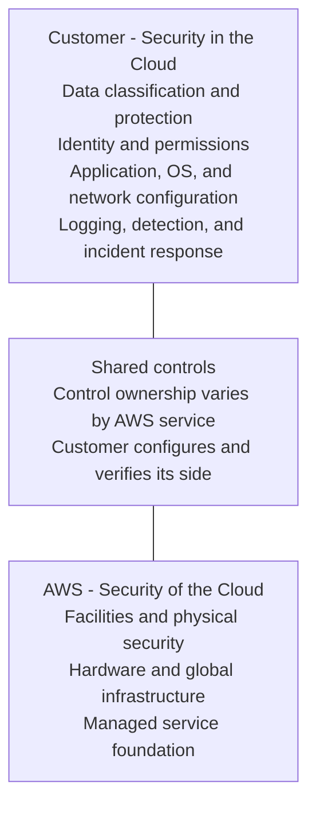

# AWS Well-Architected Framework：安全性支柱

安全性（Security）支柱以 shared responsibility 為基礎，透過 strong identity、traceability、defense in depth、自動化 controls、data protection 與 incident readiness 保護資訊、systems 與 assets。所選 AWS service 的 abstraction level 會改變 customer responsibility，但不會移除 customer 對 data、identity、configuration 與 workload behavior 的責任。

## Shared responsibility

## 設計原則

- 建立 strong identity foundation：集中 identity、強制 least privilege 與 separation of duties，優先使用 temporary credentials。
- Maintain traceability：集中、保護並關聯 logs、findings、metrics 與 changes，讓調查和 response 可重現。
- Apply security at all layers：在 edge、network、compute、OS、application、code、identity 與 data 實施 defense in depth。
- Automate security best practices：將 controls 與 guardrails 定義為 version-controlled code，自動偵測與修正 drift。
- Protect data in transit and at rest：依 classification 使用 encryption、tokenization、access control 與 lifecycle policy。
- Keep people away from data：減少直接 access 與 manual processing，避免 human error 與未追蹤操作。
- Prepare for security events：預先建立 roles、access、forensics、playbooks、communications 與 simulations。

## Review map

| AWS 問題群組 | Review 重點 | 應具備的證據 |
|---|---|---|
| SEC01 - Security foundations | Account separation、root user、control objectives、threat intelligence、control automation、threat modeling、新 capabilities | Organization/account design、root controls、control catalog、threat model、exception register |
| SEC02 - Identity management | Strong sign-in、temporary credentials、secrets、central identity、rotation、groups/attributes | Identity provider、MFA policy、role/session evidence、secret rotation、access review |
| SEC03 - Permissions | Access requirements、least privilege、emergency access、continuous reduction、guardrails、lifecycle、resource sharing | IAM analysis、SCP/permission boundaries、break-glass test、joiner/mover/leaver record |
| SEC04 - Detection | Service/application logging、central findings、correlation/enrichment、自動 remediation | Log inventory、central account/storage、alert route、remediation audit trail |
| SEC05 - Network protection | Network layers、traffic control、inspection、自動 protection | Data-flow diagram、security groups/NACL/routing policy、inspection coverage、change test |
| SEC06 - Compute protection | Vulnerability management、hardened images、減少 interactive access、software integrity、自動 protection | Patch/SLA report、image baseline、session audit、signature/SBOM、runtime findings |
| SEC07-SEC09 - Data protection | Classification、sensitivity-based controls、lifecycle、key/certificate management、encryption、authentication | Data inventory、KMS/key policy、TLS policy、certificate rotation、access evidence |
| SEC10 - Incident response | Personnel、plans、forensics、playbooks、pre-provisioned access/tools、simulations、learning | Contact matrix、tested playbook、forensic account/retention、exercise and action report |
| SEC11 - Application security | Training、automated testing、penetration testing、code review、package service、programmatic deployment、pipeline assessment、team ownership | Secure SDLC controls、scan results、review approvals、artifact provenance、security champions |

## 個別 best practices

### SEC01 - Security foundations

#### SEC01-BP01 Separate workloads using accounts

**未建立風險：高。** 依 business、environment、data sensitivity、regulatory scope 與 blast radius 使用 multi-account boundaries，透過 AWS Organizations/OUs 套用 guardrails。避免 production/non-production 或 unrelated workloads 共用 account；以 account vending、SCP、central logging、ownership 和 exception evidence 驗證。

#### SEC01-BP02 Secure account root user and properties

**未建立風險：高。** root user 只用於 required root tasks，使用 unique strong credentials、MFA、無 access keys、protected email/phone 和 monitored usage。避免 shared mailbox、daily administration 或無 recovery plan；以 credential inventory、CloudTrail alerts、contact recertification 和 tested access procedure 驗證。

#### SEC01-BP03 Identify and validate control objectives

**未建立風險：高。** 從 business risk、threat model、contracts、laws 與 standards 定義 measurable security control objectives，而非直接堆疊 tools。每個 objective 要有 owner、scope、implementation、evidence 和 test；避免 controls 與 risk 無關或只看 compliance checkbox。

#### SEC01-BP04 Stay up to date with security threats and recommendations

**未建立風險：高。** 持續接收 AWS Security Bulletins、service advisories、threat intelligence、CVE、vendor 與 industry guidance，判斷 applicability 和 urgency。避免只依 annual audit；建立 triage SLA、asset/dependency mapping、owner 和 remediation/exception，並以 closure evidence 驗證。

#### SEC01-BP05 Reduce security management scope

**未建立風險：中。** 優先使用 managed services、standardized platforms、central controls 和 automated guardrails，減少需自行 patch、access、monitor 與 audit 的 components。避免為差異化不高的 capability 自建；用 shared-responsibility analysis、attack surface、control count、toil 和 residual risk 比較。

#### SEC01-BP06 Automate deployment of standard security controls

**未建立風險：中。** 以 IaC、service control policies、Config rules、security services 和 policy-as-code 自動套用 baseline logging、encryption、identity、network 與 detection controls。避免 manual enablement 或 drift；建立 versioning、test、exception、rollback 和 centralized compliance evidence。

#### SEC01-BP07 Identify threats and prioritize mitigations using a threat model

**未建立風險：高。** 對 assets、actors、entry points、trust boundaries、data flows、abuse paths 與 assumptions 建立 threat model，依 likelihood/impact 排 mitigations。避免只在 launch 前畫圖或忽略 business logic/insider/supply chain；以 owner、mitigation status、accepted risk、test cases 和 change-triggered reviews 驗證。

#### SEC01-BP08 Evaluate and implement new security services and features regularly

**未建立風險：低。** 定期評估 AWS 新 security capabilities 和 existing-service features 對 coverage、automation、cost 與 complexity 的價值。避免 chase every feature 或永不更新 baseline；用 requirements、pilot、false positives、integration、operating owner、rollback 和 adoption decision 驗證。

### SEC02 - Identity management

#### SEC02-BP01 Use strong sign-in mechanisms

**未建立風險：高。** human identities 使用 centralized federation、phishing-resistant MFA、conditional access、session controls 與 no shared accounts。避免 password-only、long-lived IAM users 或 recovery bypass；以 IdP policy、MFA coverage、sign-in risk alerts、break-glass controls 和 authentication logs 驗證。

#### SEC02-BP02 Use temporary credentials

**未建立風險：高。** human 與 workloads 透過 roles、federation、STS、EKS Pod Identity/IRSA 或 service identities 取得 short-lived credentials。避免 embedded/static access keys 或 broad instance roles；限制 session duration、audience/trust、source identity 和 permissions，並以 key inventory、CloudTrail sessions 和 rotation metrics 驗證。

#### SEC02-BP03 Store and use secrets securely

**未建立風險：高。** secrets 存在 managed secret store 或 HSM-backed service，使用 encryption、least privilege、rotation、versioning 與 audited retrieval。避免 Git、images、logs、environment dumps 或 shared secrets；讓 applications 動態取得或掛載，並以 secret scans、access logs、rotation/failure tests 驗證。

#### SEC02-BP04 Rely on a centralized identity provider

**未建立風險：高。** 以 enterprise IdP/IAM Identity Center 集中 joiner/mover/leaver、MFA、groups、attributes 與 session policy，federate 到 AWS accounts。避免各 account 建 users 或 orphan credentials；以 provisioning/deprovisioning SLA、group-to-role mapping、access reviews 和 sign-in logs 驗證。

#### SEC02-BP05 Audit and rotate credentials periodically

**未建立風險：高。** 持續盤點 passwords、access keys、certificates、tokens、SSH keys 與 secrets，依 exposure/lifetime 自動 rotate 並移除 unused credentials。避免只看 creation date 或 rotation 未更新 consumers；以 credential reports、last-used data、rotation success、revocation 和 exception expiry 驗證。

#### SEC02-BP06 Employ user groups and attributes

**未建立風險：中。** 透過 groups、job functions、resource tags 與 session attributes 管理 scalable RBAC/ABAC，避免逐人 grants。建立 authoritative attributes、mapping、change approval 和 deny guardrails；防止 privilege through mutable tags。以 entitlement review、policy simulation、joiner/mover/leaver tests 和 exceptions 驗證。

### SEC03 - Permissions management

#### SEC03-BP01 Define access requirements

**未建立風險：高。** 對每個 persona、workload 與 operational task 記錄 required actions、resources、conditions、duration 和 approval，並區分 human/machine 和 read/write/admin。避免先給 broad access 再慢慢收；以 use cases、data classification、RACI 和 owner sign-off 驗證。

#### SEC03-BP02 Grant least privilege access

**未建立風險：高。** 從 minimum permissions 開始，使用 roles、resource/condition constraints、permission boundaries 與 scoped sessions，依 actual activity 精煉。避免 `*` actions/resources、shared admin 或 workload credential 可被其他 pods/hosts 使用；以 Access Analyzer、CloudTrail、policy simulation 和 denied-action review 驗證。

#### SEC03-BP03 Establish emergency access process

**未建立風險：中。** 建立 isolated break-glass roles/credentials，在 IdP 或 normal control path failure 時可用，但需 strong authentication、dual control、time-bound elevation、logging 和 immediate review。避免日常使用或未測 access；以 sealed custody、alarm、exercise、session audit 和 post-use revocation 驗證。

#### SEC03-BP04 Reduce permissions continuously

**未建立風險：中。** 利用 last-accessed、CloudTrail、Access Analyzer、service control data 和 role usage 定期移除 unused actions/resources、stale roles 與 broad grants。避免 permission 只增不減或一次性 review；建立 automated recommendations、owner approval、safe rollback 和 reduction metrics。

#### SEC03-BP05 Define permission guardrails for your organization

**未建立風險：中。** 以 SCPs、permission boundaries、session policies、resource policies 與 preventive controls 阻止高風險 actions，即使 identity policy 誤設。避免 guardrail 未測導致 outage 或 exceptions 永久存在；使用 sandbox simulation、version control、break-glass、owner 和 expiry。

#### SEC03-BP06 Manage access based on lifecycle

**未建立風險：中。** 將 access provisioning、modification、recertification 和 removal 連結 HR/vendor/application lifecycle，確保 movers/leavers、temporary roles 和 service retirement 即時處理。避免 orphan accounts 或 expired project access；以 SLA、automated workflows、manager/resource-owner reviews 和 termination tests 驗證。

#### SEC03-BP07 Analyze public and cross-account access

**未建立風險：低。** 持續辨識 S3、KMS、IAM roles、resource policies、network endpoints 等 public/external principals 與 unintended trust paths。避免只 review identity policies；用 IAM Access Analyzer、block-public controls、organization conditions、findings owner、SLA 和 exception expiry 驗證。

#### SEC03-BP08 Share resources securely within your organization

**未建立風險：中。** 透過 AWS RAM、organization-scoped policies、PrivateLink 或 controlled roles 分享 approved resources，定義 producer/consumer、data classification、permissions 和 revocation。避免 broad account trust 或 copy uncontrolled data；以 allowlist、resource policy、consumer inventory、logs 和 offboarding tests 驗證。

#### SEC03-BP09 Share resources securely with a third party

**未建立風險：中。** 對 vendors/partners 使用 dedicated roles、external IDs、short sessions、least privilege、network/data constraints、contracts 和 expiry。避免 shared credentials、permanent trust 或第三方可再委派；以 due diligence、access logs、periodic review、incident contact 和 termination/revocation test 驗證。

### SEC04 - Detection

#### SEC04-BP01 Configure service and application logging

**未建立風險：高。** 為 account、identity、network、data、application 與 security services 啟用足以偵測和調查的 logs，包含 data events where justified。避免 default-only、關鍵 service 未記錄或 secrets/PII 進 logs；以 logging inventory、coverage tests、schema、retention 和 owner 驗證。

#### SEC04-BP02 Capture logs, findings, and metrics in standardized locations

**未建立風險：中。** 集中到 dedicated security/log archive accounts 與 standardized stores，使用 encryption、immutable retention、time synchronization、cross-account delivery 和 restricted investigation access。避免 attacker 可刪同 account logs 或 fragmented schemas；以 delivery health、integrity、retention 和 query tests 驗證。

#### SEC04-BP03 Correlate and enrich security alerts

**未建立風險：低。** 將 GuardDuty/Security Hub/CloudTrail/application findings 與 asset owner、identity、network、data sensitivity、threat intel 和 business context 關聯，產生可優先處理 cases。避免 duplicate raw alerts 或無 context severity；以 dedup rate、triage time、precision 和 case completeness 驗證。

#### SEC04-BP04 Initiate remediation for non-compliant resources

**未建立風險：中。** 對已知 violations 自動 ticket、quarantine、revoke、reconfigure 或 rollback，依 risk 設 human approval。automation 要 least privilege、idempotent、bounded、audited 並保留 forensic evidence；避免 destructive auto-fix。以 injected violation、false remediation、MTTR 和 exception handling 驗證。

### SEC05 - Protect networks

#### SEC05-BP01 Create network layers

**未建立風險：高。** 依 trust、exposure、data sensitivity 與 function 分隔 edge、public ingress、application、data、management 和 inspection layers，使用 accounts/VPCs/subnets。避免 flat network 或 public reachability by default；以 data-flow diagram、route/security policy、reachability analysis 和 segmentation tests 驗證。

#### SEC05-BP02 Control traffic flow within network layers

**未建立風險：高。** 以 security groups、NACLs、routing、endpoints、firewalls 和 service-to-service policy 實施 least-connectivity ingress/egress，明確 ports、protocols、sources 和 destinations。避免 `0.0.0.0/0`、broad east-west 或 unmanaged egress；以 flow logs、reachability tests、rule owners 和 stale-rule cleanup 驗證。

#### SEC05-BP03 Implement inspection-based protection

**未建立風險：中。** 在 internet、VPC、hybrid、east-west 或 application boundaries 依 threat/risk 使用 WAF、IDS/IPS、Network Firewall、malware/content inspection 和 TLS-aware controls。避免 inspection blind spots、single bottleneck 或未處理 encrypted traffic；以 architecture、signature/policy updates、fail-open/closed decision、capacity 和 tests 驗證。

#### SEC05-BP04 Automate network protection

**未建立風險：中。** 以 IaC、policy-as-code、Firewall Manager、managed rules 和 automated response 一致部署、更新、validate network controls。避免 console drift、不同 accounts rules 不一致或 emergency rule 永久存在；使用 staged rollout、simulation、rollback、exception expiry 和 compliance dashboard 驗證。

### SEC06 - Protect compute

#### SEC06-BP01 Perform vulnerability management

**未建立風險：高。** 持續 inventory/scan hosts、containers、functions、libraries、appliances 與 cloud configurations，依 exploitability、exposure、asset criticality 和 compensating controls 排 remediation。避免只看 CVSS 或 scan 不修；定義 SLA、owner、exception expiry、rescan 和 risk acceptance。

#### SEC06-BP02 Provision compute from hardened images

**未建立風險：高。** 使用 approved、minimal、patched、configured 和 scanned images/templates，移除 unused software/accounts/services，設定 logging、EDR 和 secure defaults。避免 hand-built hosts、public base drift 或 latest tags；以 image pipeline、CIS/organization baseline、signature/SBOM、expiry 和 launch policy 驗證。

#### SEC06-BP03 Reduce manual management and interactive access

**未建立風險：中。** 優先 immutable deployment、automation 與 Systems Manager/session brokering，關閉 direct SSH/RDP/public management，使用 just-in-time audited access。避免 shared bastion keys 或 operators 直接改 production；以 session logs、port exposure、manual-change count、break-glass 和 drift evidence 驗證。

#### SEC06-BP04 Validate software integrity

**未建立風險：中。** 驗證 OS packages、images、binaries、dependencies 和 deployment artifacts 的 provenance、signature、digest 與 SBOM，並保護 build pipeline。避免 unsigned artifacts、mutable tags 或 download without verification；以 admission/deployment policy、attestation、tamper tests 和 traceability 驗證。

#### SEC06-BP05 Automate compute protection

**未建立風險：中。** 以 launch templates、IaC、configuration management、EDR/runtime monitoring、patch/replace 和 auto-quarantine 一致保護 compute fleet。避免 security agent missing 或 self-healing 抹除 evidence；設 health/compliance checks、guardrails、forensic capture、rollback 和 exception tracking。

### SEC07 - Data classification

#### SEC07-BP01 Understand your data classification scheme

**未建立風險：高。** 建立 enterprise classification levels、definitions、examples、owners 與 handling requirements，涵蓋 confidentiality、integrity、availability、privacy 和 regulatory needs。避免 teams 各自命名或 unknown data；以 data catalog、training、decision criteria、owner review 和 sampled accuracy 驗證。

#### SEC07-BP02 Apply data protection controls based on data sensitivity

**未建立風險：高。** 讓 classification 驅動 encryption、access、network、masking/tokenization、logging、backup、retention、residency、sharing 和 deletion。避免所有 data 同一 controls 或 label 不影響實作；建立 control matrix、policy enforcement、exceptions、tests 和 access/handling evidence。

#### SEC07-BP03 Automate identification and classification

**未建立風險：中。** 使用 discovery、metadata、pattern/ML scanning 和 event-driven workflows 找 sensitive data、assign labels、notify owners 與 trigger controls。避免完全手動 inventory 或 false positives 無處理；定義 confidence、human review、coverage、rescan、lineage 和 remediation SLA。

#### SEC07-BP04 Define scalable data lifecycle management

**未建立風險：高。** 依 business/legal needs 自動建立、分類、retain、archive、legal hold 與 securely delete data，包含 replicas、backups、logs 和 derived copies。避免 indefinite retention 或刪 primary 卻留 copies；以 lifecycle policies、owner approval、deletion verification、exceptions 和 restore implications 驗證。

### SEC08 - Protect data at rest

#### SEC08-BP01 Implement secure key management

**未建立風險：高。** 集中 KMS/HSM key ownership、policy、separation of duties、rotation、backup、deletion protection 和 usage monitoring。避免 application-owned raw keys、broad decrypt 或 key 與 encrypted data 同 failure domain；以 key inventory、grants、CloudTrail usage、rotation 和 recovery/deletion tests 驗證。

#### SEC08-BP02 Enforce encryption at rest

**未建立風險：高。** 對 block/object/file/database/backup/log/queue 和 managed services 預設 encryption，依 classification 選 AWS-owned、AWS-managed 或 customer-managed keys。避免 optional/manual enablement 或 snapshot/copy 漏加密；以 preventive policy、Config checks、key policy、migration 和 restore tests 驗證。

#### SEC08-BP03 Automate data at rest protection

**未建立風險：中。** 以 IaC、organization policy、service defaults、Config/remediation 和 data-classification events 自動 enforce encryption、access、retention 與 backup。避免 resource creator 自行選擇或 remediation 破壞 workload；採 staged rollout、exception、audit、rollback 和 compliance trend。

#### SEC08-BP04 Enforce access control

**未建立風險：高。** 對 data APIs、storage、database、backups 和 keys 實施 least privilege、resource policies、network restrictions、row/column/object controls 和 audited privileged access。避免 public buckets、shared DB admin 或 bypass path；以 Access Analyzer、policy simulation、data-access logs 和 negative tests 驗證。

### SEC09 - Protect data in transit

#### SEC09-BP01 Implement secure key and certificate management

**未建立風險：高。** 集中 certificate/key issuance、inventory、ownership、renewal、revocation、storage 與 monitoring，使用 ACM/Private CA/KMS/HSM 等 managed mechanisms。避免 private keys in images、expired certs 或 unknown endpoints；以 expiry alarms、rotation automation、revocation 和 failover tests 驗證。

#### SEC09-BP02 Enforce encryption in transit

**未建立風險：高。** 對 external/internal、service-to-service、management、replication 和 backup traffic 強制 current TLS 或 suitable encrypted protocols，禁用 weak versions/ciphers 和 plaintext downgrade。避免只保護 public edge；以 policy scans、packet/config tests、certificate validation 和 client compatibility 驗證。

#### SEC09-BP03 Authenticate network communications

**未建立風險：低。** 除了 encryption，使用 certificate identity、mTLS、signed requests、service identity 或 token audience 驗證 peers，防止 spoofing/MITM。避免只信 IP/network location 或跳過 hostname validation；以 trust-store governance、rotation、negative tests、revocation 和 authorization linkage 驗證。

### SEC10 - Incident response

#### SEC10-BP01 Identify key personnel and external resources

**未建立風險：高。** 建立 incident roles 與 contacts，包含 command、security、application、cloud、network、forensics、legal、privacy、HR、communications、executives、AWS Support 和 vendors。避免 incident 才找人；明確 authority、time zones、alternates 和 secure channels，並定期 call-tree test。

#### SEC10-BP02 Develop incident management plans

**未建立風險：高。** 建立 approved incident plan，涵蓋 scope、severity、RACI、detection、triage、containment、eradication、recovery、evidence、communications、regulatory duties 和 lessons learned。避免 generic plan 未對 AWS/shared responsibility；以 annual/change-triggered review、simulation 和 stakeholder sign-off 驗證。

#### SEC10-BP03 Prepare forensic capabilities

**未建立風險：中。** 預先建立 isolated forensic accounts/VPCs、immutable log/evidence stores、snapshots/images、time sync、chain of custody 和 analysis tools。避免在 compromise account 臨時安裝工具或修改 original evidence；以 access、retention、collection automation、hashing、legal requirements 和 exercise 驗證。

#### SEC10-BP04 Develop and test security incident response playbooks

**未建立風險：中。** 針對 credential compromise、public data、malware、ransomware、network intrusion、supply chain 和 insider scenarios 建 playbooks，包含 indicators、queries、containment、evidence、communications、recovery 和 stop conditions。避免 copy template 不測；以 tabletop/technical simulations 和 updates 驗證。

#### SEC10-BP05 Pre-provision access

**未建立風險：中。** 預先建立 time-bound incident roles、break-glass credentials、cross-account trust、forensic access 和 approval，使 normal IdP/workload unavailable 時仍可 action。避免日常使用或 permissions 未測；以 dual control、MFA、alarm、session audit、exercise 和 post-use revocation 驗證。

#### SEC10-BP06 Pre-deploy tools

**未建立風險：中。** 在 secure tooling/forensic environments 預置 trusted CLI、queries、automation、EDR、collection scripts、images 和 communication tools，保持 patched/versioned。避免 incident 時從 internet 下載 unknown binaries；以 integrity/signature、access, network path、compatibility 和 offline availability tests 驗證。

#### SEC10-BP07 Run simulations

**未建立風險：中。** 定期執行 tabletop、purple-team、technical 和 cross-functional simulations，測 detection、roles、access、containment、forensics、communications 與 recovery。避免只通知 security team 或無 measurable criteria；限制 blast radius，記錄 timeline、gaps、owners、due dates 和 re-test。

#### SEC10-BP08 Establish a framework for learning from incidents

**未建立風險：中。** 以 blameless post-incident process 分析 timeline、attack path、control successes/failures、decision 和 organizational factors，將 lessons 回饋 threat models、controls、playbooks、training 和 metrics。避免只找 offender 或 action 無 owner；以 closure/effectiveness 和 recurrence 驗證。

### SEC11 - Application security

#### SEC11-BP01 Train for application security

**未建立風險：中。** 依 developer、architect、tester、operator 與 product roles 提供 threat modeling、secure design/coding、cloud IAM/data、dependency、testing 和 incident training，包含 language/framework risks。避免 annual generic video；以 labs、role coverage、assessment、defect trends 和 champion network 驗證。

#### SEC11-BP02 Automate testing throughout the development and release lifecycle

**未建立風險：中。** 在 IDE/commit/CI/pre-deploy/runtime 依風險使用 SAST、SCA、secret、IaC、container、DAST、API 和 policy tests，設定 severity gates。避免 scanner overload、unpinned tools 或 findings 無 owner；以 coverage、false-positive process、SLA、exceptions 和 deployed-artifact trace 驗證。

#### SEC11-BP03 Perform regular penetration testing

**未建立風險：高。** 依 scope/risk 定期和重大 change 後進行 authorized penetration tests，涵蓋 business logic、identity、API、cloud configuration、tenant isolation 和 chained attack paths。避免未核准 production testing 或只跑 scanner；定義 rules of engagement、data handling、fix/validation 和 retest。

#### SEC11-BP04 Conduct code reviews

**未建立風險：中。** 對 security-sensitive changes 進行 peer review，使用 checklist/ownership 檢查 authn/authz、input/output、crypto、secrets、errors、logging、concurrency 和 data flow。避免 rubber-stamp approval 或 author self-approve；以 protected branches、review evidence、high-risk specialists 和 defect feedback 驗證。

#### SEC11-BP05 Centralize services for packages and dependencies

**未建立風險：中。** 使用 controlled artifact/package repositories、allowlists、provenance、signatures、SBOM、malware/license/vulnerability scanning 和 retention。避免 direct public downloads、dependency confusion 或 mutable artifacts；以 repository policy、namespace ownership、digest pinning、quarantine 和 traceability 驗證。

#### SEC11-BP06 Deploy software programmatically

**未建立風險：高。** 以 version-controlled pipeline、least-privilege roles、immutable signed artifacts、approval、environment gates 和 rollback 部署，移除 manual production changes。避免 workstation credentials、copy/paste 或 rebuilt artifacts；以 commit-build-scan-deploy digest chain、audit、separation of duties 和 drift detection 驗證。

#### SEC11-BP07 Regularly assess security properties of the pipelines

**未建立風險：高。** 把 CI/CD 當 production system threat model，review source triggers、runner isolation、secrets、dependencies、artifact integrity、approvals、logs 和 admin access。避免 untrusted fork 取得 secrets、mutable third-party actions 或 long-lived tokens；以 attack simulation、patching、access review 和 recovery plan 驗證。

#### SEC11-BP08 Build a program that embeds security ownership in workload teams

**未建立風險：低。** 讓 workload teams 對 security outcomes、threat models、findings 和 risk acceptance 負責，central security 提供 standards、platforms、coaching 和 assurance。避免 security 是 release-end gate 或責任外包；建立 champions、RACI、metrics、office hours、exception governance 和 leadership review。

## 實作與驗證

1. 依 business、data sensitivity 與 blast radius 設計 multi-account boundaries，保護 root user 並集中 workforce identity。
2. 使用 short-lived role sessions、least privilege、permission guardrails 與定期 access analysis；break-glass access 必須可稽核且實測。
3. 建立 data inventory 與 classification，讓 encryption、key ownership、retention、residency、sharing 與 deletion policies 由 sensitivity 驅動。
4. 集中 CloudTrail、configuration、network、identity、application 與 security findings；保護 log integrity、retention 與 investigation access。
5. 以 hardened images、patching、vulnerability management、software provenance、automated deployment 與 runtime detection 保護 compute 和 application lifecycle。
6. 預先準備 incident roles、forensic environment、isolated access、evidence capture、containment playbooks 與 customer/regulatory communication，並定期 simulation。

## Checklist

- [ ] AWS 與 customer 的 responsibility 已依實際 services 與 control objectives 記錄。
- [ ] Human 與 workload identities 使用 centralized identity、MFA、temporary credentials 與 least privilege。
- [ ] Public、cross-account 與 third-party access 有持續 analysis 和 owner。
- [ ] Critical logs 與 findings 集中、加密、具 retention，且 alert 能觸發可稽核 response。
- [ ] Data classification 會實際驅動 encryption、key、access、retention 與 deletion controls。
- [ ] Incident response access、forensics、playbooks、communications 與 simulations 已驗證。

---

# AWS Well-Architected Framework: Security Pillar

The security pillar builds on shared responsibility to protect information, systems, and assets through strong identity, traceability, defense in depth, automated controls, data protection, and incident readiness. The abstraction level of the selected AWS service changes customer responsibility, but it does not remove responsibility for data, identity, configuration, or workload behavior.

## Shared responsibility

## Design principles

- Implement a strong identity foundation with centralized identity, least privilege, separation of duties, and temporary credentials.
- Maintain traceability by centralizing, protecting, and correlating logs, findings, metrics, and changes.
- Apply security at all layers across edge, network, compute, OS, application, code, identity, and data.
- Automate security best practices by defining controls and guardrails as version-controlled code and remediating drift.
- Protect data in transit and at rest with classification-driven encryption, tokenization, access control, and lifecycle policies.
- Keep people away from data by reducing direct access and manual processing.
- Prepare for security events with predefined roles, access, forensics, playbooks, communication, and simulations.

## Review map

| AWS question group | Review focus | Expected evidence |
|---|---|---|
| SEC01 - Security foundations | Account separation, root user, control objectives, threat intelligence, control automation, threat modeling, and new capabilities | Organization/account design, root controls, control catalog, threat model, exception register |
| SEC02 - Identity management | Strong sign-in, temporary credentials, secrets, centralized identity, rotation, and groups/attributes | Identity provider, MFA policy, role/session evidence, secret rotation, access review |
| SEC03 - Permissions | Access requirements, least privilege, emergency access, continuous reduction, guardrails, lifecycle, and sharing | IAM analysis, SCPs/permission boundaries, break-glass test, joiner/mover/leaver record |
| SEC04 - Detection | Service/application logging, centralized findings, correlation/enrichment, and automated remediation | Log inventory, central account/storage, alert route, remediation audit trail |
| SEC05 - Network protection | Network layers, traffic control, inspection, and automated protection | Data-flow diagram, security groups/NACL/routing policy, inspection coverage, change test |
| SEC06 - Compute protection | Vulnerability management, hardened images, reduced interactive access, software integrity, and automation | Patch/SLA report, image baseline, session audit, signature/SBOM, runtime findings |
| SEC07-SEC09 - Data protection | Classification, sensitivity-based controls, lifecycle, key/certificate management, encryption, and authentication | Data inventory, KMS/key policy, TLS policy, certificate rotation, access evidence |
| SEC10 - Incident response | Personnel, plans, forensics, playbooks, pre-provisioned access/tools, simulations, and learning | Contact matrix, tested playbook, forensic account/retention, exercise and action report |
| SEC11 - Application security | Training, automated testing, penetration testing, code review, package services, deployment, pipeline assessment, and team ownership | Secure SDLC controls, scan results, review approvals, artifact provenance, security champions |

## Individual best practices

### SEC01 - Security foundations

#### SEC01-BP01 Separate workloads using accounts

**Risk if absent: High.** Use multi-account boundaries based on business, environment, data sensitivity, regulatory scope, and blast radius, applying guardrails through AWS Organizations and OUs. Avoid mixing production with nonproduction or unrelated workloads. Verify account vending, SCPs, central logging, ownership, and exceptions.

#### SEC01-BP02 Secure account root user and properties

**Risk if absent: High.** Use the root user only for required root tasks with unique strong credentials, MFA, no access keys, protected email and phone, and monitored use. Avoid shared mailboxes, daily administration, or no recovery plan. Verify credential inventory, CloudTrail alerts, contact recertification, and tested access procedures.

#### SEC01-BP03 Identify and validate control objectives

**Risk if absent: High.** Define measurable security control objectives from business risk, threat models, contracts, laws, and standards rather than accumulating tools. Give each objective an owner, scope, implementation, evidence, and test. Avoid controls disconnected from risk or compliance-only checkboxes.

#### SEC01-BP04 Stay up to date with security threats and recommendations

**Risk if absent: High.** Continuously consume AWS security bulletins, service advisories, threat intelligence, CVEs, vendor, and industry guidance, assessing applicability and urgency. Avoid annual-audit-only updates. Use triage SLAs, asset/dependency mapping, owners, remediation or exceptions, and closure evidence.

#### SEC01-BP05 Reduce security management scope

**Risk if absent: Medium.** Prefer managed services, standardized platforms, central controls, and automated guardrails to reduce components requiring patching, access, monitoring, and audit. Avoid self-building undifferentiated capabilities. Compare shared responsibility, attack surface, control count, toil, and residual risk.

#### SEC01-BP06 Automate deployment of standard security controls

**Risk if absent: Medium.** Use IaC, service control policies, Config rules, security services, and policy-as-code to deploy baseline logging, encryption, identity, network, and detection controls. Avoid manual enablement or drift. Provide versioning, tests, exceptions, rollback, and centralized compliance evidence.

#### SEC01-BP07 Identify threats and prioritize mitigations using a threat model

**Risk if absent: High.** Model assets, actors, entry points, trust boundaries, data flows, abuse paths, and assumptions, prioritizing mitigations by likelihood and impact. Avoid launch-only diagrams or missing business logic, insider, and supply-chain threats. Verify owners, status, accepted risk, tests, and change-triggered reviews.

#### SEC01-BP08 Evaluate and implement new security services and features regularly

**Risk if absent: Low.** Regularly evaluate new AWS security capabilities and existing-service features for coverage, automation, cost, and complexity. Avoid chasing every feature or never updating the baseline. Verify requirements, pilots, false positives, integration, ownership, rollback, and adoption decisions.

### SEC02 - Identity management

#### SEC02-BP01 Use strong sign-in mechanisms

**Risk if absent: High.** Human identities use centralized federation, phishing-resistant MFA, conditional access, session controls, and no shared accounts. Avoid password-only access, long-lived IAM users, or recovery bypasses. Verify IdP policy, MFA coverage, sign-in risk alerts, break-glass controls, and authentication logs.

#### SEC02-BP02 Use temporary credentials

**Risk if absent: High.** Humans and workloads obtain short-lived credentials through roles, federation, STS, EKS Pod Identity or IRSA, and service identities. Avoid embedded static keys or broad instance roles. Limit duration, trust, source identity, and permissions; verify key inventory, CloudTrail sessions, and rotation metrics.

#### SEC02-BP03 Store and use secrets securely

**Risk if absent: High.** Store secrets in managed secret stores or HSM-backed services with encryption, least privilege, rotation, versioning, and audited retrieval. Avoid Git, images, logs, environment dumps, or shared secrets. Let applications retrieve or mount securely; verify scans, access logs, rotation, and failure tests.

#### SEC02-BP04 Rely on a centralized identity provider

**Risk if absent: High.** Centralize joiner/mover/leaver, MFA, groups, attributes, and session policy in an enterprise IdP or IAM Identity Center federated to AWS accounts. Avoid per-account users or orphan credentials. Verify provisioning SLAs, group-to-role mapping, access reviews, and sign-in logs.

#### SEC02-BP05 Audit and rotate credentials periodically

**Risk if absent: High.** Continuously inventory passwords, access keys, certificates, tokens, SSH keys, and secrets, rotating by exposure and lifetime and removing unused credentials. Avoid creation-date-only review or rotations that miss consumers. Verify reports, last-used data, rotation success, revocation, and exception expiry.

#### SEC02-BP06 Employ user groups and attributes

**Risk if absent: Medium.** Use groups, job functions, resource tags, and session attributes for scalable RBAC or ABAC instead of per-user grants. Govern authoritative attributes, mappings, approvals, and deny guardrails; prevent privilege through mutable tags. Verify entitlement reviews, policy simulation, lifecycle tests, and exceptions.

### SEC03 - Permissions management

#### SEC03-BP01 Define access requirements

**Risk if absent: High.** Document required actions, resources, conditions, duration, and approval for each persona, workload, and operational task, separating human, machine, read, write, and administration. Avoid granting broad access first. Verify use cases, data classification, RACI, and owner sign-off.

#### SEC03-BP02 Grant least privilege access

**Risk if absent: High.** Start with minimum permissions using roles, resource and condition constraints, permission boundaries, and scoped sessions, refining from actual activity. Avoid wildcard permissions, shared admin, or reusable workload credentials. Verify Access Analyzer, CloudTrail, policy simulation, and denied-action reviews.

#### SEC03-BP03 Establish emergency access process

**Risk if absent: Medium.** Provide isolated break-glass roles or credentials for IdP or normal-control failure with strong authentication, dual control, time-bounded elevation, logging, and immediate review. Avoid daily use or untested access. Verify custody, alarms, exercises, session audit, and post-use revocation.

#### SEC03-BP04 Reduce permissions continuously

**Risk if absent: Medium.** Use last-accessed data, CloudTrail, Access Analyzer, control data, and role usage to remove unused actions, resources, stale roles, and broad grants regularly. Avoid add-only permissions or one-time reviews. Provide recommendations, owner approval, safe rollback, and reduction metrics.

#### SEC03-BP05 Define permission guardrails for your organization

**Risk if absent: Medium.** Use SCPs, permission boundaries, session policies, resource policies, and preventive controls to block high-risk actions even when identity policies are wrong. Avoid untested guardrails causing outages or permanent exceptions. Use sandbox simulation, version control, break-glass, ownership, and expiry.

#### SEC03-BP06 Manage access based on lifecycle

**Risk if absent: Medium.** Link access provisioning, modification, recertification, and removal to HR, vendor, application, and service lifecycles so movers, leavers, temporary roles, and retired services are handled promptly. Avoid orphan accounts or expired project access. Verify SLAs, workflows, owner reviews, and termination tests.

#### SEC03-BP07 Analyze public and cross-account access

**Risk if absent: Low.** Continuously identify public or external principals and unintended trust paths across S3, KMS, IAM roles, resource policies, and endpoints. Avoid reviewing identity policies alone. Use IAM Access Analyzer, public-access blocks, organization conditions, finding owners, SLAs, and expiring exceptions.

#### SEC03-BP08 Share resources securely within your organization

**Risk if absent: Medium.** Share approved resources through AWS RAM, organization-scoped policies, PrivateLink, or controlled roles with producer, consumer, classification, permissions, and revocation defined. Avoid broad account trust or uncontrolled copying. Verify allowlists, policies, consumer inventory, logs, and offboarding tests.

#### SEC03-BP09 Share resources securely with a third party

**Risk if absent: Medium.** For vendors and partners, use dedicated roles, external IDs, short sessions, least privilege, network/data constraints, contracts, and expiry. Avoid shared credentials, permanent trust, or uncontrolled delegation. Verify due diligence, logs, reviews, incident contacts, and revocation tests.

### SEC04 - Detection

#### SEC04-BP01 Configure service and application logging

**Risk if absent: High.** Enable sufficient account, identity, network, data, application, and security-service logs for detection and investigation, including justified data events. Avoid defaults only, missing critical services, or secrets and PII in logs. Verify inventories, coverage tests, schemas, retention, and ownership.

#### SEC04-BP02 Capture logs, findings, and metrics in standardized locations

**Risk if absent: Medium.** Centralize logs, findings, and metrics in dedicated security or log-archive accounts and standardized stores with encryption, immutable retention, time synchronization, cross-account delivery, and restricted access. Avoid attacker-deletable local logs or fragmented schemas. Verify delivery health, integrity, retention, and queries.

#### SEC04-BP03 Correlate and enrich security alerts

**Risk if absent: Low.** Correlate GuardDuty, Security Hub, CloudTrail, application, and other findings with asset ownership, identity, network, data sensitivity, threat intelligence, and business context. Avoid duplicate raw alerts or context-free severity. Verify deduplication, triage time, precision, and case completeness.

#### SEC04-BP04 Initiate remediation for non-compliant resources

**Risk if absent: Medium.** For known violations, automatically ticket, quarantine, revoke, reconfigure, or roll back with risk-based human approval. Automation must be least-privileged, idempotent, bounded, audited, and preserve evidence. Avoid destructive auto-fixes. Verify injected violations, false remediation, MTTR, and exceptions.

### SEC05 - Protect networks

#### SEC05-BP01 Create network layers

**Risk if absent: High.** Separate edge, public ingress, application, data, management, and inspection layers by trust, exposure, sensitivity, and function using accounts, VPCs, and subnets. Avoid flat networks or public reachability by default. Verify data-flow diagrams, routes, policies, reachability analysis, and segmentation tests.

#### SEC05-BP02 Control traffic flow within network layers

**Risk if absent: High.** Enforce least-connectivity ingress and egress with security groups, NACLs, routing, endpoints, firewalls, and service policy, defining ports, protocols, sources, and destinations. Avoid broad internet or east-west access and unmanaged egress. Verify flow logs, reachability tests, owners, and stale-rule cleanup.

#### SEC05-BP03 Implement inspection-based protection

**Risk if absent: Medium.** Apply WAF, IDS/IPS, Network Firewall, malware or content inspection, and TLS-aware controls at internet, VPC, hybrid, east-west, or application boundaries according to risk. Avoid blind spots, single bottlenecks, or ignored encryption. Verify architecture, updates, failure policy, capacity, and tests.

#### SEC05-BP04 Automate network protection

**Risk if absent: Medium.** Use IaC, policy-as-code, Firewall Manager, managed rules, and automated response to deploy, update, and validate network controls consistently. Avoid console drift, inconsistent account rules, or permanent emergency rules. Use staged rollout, simulation, rollback, expiring exceptions, and compliance dashboards.

### SEC06 - Protect compute

#### SEC06-BP01 Perform vulnerability management

**Risk if absent: High.** Continuously inventory and scan hosts, containers, functions, libraries, appliances, and cloud configuration, prioritizing by exploitability, exposure, criticality, and compensating controls. Avoid CVSS-only decisions or scanning without remediation. Define SLAs, owners, expiring exceptions, rescans, and risk acceptance.

#### SEC06-BP02 Provision compute from hardened images

**Risk if absent: High.** Use approved, minimal, patched, configured, and scanned images or templates with unused software, accounts, and services removed and secure logging and EDR defaults. Avoid hand-built hosts, drifting public bases, or latest tags. Verify image pipelines, baselines, signatures/SBOMs, expiry, and launch policy.

#### SEC06-BP03 Reduce manual management and interactive access

**Risk if absent: Medium.** Prefer immutable deployment, automation, and Systems Manager or session brokering; disable direct SSH, RDP, and public management; use just-in-time audited access. Avoid shared bastion keys or direct production edits. Verify sessions, exposed ports, manual changes, break-glass, and drift.

#### SEC06-BP04 Validate software integrity

**Risk if absent: Medium.** Validate provenance, signatures, digests, and SBOMs for OS packages, images, binaries, dependencies, and deployment artifacts, securing the build pipeline. Avoid unsigned artifacts, mutable tags, or unverified downloads. Verify admission or deployment policy, attestations, tamper tests, and traceability.

#### SEC06-BP05 Automate compute protection

**Risk if absent: Medium.** Protect compute fleets consistently with launch templates, IaC, configuration management, EDR or runtime monitoring, patch or replacement, and auto-quarantine. Avoid missing agents or self-healing that destroys evidence. Use health and compliance checks, guardrails, forensic capture, rollback, and exceptions.

### SEC07 - Data classification

#### SEC07-BP01 Understand your data classification scheme

**Risk if absent: High.** Define enterprise classification levels, examples, owners, and handling requirements across confidentiality, integrity, availability, privacy, and regulation. Avoid team-specific labels or unknown data. Verify data catalogs, training, decision criteria, owner reviews, and sampled accuracy.

#### SEC07-BP02 Apply data protection controls based on data sensitivity

**Risk if absent: High.** Make classification drive encryption, access, network, masking or tokenization, logging, backup, retention, residency, sharing, and deletion. Avoid one control set for all data or labels without enforcement. Maintain control matrices, policy enforcement, exceptions, tests, and handling evidence.

#### SEC07-BP03 Automate identification and classification

**Risk if absent: Medium.** Use discovery, metadata, pattern or ML scanning, and event-driven workflows to find sensitive data, assign labels, notify owners, and trigger controls. Avoid fully manual inventories or unmanaged false positives. Define confidence, human review, coverage, rescans, lineage, and remediation SLAs.

#### SEC07-BP04 Define scalable data lifecycle management

**Risk if absent: High.** Automate creation, classification, retention, archival, legal hold, and secure deletion from business and legal needs across replicas, backups, logs, and derived copies. Avoid indefinite retention or deleting only the primary. Verify lifecycle policies, approval, deletion evidence, exceptions, and restore implications.

### SEC08 - Protect data at rest

#### SEC08-BP01 Implement secure key management

**Risk if absent: High.** Centralize KMS or HSM key ownership, policy, separation of duties, rotation, backup, deletion protection, and usage monitoring. Avoid application-owned raw keys, broad decrypt, or keys sharing data failure domains. Verify inventory, grants, usage, rotation, and recovery or deletion tests.

#### SEC08-BP02 Enforce encryption at rest

**Risk if absent: High.** Default encryption for block, object, file, database, backup, log, queue, and managed services, choosing key ownership from classification. Avoid optional/manual enablement or unencrypted snapshots and copies. Verify preventive policy, Config checks, key policy, migration, and restore tests.

#### SEC08-BP03 Automate data at rest protection

**Risk if absent: Medium.** Use IaC, organization policy, service defaults, Config and remediation, and classification events to enforce encryption, access, retention, and backup automatically. Avoid creator choice or disruptive remediation. Use staged rollout, exceptions, audit, rollback, and compliance trends.

#### SEC08-BP04 Enforce access control

**Risk if absent: High.** Enforce least privilege, resource policies, network restrictions, row, column, or object controls, and audited privileged access across data APIs, storage, databases, backups, and keys. Avoid public buckets, shared database admins, or bypass paths. Verify Access Analyzer, policy simulation, logs, and negative tests.

### SEC09 - Protect data in transit

#### SEC09-BP01 Implement secure key and certificate management

**Risk if absent: High.** Centralize certificate and key issuance, inventory, ownership, renewal, revocation, storage, and monitoring using managed mechanisms such as ACM, Private CA, KMS, or HSM. Avoid keys in images, expired certificates, or unknown endpoints. Verify expiry alarms, rotation, revocation, and failover.

#### SEC09-BP02 Enforce encryption in transit

**Risk if absent: High.** Require current TLS or suitable encrypted protocols for external, internal, service-to-service, management, replication, and backup traffic, disabling weak versions, ciphers, and plaintext downgrade. Avoid protecting only the public edge. Verify policy scans, packet or configuration tests, certificate validation, and compatibility.

#### SEC09-BP03 Authenticate network communications

**Risk if absent: Low.** Beyond encryption, authenticate peers with certificate identity, mTLS, signed requests, service identity, or token audience to prevent spoofing and MITM. Avoid trusting IP or network location alone or skipping hostname validation. Verify trust governance, rotation, negative tests, revocation, and authorization linkage.

### SEC10 - Incident response

#### SEC10-BP01 Identify key personnel and external resources

**Risk if absent: High.** Identify incident command, security, application, cloud, network, forensics, legal, privacy, HR, communications, executives, AWS Support, and vendors. Avoid finding people during incidents. Define authority, time zones, alternates, and secure channels and test the call tree regularly.

#### SEC10-BP02 Develop incident management plans

**Risk if absent: High.** Maintain an approved incident plan covering scope, severity, RACI, detection, triage, containment, eradication, recovery, evidence, communications, regulatory duties, and learning. Avoid a generic plan that ignores AWS shared responsibility. Verify recurring review, simulation, and stakeholder sign-off.

#### SEC10-BP03 Prepare forensic capabilities

**Risk if absent: Medium.** Prebuild isolated forensic accounts or VPCs, immutable evidence stores, snapshots and images, time sync, chain of custody, and analysis tools. Avoid installing tools in compromised accounts or modifying originals. Verify access, retention, collection automation, hashes, legal needs, and exercises.

#### SEC10-BP04 Develop and test security incident response playbooks

**Risk if absent: Medium.** Create playbooks for credential compromise, public data, malware, ransomware, intrusion, supply chain, and insider scenarios with indicators, queries, containment, evidence, communication, recovery, and stop conditions. Avoid untested copied templates. Verify tabletop and technical simulations and updates.

#### SEC10-BP05 Pre-provision access

**Risk if absent: Medium.** Preprovision time-bounded incident roles, break-glass credentials, cross-account trust, forensic access, and approval so responders can act if normal identity systems fail. Avoid daily use or untested permissions. Verify dual control, MFA, alarms, session audit, exercises, and revocation.

#### SEC10-BP06 Pre-deploy tools

**Risk if absent: Medium.** Predeploy trusted CLIs, queries, automation, EDR, collection scripts, images, and communication tools in secure tooling or forensic environments and keep them patched and versioned. Avoid downloading unknown binaries during incidents. Verify integrity, access, paths, compatibility, and offline availability.

#### SEC10-BP07 Run simulations

**Risk if absent: Medium.** Run tabletop, purple-team, technical, and cross-functional simulations for detection, roles, access, containment, forensics, communication, and recovery. Avoid security-only exercises or missing criteria. Bound blast radius and record timelines, gaps, owners, dates, and retests.

#### SEC10-BP08 Establish a framework for learning from incidents

**Risk if absent: Medium.** Use blameless post-incident analysis of timelines, attack paths, control successes and failures, decisions, and organizational factors, feeding lessons into threat models, controls, playbooks, training, and metrics. Avoid blame or ownerless actions. Verify closure, effectiveness, and recurrence.

### SEC11 - Application security

#### SEC11-BP01 Train for application security

**Risk if absent: Medium.** Provide role-based training for developers, architects, testers, operators, and product teams in threat modeling, secure design and coding, cloud identity and data, dependencies, testing, and incidents, including language and framework risks. Avoid annual generic videos. Verify labs, coverage, assessments, defect trends, and champions.

#### SEC11-BP02 Automate testing throughout the development and release lifecycle

**Risk if absent: Medium.** Use risk-based SAST, SCA, secret, IaC, container, DAST, API, and policy tests across IDE, commit, CI, predeployment, and runtime with severity gates. Avoid scanner overload, unpinned tools, or ownerless findings. Verify coverage, false-positive handling, SLAs, exceptions, and artifact traceability.

#### SEC11-BP03 Perform regular penetration testing

**Risk if absent: High.** Perform authorized penetration tests periodically and after major changes, covering business logic, identity, APIs, cloud configuration, tenant isolation, and chained attack paths. Avoid unapproved production tests or scanner-only exercises. Define rules, data handling, remediation, validation, and retest.

#### SEC11-BP04 Conduct code reviews

**Risk if absent: Medium.** Peer-review security-sensitive changes using checklists and ownership for authentication, authorization, input/output, crypto, secrets, errors, logging, concurrency, and data flow. Avoid rubber-stamp or self-approval. Verify protected branches, review evidence, specialist review, and defect feedback.

#### SEC11-BP05 Centralize services for packages and dependencies

**Risk if absent: Medium.** Use controlled artifact and package repositories with allowlists, provenance, signatures, SBOMs, malware/license/vulnerability scans, and retention. Avoid direct public downloads, dependency confusion, or mutable artifacts. Verify repository policy, namespace ownership, digest pinning, quarantine, and traceability.

#### SEC11-BP06 Deploy software programmatically

**Risk if absent: High.** Deploy through version-controlled pipelines, least-privileged roles, immutable signed artifacts, approvals, environment gates, and rollback, removing manual production changes. Avoid workstation credentials, copy/paste, or rebuilt artifacts. Verify commit-build-scan-deploy digest chains, audit, separation of duties, and drift.

#### SEC11-BP07 Regularly assess security properties of the pipelines

**Risk if absent: High.** Threat-model CI/CD as a production system, reviewing source triggers, runner isolation, secrets, dependencies, artifact integrity, approvals, logs, and administration. Avoid secrets in untrusted forks, mutable third-party actions, or long-lived tokens. Verify attack simulations, patching, access reviews, and recovery plans.

#### SEC11-BP08 Build a program that embeds security ownership in workload teams

**Risk if absent: Low.** Make workload teams accountable for security outcomes, threat models, findings, and risk acceptance while central security provides standards, platforms, coaching, and assurance. Avoid end-of-release gates or outsourced ownership. Use champions, RACI, metrics, office hours, exception governance, and leadership review.

## Implementation and validation

1. Design multi-account boundaries from business context, data sensitivity, and blast radius. Protect the root user and centralize workforce identity.
2. Use short-lived role sessions, least privilege, permission guardrails, and recurring access analysis. Audit and exercise break-glass access.
3. Build a data inventory and classification so sensitivity drives encryption, key ownership, retention, residency, sharing, and deletion policies.
4. Centralize CloudTrail, configuration, network, identity, application, and security findings. Protect log integrity, retention, and investigation access.
5. Protect the compute and application lifecycle with hardened images, patching, vulnerability management, software provenance, automated deployment, and runtime detection.
6. Pre-stage incident roles, a forensic environment, isolated access, evidence capture, containment playbooks, and customer/regulatory communication, then run simulations.

## Checklist

- [ ] AWS and customer responsibilities are documented for the actual services and control objectives.
- [ ] Human and workload identities use centralized identity, MFA, temporary credentials, and least privilege.
- [ ] Public, cross-account, and third-party access is continuously analyzed and owned.
- [ ] Critical logs and findings are centralized, encrypted, retained, and connected to auditable response.
- [ ] Data classification drives encryption, keys, access, retention, and deletion controls.
- [ ] Incident access, forensics, playbooks, communication, and simulations are validated.
