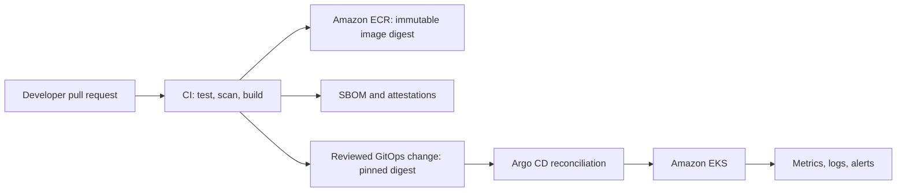

# Build and deliver Java applications to Amazon EKS

## Abstract

Build Java applications in CI, scan and publish an immutable container image to Amazon ECR, then promote the image digest through GitOps. CI must not have routine write access to the Kubernetes API: Argo CD reconciles the reviewed deployment configuration, and remediation remains approval-gated.

## Table of Contents

- [Summary](#summary)
- [Prerequisites and limitations](#prerequisites-and-limitations)
- [Architecture](#architecture)
- [Best practices](#best-practices)
- [Implementation](#implementation)
- [Validation](#validation)

## Summary

This practice applies to a Java application packaged with Maven, deployed by Helm, and operated on Amazon EKS. It uses a source-control pull request as the control point, CI for build and evidence, Amazon ECR for immutable images, and Argo CD for continuous reconciliation. It deliberately does not prescribe direct `helm upgrade` access from CI.

## Prerequisites and limitations

- A Git repository for application source and a separate, protected GitOps repository for Helm values or Kustomize overlays.
- GitLab CI or an equivalent CI system configured to obtain short-lived AWS credentials through OIDC; do not store long-lived AWS keys in CI variables.
- An ECR repository with immutable tags, image scanning, lifecycle policy, and least-privilege push access.
- Argo CD installed with a dedicated workload identity and narrowly scoped access to the target namespaces. For new EKS clusters, use EKS access entries or Kubernetes RBAC; do not use the legacy `aws-auth` ConfigMap for this practice.
- An approved vulnerability policy defining severity thresholds, exceptions, ownership, and expiry. A scanner report alone is not a release decision.

## Architecture

CI proves the candidate artifact; GitOps declares desired runtime state; Argo CD applies and continuously reconciles it. This separation creates an auditable promotion path and avoids giving each build job broad cluster-admin access.

## Tools

- Maven for dependency resolution, tests, and packaging.
- GitLab CI or another CI platform with OIDC federation to AWS IAM.
- Checkov or an equivalent IaC and Helm configuration scanner.
- Trivy for image, filesystem, SBOM, and misconfiguration scanning.
- Amazon ECR for image storage and digest-based promotion.
- Helm for packaging; Argo CD for GitOps reconciliation.
- EKS access entries, IAM roles, and Kubernetes RBAC for access control.

## Best practices

- Run unit, integration, dependency, secret, Dockerfile, Helm, and IaC checks before publishing an image.
- Build a non-root image, generate an SBOM, scan the exact image digest, and retain scan results with pipeline evidence.
- Fail protected-branch promotion for policy violations; time-box approved exceptions with an owner. Do not use permanent `--soft-fail` or an always-zero scanner exit code for release gates.
- Push a versioned image, promote by immutable digest, and configure ECR tag immutability. Never promote a mutable `latest` tag.
- Have CI propose the GitOps digest update through a reviewed merge request. Argo CD, not the CI runner, performs normal deployment reconciliation.
- Use progressive delivery, readiness checks, rollback criteria, and post-deployment verification. Roll back the GitOps revision or Helm release revision, not an untracked imperative change.
- Keep production credentials short-lived and scoped to the action. Separate build, registry, GitOps, and runtime identities.

## Implementation

1. Protect application and GitOps branches; require review and required CI checks.
2. Configure CI OIDC trust in AWS IAM and grant only ECR publish permissions for the target repository.
3. Build and test with Maven. Produce a reproducible image without embedding credentials or using root by default.
4. Run configuration, secret, dependency, and image scans. Generate and retain the SBOM and findings with the pipeline result.
5. Push the verified image to ECR and record its digest.
6. Create a reviewed GitOps change that replaces the environment image reference with that digest.
7. Let Argo CD sync the approved revision. Require health checks and collect rollout, application, and security evidence.
8. Promote the same digest between environments only through the protected GitOps path; use a new source build for any code change.

## Validation

- Confirm the workload references `image@sha256:<digest>` and the ECR tag cannot be overwritten.
- Confirm the CI job receives short-lived OIDC credentials and cannot modify unrelated AWS resources or Kubernetes namespaces.
- Confirm Argo CD reports the intended Git revision as `Synced` and the workload as `Healthy`.
- Test an intentional policy violation, a rejected GitOps change, a failed rollout, and a rollback in a non-production environment.
- Verify that the production audit trail connects source commit, CI evidence, image digest, GitOps merge request, Argo CD sync, and runtime revision.

## Related resources

- [Amazon EKS access entries](https://docs.aws.amazon.com/eks/latest/userguide/access-entries.html)
- [EKS access management best practices](https://docs.aws.amazon.com/eks/latest/best-practices/cluster-access-management.html)
- [Amazon ECR image tag mutability](https://docs.aws.amazon.com/AmazonECR/latest/userguide/image-tag-mutability.html)
- [Argo CD automated sync policy](https://argo-cd.readthedocs.io/en/stable/user-guide/auto_sync/)
- [Trivy documentation](https://trivy.dev/latest/docs/)
