# Layered Trivy Security Scanning with GitLab CI/CD

Trivy can provide one security control across a repository, dependencies,
container images, Helm charts, and running Kubernetes workloads. The strongest
implementation does not run one large scan at the end. It uses fast feedback
before merge, blocks unsafe artifacts before deployment, and verifies the
effective state after deployment.

This practice uses GitLab CI/CD to demonstrate that layered workflow.

## Understand Trivy's role

Trivy scans several targets, but each target answers a different question.

| Target | Trivy command | Primary question |
|---|---|---|
| Source tree and lockfiles | `trivy fs` | Did this change introduce a vulnerable dependency, secret, or insecure configuration? |
| Container image | `trivy image` | Does the built artifact contain vulnerable OS or application packages or embedded secrets? |
| Helm chart and rendered manifests | `trivy config` | Will the intended Kubernetes configuration violate security practices? |
| Kubernetes cluster | `trivy k8s` | Does the effective runtime state contain vulnerabilities, secrets, or misconfiguration? |

Repository scanning is Software Composition Analysis (SCA), secret detection,
and configuration analysis. It does not find arbitrary vulnerabilities in
application logic, such as broken authorization or injection caused by unsafe
data flow. Keep language-aware SAST, tests, code review, and DAST in the
pipeline as complementary controls.

Commit resolved dependency lockfiles whenever the package manager supports
them. Trivy uses files such as `package-lock.json`, `go.sum`, and
`requirements.txt` to identify dependency versions; a manifest without resolved
versions provides weaker and sometimes incomplete evidence.

## Use security controls throughout delivery

```mermaid
flowchart LR
    A[Developer workstation] --> B[Merge request]
    B --> C[Source, dependency, secret, and Helm gates]
    C --> D[Tests and SAST]
    D --> E[Rootless image build]
    E --> F[Image scan and SBOM]
    F --> G[Staging deploy]
    G --> H[Live cluster scan]
    H --> I[Approved production promotion]
    I --> J[Scheduled rescans and remediation]
```



Use these controls as independent layers:

1. Run a quick `trivy fs` scan locally or in a pre-commit workflow.
2. Run blocking repository and Helm scans for every merge request.
3. Run tests and a dedicated SAST tool before producing an artifact.
4. Build once without a privileged Docker daemon and identify the image by the
   commit SHA and, for deployment, its immutable digest.
5. Scan the exact image that will be deployed and generate an SBOM.
6. Deploy only after the earlier gates pass.
7. Scan the effective staging namespace with read-only Kubernetes access.
8. Promote the same approved image digest to production.
9. Rescan repositories, images, and clusters on a schedule because new
   vulnerabilities are disclosed after software is released.

## Define a policy before enforcing it

A scanner is only useful when teams know what blocks delivery and how findings
are handled. A practical starting policy is:

- Block committed or image-embedded secrets immediately.
- Block `CRITICAL` vulnerabilities and misconfigurations in merge requests.
- Block fixable `HIGH` and `CRITICAL` findings before production.
- Display `LOW` and `MEDIUM` findings and manage them through remediation
  service-level objectives.
- Treat an end-of-life base image as a release blocker even when a specific CVE
  has no published fix.
- Fail closed when a scanner cannot download its databases or complete a scan.
- Require an owner, justification, approval, and expiration date for every
  exception.

An existing application may need a short audit-only adoption period. Record the
baseline, assign owners, and set an enforcement date. Do not leave
`allow_failure: true` in place indefinitely.

Do not hide all unfixed vulnerabilities with `--ignore-unfixed`. An unfixed
finding is still risk. Prioritize it with reachability, exposure, runtime
controls, and VEX information, then document an exception when the risk is
accepted.

## Run local feedback before pushing

Install a reviewed, pinned Trivy version and run the same essential commands as
CI:

```shell
trivy fs \
  --scanners vuln,secret,misconfig \
  --severity HIGH,CRITICAL \
  --exit-code 1 \
  .

trivy config \
  --severity HIGH,CRITICAL \
  --exit-code 1 \
  charts/myapp
```

`trivy config charts/myapp` inspects chart source. Also scan rendered manifests
because values, dependencies, and environment overlays determine the resources
that Kubernetes will receive:

```shell
helm dependency build charts/myapp
helm template myapp charts/myapp \
  --namespace myapp-staging \
  --values charts/myapp/values-staging.yaml \
  > rendered-myapp.yaml

trivy config \
  --severity HIGH,CRITICAL \
  --exit-code 1 \
  rendered-myapp.yaml
```

Never put real secrets in a values file merely to make the render realistic.
Use references to an external secret manager, Sealed Secrets, or another
approved secrets workflow.

## Implement a multi-stage GitLab pipeline

The following example is intentionally explicit so each control has one clear
responsibility. Adapt chart names, tests, deployment commands, and runner tags
to the project.

Pin every CI image to an approved version and preferably a digest. The versions
below are readable examples; update them through reviewed dependency changes,
not automatically during a pipeline.

```yaml
stages:
  - validate
  - test
  - build
  - scan
  - deploy
  - verify
  - promote

workflow:
  rules:
    - if: '$CI_PIPELINE_SOURCE == "schedule"'
      when: never
    - if: '$CI_PIPELINE_SOURCE == "merge_request_event"'
    - if: '$CI_COMMIT_BRANCH == $CI_DEFAULT_BRANCH'
    - if: '$CI_COMMIT_TAG'

variables:
  TRIVY_IMAGE: "aquasec/trivy:0.72.0"
  TRIVY_CACHE_DIR: "$CI_PROJECT_DIR/.trivycache"
  TRIVY_NO_PROGRESS: "true"
  TRIVY_SEVERITY: "HIGH,CRITICAL"
  IMAGE_REF: "$CI_REGISTRY_IMAGE:$CI_COMMIT_SHA"

.trivy:
  image:
    name: "$TRIVY_IMAGE"
    entrypoint: [""]
  cache:
    key: "trivy-$CI_PROJECT_ID"
    paths:
      - .trivycache/
    policy: pull-push
  before_script:
    - trivy --version

repository-scan:
  extends: .trivy
  stage: validate
  script:
    - >-
      trivy fs
      --scanners vuln,secret,misconfig
      --severity "$TRIVY_SEVERITY"
      --exit-code 1
      --format json
      --output trivy-repository.json
      .
  artifacts:
    when: always
    expire_in: 14 days
    paths:
      - trivy-repository.json

helm-render:
  stage: validate
  image:
    name: "alpine/helm:3.18.6"
    entrypoint: [""]
  script:
    - helm dependency build charts/myapp
    - helm lint charts/myapp --values charts/myapp/values-staging.yaml
    - mkdir -p rendered
    - >-
      helm template myapp charts/myapp
      --namespace myapp-staging
      --values charts/myapp/values-staging.yaml
      > rendered/myapp.yaml
  artifacts:
    expire_in: 1 day
    paths:
      - rendered/

helm-misconfiguration-scan:
  extends: .trivy
  stage: validate
  needs:
    - job: helm-render
      artifacts: true
  script:
    - |
      status=0
      trivy config \
        --severity "$TRIVY_SEVERITY" \
        --exit-code 1 \
        --format json \
        --output trivy-helm-source.json \
        charts/myapp || status=$?
      trivy config \
        --severity "$TRIVY_SEVERITY" \
        --exit-code 1 \
        --format json \
        --output trivy-helm-rendered.json \
        rendered/ || status=$?
      exit "$status"
  artifacts:
    when: always
    expire_in: 14 days
    paths:
      - trivy-helm-source.json
      - trivy-helm-rendered.json

unit-and-sast-tests:
  stage: test
  image: "registry.example.com/platform/test-toolbox@sha256:REPLACE_ME"
  script:
    - ./scripts/test.sh
    - ./scripts/sast.sh

build-image:
  stage: build
  image:
    name: "moby/buildkit:v0.32.2-rootless"
    entrypoint: [""]
  variables:
    BUILDKITD_FLAGS: "--oci-worker-no-process-sandbox"
  before_script:
    - mkdir -p ~/.docker
    - >-
      echo
      "{\"auths\":{\"$CI_REGISTRY\":{\"username\":\"$CI_REGISTRY_USER\",\"password\":\"$CI_REGISTRY_PASSWORD\"}}}"
      > ~/.docker/config.json
  script:
    - >-
      buildctl-daemonless.sh build
      --frontend dockerfile.v0
      --local context=.
      --local dockerfile=.
      --output type=image,name="$IMAGE_REF",push=true
      --metadata-file image-metadata.json
  artifacts:
    expire_in: 1 day
    paths:
      - image-metadata.json

image-scan-and-sbom:
  extends: .trivy
  stage: scan
  needs:
    - job: build-image
      artifacts: true
  variables:
    TRIVY_USERNAME: "$CI_REGISTRY_USER"
    TRIVY_PASSWORD: "$CI_REGISTRY_PASSWORD"
    TRIVY_AUTH_URL: "$CI_REGISTRY"
  script:
    - |
      digest="$(sed -n \
        's/.*"containerimage.digest": "\(sha256:[a-f0-9]*\)".*/\1/p' \
        image-metadata.json)"
      test -n "$digest"
      IMAGE_DIGEST_REF="$CI_REGISTRY_IMAGE@$digest"
      printf 'IMAGE_DIGEST_REF=%s\n' "$IMAGE_DIGEST_REF" > image.env
      trivy image
        --format cyclonedx \
        --output gl-sbom-image.cdx.json \
        "$IMAGE_DIGEST_REF"
      trivy image
        --scanners vuln,secret \
        --severity "$TRIVY_SEVERITY" \
        --exit-code 1 \
        --format json \
        --output trivy-image.json \
        "$IMAGE_DIGEST_REF"
  artifacts:
    when: always
    expire_in: 30 days
    paths:
      - gl-sbom-image.cdx.json
      - image.env
      - trivy-image.json
    reports:
      cyclonedx:
        - gl-sbom-image.cdx.json
      dotenv: image.env

deploy-staging:
  stage: deploy
  image:
    name: "alpine/helm:3.18.6"
    entrypoint: [""]
  needs:
    - job: image-scan-and-sbom
      artifacts: true
  resource_group: myapp-staging
  script:
    - image_digest="${IMAGE_DIGEST_REF#*@}"
    - >-
      helm upgrade --install myapp charts/myapp
      --kube-context "$KUBE_CONTEXT"
      --namespace myapp-staging
      --values charts/myapp/values-staging.yaml
      --set-string image.repository="$CI_REGISTRY_IMAGE"
      --set-string image.digest="$image_digest"
      --atomic
      --wait
  environment:
    name: staging
    deployment_tier: staging
  rules:
    - if: '$CI_COMMIT_BRANCH == $CI_DEFAULT_BRANCH'

cluster-scan-staging:
  extends: .trivy
  stage: verify
  needs:
    - deploy-staging
  script:
    - >-
      trivy k8s "$KUBE_CONTEXT"
      --include-namespaces myapp-staging
      --scanners vuln,secret,misconfig
      --severity "$TRIVY_SEVERITY"
      --report all
      --exit-code 1
      --format json
      --output trivy-k8s-staging.json
  artifacts:
    when: always
    expire_in: 14 days
    paths:
      - trivy-k8s-staging.json
  rules:
    - if: '$CI_COMMIT_BRANCH == $CI_DEFAULT_BRANCH'

promote-production:
  stage: promote
  image:
    name: "alpine/helm:3.18.6"
    entrypoint: [""]
  needs:
    - job: image-scan-and-sbom
      artifacts: true
    - job: cluster-scan-staging
      artifacts: false
  resource_group: myapp-production
  script:
    - ./scripts/promote-image-digest.sh "$IMAGE_DIGEST_REF"
  environment:
    name: production
    deployment_tier: production
  rules:
    - if: '$CI_COMMIT_BRANCH == $CI_DEFAULT_BRANCH'
      when: manual
  allow_failure: false
```

The placeholder test toolbox must be replaced with the project's approved,
digest-pinned image. This example records BuildKit's output digest, scans that
digest, passes it through a dotenv artifact, and deploys the same digest. The
chart must render `repository@digest` when `image.digest` is set. A tag,
including a commit-SHA tag, can be moved; a digest identifies the exact scanned
content.

`artifacts:reports:cyclonedx` integrates with GitLab features that depend on the
GitLab tier and SBOM metadata. Keeping the same file under `artifacts:paths`
makes the SBOM downloadable even when those features are unavailable. Trivy's
native JSON is useful evidence, but it is not automatically a valid GitLab
container-scanning report. Use GitLab's supported security template when the
merge-request security widget or vulnerability dashboard is required.

This delivery workflow excludes scheduled pipelines so a security rescan never
deploys by accident. Create a separate scheduled pipeline that accepts approved
image digests as input, rescans those registry artifacts, and runs `trivy k8s`
with read-only identities against each environment. Route new findings to the
service owner without rebuilding or changing the deployed workload.

## Grant minimum Kubernetes access

Use the GitLab Kubernetes Agent rather than storing a long-lived, cluster-admin
kubeconfig in CI variables. Give the deployment job access only to the
application namespace and give the scan job read-only access to the resources
it must inspect.

Keep deployment and scanning identities separate. A namespace scan commonly
needs `get` and `list` on workload and configuration resources, while image
pulls should use registry read credentials. Validate the exact permissions
against the selected Trivy version and resource scope before enabling the job.
Do not grant write, impersonation, secret mutation, or cluster-admin rights to
a scanner.

Full-cluster scans create broader data access and more noise. Use them in a
separate scheduled security pipeline with a reviewed ClusterRole. Use
namespace-scoped scans after application deployment.

## Manage exceptions as expiring code

Use `.trivyignore.yaml` only after investigation. Scope an exception to the
finding and path or package, explain why it is not currently remediated, and
set an expiration date.

```yaml
vulnerabilities:
  - id: CVE-2026-12345
    purls:
      - pkg:maven/com.example/example-library@1.2.3
    statement: Compensating control is documented in SEC-1234.
    expired_at: 2026-09-30

misconfigurations:
  - id: AVD-KSV-0001
    paths:
      - charts/myapp/templates/special-workload.yaml
    statement: Temporary vendor requirement tracked by SEC-1270.
    expired_at: 2026-09-15
```

Require security or service-owner review for the ignore file. A finding ID
without a path, package, reason, or expiry is an unbounded policy bypass. Prefer
a signed VEX document when a supplier or product security team can state that a
component is not affected.

Never ignore a detected credential. Revoke and rotate it, remove it from Git
history where appropriate, and investigate its use.

## Keep scans reliable and actionable

- Pin and regularly update Trivy, Helm, BuildKit, and all CI images.
- Mirror scanner images and databases for controlled or air-gapped networks.
- Allow Trivy to refresh its vulnerability database and checks bundle; do not
  use skip-update flags merely to make an unreliable pipeline pass.
- Cache the Trivy database to reduce downloads, but treat cache availability as
  a performance optimization rather than security evidence.
- Keep separate machine-readable reports for repository, chart, image, and
  cluster targets so ownership and remediation remain clear.
- Protect reports because secret findings and cluster inventory can contain
  sensitive metadata. Use short retention and restricted job access.
- Scan the image before deployment and scan the runtime state after deployment.
  One does not prove the other.
- Measure time to triage, time to remediate, expired exceptions, recurring
  findings, and the percentage of deployed images tied to a passing scan and
  SBOM. Do not use raw vulnerability counts as the only success metric.

## Respond to findings by layer

| Finding | Preferred response |
|---|---|
| Vulnerable direct dependency | Upgrade the dependency and regenerate the lockfile. |
| Vulnerable transitive dependency | Upgrade the parent, add a safe constraint, or work with the maintainer. |
| Vulnerable OS package | Rebuild from a patched, supported base image. |
| Secret in repository or image | Revoke, rotate, remove, and investigate; rebuilding alone is insufficient. |
| Dockerfile or Helm misconfiguration | Fix the source template so every environment inherits the control. |
| Runtime-only drift | Reconcile through GitOps or the owning deployment source; do not leave a manual patch as the final fix. |
| No upstream fix | Assess exposure and exploitability, add compensating controls, and create an expiring exception. |

## Verify the implementation

Before calling the practice complete, confirm all of the following:

- A deliberately vulnerable test dependency fails the repository gate.
- A fake test secret triggers detection without using a real credential.
- An insecure Helm fixture fails both source and rendered-manifest scans.
- A vulnerable base image fails before deployment.
- The SBOM corresponds to the same image digest selected for promotion.
- Scanner or database download failure fails the job.
- The staging cluster job can read its intended namespace and cannot mutate it.
- Production deployment is protected, approved, and promotes the scanned
  digest instead of rebuilding the image.
- Scheduled scans detect vulnerabilities disclosed after the original build.
- Expired exceptions fail review and are removed or explicitly renewed.

## References

- [Trivy repository scanning](https://trivy.dev/docs/latest/target/repository/)
- [Trivy misconfiguration scanning](https://trivy.dev/docs/latest/scanner/misconfiguration/)
- [Trivy Kubernetes scanning](https://www.trivy.dev/docs/latest/tutorials/kubernetes/cluster-scanning/)
- [Trivy SBOM generation](https://trivy.dev/docs/dev/guide/supply-chain/sbom/)
- [Trivy filtering and exceptions](https://trivy.dev/docs/latest/guide/configuration/filtering/)
- [GitLab rootless BuildKit](https://docs.gitlab.com/ci/docker/using_buildkit/)
- [GitLab CI/CD with the Kubernetes Agent](https://docs.gitlab.com/user/clusters/agent/ci_cd_workflow/)
- [GitLab CycloneDX artifact reports](https://docs.gitlab.com/ci/yaml/artifacts_reports/#artifactsreportscyclonedx)
