# AI-powered Kubernetes diagnostics with Amazon Bedrock

## Abstract

Use Amazon Bedrock to explain bounded, evidence-backed Kubernetes diagnostic output. The model assists an operator; it does not make production changes. Protect sensitive telemetry, use a currently supported model selected at deployment time, and require human approval before every remediation.

## Table of Contents

- [Summary](#summary)
- [Prerequisites and limitations](#prerequisites-and-limitations)
- [Architecture](#architecture)
- [Best practices](#best-practices)
- [Implementation](#implementation)
- [Validation](#validation)

## Summary

This practice combines a read-only diagnostic collector, such as K8sGPT, with Amazon Bedrock to produce natural-language explanations and proposed next steps. It is useful for reducing investigation toil, but it does not prove root cause, guarantee a reduction in MTTR, or authorize remediation.

## Prerequisites and limitations

- An EKS cluster with audit logs, workload logs, metrics, events, and relevant traces available to the diagnostic workflow.
- A dedicated IAM role with only the Bedrock invocation permissions and Kubernetes read permissions required by the selected analyzers.
- An Amazon Bedrock model that is currently active and enabled in the deployment Region. Pass its model ID as configuration; do not hard-code a model ID in source or scripts.
- A controlled operator environment, such as AWS Systems Manager Session Manager or a restricted in-cluster workload identity, with no default write permission to production resources.
- K8sGPT or equivalent collector installed at a version tested against the target Kubernetes version and model provider.

Limitations: model responses can be incomplete or incorrect; diagnostic context can contain sensitive information; model availability, quotas, and behavior vary by Region and model; and an AI explanation cannot replace runbook validation or incident ownership.

## Architecture

```mermaid
flowchart LR
  operator[Operator-approved investigation] --> collector[Read-only Kubernetes collector]
  collector --> evidence[Events, logs, metrics, manifests]
  evidence --> filter[Redaction and scope filter]
  filter --> bedrock[Amazon Bedrock\ncurrent configured model]
  bedrock --> rca[Proposed explanation and next checks]
  rca --> approval[Human validation and approval]
  approval --> runbook[Approved runbook or GitOps change]
```

The collector is restricted to the selected namespace, object type, and time window. Only redacted evidence crosses into the model prompt. The final response is recorded as an investigation artifact; an operator validates it against live evidence and executes approved remediation through the normal runbook or GitOps process.

## Best practices

- Start with read-only analyzers and a limited namespace or workload selector. Expand scope only when investigation evidence requires it.
- Redact secrets, tokens, customer data, and unnecessary log payloads before inference. Keep an allowlist of Kubernetes fields and log sources.
- Use a configurable model ID and check its Bedrock lifecycle and Regional availability during deployment. Pin prompt and tool versions for reproducibility.
- Record input references, model ID, prompt version, output, operator decision, and resulting change in the incident record.
- Use IAM least privilege, Kubernetes RBAC, short-lived credentials, Session Manager or another controlled access path, and audit logging.
- Require explicit approval before write actions. The diagnostic service should not hold `patch`, `delete`, `exec`, or broad cluster-admin permissions.
- Evaluate the workflow with known incidents, measure investigator time and diagnostic accuracy, and publish only measured outcomes.

## Implementation

1. Define allowed evidence sources and the data-redaction policy with security and incident owners.
2. Create a dedicated read-only Kubernetes service account and an IAM role that can invoke only the configured Bedrock model.
3. Configure K8sGPT or an equivalent collector with a current model ID supplied through controlled configuration. Verify model access before an incident.
4. Run narrow diagnostics, for example a selected namespace, deployment, pod, or node; collect the underlying events and logs alongside the AI output.
5. Send the redacted evidence to Bedrock and store the response with the incident ID, source references, and model configuration.
6. Have the incident commander or service owner validate the proposed diagnosis. Implement changes only through an approved runbook, pull request, or GitOps workflow.

## Validation

- Confirm the diagnostic identity cannot mutate Kubernetes objects or open an interactive `exec` session.
- Confirm sensitive fields are removed from prompts and no credentials appear in retained investigation artifacts.
- Confirm the selected model is active in the intended Region before rollout and during the scheduled lifecycle review.
- Replay representative incidents and compare the AI recommendation with authoritative telemetry and the final human RCA.
- Test a rejected recommendation and verify no production mutation occurs.

## Related resources

- [Amazon Bedrock model lifecycle](https://docs.aws.amazon.com/bedrock/latest/userguide/model-lifecycle.html)
- [Amazon EKS auditing and logging best practices](https://docs.aws.amazon.com/eks/latest/best-practices/auditing-and-logging.html)
- [K8sGPT documentation](https://docs.k8sgpt.ai/)
