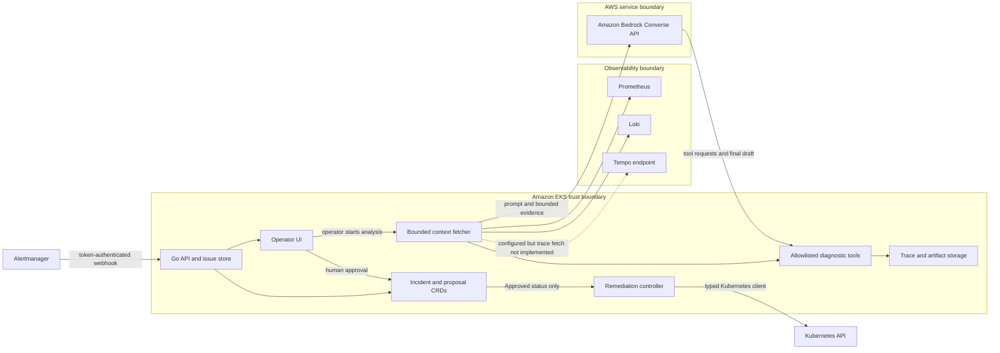

# Agentic Architecture and Guardrails

## Abstract

This phase explains why incident diagnosis is modelled as a tool-calling
reasoning loop rather than a single retrieval, and where the trust boundaries
fall. It separates analysis from action, catalogues the diagnostic tools
available to the agent, and records the threats, data-minimization decisions,
and architecture alternatives that were rejected.

## Architecture decision

The platform uses a tool-calling model because incident diagnosis is not a
single retrieval problem. The next useful query depends on the evidence already
seen: a failed rollout suggests ReplicaSet history and events; an OOM kill
suggests termination state, previous logs, and memory data; a missing endpoint
suggests Service selectors and readiness.

The model is therefore allowed to select from a small diagnostic catalog, but
it is not allowed to execute arbitrary commands. Analysis and mutation are
separate control planes.

## Trust boundaries



The diagram shows the implemented human-started investigation. Automatic
`generate_rca`, ticket, and postmortem playbook actions do not yet have runtime
handlers in the alert-ingestion path.

## Reasoning loop

Each analysis sends Bedrock:

- a fixed SRE system prompt;
- alert name, priority, severity, timestamps, and labels;
- the latest sample from four namespace-scoped Prometheus queries;
- up to 50 deduplicated recent error log lines in the prompt; and
- definitions for 17 callable tools.

Bedrock can return text or one or more tool requests. Tool results are appended
to the conversation and sent back to the model. The loop terminates when the
model returns a final response, a provider error occurs, the operator cancels,
or the configured round limit is reached.

The final response is parsed into four fields:

1. root cause;
2. short-term workaround;
3. long-term fix; and
4. optional proposed remediation text.

This schema improves consistency but is not proof that a conclusion is true.
Truth must come from attached evidence and human review.

## Diagnostic tool catalog

| Layer | Implemented tools | Boundary |
|---|---|---|
| Workload | list pods, pod status, current/previous logs, recent deployment history | Read only; logs capped by HTTP reader |
| Scheduling | deployment status, node list, ResourceQuota, HPA, StatefulSets, DaemonSets | Read only |
| Networking | Service, Endpoints, and Ingress or Gateway route inspection | Read only |
| Configuration | ConfigMap data and Secret key names | Secret values are not returned |
| Events | namespace warning events | Up to 30 non-normal events |
| Storage | PersistentVolumeClaim status | Read only; shows phase, capacity, and binding state |
| Metrics | PromQL instant query and workload resource usage | Read only; query chosen by model |
| Knowledge | load runbook hint | Current executor returns a generic acknowledgement, not full runbook content |

The three added tools are `get_pvc_status`, `get_ingress_or_gateway_routes`,
and `get_workload_resource_usage`. All three are read only and receive the same
output bounds, namespace policy, and audit tracing as the original catalog.

The service connector documents for relational databases, graph databases,
document databases, and model gateways are stubs. They are not exposed as live
diagnostic tools.

## Analysis-to-action separation

```text
model output
    -> Re-analyze stores suggestion only
    -> attached chat tool or annotated Incident path creates proposal
    -> proposal in AwaitingApproval
    -> authenticated operator decision
    -> proposal status becomes Approved
    -> remediation controller parses the full action
    -> verb, resource, name, flags, and namespace are validated
    -> typed Kubernetes API call
    -> Executed or Failed status plus execution log
```

Supported mutations are intentionally small. This controller path is separate
from the ordinary Re-analyze response:

- restart a Deployment;
- scale a Deployment between 0 and 50 replicas; and
- delete a Pod so its owning controller can recreate it.

The controller does not invoke a shell. Extra flags, unexpected verbs,
unsupported resources, malformed names, and namespaces outside the remediation
allowlist are rejected. Write RBAC is rendered only when remediation is enabled.

## Threats and controls

| Risk | Current control | Residual risk | Validation |
|---|---|---|---|
| Prompt injection in logs or labels | Model receives only bounded context; tools are predefined | Prompt can still influence tool selection or conclusion | Adversarial scenario evaluation is pending |
| Model invents evidence | Full tool transcript is stored and shown in AI Trace | UI does not automatically verify every claim against a tool result | Human rubric and claim-to-evidence checker are pending |
| Model requests a destructive command | Diagnostic catalog is read only; mutation uses a separate proposal controller | Proposed text can still be misleading | Parser and controller unit tests pass |
| Unauthorized write | Remediation is disabled by default; separate namespaced Roles and explicit approval | Misconfigured Helm values can widen scope | Rendered RBAC inspection and admission policy recommended |
| Cross-namespace data access | Alert intake filters source namespaces; remediation checks an allowlist | Diagnostic tool executor accepts a model-supplied namespace and uses cluster-wide read RBAC | Must add tool-level namespace enforcement before multi-tenant use |
| Secret disclosure | `get_secret_keys` emits key names only | Service account can read Secrets under current ClusterRole; other paths or future code could expose values | Reduce RBAC and add policy tests |
| Sensitive log retention | Logs are line- and time-bounded; files have configurable retention | No general redaction or field-level encryption | Redaction tests and retention audit pending |
| Stolen operator session | Password is bcrypt-checked; signed 8-hour cookie; login rate limit, backoff, and concurrency cap | Single-admin model and long session may not fit enterprise access policy | Integrate SSO/RBAC and shorten privileged sessions |
| Forged webhook | Shared webhook token supported | Token can appear in a URL query and logs if deployed carelessly | Prefer header secret, rotation, and log filtering |
| Bedrock credential exposure | Credentials come from Kubernetes Secret or AWS default chain | Static access keys are supported by the chart | Prefer workload identity and short-lived credentials |
| Provider timeout or throttling | Provider error is recorded; analysis moves to failed state | No retry, exponential backoff, or circuit breaker in the RCA loop | Failure-mode run is defined but incomplete |
| Observability outage | Missing queries are skipped and analysis may proceed with Kubernetes tools | Missing data is not always made explicit to the model | Add source-status markers and minimum-evidence policy |
| Burst overload | Per-namespace analysis semaphore; webhook request size limit | Rejected analyses are not durably queued | Add a durable queue and idempotent worker |
| SSE slow consumer | Per-client buffer and non-blocking broadcast | Events can be dropped and there is no replay cursor | Client polling is the fallback; durable event log is planned |

## Data minimization decisions

- Prometheus range collection covers the previous 30 minutes at one-minute
  steps.
- Loki requests up to 200 error/warning/fatal lines and deduplicates them.
- Only the first 50 collected log lines enter the initial RCA prompt.
- Direct pod-log tool output is capped at 512 KiB; Prometheus tool output is
  capped at 64 KiB.
- Secret values are excluded from the tool result.
- Model transcripts are retained because they are necessary for audit, but
  production adoption requires redaction before persistence.

## Architecture alternatives

| Option | Strength | Limitation | Decision |
|---|---|---|---|
| Manual dashboards and runbooks | Simple control model | Slow correlation and uneven results | Retained as fallback |
| Deterministic automation | Predictable and easy to test | Brittle when symptoms cross systems | Use for known classification and safety gates |
| Retrieval-only assistant | Good for finding known procedures | Cannot inspect changing cluster state | Use runbooks as context, not the whole design |
| Managed or third-party AIOps | Faster feature acquisition | Data, integration, cost, and control-plane constraints | Evaluate for commodity capabilities |
| Bounded tool-calling agent | Adaptive investigation with visible evidence | Requires strong permissions, evaluation, and cost governance | Selected for the pilot |

The selected design combines deterministic controls around an adaptive model:
classification, permissions, schemas, approval, and execution are deterministic;
evidence selection and RCA drafting are agentic.
