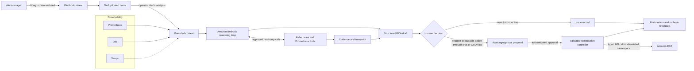

# Agentic AIOps on Amazon Bedrock and Amazon EKS

## Abstract

Human-governed AIOps for Amazon EKS incident diagnosis. An operator starts an
Amazon Bedrock investigation that uses 20 bounded, read-only diagnostic tools
and produces an auditable RCA with approval-gated remediation suggestions.

## Architecture

The trust model has three deliberate breaks:

1. an alert can create an Issue but does not automatically earn a model call;
2. a model can propose a command but cannot directly execute it; and
3. operator approval is necessary but not sufficient—the controller still
   validates the full action and namespace.

## Incident-to-RCA lifecycle

1. **Ingest** — accept at most 100 alerts in a webhook request, verify the
   webhook token when configured, and ignore sources outside the configured
   namespace list.
2. **Normalize** — map labels and triage data into independent priority and
   severity dimensions, then upsert the Issue by dedupe key.
3. **Govern** — let runtime IncidentPolicy rules override the default
   priority-by-severity playbook matrix.
4. **Start** — an authenticated operator begins or cancels analysis.
5. **Collect** — query a 30-minute Prometheus window and recent deduplicated
   Loki error lines.
6. **Investigate** — Bedrock selects from workload, rollout, scheduling,
   networking, configuration, event, metric, and runbook tools.
7. **Explain** — parse the final response into root cause, workaround,
   long-term fix, and proposed remediation text.
8. **Audit** — store and display every model round and tool result.
9. **Decide** — the operator resolves, rejects, reruns, or marks false alarm.
   An executable proposal can be created through the attached chat tool or the
   separately annotated Incident CRD path, then approved by the operator.
10. **Learn** — preserve the RCA, decision, execution outcome, and postmortem
    inputs for improving runbooks and future evaluation.

## Guarded action boundary

The RCA model-facing tools are read only. Kubernetes Secret values are never
returned by the tool catalog. The ordinary Re-analyze path stores remediation
text as a suggestion; it does not create an executable proposal. Proposal
creation is implemented in the attached chat and annotated Incident CRD paths.
Write-capable remediation is disabled in the chart by default and accepts only
restart Deployment, scale Deployment within a 0-50 replica bound, or delete
Pod. The controller rejects unexpected syntax, flags, resources, names, and
namespaces and uses the typed Kubernetes client rather than a shell.

## Verification and measured evidence

Local source verification on 2026-08-19 produced:

- passing tests across all backend Go packages;
- 21 passing frontend test files with 115 tests;
- a successful production frontend build;
- passing Helm lint and template rendering; and
- valid rendering for all 11 deterministic incident overlays, including OOM,
  throttling, CrashLoopBackOff, disk full, missing endpoints, failed rollout,
  exhausted quota, HPA saturation, readiness failure, pending storage, and HTTP
  500 errors.

Historical local burst artifacts show webhook acknowledgement p95 of 0.643s for
50 alerts, 1.012s for 100 alerts, and approximately 1.000s for 500 alerts. The
artifacts do not contain completed RCA drain, error-rate, or model-quality
summaries, so the measurements must not be interpreted as end-to-end incident
performance.

The measured production outcome was a 70% reduction in mean time to diagnose.
Diagnosis starts when a firing alert is accepted and ends when an operator
records a reviewed root-cause hypothesis with supporting evidence. Recovery
time is intentionally excluded. The paired incident dataset is retained outside
this sanitized source snapshot.

## Key decisions

| Decision | Reason | Tradeoff |
|---|---|---|
| Operator-started analysis | Controls model spend and keeps humans engaged | Adds one action before evidence collection |
| Tool calling instead of one-shot prompting | Lets evidence determine the next diagnostic step | More latency, cost, and evaluation surface |
| Deterministic execution controller | Prevents arbitrary model-generated commands | Supports only a narrow action library |
| File artifacts for the pilot | Simple, inspectable, and portable | Single-replica and durability limitations |
| Guarded action boundary | Keeps diagnosis and mutation independently controlled | Adds an approval step before remediation |

## Phases

1. [Problem and success criteria](1-problem-and-success-criteria.md)
2. [Agentic architecture and guardrails](2-agentic-architecture-and-guardrails.md)
3. [Platform implementation](3-platform-implementation.md)
4. [Evaluation and results](4-evaluation-and-results.md)
5. [Operations and adoption](5-operations-and-adoption.md)

## Appendix

- [Resume STAR interview walkthrough](6-resume-star-interview.md)
