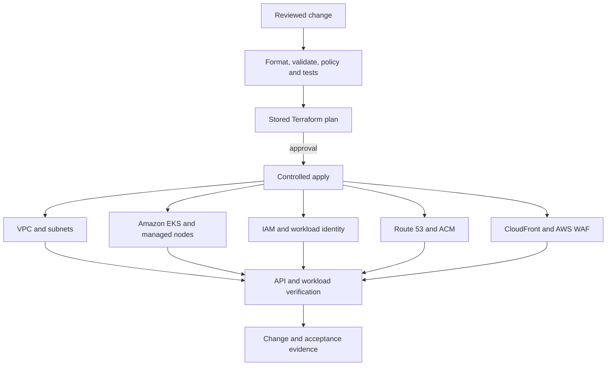

# Secure Enterprise AWS Foundation and IaC Delivery

## Executive summary

This case study establishes a governed AWS foundation for an existing
non-production estate and moves its infrastructure lifecycle into Terraform and
reviewed GitLab CI/CD. The work adopts, rather than recreates, the VPC, Amazon
EKS cluster, IAM, DNS, certificates, content delivery, and web protection
resources.

The implemented result is a modular Terraform codebase, separated remote state,
validate/plan/manual-apply gates, and import-safe roots that preserve effective
resource behavior. The VPC spans two Availability Zones. Its single NAT gateway
is an explicit non-production cost decision, not a high-availability pattern.

This is evidence of controlled infrastructure adoption for one AWS environment.
It is not presented as a complete AWS Organizations or AWS Control Tower
landing zone. Multi-account guardrails, centralized security services, and
organization-wide network governance are documented as extensions requiring a
separate customer scope.

## Evidence status

| Area | Status | Defensible evidence |
|---|---|---|
| Terraform modules | Implemented | VPC, EKS, IAM, ACM, Route 53, CDN, and WAF modules |
| Environment roots | Implemented | Network, cluster, identity, DNS, and edge roots with separated state |
| Delivery gates | Implemented | Validation, plan, approval-gated apply, and focused test harnesses |
| Existing-resource adoption | Implemented | Import-oriented configuration and reviewed in-place EKS lifecycle |
| Multi-AZ network | Implemented | Public and private subnet structure across two Availability Zones |
| NAT high availability | Deliberately not implemented | One NAT gateway accepted for non-production cost control |
| Organization landing zone | Reference extension | Account vending, organization guardrails, and central security/logging are not claimed |
| Business improvement percentages | Not measured | No manufactured deployment-time, incident, or cost-reduction claim |

## Architecture

Each independently deployable root has a deliberate state boundary. Modules
provide reusable implementation, while environment roots record effective
values and adoption decisions. AWS resources remain owned by Terraform; Argo CD
owns selected Kubernetes declarations after the cluster boundary.

## Customer outcome

- Infrastructure changes are reviewable before mutation.
- Existing services can move under Terraform ownership without combining the
  adoption with replacement or redesign.
- State, credentials, environment roots, and high-risk approvals have explicit
  boundaries.
- Operators can distinguish source, plan, apply, AWS resource state, and
  effective workload behavior.
- Availability and cost compromises are recorded instead of being hidden in
  defaults.

## Key decisions

| Decision | Reason | Tradeoff |
|---|---|---|
| Import existing resources | Preserve identity and reduce migration disruption | Requires careful effective-state discovery |
| Separate state by capability | Limit credentials and change blast radius | Cross-root changes need coordination |
| Manual apply after reviewed plan | Protect high-impact infrastructure | Adds an intentional approval wait |
| Pin EKS and node versions | Make upgrades observable and reversible | Versions require active maintenance |
| One non-production NAT gateway | Control recurring cost | An Availability Zone failure can disrupt private egress |
| Leave selected defaults unmanaged | Avoid accidental adoption of shared/default behavior | Exceptions must remain documented and monitored |

## Detailed design

1. [Problem and success criteria](1-problem-and-success-criteria.md)
2. [Architecture and decisions](2-architecture-and-decisions.md)
3. [Implementation](3-implementation.md)
4. [Validation and results](4-validation-and-results.md)
5. [Operations and handoff](5-operations-and-handoff.md)

## References

- AWS Prescriptive Guidance, [Best practices for repository structure and organization](https://docs.aws.amazon.com/prescriptive-guidance/latest/terraform-aws-provider-best-practices/structure.html)
- AWS Well-Architected Framework, [Protecting networks](https://docs.aws.amazon.com/wellarchitected/latest/security-pillar/protecting-networks.html)
- AWS Management and Governance Guide, [Implementation priorities](https://docs.aws.amazon.com/wellarchitected/latest/management-and-governance-guide/implementation-priorities.html)
