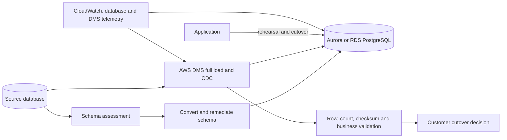

# Database Migration and Modernization

## Abstract

This solution provides an evidence-gated path for migrating a relational
database to Amazon Aurora PostgreSQL-Compatible Edition or Amazon RDS for
PostgreSQL. AWS Schema Conversion Tool or AWS DMS Schema Conversion assesses
schema compatibility, while AWS Database Migration Service performs full load
and change data capture to reduce the cutover outage.

The design covers discovery, schema remediation, data validation, rehearsal,
cutover, rollback, and operational handoff. Current portfolio artifacts are a
consulting simulation and implementation blueprint. They do not contain a
completed AWS DMS execution, production cutover, or measured migration result.

## Evidence standard

| Area | Status | Evidence or limit |
|---|---|---|
| Discovery and migration method | Designed | Source inventory, dependency questions, wave gates, and acceptance templates |
| PostgreSQL target | Designed | Multi-AZ managed PostgreSQL target and operating requirements |
| Schema conversion | Planned gate | Assessment and remediation process defined; no executed conversion report claimed |
| Full load and CDC | Planned gate | AWS DMS topology and validation criteria defined; no completed task evidence |
| Rehearsal and rollback | Planned gate | Timelines and records exist as templates, not executed results |
| Production cutover | Not performed | No approval, outage, reconciliation, or acceptance record exists |
| Business outcome | Not measured | No defensible downtime, cost, performance, or effort improvement is claimed |

## Architecture

The target choice is made from workload evidence, not from a blanket preference.
Aurora PostgreSQL is appropriate when its availability, scaling, and operational
model match the workload. RDS for PostgreSQL remains a valid option when its
simpler topology or compatibility better fits the customer.

## Intended customer outcomes

- Reduce self-managed database operations while preserving data correctness.
- Discover incompatible schema and application behavior before cutover.
- Use full load plus CDC to bound the final write outage.
- Make validation, rollback, ownership, and residual risk explicit.
- Transfer monitoring, backup, recovery, patching, security, and cost operations
  to the customer team.

These are target outcomes. They become results only after an executed migration
and signed evidence.

## Key decisions

| Decision | Reason | Tradeoff |
|---|---|---|
| Assess before selecting target | Compatibility and operations determine fit | Discovery takes time before build |
| Convert schema separately from data movement | Expose incompatible objects early | Requires coordinated tools and remediation |
| Full load plus CDC | Reduce cutover outage | Adds replication monitoring and source-log requirements |
| Multiple validation layers | Row counts alone cannot prove business correctness | Validation consumes time and resources |
| Rehearse with stop criteria | Make duration and rollback credible | Requires production-like data and coordination |
| Preserve source through rollback window | Keep recovery possible | Extends dual-operation cost and controls |

## Phases

1. [Problem and success criteria](1-problem-and-success-criteria.md)
2. [Architecture and decisions](2-architecture-and-decisions.md)
3. [Implementation](3-implementation.md)
4. [Validation and results](4-validation-and-results.md)
5. [Operations and handoff](5-operations-and-handoff.md)

## References

- AWS Prescriptive Guidance, [Migrate an on-premises Oracle database to Aurora PostgreSQL](https://docs.aws.amazon.com/prescriptive-guidance/latest/patterns/migrate-data-from-an-on-premises-oracle-database-to-aurora-postgresql.html)
- AWS Database Migration Service, [Validating AWS DMS tasks](https://docs.aws.amazon.com/dms/latest/userguide/CHAP_Validating.html)
- AWS Database Migration Service, [Converting database schemas](https://docs.aws.amazon.com/dms/latest/userguide/schema-conversion.html)
