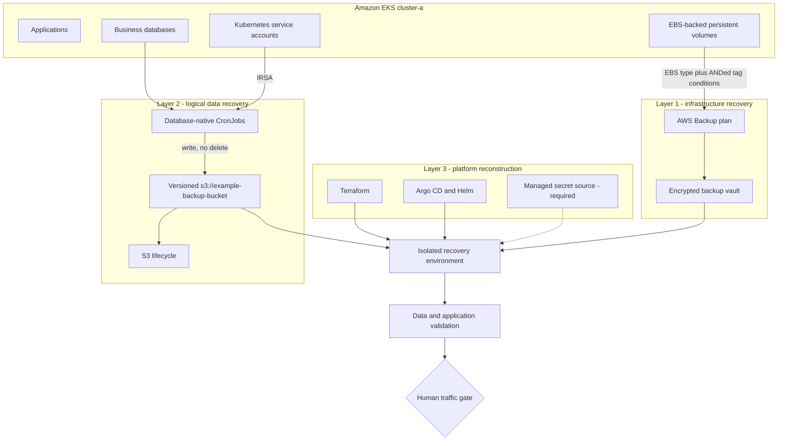

# Recovery Architecture and Decisions

## Three-layer design



Layer 1 optimizes for broad infrastructure loss, layer 2 for consistency and
restore granularity, and layer 3 for deterministic reconstruction. None can
replace the other two.

## Decision: EBS selection instead of EKS selection

AWS Backup can protect an EKS cluster as a composite recovery point or protect
its EBS volumes directly. The implementation chose EBS.

| Criterion | EKS resource type | EBS resource type |
|---|---|---|
| Recovery structure | Composite cluster, Kubernetes-state, and volume children | One flat recovery point per volume |
| Selection unit | Whole cluster | Tagged volume |
| Kubernetes objects | Serialized live state | Not included |
| Persistent data | Volume children | Volume recovery points |
| Scope control | Limited after child discovery | Resource type and tag conditions |
| Cost behavior | Includes per-namespace backup creation fee | Standard EBS snapshot storage |
| Rebuild model | Restore captured live state | Reconcile reviewed Git intent |

For a GitOps platform, serialized cluster state is a second, opaque copy that
can preserve drift. Terraform and Argo CD already define the desired platform,
are reviewable, and can target a new cluster. EBS recovery points are therefore
used only for the state that Git cannot reconstruct.

The tradeoff is explicit: a Git rebuild is only credible after it has been
drilled, and Secrets must come from a separate managed source.

## Decision: `Conditions`, not `ListOfTags`

An early selection used an EBS ARN pattern and `ListOfTags`, assuming the tag
would filter that resource pattern. AWS Backup combines those inputs as a union.
The result was measured rather than inferred: 120 EBS volumes and nine EC2
instances were selected in one run, compared with an intended 66 EBS volumes.

The corrected pattern uses `Conditions`, which are ANDed with `Resources`:

```hcl
resource "aws_backup_selection" "cluster_volumes" {
  plan_id      = aws_backup_plan.gfs.id
  iam_role_arn = aws_iam_role.backup.arn

  resources = [
    "arn:aws:ec2:${var.region}:${data.aws_caller_identity.current.account_id}:volume/*"
  ]

  condition {
    string_equals {
      key   = "aws:ResourceTag/kubernetes.io/cluster/${var.cluster_name}"
      value = "owned"
    }

    dynamic "string_not_equals" {
      for_each = var.excluded_pvc_namespaces
      content {
        key   = "aws:ResourceTag/kubernetes.io/created-for/pvc/namespace"
        value = string_not_equals.value
      }
    }
  }
}
```

The `aws:ResourceTag/` prefix is required for conditions. A missing or incorrect
prefix can silently select nothing, so the effective recovery-point inventory
must be reconciled after every selection change.

## Decision: deny-list rather than opt-in protection

The EBS CSI driver stamps cluster and namespace tags on dynamically provisioned
volumes. The cluster tag automatically brings a new PVC into scope, while the
namespace conditions remove data that has been deliberately classified as
reproducible.

This is intentionally a deny-list:

- a forgotten classification backs up too much and costs money;
- an opt-in `backup=yes` model can forget a new PVC and lose data silently; and
- an explicit ARN list becomes stale whenever volumes are replaced.

The deny-list needs a periodic ownership review. Excluding a namespace also
removes its only volume protection when logical backups are disabled.

## Decision: logical backups in addition to snapshots

An EBS recovery point is crash-consistent. It is well suited to a lost volume
but has three limitations for a database:

1. It preserves committed logical corruption faithfully.
2. Its restore unit is the whole volume, even when many tenants share it.
3. Inspecting several candidate points requires provisioning and mounting each
   one.

A database-native artifact can be listed, checked, restored into a scratch
database, and selected at database or tenant granularity. The two layers answer
different incident questions:

| Question | Preferred layer |
|---|---|
| The volume disappeared | EBS recovery point |
| A schema migration damaged data | Logical artifact |
| Restore one tenant | Logical artifact |
| Recreate a file-only workload | EBS recovery point |
| Rebuild Kubernetes objects | Terraform and Argo CD |

## Decision: AWS-managed retention

Retention is enforced by AWS Backup lifecycle and S3 lifecycle, not by a
controller running inside the protected cluster. Deleting a Kubernetes
Deployment must not turn finite retention into indefinite storage.

The design separates policy from reconciliation:

- lifecycle settings bound growth by construction;
- a recovery-point count alarm detects expiry that does not occur;
- orphan reconciliation finds snapshots outside AWS Backup ownership;
- `_COMPLETE.json` absence detects a backup that never finished; and
- a budget alarm catches unexpected cost even when technical signals fail.

Thresholds are based on measured inventory and kept independent from the
variables that set retention. A threshold derived from the same inputs as the
policy can agree with a broken policy by construction.

## Decision: writer and retention permissions are separate

Each logical-backup engine uses a namespace-bound IRSA role. The writer can
upload to its engine prefixes and abort failed multipart uploads. It cannot
delete objects. Lifecycle expiration is owned by S3, not by the workload.

This limits a compromised backup Pod, but it is not immutability against an
account administrator. Cross-account replication and a separately governed
vault are the next controls for account-level threats.

## Neo4j topology decision

A clustered Neo4j deployment does not imply that each server stores every
database. Topology inspection showed hundreds of tenant databases distributed
across multiple servers with several primaries per database.

The backup contract is therefore:

- pass every current admin endpoint to the topology-aware backup command;
- let the tool select a server that hosts each database;
- write one inspectable artifact per database;
- size scratch space for the largest database, not the entire cluster; and
- restore one seed, then let the other primaries recover through store-copy and
  consensus rather than restoring unrelated volume snapshots as a set.

The server list is generated from reviewed configuration and reconciled with
live topology. Removing a server without updating backup configuration is a
coverage defect.

## Security decisions and open risks

| Control | Decision | Current limitation |
|---|---|---|
| Encryption | Customer-managed KMS key for the vault; SSE-S3 for the artifact bucket | S3 does not use a customer-managed key; recovery access still requires a drill |
| Workload identity | IRSA bound to named service accounts and namespaces | Trust policy must be updated when namespaces change |
| Backup writer | Put-only object access; explicit delete denial | A broader account principal can still delete data |
| S3 | Public access blocked, versioning and lifecycle enabled | Cross-account replication not implemented |
| Vault | Optional governance-mode lock | Lock is not enabled |
| Credentials | Existing Kubernetes Secrets consumed by jobs | Secrets are not yet reconstructible after cluster loss |
| Audit | AWS service events, CloudWatch alarms, and inventory checks | Alert subscriber ownership must be exercised |

Compliance-mode Vault Lock was deliberately not enabled during initial tuning
because it cannot be undone. The safe sequence is to validate retention for a
complete cycle, enable governance mode, prove recovery, and only then consider
stronger immutability under an approved retention policy.

## Alternatives rejected

| Alternative | Reason rejected |
|---|---|
| Only EBS snapshots | No application consistency or tenant-level restore |
| EKS composite backup for every cadence | Duplicates Git-managed state and adds namespace-based cost |
| Explicit volume ARN allow-list | Becomes stale as CSI volumes are replaced |
| Opt-in backup tag | Fails by omitting new data silently |
| In-cluster TTL cleanup | Shares the cluster failure domain and can disappear unnoticed |
| Backup writer deletes expired data | Compromise can erase history |
| Restore every Neo4j volume together | Volumes are not a coordinated point-in-time cluster image |
| Snapshot archive by default | Archived snapshots become full copies and may increase cost and RTO |
