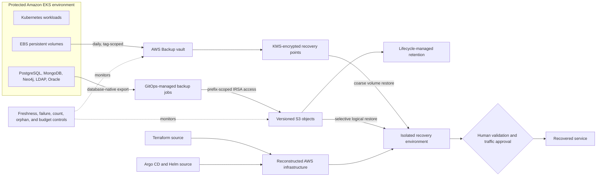

# Resilient Amazon EKS Disaster Recovery

## Executive summary

This case study turns an Amazon EKS backup implementation into a layered
recovery capability. It separates three questions that are often collapsed into
one:

1. How do we recover persistent volumes after infrastructure loss?
2. How do we recover one database or tenant after logical corruption?
3. How do we reconstruct the platform when the cluster no longer exists?

The design answers them with AWS Backup for EBS, database-native logical
backups to Amazon S3, and deterministic reconstruction from Terraform and Argo
CD. Retention is enforced by AWS services outside the protected cluster, backup
writers cannot delete their own history, and monitoring checks for missing and
unexpected backups as well as explicit failures.

The implementation is not presented as fully recovery-ready. A live EBS restore
created a new encrypted volume in 76 seconds, but the volume was not mounted and
its data was not read back. Logical-backup creation was exercised, while logical
restore and complete platform reconstruction still require drills. A backup job
that says `COMPLETED` is evidence of a mechanism, not proof that the service can
recover.

## Outcome at a glance

| Area | Verified result |
|---|---|
| Volume protection | Daily, tag-scoped EBS recovery points in an encrypted AWS Backup vault |
| Effective scope | On 2026-08-19, the scheduled run created 45 EBS recovery points; all 45 completed and no EC2 resources were selected |
| Logical backups | PostgreSQL, MongoDB, OpenLDAP, Oracle, and Neo4j backup mechanisms produced artifacts in S3 before being disabled in the non-production environment |
| Platform state | Infrastructure and Kubernetes desired state are represented in Terraform and Argo CD sources |
| Retention | Non-production runs one daily rule with seven-day retention; longer tiers remain configurable for production |
| Guardrails | Failure, freshness, recovery-point count, orphan, partial-job, and budget signals are defined |
| Restore evidence | EBS recovery point to new volume completed in 76 seconds |
| Not yet proven | Data readback, application validation, logical restore, full cluster reconstruction, and measured service RPO/RTO |

## Recovery architecture

The layers have different recovery contracts:

- **Layer 1 — AWS Backup for EBS:** fast, coarse, crash-consistent volume
  recovery when storage is lost.
- **Layer 2 — database-native exports to S3:** inspectable and selectively
  restorable data for corruption or tenant-level recovery.
- **Layer 3 — Terraform and Argo CD:** the reviewed source of truth used to
  rebuild infrastructure and Kubernetes objects. Git is not another backup
  copy of live drift.

## What changed

The original implementation exposed three design errors through measurement:

- An AWS Backup selection combined `Resources` and `ListOfTags`. Those inputs
  are a union, so one run selected 120 regional EBS volumes and nine EC2
  instances instead of the intended 66 persistent volumes. The corrected
  selection uses `Conditions`, which are ANDed with the EBS resource pattern,
  plus a namespace deny-list. The current scheduled result is 45 EBS volumes.
- A multi-server Neo4j cluster was initially treated as repeated copies of one
  dataset. Topology inspection showed that tenant databases were distributed
  across servers. The logical backup therefore supplies all server endpoints
  to one topology-aware command, and restore seeds one database before the
  remaining primaries catch up.
- A sparse CloudWatch failure metric left an alarm latched after one historical
  failure. Metric math fills missing periods with zero so the alarm can return
  to `OK` and detect the next failure.

These corrections are the core architectural lesson: validate the resource set,
restore unit, and alarm behavior against effective state rather than assuming
the configuration expresses its comments.

## Security and failure boundaries

- AWS Backup recovery points use a customer-managed KMS key; S3 artifacts use
  the bucket's server-side SSE-S3 encryption.
- Backup jobs receive short-lived, service-account-bound AWS access through
  IRSA.
- S3 writers can put objects and abort multipart uploads, but cannot delete
  retained backups.
- S3 lifecycle and AWS Backup retention run outside the protected cluster.
- The current implementation does not yet have cross-account copies or an
  enabled vault lock, so account-level destructive access remains a risk.
- Kubernetes Secrets are not reconstructed by Terraform or Argo CD. External
  Secrets backed by AWS Secrets Manager, or encrypted Secrets in Git, is a
  production gate.

## Recovery posture

| Capability | Current posture | Production gate |
|---|---|---|
| EBS backup creation | Verified | Continue daily success and scope reconciliation |
| EBS restore mechanism | Volume creation verified | Mount, checksum, start datastore, and run application queries |
| Logical backup creation | Mechanisms verified | Enable where business data requires it and alert on missing completion markers |
| Logical restore | Runbook defined | Restore a representative database and validate application behavior |
| Platform reconstruction | Sources available | Rebuild an isolated cluster and record dependency order and duration |
| Credential recovery | Gap | Make Secrets reconstructible from a managed source |
| Account compromise | Gap | Add cross-account copies and test the independent restore path |

## Detailed design

1. [Recovery requirements and failure model](1-recovery-requirements-and-failure-model.md)
2. [Recovery architecture and decisions](2-recovery-architecture-and-decisions.md)
3. [Three-tier backup implementation](3-1-three-tier-backup-implementation.md)
4. [Restore validation and results](4-restore-validation-and-results.md)
5. [Recovery runbook and handoff](5-recovery-runbook-and-handoff.md)
