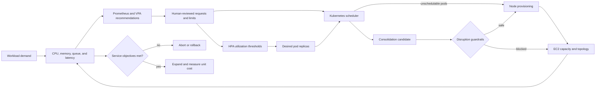

# Control-Loop Design and Decisions

## Abstract

This phase explains why Pod requests, horizontal autoscaling, scheduling, and
node provisioning form one coupled control system that cannot be tuned a
setting at a time. It records the request-coupling effect on autoscaling, the
Goldilocks and VPA decision, quality-of-service consequences, node
consolidation behavior, and the matrix used to choose between them.

## Why the loops must be designed together

EKS cost is not controlled by one setting. Pod requests influence both HPA
utilization and scheduler placement. The scheduler's unsatisfied demand drives
node provisioning, while Karpenter or Cluster Autoscaler later decides whether
capacity can be removed. Application latency and error rate determine whether
the resulting system is acceptable.



The control loops have different timescales. HPA reacts in seconds or minutes;
node provisioning and consolidation take minutes; application caches and JVM
behavior can take hours; billing outcomes require matched periods. A safe
change respects all four.

## The HPA request coupling

For a utilization-based CPU target:

```text
scale threshold per pod = CPU request x HPA target utilization
```

One reviewed service had a `100m` CPU request and an 80% HPA target. The
effective scale threshold was therefore about `80m` per pod. Goldilocks
recommended a `15m` CPU target after a low-traffic observation window. Applying
that value directly would have moved the same HPA threshold to about `12m`:

```text
before: 100m x 80% = 80m
after:   15m x 80% = 12m
```

The observed pod used about `6m`, so `15m` looked generous in a quiet snapshot.
It was still rejected as an automatic change because a small burst could cross
`12m`, create premature scale-out, and cause replica churn before latency or
concurrency had been tested. The request stayed at `100m` pending a workload
test and a joint HPA review.

This behavior follows the Kubernetes HPA model: average utilization is a
percentage of the pod's requested resource. See the
[Kubernetes HPA algorithm](https://kubernetes.io/docs/concepts/workloads/autoscaling/horizontal-pod-autoscale/).

## Goldilocks and VPA decision

Goldilocks generated VPA objects for application namespaces, but the updater
and admission controller were disabled. Every VPA remained recommendation-only
with `updateMode: Off`.

That was intentional for a shared cluster:

- application owners retained control of rollout timing;
- VPA could not evict pods or silently rewrite requests;
- recommendations could be compared with Prometheus percentiles and service
  behavior; and
- Helm remained the durable source of truth.

VPA output was treated as an independent signal, not a command. Reviewers
checked the lower, target, and upper bounds against:

- the observation-window length and traffic representativeness;
- initialization and warm-up peaks;
- caches, heap behavior, and garbage collection;
- memory growth between restarts;
- sidecars and init containers;
- runtime concurrency and downstream limits; and
- HPA thresholds and stabilization behavior.

## Requests, limits, and QoS

The program separated four problems that are often conflated:

1. **Oversized requests** reserve scheduler capacity that demand does not need.
2. **Missing requests** make placement and HPA behavior unpredictable.
3. **CPU limits** can add throttling even when nodes have spare CPU.
4. **Memory limits** are hard failure boundaries and require conservative
   headroom.

For each container, the decision record states why a request exists, whether a
limit is necessary, and which signal would invalidate it. Low observed CPU may
support a smaller request while retaining burst capacity; memory is reduced
more cautiously because it cannot be throttled safely.

Namespace defaults are a fallback for omitted values, not a substitute for
workload-specific settings. Kubernetes QoS changes are reviewed explicitly so
an optimization does not unintentionally change eviction priority.

## Node provisioning and consolidation

The cluster's existing autoscaler could not remove nodes when inflated pod
requests kept scheduler utilization high. Replacing it with Karpenter before
right-sizing would preserve the same false demand signal. The sequence was
therefore:

1. correct ownership and pod requests;
2. prove services still meet objectives;
3. establish disruption and topology protections; and
4. only then improve provisioning, instance choice, and consolidation.

The Karpenter assessment selected these guardrails:

- keep a small managed node group for Karpenter and critical platform services;
- allow multiple compatible instance families rather than one fixed type;
- set NodePool resource limits and start with one voluntary disruption at a
  time;
- pin tested AMIs for production rather than adopting untested releases;
- protect single-replica or long-running stateful pods from voluntary
  disruption;
- account for DaemonSet overhead, pod-density limits, persistent-volume zones,
  topology spread, and the largest pod request;
- configure an interruption queue before using Spot; and
- use Spot only for fault-tolerant workloads with enough instance and
  Availability Zone diversity.

These choices align with the
[Amazon EKS Karpenter best practices](https://docs.aws.amazon.com/eks/latest/best-practices/karpenter.html),
but Karpenter was still a planned enhancement in the retained evidence.

## Optimization decision matrix

| Lever | Hypothesis | Reliability risk | Validation signal | Rollback | Status |
|---|---|---|---|---|---|
| Remove abandoned resources | Eliminate cost with no business output | Hidden caller or ownership | Traffic, owner, dependency, and rollback checks | Restore source and routing | Assessment only |
| Right-size requests | Release false scheduler demand | Throttling, OOM, latency, or HPA shift | Percentiles, load test, HPA, service SLOs | Revert Helm value | Pilot verified for selected CPU request |
| Add missing resources | Make placement and scaling deterministic | Poor starter value | Rollout plus usage and SLO review | Adjust or revert values | Source verified |
| Reconcile HPA | Preserve intended scale behavior after request change | Early churn or late scale-out | Threshold calculation, replica events, burst test | Restore request/HPA pair | Unsafe automatic change rejected |
| Improve node packing | Convert request reduction into fewer nodes | Pending pods or concentration | Scheduler events, node utilization, failure test | Restore managed-node capacity | Planned |
| Karpenter lifecycle | Broaden instances and automate safe rotation | Disruption, volume/AZ conflict, capacity shortage | Canary NodePool, drain, interruption, consolidation | Delete canary NodePool and restore taints/selectors | Modeled only |
| Spot for non-critical workloads | Lower eligible compute price | Interruption and insufficient capacity | Fault injection, queue handling, availability | Route workload to On-Demand | Modeled only |
| Storage right-sizing | Remove oversized node/storage allocation | Disk pressure or slow recovery | Filesystem use, image/cache growth, node recycle | Restore volume size in next node class | Assessment only |

The rule is simple: a lower request is useful only when the entire control
system still behaves correctly.
