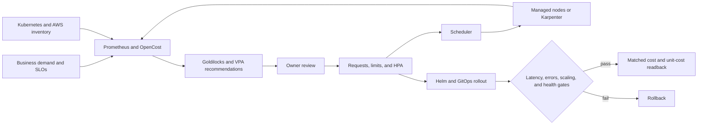

# Amazon EKS Reliability and Cost Optimization

## Executive summary

This case study shows how to reduce Amazon EKS scheduler demand without turning
cost optimization into a reliability gamble. A shared cluster assessment joined
Prometheus usage, OpenCost allocation, recommendation-only Goldilocks/VPA, HPA
behavior, Kubernetes scheduling, AWS node capacity, and durable Helm ownership.

The historical baseline contained 317 running pods. They requested 86.66 vCPU
and 297.84 GiB while a point-in-time snapshot used 4.53 vCPU and 143.64 GiB.
That 19.1x CPU request-to-usage gap identified an investigation priority, not an
automatic target: peaks, startup, concurrency, memory growth, HPA thresholds,
topology, and service objectives still had to be tested.

A bounded six-replica pilot reduced one cache workload's CPU request from
`500m` to `50m` per pod while retaining its memory request and CPU/memory
limits. All six replicas returned Ready, releasing `2.7` vCPU of
scheduler-visible demand. This is a verified request and rollout result—not a
fleet-wide cost claim. A separate HPA-managed workload's low VPA recommendation
was rejected because it would have moved the approximate scale threshold from
`80m` to `12m` per pod before burst behavior had been tested.

No fleet-wide infrastructure-cost percentage is claimed. Karpenter, Spot
capacity, broader instance choice, and node-disk reduction were assessed but
not implemented, so their modeled savings are excluded.

## Outcome at a glance

| Area | Defensible result |
|---|---|
| Scale assessed | 317 running pods across three lifecycle environments in one shared EKS cluster |
| Baseline | 86.66 vCPU / 297.84 GiB requested versus a 4.53 vCPU / 143.64 GiB point-in-time usage snapshot |
| Right-sizing control | Goldilocks/VPA recommendation-only with `updateMode: Off`; no automatic eviction or request mutation |
| Selected pilot | CPU request reduced 90% for one six-replica workload, from `3.0` to `0.3` aggregate vCPU |
| Reliability boundary | Memory request and limits retained; ordered rollout finished 6/6 Ready |
| Unsafe change avoided | Direct adoption of a `15m` VPA target rejected because of HPA threshold and burst risk |
| Delivery lesson | A merged Helm value was not called deployed until deploy job, release, rollout, and runtime state were separated |
| Node optimization | Karpenter and Spot design completed as an assessment; no realized result claimed |
| Financial outcome | Fleet-wide cost and unit-cost comparison not retained; no percentage claimed |

## Architecture



The design treats cost and reliability as one control system:

- VPA proposes; a human and workload evidence decide.
- Requests influence HPA utilization and scheduler placement.
- Scheduler demand controls whether nodes are added, packed, or removed.
- Service objectives can veto a lower request even when usage looks low.
- Cost becomes a result only after a matched observation window.

## The critical HPA calculation

Kubernetes resource-utilization HPA targets are percentages of requests:

```text
scale threshold per pod = CPU request x HPA target utilization
```

For the reviewed service:

```text
100m request x 80% target = 80m before scale pressure
 15m request x 80% target = 12m before scale pressure
```

The VPA target came from quiet observed usage. It did not encode request
latency, concurrency, readiness delay, downstream capacity, or desired replica
stability. The team therefore retained `100m` until the request and HPA could be
load-tested together. The
[Kubernetes HPA documentation](https://kubernetes.io/docs/concepts/workloads/autoscaling/horizontal-pod-autoscale/)
describes this request-relative utilization model.

## Delivery lifecycle

1. **Inventory** — join pod requests, usage, HPA, owner, node constraints, and
   cost allocation.
2. **Classify** — separate oversized, missing, HPA-coupled, stateful,
   platform-critical, unowned, and insufficient-evidence candidates.
3. **Review** — compare Prometheus percentiles with VPA bounds, runtime
   behavior, peaks, and service objectives.
4. **Change source** — update the owning Helm or IaC repository; keep VPA
   advisory.
5. **Test** — render charts and exercise steady, burst, startup, scaling, and
   failure behavior in a lower environment.
6. **Canary** — change one bounded workload or capacity pool with explicit
   abort conditions.
7. **Verify delivery** — prove merge, deploy job, release revision, rollout,
   and effective runtime configuration independently.
8. **Observe and expand** — wait through a representative workload cycle; stop
   or roll back on service, container, scheduling, or autoscaling regression.
9. **Read back cost** — compare matched billing/OpenCost periods normalized by
   a stable business-output unit.

## Selected pilot

`service-a` was a six-replica stateful cache. Its retained VPA history suggested
about `35m` CPU per pod against a `500m` request. A `50m` pilot kept additional
headroom and changed only CPU:

| Setting | Before | Verified pilot |
|---|---:|---:|
| CPU request per pod | `500m` | `50m` |
| Aggregate CPU request | `3.0` vCPU | `0.3` vCPU |
| CPU limit per pod | `1` vCPU | `1` vCPU |
| Memory request per pod | `512Mi` | `512Mi` |
| Memory limit per pod | `1Gi` | `1Gi` |
| Ready replicas after rollout | 6 | 6 |

The chart also contained a proposed memory reduction, but the live pilot kept
memory unchanged. This isolated the CPU change and avoided treating memory as a
compressible resource. No workload cost, latency, or error-rate window was
retained, so the result is limited to scheduler demand and rollout readiness.

## Karpenter decision

The node assessment found that changing provisioners before requests would not
solve false scheduler demand. Karpenter therefore followed, rather than led,
the design:

- retain a small managed node group for critical services and Karpenter itself;
- add PDB, topology, and stateful-workload disruption controls first;
- diversify compatible instance families and Availability Zones;
- cap NodePool resources and begin with one voluntary disruption at a time;
- pin tested AMIs for production;
- configure SQS interruption handling before Spot;
- canary only fault-tolerant workloads; and
- validate persistent-volume placement, pod density, and DaemonSet overhead.

These controls follow
[Amazon EKS Karpenter best practices](https://docs.aws.amazon.com/eks/latest/best-practices/karpenter.html).
They remain an implementation roadmap in this case study.

## Guardrails

Expansion stops on any of these conditions:

- availability, latency, error rate, throughput, or queue-depth regression;
- new OOM kills, crash loops, sustained throttling, or abnormal restarts;
- HPA churn, saturation, or slower response to burst traffic;
- increased pending or unschedulable pod duration;
- node provisioning failure, unsafe consolidation, or volume-zone conflict;
- source, release, and runtime configuration disagreement; or
- loss of a tested rollback path.

Rollback restores the previous Helm request/HPA pair or managed-node capacity,
then verifies workload readiness, service objectives, and effective runtime
values.

## Cost evidence

AWS Well-Architected cost guidance emphasizes efficiency per business outcome,
not raw spend alone. A future result will use matched periods:

```text
unit cost = eligible infrastructure cost / business-output units
improvement = (baseline unit cost - comparison unit cost) / baseline unit cost
```

Pricing changes, demand growth, shared-cost allocation, storage/network changes,
and purchase-model effects must be removed or disclosed. See
[AWS Well-Architected cost goals](https://docs.aws.amazon.com/wellarchitected/latest/framework/cost_govern_usage_goal_target.html).

## Contribution

The platform-engineering contribution covered:

- building the sanitized Kubernetes/AWS resource inventory;
- operating Goldilocks/VPA as an advisory control;
- correlating recommendations with Prometheus, HPA, runtime, and workload
  ownership;
- implementing and verifying the selected CPU-request pilot;
- distinguishing source merge, deployment execution, Helm revision, and
  effective cluster state; and
- designing the guarded Karpenter migration and continuous-review model.

The strongest consulting decision was not the smallest resource value. It was
establishing which changes had enough evidence to ship and which should wait.

## Detailed implementation

1. [Baseline and success criteria](1-baseline-and-success-criteria.md)
2. [Control-loop design and decisions](2-control-loop-design-and-decisions.md)
3. [Optimization implementation](3-optimization-implementation.md)
4. [Validation and results](4-validation-and-results.md)
5. [Continuous optimization](5-continuous-optimization.md)
