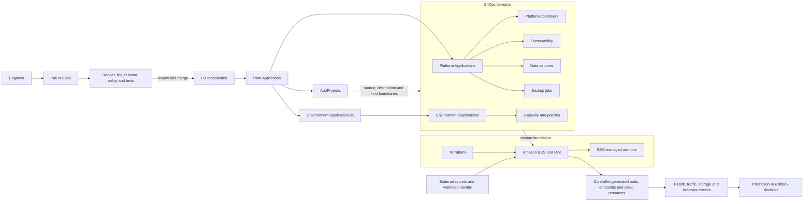
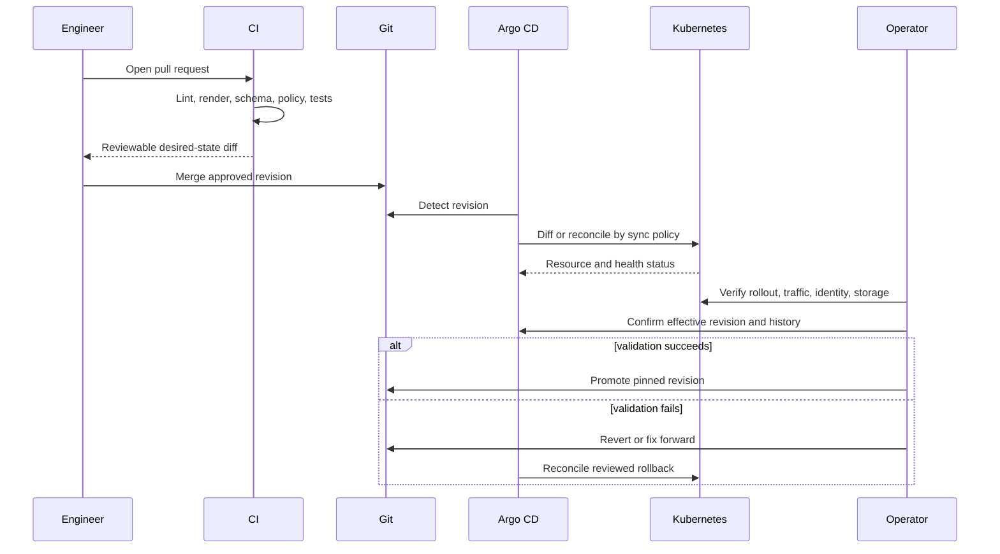

# Operating Model and Architecture

## Ownership model

The central design rule is one authoritative reconciler per resource. Ownership
follows lifecycle rather than resource type.

| Layer | Primary owner | Responsibility boundary |
|---|---|---|
| AWS network, EKS, node groups, IAM, OIDC | Terraform | Create and evolve cloud infrastructure and identity prerequisites |
| EKS managed add-ons | EKS, declared through Terraform | Keep cluster-coupled lifecycle with EKS |
| Argo bootstrap and root registration | Platform bootstrap procedure | Establish the control plane and its first root Application once |
| Argo CD live release | `argocd-self`, manual sync | Reviewed upgrades without risking an automatic self-lockout |
| Platform controllers and add-ons | Argo CD Applications | Reconcile pinned charts and repository manifests |
| Environment configuration | Argo CD ApplicationSet/Applications | Generate consistent environment Applications and reconcile overlays |
| Product charts and images | Application teams | Build, test, publish, and propose pinned versions; migration is separately approved |
| Controller-generated resources | Their Kubernetes/AWS controller | Never managed as independent GitOps objects |
| Secrets | External secret/credential owner | Deliver credentials without storing values in Git |
| Emergency change | On-call operator, time bounded | Stabilize service, then convert or revert the change in Git |

## Target architecture



Terraform and Argo CD intentionally meet at narrow interfaces. Terraform can
create an IAM role and ServiceAccount prerequisite while Argo manages the
controller that consumes it. Argo observes controller-generated load balancers
but does not import them. This prevents two state engines from managing the
same lifecycle.

## Root, projects, Applications, and ApplicationSets

The root Application watches only the directory containing Argo custom
resources. It may use automated self-heal and prune because its direct blast
radius is the Argo control namespace, not workload objects.

Child Applications are separated by operational domain:

- platform controllers;
- gateway base and environment policy;
- observability;
- stateful data services; and
- backup jobs.

AppProjects restrict source repositories, target namespaces, clusters, and
resource kinds for each domain. A data-service project can target its approved
namespaces, for example, but cannot deploy an arbitrary cluster-scoped resource.
These restrictions are both a security boundary and an early configuration
test: an Application with the wrong destination is rejected before sync.

ApplicationSet is used where the unit is repeatable and discoverable from Git,
such as environment overlays. Hand-written Applications remain appropriate for
singleton controllers and stateful releases with distinct adoption decisions.

## Repository and naming design

The public pattern is intentionally small:

```text
platform-repository/
├── argocd/
│   ├── root-application.yaml
│   ├── projects/
│   │   ├── platform.yaml
│   │   ├── observability.yaml
│   │   └── data-services.yaml
│   ├── applications/
│   │   ├── platform-controller.yaml
│   │   └── database-cluster-1.yaml
│   └── applicationsets/
│       └── environment-gateways.yaml
├── environments/
│   ├── environment-a/
│   └── environment-b/
├── platform/
└── terraform/
```

Conventions:

- names describe domain and environment, not people or tickets;
- chart and image versions are pinned;
- a shared base contains stable defaults and overlays contain only intentional
  environment differences;
- each Application has one documented owner and rollback path;
- namespaces are not implicitly created by child Applications;
- dependencies use a few explicit sync waves rather than a dense global order;
  and
- generated resources stay outside Git even when their parent declaration is in
  Git.

An environment is added by creating one small overlay that matches the
ApplicationSet generator. A new stateful service is added with an explicit
Application and adoption record because copying a generic environment template
would hide its storage and recovery decisions.

## Pull-request-to-runtime flow



Pre-merge controls can prove that source renders and satisfies known schemas.
Only a live environment can prove admission, rollout, controller behavior,
traffic, cloud side effects, and data safety.

## Secrets and privilege boundaries

Repository credentials belong to the Argo control plane, not to workload
charts. Workload Secrets are provided by an external secret or credential
bootstrap owner; manifests reference stable Secret names without embedding
values. IAM roles and trust policies remain Terraform-owned, while Kubernetes
workloads consume them through approved ServiceAccounts.

AppProjects minimize destinations and kinds. Cluster-scoped permissions are
granted only to Applications that install a required controller or CRD. Human
sync access is separated from repository merge approval, and high-risk manual
Applications require an explicit diff and operational verification before sync.

## Break-glass changes

Break glass pauses the relevant automated reconciliation before an emergency
edit. The operator records the incident, owner, object, reason, and expiry;
stabilizes the service; then either commits the effective change to Git or
reverts it. Automation is re-enabled only after Argo diff is empty or fully
explained. A raw cluster edit without pausing self-heal is not a repair—Argo may
reverse it during the incident.

## Architecture decisions

| Decision | Reason | Tradeoff |
|---|---|---|
| Terraform owns cloud foundations; Argo owns selected Kubernetes declarations | Matches each tool to its state model and avoids overlapping reconciliation | Cross-layer changes need coordinated reviews |
| Root app-of-apps plus domain projects | One bootstrap entrypoint with reviewable blast-radius boundaries | A bad root change can affect many child definitions |
| ApplicationSet only for repeatable environments | Adds environments without copying Application manifests | Generator mistakes can fan out, so preview and exclusions matter |
| Manual self-management | A failed automatic Argo upgrade can lock out its own recovery path | Platform upgrades require an operator step |
| External secret values | Keeps credentials out of Git and diffs | Recovery depends on a separately tested credential system |
| Server-side apply during adoption | Makes field ownership explicit and supports existing objects | Managed-field conflicts and defaulting must be reviewed carefully |
| Enable prune last | Avoids deleting valid but uninventoried objects | Temporary orphaned resources require deliberate cleanup |

## Alternatives considered

| Alternative | Why it was not the default |
|---|---|
| Keep CI as the Kubernetes writer | Validation and mutation stay coupled, drift is not continuously visible, and ownership remains pipeline-dependent |
| Put all infrastructure in Terraform | Kubernetes controllers, generated children, and high-frequency app configuration do not fit one monolithic Terraform lifecycle |
| One unrestricted AppProject | Simpler initially, but removes useful source, destination, and kind boundaries |
| One Application per copied environment | Easy to start, but environment declarations drift and onboarding becomes repetitive |
| Automate every Application immediately | Unsafe for control-plane self-management and database membership changes |
