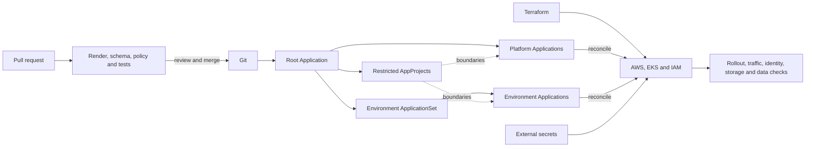

# GitOps Platform Modernization with Argo CD

## Abstract

This case study modernizes an existing Amazon EKS platform from overlapping
Terraform, Helm, CI, `kubectl`, and manual ownership into a controlled Argo CD
operating model. The work focused on adopting live resources without changing
their behavior, defining one reconciler per lifecycle, and proving deployment
from reviewed source through effective runtime state.

The result is not “everything in Argo.” Terraform still owns AWS and EKS
foundations, EKS owns managed add-ons, controllers own their generated children,
external systems own secret values, and product teams retain application
releases not yet approved for migration. Argo owns the selected Kubernetes
platform declarations for which the previous writer has been retired.

A read-only check on 2026-08-19 found 31 Applications across 12 AppProjects:
all 31 were `Synced`, 30 were `Healthy`, and one was `Progressing` because an
auxiliary workload could not pull its pinned upstream image. Twenty-five
Applications reconcile automatically. Argo self-management and five
graph-database objects remain manual because their failure and sequencing risks
justify an explicit operator gate.

## Architecture



The root Application automatically manages only Argo custom resources. Child
Applications begin manual and non-pruning during adoption. Self-heal is enabled
after the old writer is disabled; prune is enabled last after its deletion blast
radius has been reviewed.

## Modernization flow

1. Inventory live objects, effective configuration, dependencies, generated
   children, credentials, storage, and every existing writer.
2. Assign Terraform, Argo, controller, external-secret, or application-team
   ownership by lifecycle.
3. Render the exact existing release or manifests and compare them with live
   state.
4. Register a least-privileged AppProject and a manual, non-pruning Application.
5. Sync one adoption unit and verify rollout, traffic, identity, storage, and
   external side effects.
6. Retire the previous writer so ownership is exclusive.
7. Enable self-heal and then prune only after observation and dry-run review.
8. Train operators on drift, promotion, rollback, break glass, and recovery.

## Safe adoption pattern

For the stateless controller path, matching the Deployment was only the start.
The adoption also preserved its Terraform-managed workload identity, webhook
certificates, admission behavior, and controller-created load balancers. No
upgrade was combined with the ownership transfer.

For the stateful path, four database releases could not safely share ownership
of one lookup-generated Service. The Service received one explicit Application,
credential values stayed outside Git, PVC and Service identity were preserved,
and servers were synced one at a time with membership checks. Those Applications
remain manual in steady state.

## Source-to-runtime proof

```text
source merged
    -> selected CI checks passed
        -> desired revision rendered
            -> Argo Synced
                -> Kubernetes rollout ready
                    -> effective traffic, identity, storage and data verified
```

Each arrow is a separate gate. The current `Synced` but `Progressing` workload
is a concrete reminder that source and control-plane convergence do not prove
artifact availability or service health.

## Key decisions

| Decision | Why | Tradeoff |
|---|---|---|
| Terraform/Argo lifecycle boundary | Prevents two state engines from owning the same resource | Cross-layer changes need coordination |
| Root app-of-apps plus restricted projects | One bootstrap entrypoint with domain blast-radius controls | Root changes require careful review |
| ApplicationSet for repeatable environments | Avoids copied Application manifests | Generator errors can fan out |
| External secret values | Keeps credentials out of Git | Recovery depends on another tested system |
| Manual Argo self-management | Avoids an automatic upgrade locking out its own control plane | Upgrades require an operator |
| Manual database Applications | Preserves ordered membership and storage checks | Reconciliation is intentionally slower |
| Prune enabled last | Protects legitimate uninventoried resources during adoption | Cleanup remains deliberate until scope is proven |

## Measured outcome and limits

The verified outcome is controlled ownership and observable convergence, not a
manufactured percentage improvement. Historical lead-time and rollback data
were not comparable, so the case study defines future measurement contracts
instead of claiming a reduction. Full product deployment migration and an
end-to-end cluster-plus-data recovery exercise remain separate gates.

## Phases

1. [Current state and success criteria](1-current-state-and-success-criteria.md)
2. [Operating model and architecture](2-operating-model-and-architecture.md)
3. [Adoption implementation](3-adoption-implementation.md)
4. [Rollout validation and results](4-rollout-validation-and-results.md)
5. [Operations, governance, and handoff](5-operations-governance-and-handoff.md)
