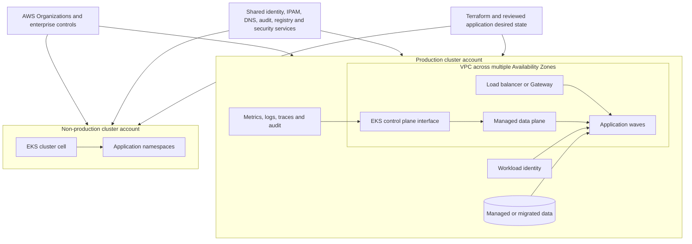

# Target Architecture and Compatibility Decisions

## Abstract

This phase designs an enterprise Amazon EKS fleet rather than a byte-for-byte
hosted copy of the source clusters, preserving application requirements while
replacing self-managed control-plane, node, cloud integration, identity,
networking, storage, and lifecycle assumptions with explicit EKS contracts. It
records the topology, responsibility mapping, desired-state ownership, build
order, and the decisions behind each.

## Decision frame

The target is an enterprise EKS fleet, not a byte-for-byte hosted copy of the
source clusters. Architecture preserves application requirements while replacing
self-managed control-plane, node, cloud integration, identity, networking,
storage, and lifecycle assumptions with explicit EKS contracts.

## Target topology



The diagram shows the minimum reference separation between production and
non-production. Repeat a cluster-account cell only when the assessment proves a
trust, regulatory, Region, lifecycle, quota, scale, or recovery requirement.

## Source-to-target responsibility mapping

| Capability | Source state | Target contract | Proof |
|---|---|---|---|
| Control plane | Self-managed API server, etcd, scheduler and controllers | EKS-managed control plane; no etcd copy | Cluster health, access, audit, API and failure tests |
| Nodes | Source OS/runtime, labels, taints, devices and patching | Approved managed/self-managed/Auto Mode decision with lifecycle and node-pool contracts | Scheduling, drain, replacement, vulnerability and capacity tests |
| Pod network | Source CNI and address model | VPC CNI or approved alternative with IPAM, per-AZ capacity and policy semantics | Allowed/denied flows, source IP, MTU, scale and allocation tests |
| Service exposure | Source Ingress/Gateway/LB implementation | AWS Load Balancer Controller, Gateway implementation or approved alternative | DNS, TLS, health, protocol, client IP and traffic-shift tests |
| DNS | Source CoreDNS/custom zones/stub domains | EKS/CoreDNS design plus enterprise Route 53/Resolver integration | Internal/external resolution, caching and failure tests |
| Storage | Source provisioner and PV backend | Supported CSI, target StorageClasses and separate application-consistent data migration | Provision, attach, mount, performance, integrity and restore tests |
| Human access | Source identity and cluster RBAC | Federated AWS access plus EKS authorization and least privilege | Authentication, allowed/denied, escalation and audit tests |
| Workload access | Static/cloud/node credentials | Service-specific Pod Identity or IRSA where appropriate | Required and denied AWS actions, rotation and failure tests |
| Secrets | Source Secret values/operator | External authority and target references populated outside Git/extraction | Rotation, reload, revoke and audit tests without value output |
| Policy | PSP/custom admission/manual controls | Pod Security Admission and approved policy engine with exception lifecycle | Compliant admission, denied unsafe object, availability and bypass test |
| Autoscaling | Source HPA/VPA/node autoscaler | HPA/KEDA/VPA/node provisioning selected from workload evidence | Load, burst, pending, node launch and scale-down tests |
| Observability | Source agents and backends | Enterprise application/platform/audit/cost telemetry before traffic | Dashboard, alert, trace, retention and incident exercise |
| Backup/recovery | Source cluster/PV/data tooling | Declarative configuration recovery plus workload-specific data recovery | Restore, controller reconcile, application read/write and traffic proof |

## Desired-state ownership

Each target object has one authoritative writer:

| Object layer | Preferred authority |
|---|---|
| AWS accounts, VPC, EKS, IAM and foundational services | Terraform or approved infrastructure workflow |
| EKS add-ons and cluster-scoped platform services | One platform release/GitOps owner per object |
| CRDs and operators | Pinned platform or application owner following vendor lifecycle |
| Application namespace resources | Versioned Helm/Kustomize/manifests through the approved delivery owner |
| Operator-generated children and status | The installed controller; never copied as independent desired state |
| Secret values | External secret authority; repositories contain references only |
| Traffic weights and DNS | Named release/traffic owner with observed effective state |
| Persistent data | Data/application owner through a system-specific migration workflow |

Extraction output is never a second permanent writer. Emergency target changes
must be reconciled back to the declared owner or explicitly retired.

## Platform build order

Dependencies are established in an intentional order:

1. enterprise account, network, endpoints, DNS, keys, certificates, logging and
   access prerequisites;
2. EKS control plane, endpoint access, audit/control-plane logs and
   authorization;
3. node capacity, VPC CNI/IPAM, CoreDNS, kube-proxy or target equivalent;
4. CSI drivers and tested StorageClasses;
5. workload identity, secret integration and certificate lifecycle;
6. ingress/Gateway/load-balancing and external/internal DNS integration;
7. admission, Pod security, policy, quota and tenancy controls;
8. metrics, logs, traces, events, audit, backup and security tooling;
9. approved CRDs, webhooks and operators; and
10. application waves and traffic.

The exact order changes only when dependencies prove it necessary. For example,
a policy engine cannot enforce a CRD-based policy before its own APIs and
webhooks are healthy.

## Network and capacity design

For every cluster cell:

- assign non-overlapping VPC, subnet, Pod and Service ranges compatible with
  enterprise/on-premises connectivity;
- calculate VPC CNI addresses, warm capacity, node ENIs, EKS interfaces, load
  balancers, endpoints, replacement nodes, AZ failure and growth per subnet;
- select IPv4/IPv6, secondary-IP/prefix mode, custom networking or alternatives
  from measured requirements rather than treating them as later fixes;
- test source/target coexistence routes, DNS, proxies, inspection, NAT, fixed
  egress, partner allowlists and certificate paths;
- size nodes from resource requests and observed demand while respecting
  `maxPods`, ENI/IP, volume, device, conntrack and network limits;
- register and approve applicable AWS quotas and API throttles before dependent
  waves; and
- monitor IP availability, CNI allocation, pending Pods, DNS, network errors,
  targets, connections and bandwidth.

Free capacity is evaluated per compatible node pool and Availability Zone. A
cluster-wide aggregate cannot satisfy a Pod constrained to a full zone, tainted
pool, architecture, accelerator, volume topology or security boundary.

## Storage architecture

The target separates three concerns:

```text
StorageClass and CSI contract
  -> creates and attaches suitable target volumes

data migration contract
  -> copies or synchronizes application-consistent content

recovery contract
  -> restores data and proves application read/write and traffic behavior
```

For EBS-backed workloads, topology and access modes must fit node/AZ placement.
Shared filesystem, object, database or local-volume workloads require an
explicit target service and migration path. Snapshot portability, encryption
keys, filesystem identity, throughput, IOPS, attachment and restore time are
verified rather than assumed.

## Security architecture

- private cluster endpoint access is selected when it fits enterprise access and
  operations; any public endpoint is explicitly restricted and monitored;
- human AWS federation and EKS authorization are separated from workload
  ServiceAccounts and AWS permissions;
- cluster-admin is exceptional, time-bounded and audited;
- RBAC is redesigned from job function and workload need, not cloned from
  source;
- admission and policy components are highly available, scoped, observable and
  protected from deadlocking recovery;
- Pod Security Standards and Linux controls are enforced by workload tier;
- default-deny network policy and explicit ingress/egress are validated with
  tests;
- images use approved registries, immutable digests, vulnerability disposition,
  provenance/signing policy where required, and runtime controls;
- secret values remain in approved authorities and are never migration
  artifacts; and
- control-plane/AWS audit, security, network and workload events have defined
  retention, access and incident ownership.

## Key decisions

Every record below is `Proposed`, not `Accepted`. This solution has no retained
production engagement, so no decision here has been ratified by a customer or
survived contact with a real migration. Marking them accepted would overstate
the evidence.

### ADR 1: New managed control plane, reconciled workload state

**Status:** Proposed · **Date:** Not retained, this is a reference design
· **Owner:** Migration architect

**Context:** EKS owns its control plane. Source internal state includes
distribution-, version-, and environment-specific data that is not a portable
application contract, so it cannot be carried across as desired state.

**Decision:** Build a new EKS cluster and redeploy reconciled desired state.

**Rejected alternatives:** Copy source etcd or control-plane state into the
target. Rejected because the state is not portable and the attempt would import
the source's accumulated drift along with it.

**Tradeoff:** Requires explicit inventory and a controlled rebuild, but that
work exposes hidden dependencies and produces a repeatable target.

**Reversal trigger:** None foreseeable while EKS supplies its own managed
control plane.

**Compliance:** Architecture review rejects any proposal to import source
control-plane state. Every target object must trace to a declared source.

### ADR 2: Declared sources are authoritative after reconciliation

**Status:** Proposed · **Date:** Not retained, this is a reference design
· **Owner:** Platform lead

**Context:** Live objects contain generated fields, controller-owned children,
credentials, defaulted values, and drift. Some desired state exists only in the
cluster because an emergency change was never codified.

**Decision:** Use Git, Helm, Kustomize, Terraform, pipeline, and operator
sources as deployment authority after comparing them with live state.

**Rejected alternatives:** Export all live objects and apply them to EKS.
Rejected because blind replay can create conflicting writers and unsafe
privilege, and it copies drift forward as if it were intent.

**Tradeoff:** Undeclared emergency fixes must be understood and either codified
or deliberately removed before migration, which delays the first wave.

**Reversal trigger:** A workload whose declared source cannot be reconstructed
is quarantined for rebuild rather than migrated from live state.

**Compliance:** Render and server-side dry run execute from the declared
source. Live extraction output is marked evidence-only and is not a valid apply
input in the pipeline.

### ADR 3: Replace platform integrations, preserve application contracts

**Status:** Proposed · **Date:** Not retained, this is a reference design
· **Owner:** Platform lead

**Context:** Source-specific CNI, CSI, ingress, identity, secret, policy, and
observability mechanisms carry the operational burden the migration exists to
remove. Application behavior, by contrast, is what the business depends on.

**Decision:** Map platform mechanisms to EKS-supported target contracts while
preserving approved application behavior.

**Rejected alternatives:** Force source cluster implementation details onto
EKS. Rejected because it recreates the self-managed burden inside a managed
service and forfeits the reason for migrating.

**Tradeoff:** Some manifests and operational procedures change, and portability
must be proven by tests rather than assumed from Kubernetes conformance.

**Reversal trigger:** An application contract that cannot survive a mapped
platform mechanism blocks the mapping, not the application.

**Compliance:** Each mapped contract has a passing target test before dependent
workloads deploy. Conformance alone is not accepted as proof.

### ADR 4: Blue/green cluster migration by wave

**Status:** Proposed · **Date:** Not retained, this is a reference design
· **Owner:** Migration lead

**Context:** A cluster-wide cutover has no bounded rollback target. Failure and
rollback ownership only stay coherent if the migration unit is
dependency-complete.

**Decision:** Keep source and target clusters active, migrate
dependency-complete waves, and move traffic only after target proof.

**Rejected alternatives:** Stop the source and migrate the full cluster in one
window. Rejected because it removes the rollback target and the comparison
baseline at the same time.

**Tradeoff:** Dual-run cost and configuration discipline increase, and shared
dependencies can enlarge a wave beyond its intended scope.

**Reversal trigger:** Dual-run cost exceeding the value of the remaining
rollback window is the signal to close the observation period, not to skip it.

**Compliance:** Wave entry requires a dependency-complete scope and a tested
rollback route. Source capacity is verified before traffic moves.

### ADR 5: Data migration is workload-specific

**Status:** Proposed · **Date:** Not retained, this is a reference design
· **Owner:** Data owner

**Context:** Kubernetes objects describe claims and attachment. They do not
contain application-consistent data, and consistency requirements differ by
engine, change rate, and recovery objective.

**Decision:** Choose database, object, queue, and volume migration methods from
consistency, change rate, RTO/RPO, and rollback requirements.

**Rejected alternatives:** Treat PV/PVC object recreation, or one backup tool,
as a universal data migration. Rejected because a recreated claim proves
nothing about the data behind it.

**Tradeoff:** Stateful waves require more design and rehearsal, but data
integrity is no longer hidden behind Kubernetes object success.

**Reversal trigger:** An engine whose method cannot meet its RPO inside the
cutover window moves to a dedicated data migration wave.

**Compliance:** Each stateful wave carries a data method, an integrity test,
and a named last reversible point before deployment.

### ADR 6: Cluster cells follow isolation and lifecycle requirements

**Status:** Proposed · **Date:** Not retained, this is a reference design
· **Owner:** Enterprise and platform architects

**Context:** A cluster is the strong isolation boundary; a namespace is a
logical control. Trust, regulation, Region, recovery, lifecycle, quota, scale,
and business autonomy each independently justify separation.

**Decision:** Separate production from non-production, and add cells where one
of those requirements applies.

**Rejected alternatives:** One enterprise cluster, or one cluster per
application, adopted as an unexamined default. Both are rejected because
neither derives from a stated requirement.

**Tradeoff:** More cells increase fleet cost and governance; fewer cells
increase shared blast radius and lifecycle coupling.

**Reversal trigger:** A cell whose justifying requirement no longer applies is
a consolidation candidate, with the accepted blast radius recorded.

**Compliance:** A new cell request cites the isolation or lifecycle requirement
that justifies it. A consolidation proposal states the blast radius accepted.

### ADR 7: AWS Backup is the default target recovery service

**Status:** Proposed · **Date:** Not retained, this is a reference design
· **Owner:** Platform and security owners

**Context:** In-cluster backup controllers add software lifecycle, credential,
and upgrade ownership to the very cluster they are meant to protect. AWS Backup
moves retention and vault governance outside that boundary, but only across its
supported coverage.

**Decision:** Use AWS Backup as the default EKS recovery control when cluster
objects and persistent storage fall within its supported coverage. Use Velero
only for a documented portability, source-cluster, storage, or workflow
requirement that AWS Backup does not meet.

**Rejected alternatives:** Install Velero in every target cluster by default,
or assume one Kubernetes backup tool suits every migration and recovery case.
Rejected because the default then carries controller, plugin, and credential
ownership that most workloads do not need.

**Tradeoff:** AWS Backup reduces in-cluster and software-lifecycle ownership
and integrates with AWS governance, but introduces AWS service dependencies,
coverage constraints, quotas, and platform coupling. Velero remains useful for
portable and plugin-based workflows, at the cost of operating its controllers,
plugins, backup locations, credentials, and upgrades.

**Reversal trigger:** A workload whose storage or restore prerequisite falls
outside AWS Backup coverage switches to Velero for that workload only, not for
the fleet.

**Compliance:** A Velero installation requires a recorded requirement that AWS
Backup does not meet. Coverage and restore prerequisites are re-validated at
each Kubernetes version upgrade.

## Why prefer AWS Backup over Velero

This is a target-platform default, not a claim that AWS Backup universally
replaces Velero. The source cluster may still need Velero or another
application-specific mechanism during migration.

| Decision factor | AWS Backup for EKS | Velero | Architecture implication |
|---|---|---|---|
| In-cluster footprint | Agent-free: no customer-managed backup controller or add-on is installed in the EKS cluster | Runs a Velero server; file-system backup and CSI snapshot data movement use an optional node-agent `DaemonSet` | AWS Backup avoids reserving cluster capacity and patching an in-cluster backup stack |
| Node-agent count | No per-node backup agent | When node-agent is enabled, it runs as a `DaemonSet` on eligible nodes; a six-node fleet may therefore run six agents, but six is not a fixed requirement | Size Velero overhead from eligible node pools, resource requests, concurrency, and data-mover Pods—not a hard-coded Pod count |
| Service lifecycle | AWS operates the backup service; the platform team owns plans, vaults, IAM, KMS, policy, alerts, cost, and restore tests | The platform team owns the server, CRDs, plugins, node-agent, object storage, credentials, compatibility, monitoring, and upgrades | Managed service reduces undifferentiated operations but does not remove recovery ownership |
| Schedule and retention | Backup plans define schedules, windows, retention, copy actions, and supported warm-to-cold lifecycle centrally | A Velero `Schedule` CRD is reconciled by the Velero server; storage lifecycle remains part of the chosen backend design | AWS Backup can express daily, weekly, monthly, and yearly GFS-style retention without operating an in-cluster schedule controller |
| Cross-Region and cross-account recovery | EKS recovery points support same-account, cross-Region, and cross-account copy workflows through backup plans | Requires a designed combination of backup locations, credentials, storage replication/copy, and operational automation | AWS Backup can replace custom copy scripts after Organizations, vault policy, IAM, KMS, Region, and restore prerequisites are configured |
| Governance scope | One policy and vault model can govern EKS and other supported AWS resource types | Primarily protects Kubernetes resources and supported volume/data workflows | AWS Backup better fits enterprise-wide retention, audit, vault, and delegated-policy controls; verify feature availability per resource and Region |
| Portability and extensibility | AWS- and EKS-native; coverage follows the documented service and CSI support matrix | Kubernetes-native, extensible through plugins, and usable across supported on-premises and cloud environments | Prefer Velero when provider portability, source-cluster capture, or a required plugin is a material requirement |
| Quotas | Subject to AWS Backup EKS backup/restore quotas and underlying service quotas, including applicable EBS limits | Subject to Kubernetes, object-store, snapshot-provider, plugin, and transfer limits | AWS Backup centralizes quota visibility but does **not** bypass EBS snapshot or account quotas |
| Cost model | AWS Backup storage, restore, copy, cross-Region transfer, and related service charges | Open-source software does not mean zero cost: include cluster compute, object/snapshot storage, transfer, engineering, upgrades, and incident effort | Compare total recovery cost at the required RPO, retention, copy, and restore frequency—not license price alone |

### Choose AWS Backup by default when

- the target is EKS and required Kubernetes objects, EBS, EFS, or S3-backed
  persistent storage are supported by the current AWS Backup coverage matrix;
- the enterprise wants centralized AWS Organizations policy, vault, retention,
  audit, cross-account, and cross-Region governance;
- reducing per-cluster controllers, privileged/node-level agents, plugins, and
  upgrade work is an explicit platform objective; and
- the team accepts AWS-native recovery contracts and has validated permissions,
  encryption, quotas, cost, and target-cluster prerequisites.

### Choose Velero or another method when

- the self-managed source cluster needs a portable backup before EKS exists;
- multi-cloud or provider-independent recovery is a hard requirement;
- an application, volume type, CSI behavior, subpath, controller, or Region is
  outside AWS Backup for EKS support;
- existing Velero plugins, hooks, resource filters, or data movers provide a
  tested recovery workflow that the managed service cannot reproduce; or
- workload-native replication, database backup, or application quiescing is
  required for consistency. Neither AWS Backup nor Velero replaces those
  application controls automatically.

Using both can be valid during migration: Velero or workload-native tooling can
protect the source while AWS Backup protects the EKS target. Declare one
recovery owner for each resource and recovery objective, avoid overlapping
schedules and unexplained duplicate cost, and test the handoff before retiring
the source.

### Recovery proof and caveats

Do not describe cross-account or cross-Region recovery as literally “one
button.” AWS Backup removes the need for a custom copy controller or script, but
the design still requires compatible destination clusters, AWS Organizations
and vault policy where applicable, IAM, KMS keys, network access, APIs and CRDs,
StorageClasses, image registry access, and workload identity. Cross-cluster IRSA
trust must be updated; EKS Pod Identity can reduce that coupling where it fits.

An EKS backup can also complete with issues when some objects fail. Acceptance
therefore requires alerts on partial results and a timed restore exercise that
proves Kubernetes objects, persistent data, application read/write behavior,
dependencies, and a real request path. A successful backup job alone is not
recovery evidence.

## Exit criteria
Implementation begins only when topology, target Kubernetes version, API and
operator compatibility, desired-state ownership, network/IP capacity, quota,
storage/data methods, identity, policy, observability, recovery, delivery,
cutover and source-retention decisions are approved and have named owners.

## References

- [Amazon EKS best-practices guide](https://docs.aws.amazon.com/eks/latest/best-practices/introduction.html)
- [Amazon EKS networking best practices](https://docs.aws.amazon.com/eks/latest/best-practices/networking.html)
- [Amazon EKS reliability best practices](https://docs.aws.amazon.com/eks/latest/best-practices/reliability.html)
- [Amazon EKS tenant isolation](https://docs.aws.amazon.com/eks/latest/best-practices/tenant-isolation.html)
- [AWS Backup: Amazon EKS backups](https://docs.aws.amazon.com/aws-backup/latest/devguide/eks-backups.html)
- [AWS Backup: Restoring Amazon EKS](https://docs.aws.amazon.com/aws-backup/latest/devguide/restoring-eks.html)
- [AWS Backup: Create a backup plan](https://docs.aws.amazon.com/aws-backup/latest/devguide/creating-a-backup-plan.html)
- [AWS Backup: Cross-account backup copies](https://docs.aws.amazon.com/aws-backup/latest/devguide/create-cross-account-backup.html)
- [AWS Backup quotas](https://docs.aws.amazon.com/aws-backup/latest/devguide/aws-backup-limits.html)
- [Velero: File System Backup and node-agent](https://velero.io/docs/v1.18/file-system-backup/)
- [Velero: Schedule API type](https://velero.io/docs/v1.18/api-types/schedule/)
