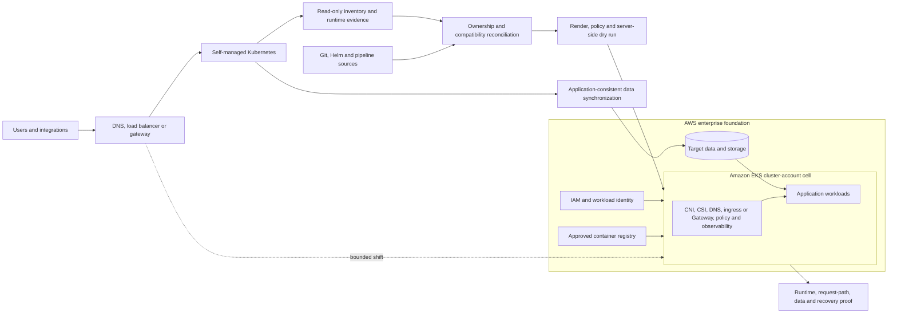

# Self-Managed Kubernetes Migration to Amazon EKS

## Abstract

A large enterprise runs containerized workloads on self-managed Kubernetes.
The applications already have images and Kubernetes objects, but the source
platform carries cluster-specific networking, storage, identity, policy,
controller, and operational assumptions that cannot be copied safely into
Amazon EKS.

This solution assesses the source fleet and its declared sources of truth,
establishes EKS cluster-account cells, reconciles every workload and cluster
service against a target compatibility contract, migrates in dependency-aware
waves, synchronizes state through workload-specific mechanisms, shifts traffic
between clusters, and retains the source until runtime, data, recovery, and
operations criteria pass.

This path begins after container images, runtime contracts, Helm releases, and
service boundaries already exist. If a workload has no production container and
Kubernetes contract, route it to the [on-premises monolith modernization
solution](../migrate-on-premises-monolith-to-eks/README.md) instead; treating
this path as "skip containerization" would hide the primary risks in both.

## Architecture

This is a blue/green cluster migration. It does not move the source control
plane or copy its etcd database. Amazon EKS supplies a new managed control
plane; application and approved platform desired state are rebuilt and
validated on it.

## Key decisions

Because the application artifacts already exist, the hard questions are not
about packaging. They are about which source state is authoritative, which
platform assumptions are portable, and when the source stops being the rollback
target. Each decision below had a defensible alternative; the reasoning and
evidence are recorded as ADRs in [target architecture and compatibility
decisions](2-target-architecture-and-compatibility-decisions.md).

| Decision | Rejected alternative | Why it won | What it cost |
|---|---|---|---|
| Build a new managed control plane and redeploy reconciled state | Lift the cluster: copy source etcd or control-plane state into EKS | EKS supplies its own managed control plane, and source system objects are not portable desired state | Every object needs an explicit owner and a controlled rebuild order |
| Treat declared sources as authoritative after reconciliation | Export all live objects and apply them to the target | Live state carries status, UIDs, resource versions, managed fields, defaults, tokens, and drift that are not desired state | Undeclared emergency fixes must be found and either codified or dropped, which delays the first wave |
| Replace platform integrations, preserve application contracts | Force source CNI, CSI, ingress, identity, and policy implementations onto EKS | Source-specific mechanisms carry the operational burden the migration exists to remove | Some manifests and runbooks change, and portability claims must be retested |
| Blue/green cluster migration by dependency-complete wave | Stop the source and move the whole cluster in one event | Failure and rollback ownership stay coherent, and the source remains a tested rollback target | Dual-run cost and configuration discipline increase; shared dependencies can enlarge a wave |
| Choose data migration per workload | Treat PV/PVC recreation, or one backup tool, as a universal data migration | Kubernetes objects describe claims and attachment, not application-consistent data | Stateful waves need per-engine design, rehearsal, and an explicit last reversible point |
| Size cluster cells from isolation and lifecycle requirements | One enterprise cluster, or one cluster per application | A cluster is the strong isolation boundary; a namespace is a logical control, not an equivalent one | More cells raise fleet cost and governance; fewer cells raise shared blast radius |
| AWS Backup as the default target recovery control | Install Velero in every target cluster by default | Agent-free, policy-driven protection removes in-cluster controllers and centralizes retention, vault, and copy governance | AWS coverage, quotas, KMS/IAM, restore prerequisites, and platform coupling must be validated; Velero is retained for source-side, portability, and unsupported-storage needs |
| Rebuild least privilege rather than clone authorization | Copy source RBAC and cluster-admin bindings into EKS | Source identities and cluster-admin patterns may not fit AWS or enterprise controls | Access mapping requires owner testing and often exposes hidden dependencies |

Deprecated source behavior is not carried forward merely because it exists.
`PodSecurityPolicy`, removed API versions, in-tree provisioners, generated
tokens, and cluster-assigned fields are converted, replaced, or dropped. The
full boundary list is in [solution context and
requirements](0-solution-context-and-requirements.md).

## Results and claim boundary

This solution defines a measurement contract rather than inventing production
results.

| Metric | Baseline | Target evidence |
|---|---|---|
| Workload completeness | Reconciled source inventory | Expected, migrated, skipped, and error counts with approved disposition |
| Functional parity | Source contract and journey results | Same tests on target under representative dependencies |
| Performance | Source demand, latency, errors, saturation | Matched target window normalized by business demand |
| Availability | Approved service objective | Cutover and observation-window compliance |
| Recovery | Source recovery behavior and target RTO/RPO | Timed restore, read/write, application, and traffic exercise |
| Operations | Source ownership and effort | Independent EKS deploy, diagnose, scale, upgrade, rollback, and incident exercises |
| Cost | Source platform and workload allocation | Target and dual-run cost with shared allocation and demand normalization |

No migration scale, downtime, cost saving, availability improvement, or
decommission result is claimed without retained evidence. A successful API
apply is not a successful migration, and a Ready Pod is not proof of correct
identity, storage, traffic, dependency, or data behavior.

## Phases

0. [Solution context and requirements](0-solution-context-and-requirements.md)
1. [Source cluster assessment and success criteria](1-source-cluster-assessment-and-success-criteria.md)
2. [Target architecture and compatibility decisions](2-target-architecture-and-compatibility-decisions.md)
3. [Migration implementation](3-migration-implementation.md)
4. [Cutover, validation, and results](4-cutover-validation-and-results.md)
5. [Operations and source decommission](5-operations-and-decommission.md)

## Related solutions

[Enterprise EKS readiness assessment](../migrate-on-premises-monolith-to-eks/1-1-enterprise-assessment.md),
[EKS reliability and cost optimization](../eks-reliability-cost-optimization/README.md),
[EKS disaster recovery](../eks-disaster-recovery/README.md), and
[GitOps platform modernization](../gitops-platform-modernization/README.md).

## References

- [AWS Prescriptive Guidance: Migrating large-scale self-managed Kubernetes clusters to Amazon EKS](https://docs.aws.amazon.com/prescriptive-guidance/latest/migrating-self-managed-kubernetes-cluster-to-amazon-eks/introduction.html)
- [AWS Prescriptive Guidance: Pre-migration checklist](https://docs.aws.amazon.com/prescriptive-guidance/latest/migrating-self-managed-kubernetes-cluster-to-amazon-eks/pre-migration-checklist.html)
- [Amazon EKS best practices](https://docs.aws.amazon.com/eks/latest/best-practices/introduction.html)
- [Kubernetes deprecated API migration guide](https://kubernetes.io/docs/reference/using-api/deprecation-guide/)
