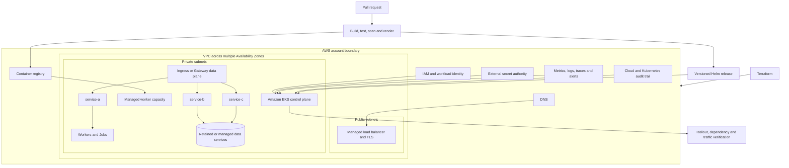

# Target Architecture and Decisions

## Decision frame

The target had to support more than 20 independently packaged components,
multiple runtimes, uneven scaling, tenant and workload isolation, reversible
releases, and a team already investing in Kubernetes delivery patterns. The
platform decision followed those requirements; EKS was not selected simply
because Kubernetes was available.

## Target-platform comparison

| Option | Strengths | Constraints for this migration | Decision |
|---|---|---|---|
| EC2 with an instance-based scheduler | Maximum host control and simplest conceptual continuation from virtual machines | Preserves host patching, placement, and bespoke release automation; weakens per-service portability and scaling consistency | Rejected as the application target; retained only for dependencies that could not yet move |
| Amazon ECS | AWS-native orchestration with a smaller Kubernetes operating surface | Would require a second application and operating model while the retained delivery estate already used Helm and Kubernetes controls | Viable alternative, rejected for this program context |
| Amazon EKS | Portable Kubernetes API, Helm ecosystem, workload-level policy, independent scaling, and a common control plane for mixed runtimes | Adds cluster upgrades, add-ons, capacity, policy, observability, and Kubernetes skill requirements | Selected with standardized platform ownership and handoff gates |

EKS was justified by the aggregate estate. A single small service would not have
earned this complexity.

## Target AWS architecture



Only components that answer a requirement are shown. A specific managed
database, CDN, WAF, service mesh, Spot strategy, or GitOps controller is not
claimed as part of the original migration unless separately evidenced.

## Network and traffic boundaries

- Worker nodes and workload endpoints run in private subnets; public exposure is
  through a controlled load-balancing path.
- Security groups and Kubernetes NetworkPolicies restrict flows by purpose.
- DNS and TLS changes are versioned as cutover steps with their own rollback.
- Egress is explicit for package, identity, and required external-service paths;
  unrestricted application egress is not a default.
- Each migration wave exposes only the route or capability being moved. The
  legacy route remains available until the observation gate passes.

The exact subnet ranges, endpoints, certificate identifiers, and account
details are intentionally excluded.

## Identity and secret boundaries

Human and workload credentials have different lifecycles:

```text
human -> federated AWS role -> cluster authorization -> approved operation
pod   -> Kubernetes ServiceAccount -> workload identity -> scoped AWS API
app   -> Secret reference -> external secret authority -> runtime value
```

Images and Helm values contain no long-lived credentials. Each service receives
its own ServiceAccount and only the AWS permissions required by that workload.
Secret names and configuration structure may be versioned; secret values stay
outside source control and are redacted from logs and pipeline output.

## Capacity and reliability design

The scheduler, autoscaler, and application health contract form one control
loop:

- requests represent schedulable demand and must be based on workload evidence;
- limits protect shared capacity but must not create sustained CPU throttling or
  unsafe memory pressure;
- HPA thresholds are reviewed together with requests because utilization is
  request-relative;
- readiness gates traffic, liveness detects irrecoverable runtime failure, and
  startup probes protect slow initialization;
- multiple replicas, topology spread, and disruption budgets are applied where
  the workload and recovery objective justify them; and
- node and Availability Zone failure tests precede claims of resilience.

Stateful dependencies require separate backup, restore, placement, and data
integrity decisions. Running a stateful component on EKS does not make it
resilient by itself.

## Ownership model

| Layer | Primary owner | Change mechanism | Runtime proof |
|---|---|---|---|
| VPC, EKS, node capacity, IAM | Platform team | Reviewed Terraform plan and apply | AWS inventory plus cluster/node readiness |
| Cluster add-ons and ingress | Platform team | Pinned Helm or infrastructure workflow | Controller readiness and effective traffic |
| Application image | Service team | CI-built immutable digest | Registry metadata and running image digest |
| Application chart and configuration | Service team with platform guardrails | Versioned Helm values and templates | Rendered diff, release revision, and workload spec |
| Credentials | Security or secret-system owner | External rotation workflow | Reference and authorization test, never value output |
| Data schema | Data/application owner | Backward-compatible migration workflow | Schema, integrity, and old/new reader tests |
| DNS and traffic weight | Release owner | Approved cutover step | Real request-path probes and telemetry |
| Service objectives and alerts | Service owner | Versioned monitoring configuration | Dashboard, alert test, and runbook link |

## Architecture decisions

### ADR 1: Replatform before deep refactoring

**Decision:** Establish a container and EKS operating contract first, then
extract capabilities in bounded waves.

**Rejected alternative:** Rewrite the monolith and move platforms in one event.

**Evidence:** Shared application, data, and release dependencies made a single
rewrite difficult to validate and roll back. The final estate demonstrates that
service extraction could proceed incrementally.

**Tradeoff:** Some services initially carry legacy models or adapters. That is
intentional technical debt with an owner and removal criterion.

### ADR 2: One independently versioned image and chart per service

**Decision:** Give each deployable component an immutable image, Helm release,
resource contract, health contract, and owner.

**Rejected alternative:** Keep one large image or one coupled chart for all
components.

**Evidence:** The retained implementation contains more than 20 chart-bearing
components and multi-stage Dockerfiles across Node.js, Java, web, and supporting
runtimes.

**Tradeoff:** Repository and release count grows. Shared templates and policy
checks are required to prevent drift.

### ADR 3: Retain data compatibility during compute migration

**Decision:** Use expand-and-contract schemas, compatible clients, and adapters
while legacy and EKS paths coexist.

**Rejected alternative:** Move every data store and schema in the same cutover.

**Evidence:** The retained service map shows several components sharing
operational data and integration dependencies.

**Tradeoff:** Compatibility code exists for longer, but rollback does not depend
on an immediate reverse data migration.

### ADR 4: Helm as the application release contract

**Decision:** Standardize replicas, image identity, Service, configuration,
resources, health, autoscaling, and policy through reviewed charts.

**Rejected alternative:** Hand-maintained manifests and imperative per-service
commands.

**Evidence:** Helm charts and reusable CI deployment patterns are present across
the retained estate.

**Tradeoff:** Templates can hide unsafe defaults. Every release must render and
validate the effective manifest before deployment.

### ADR 5: Separate infrastructure and application lifecycles

**Decision:** Terraform owns AWS and EKS foundations; application releases own
their image and Helm revisions.

**Rejected alternative:** One pipeline applies infrastructure and every
application in a single blast radius.

**Evidence:** The retained delivery estate separates infrastructure code,
component charts, and application pipelines.

**Tradeoff:** Cross-layer changes need an explicit compatibility sequence and
named release owner.

## Security, reliability, and cost review

This is an architecture review against relevant AWS Well-Architected concerns,
not a claim that a formal Well-Architected Review was performed.

| Concern | Design response | Evidence needed before production |
|---|---|---|
| Least privilege | Service-specific workload identity and namespace authorization | Denied unauthorized action and successful required action |
| Software supply chain | Pinned bases, multi-stage builds, dependency/image/manifest scanning, immutable tags or digests | Signed release evidence and disposition of blocking findings |
| Network isolation | Private workloads, controlled ingress/egress, security groups, NetworkPolicies | Allowed and denied flow tests |
| Availability | Multiple replicas where justified, probes, topology, disruption controls, autoscaling | Load, node-failure, and zone-failure results |
| Recovery | Versioned releases, backward-compatible data change, tested rollback, separate backups | Timed rollback and restore exercises |
| Resource efficiency | Requests from representative percentiles and concurrency; matched cost allocation | Before/after resource and unit-cost worksheet |
| Operability | Standard dashboards, alerts, runbooks, ownership, and escalation | Independent incident and deployment exercises |

## Complexity accepted with EKS

The EKS choice creates continuing obligations: Kubernetes and add-on upgrades,
node capacity, pod scheduling, workload identity, admission and network policy,
observability, backup, and operator training. The target architecture is complete
only when those responsibilities have owners and tested procedures; a healthy
control plane alone is not the outcome.
