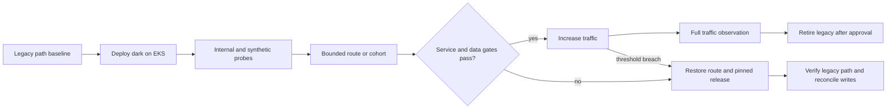

# Cutover, Validation, and Results

## Evidence standard

A container starting, a pipeline passing, and Kubernetes reporting Ready are
necessary but different claims. Migration acceptance joins application parity,
service objectives, dependency behavior, release identity, traffic path, data
integrity, security, and rollback.

The retained evidence proves the final delivery pattern and scale. It does not
contain the complete historical cutover report or replayable calculation for
the résumé's percentage outcomes. This document does not manufacture those
missing records.

## Test strategy

| Test layer | Question | Required evidence |
|---|---|---|
| Unit | Does the extracted logic behave correctly in isolation? | Versioned test result for the release commit |
| Contract | Does the new service preserve request, response, error, event, and timeout semantics? | Old/new provider and consumer results |
| Integration | Do identity, configuration, data, queues, and external systems work together? | Environment-specific test report without secrets |
| Functional parity | Can critical user journeys complete through both legacy and EKS routes? | Side-by-side synthetic and business acceptance results |
| Data integrity | Are writes, reads, backfills, ordering, and reconciliation correct? | Counts, checksums or domain invariants, and exception disposition |
| Load | Does the service meet throughput and latency objectives at steady and burst demand? | Workload profile, p50/p95/p99, errors, saturation, and resource data |
| Resilience | What happens during replica, node, zone, and dependency failure? | Recovery behavior, data result, alert, and operator action |
| Deployment | Can the pinned image/chart roll out and roll back without hidden mutation? | Rendered diff, release revision, running digest, and timed rollback |
| Security | Are images, dependencies, manifests, identities, and network paths acceptable? | Scan/policy results and approved exception record |

## Functional parity contract

Parity does not require identical implementation. It requires agreed observable
behavior:

- successful responses and domain side effects;
- validation and authorization failures;
- timeout, retry, and duplicate-request behavior;
- message and schema compatibility;
- ordering and idempotency where required;
- audit and telemetry fields needed by operations; and
- performance within the approved objective.

Known intentional differences are reviewed as product changes, not silently
accepted as migration variance.

## Traffic cutover



The route-control mechanism may be weighted traffic, a tenant allowlist,
blue/green endpoints, or a strangler route. The mechanism is chosen before the
wave and tested in both directions.

## Abort thresholds

Exact values belong to the workload's approved service objective. The release
owner stops expansion and initiates rollback when any of these occur:

- availability or error rate breaches its agreed threshold for the evaluation
  interval;
- p95 or p99 latency exceeds the objective without an understood benign cause;
- data invariants, reconciliation, ordering, or duplicate handling fail;
- dependency timeout, queue depth, saturation, or retry volume grows beyond the
  approved bound;
- new crash loops, OOM kills, sustained throttling, failed scheduling, or HPA
  instability appears;
- image, chart, source, or effective configuration cannot be reconciled;
- telemetry is missing, so the release cannot be judged safely; or
- rollback is no longer demonstrably available.

Thresholds are not invented in this public case study. A real wave packet must
contain the values, evaluation period, query, approver, and decision.

## Rollback sequence

1. Freeze further traffic and configuration change.
2. Restore the previous route, weight, or DNS target.
3. Roll back the application to the last pinned image and chart revision if the
   new release could still receive internal traffic.
4. Confirm legacy and dependency health through real request-path probes.
5. Stop incompatible writers and reconcile any dual-written or queued data
   using the pre-approved procedure.
6. Preserve logs, traces, release metadata, and timeline for diagnosis.
7. Communicate status, customer impact, and the next decision time.
8. Reopen the wave only after the fault is understood and the failed gate has a
   new test.

Rollback is not “run Helm rollback” alone. Traffic and data may have moved even
when Kubernetes returns to a prior ReplicaSet.

## Post-cutover observation

The observation window spans representative workload cycles rather than an
arbitrary quiet hour. It compares:

- successful business transactions and demand volume;
- availability, latency, and error distributions;
- CPU, memory, throttling, restarts, and autoscaling behavior;
- queue, cache, database, and external-dependency health;
- support volume and operator interventions; and
- allocated infrastructure cost under the same inclusion rules.

Legacy retirement waits until no required consumer or rollback path depends on
the old component and the agreed recovery artifact exists.

## Retained results

| Metric | Before | After | Change | Window | Evidence |
|---|---:|---:|---:|---|---|
| Application shape | Legacy monolith | More than 20 containerized service/components on EKS | Independently packaged estate established | Historical program; final snapshot retained | Current résumé plus sanitized chart/service inventory |
| Packaging and release | Coupled legacy artifact | Per-component Docker image and Helm release pattern | Standardized container delivery | Final retained snapshot | Multi-stage Dockerfiles, 20+ chart-bearing repositories, CI templates |
| Platform | Legacy deployment target | Amazon EKS with Terraform and Helm ownership boundaries | Replatformed compute and orchestration | Historical program; final mechanism retained | Current résumé and retained IaC/release patterns |
| Memory consumption | Baseline not retained | Comparison not retained | 40% lower is recorded in the résumé | Window not retained | **Historical claim, not independently verified here** |
| Compute cost | Allocation not retained | Comparison not retained | 30% lower is recorded in the résumé | Window not retained | **Historical claim, not independently verified here** |
| Deployment frequency | Not retained | Not retained | No percentage claimed | Not available | Measurement contract only |
| Rollback time | Not retained | Not retained | No duration claimed | Not available | Mechanism evidenced, performance unverified |
| Availability and latency | Not retained | Not retained | No improvement claimed | Not available | Targets required per workload |

The defensible public outcome is the delivered migration pattern and final
service scale. The memory and cost figures remain interview claims that require
the missing baseline worksheet before being promoted to verified case-study
results.

## Required measurement contract for resource and cost claims

For each matched baseline and comparison period, retain:

```text
memory intensity = aggregate service memory consumption / successful transactions
compute unit cost = eligible compute cost / successful transactions
improvement       = (baseline intensity - comparison intensity) / baseline intensity
```

The worksheet must define:

- period dates, environments, services, and time zone;
- request volume or other stable business-output denominator;
- requested, working-set, peak, and percentile memory definitions;
- included EKS control-plane and worker compute charges;
- treatment of discounts, commitments, Spot, credits, tax, and support;
- shared-cost allocation across tenants and platform services;
- migrations, demand shifts, outages, and unrelated optimizations; and
- the author, reviewer, query, source export, and reproducible calculation.

Without those fields, a percentage is not falsifiable and should not be used as
an architecture result.

## Implementation problem and correction

One recurring failure mode in the retained estate was a service that completed
its Kubernetes rollout but used an incorrect downstream endpoint or port in the
target environment. The pod was running; the user journey still failed.

| Item | Detail |
|---|---|
| Assumption | Readiness and a successful rollout meant the service was usable |
| Observed evidence | Requests failed only when the service invoked a downstream dependency |
| Root cause | A legacy/default runtime endpoint did not match the Kubernetes Service contract |
| Correction | Externalize the endpoint, set it explicitly per environment, add dependency-aware integration and synthetic tests, and verify callers and dependencies together |
| Rejected shortcut | Add the dependency to liveness and restart pods repeatedly; this would amplify a configuration or downstream incident |
| Reusable lesson | Release proof must include the effective request path, not only pod state |

## Decisions and lessons

### Incremental extraction over a big-bang rewrite

The rejected big-bang alternative offered a cleaner conceptual target but
combined application, platform, data, and traffic risk. Incremental seams kept
rollback available and produced reusable release patterns early.

### EKS over a simpler orchestrator

EKS fit the retained Kubernetes delivery model and multi-service control needs,
but it transferred continuing platform obligations to the team. The lesson is
to evaluate the operating model and handoff burden, not only the application
scheduler.

### Backward compatibility over synchronized cutover

Keeping old and new readers compatible extended the transition period but
prevented rollback from depending on reversing data. Removal follows evidence,
not deployment completion.

### Measurement before optimization claims

Containerization and service extraction can lower resource demand, but several
changes may occur together: runtime tuning, image changes, requests, node types,
traffic, and discounts. A credible cost result isolates or discloses those
effects and normalizes by business output.

## Result statement

> I led the migration pattern from a legacy monolith to a 20-plus-component
> containerized estate on Amazon EKS, standardizing Docker, Terraform, Helm, and
> CI/CD delivery while preserving incremental rollback. Retained source supports
> the final scale and implementation mechanisms. Historical résumé figures for
> memory and compute improvement are intentionally not presented as verified
> outcomes because their baseline calculation and comparison window were not
> retained.

## Implemented extensions

- [Reliability and disaster recovery modernization](4-3-reliability-and-disaster-recovery-modernization.md)
- [NGINX Ingress to Envoy Gateway modernization](4-4-nginx-ingress-to-envoy-gateway-modernization.md)
- [Sustainability and resource-efficiency review](4-5-sustainability-and-resource-efficiency-review.md)
