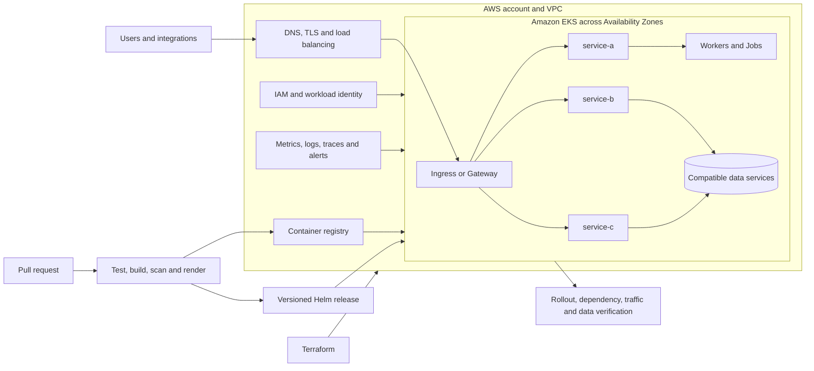

# Legacy Application Migration and Modernization to Amazon EKS

## Executive summary

**Challenge:** A legacy monolith coupled application capabilities to one release,
scaling model, and operational blast radius. The target needed to support
independent delivery and scaling without combining platform, application, data,
and traffic risk in one big-bang rewrite.

**Approach:** I led an incremental replatform-and-refactor pattern: inventory
dependencies, establish an Amazon EKS foundation with Terraform, containerize
capabilities with multi-stage Docker builds, standardize application releases
with Helm and CI/CD, preserve data compatibility, and move bounded traffic waves
with explicit abort and rollback gates.

**Outcome:** The retained evidence supports a final estate of more than 20
containerized components on EKS and the Docker, Terraform, Helm, and pipeline
mechanisms used to deliver it. The current résumé also records 40% lower memory
consumption and 30% lower compute cost, but the source baseline, comparison
window, and allocation worksheet are not retained. Those percentages are
therefore disclosed as historical claims, not presented as verified results in
this case study.

## Outcome at a glance

| Area | Defensible result |
|---|---|
| Migration scale | Legacy monolith to a 20-plus-component containerized estate |
| Target platform | Amazon EKS with Terraform-owned foundation and Helm application releases |
| Delivery model | Independently versioned images and charts with build, scan, render, deploy, rollout, and traffic gates |
| Migration strategy | Replatform first, selectively refactor by dependency seam, retain data compatibility, cut over in bounded waves |
| Security | Workload identity, external secret references, image/dependency/manifest gates, and explicit network boundaries |
| Reliability | Health contracts, resource ownership, autoscaling review, real request-path validation, and tested rollback design |
| Operations | Service ownership, dashboards, runbooks, exercises, and independent-operation acceptance criteria |
| Resource outcome | 40% memory reduction is a historical résumé claim; calculation not retained, so not independently verified here |
| Financial outcome | 30% compute-cost reduction is a historical résumé claim; allocation/window not retained, so not independently verified here |
| Claims withheld | Downtime, deployment-frequency, latency, availability, rollback-time, and formal handoff improvements are not quantified |

## Architecture



The architecture uses symbolic names and intentionally excludes internal
accounts, repositories, endpoints, IPs, and customer identifiers.

## Why EKS

EC2 would have preserved host and bespoke release ownership. ECS was a credible
simpler orchestrator, but it would have introduced another delivery model while
the target estate required Kubernetes policy, Helm packaging, mixed-runtime
workloads, independent scaling, and team investment in Kubernetes operations.

EKS was selected for the aggregate 20-plus-component platform, not for a single
service. The decision deliberately accepted responsibility for cluster and
add-on upgrades, capacity, scheduling, identity, networking, observability,
backup, and operator enablement.

## Migration flow

```text
inventory and baseline
    -> EKS and IAM foundation
        -> container and Helm contract
            -> one dependency-bounded extraction
                -> contract, load and failure tests
                    -> bounded traffic cutover
                        -> observation and handoff
                            -> legacy retirement
```

Every arrow is a gate. A built image is not a deployed release; a deployed
release is not a healthy workload; a Ready workload is not proof that traffic,
dependencies, identity, and data behave correctly.

## Key decisions and tradeoffs

| Decision | Reason | Tradeoff |
|---|---|---|
| Replatform before deep refactoring | Separated platform risk from application and data redesign | Temporary legacy models and adapters remained |
| Extract by capability and dependency seam | Created useful release and scaling boundaries | Required contract discovery and coexistence logic |
| One image and chart per deployable component | Made identity, ownership, rollback, and resources explicit | Increased repository/release count and need for shared standards |
| Retain compatible data paths during waves | Kept rollback available without immediate reverse migration | Extended expand-and-contract periods |
| Terraform for AWS/EKS, Helm for applications | Matched lifecycle and blast radius | Cross-layer changes required coordinated sequencing |
| Traffic and data proof above pod readiness | Caught integration failures that Kubernetes health alone cannot see | Added synthetic, contract, and reconciliation work |

## Implementation problem

A service could complete its Kubernetes rollout while still using a wrong
downstream endpoint inherited from a legacy/default configuration. The pods were
running, but the user journey failed when the dependency was called.

The correction was to externalize and explicitly set environment endpoints,
test the dependency contract, trace callers and dependencies together, and add a
real synthetic journey to the post-deploy gate. Adding the dependency to
liveness was rejected because restarting healthy processes would amplify a
configuration or downstream outage.

## Validation and rollback

Each wave combines:

- unit, contract, integration, functional-parity, data, load, resilience,
  deployment, and security evidence;
- pinned source, image digest, chart version, rendered manifest, and effective
  runtime identity;
- service-objective and dependency thresholds approved before cutover;
- a bounded route, tenant cohort, or traffic weight;
- route, release, and data-aware rollback; and
- an observation window covering representative business demand.

Expansion stops on service-objective breach, data-integrity failure, dependency
saturation, unhealthy scaling or scheduling, missing telemetry, release identity
mismatch, or loss of the tested rollback path.

## Results and measurement limits

The public evidence supports the platform change and final service scale. It
does not support independently replaying every historical percentage:

| Metric | Before | After | Change | Window | Evidence |
|---|---:|---:|---:|---|---|
| Application shape | Legacy monolith | 20+ containerized components on EKS | Independent packaging and release boundaries | Historical program; final snapshot retained | Résumé and sanitized source inventory |
| Delivery mechanism | Coupled legacy delivery | Docker, Terraform, Helm, and CI/CD patterns | Standardized release contract | Final retained snapshot | Source artifacts |
| Memory consumption | Not retained | Not retained | 40% lower recorded in résumé | Not retained | Historical claim only |
| Compute cost | Not retained | Not retained | 30% lower recorded in résumé | Not retained | Historical claim only |

A future verified percentage requires matched periods and a retained calculation:

```text
resource intensity = aggregate resource consumption / successful business output
unit cost          = eligible compute cost / successful business output
improvement        = (baseline - comparison) / baseline
```

The worksheet must preserve scope, dates, demand, percentiles, cost allocation,
discount treatment, confounders, source queries, and reviewers.

## Customer enablement

The target operating model assigns every service a product owner, technical
owner, on-call path, objective, dashboard, dependency map, release and rollback
runbook, data/recovery dependency, and debt exit criteria. Handoff progresses
from walkthrough to guided operation, paired execution, failure exercise,
independent deployment/rollback, and independent incident response.

The retained record does not contain a historical handoff scorecard, so this
case study defines those acceptance gates without claiming a measured training
or independence result.

## My contribution

The retained résumé and implementation estate support end-to-end leadership
across:

- application and dependency assessment;
- service-boundary and migration-wave decisions;
- multi-runtime containerization;
- Terraform/EKS and Helm ownership boundaries;
- reusable build, scan, release, and verification patterns;
- resource and health contracts;
- integration troubleshooting and rollback design; and
- the operating and evidence model needed for customer handoff.

No sole-delivery claim is made; product, application, data, security, platform,
and operations owners remain part of the responsibility model.

## Interview walkthroughs

### 90 seconds

Use the executive summary, why EKS, the incremental migration flow, and the
evidence boundary around outcomes.

### 5 minutes

Walk through the architecture, EC2/ECS/EKS decision, one service extraction,
the configuration failure, cutover gates, and customer handoff.

### 15 minutes

Use the detailed sequence below to discuss discovery evidence, target-state
tradeoffs, Terraform/Helm/pipeline implementation, parity and rollback, outcome
measurement, and independent operation.

## Detailed implementation

1. [Discovery and success criteria](1-discovery-and-success-criteria.md)
2. [Target architecture and decisions](2-target-architecture-and-decisions.md)
3. [Migration implementation](3-migration-implementation.md)
4. [Cutover, validation, and results](4-cutover-validation-and-results.md)
5. [Operations and handoff](5-operations-and-handoff.md)

Related deep dives: [GitOps platform modernization](../gitops-platform-modernization/README.md),
[EKS reliability and cost optimization](../eks-reliability-cost-optimization/README.md),
and [EKS disaster recovery](../eks-disaster-recovery/README.md).
