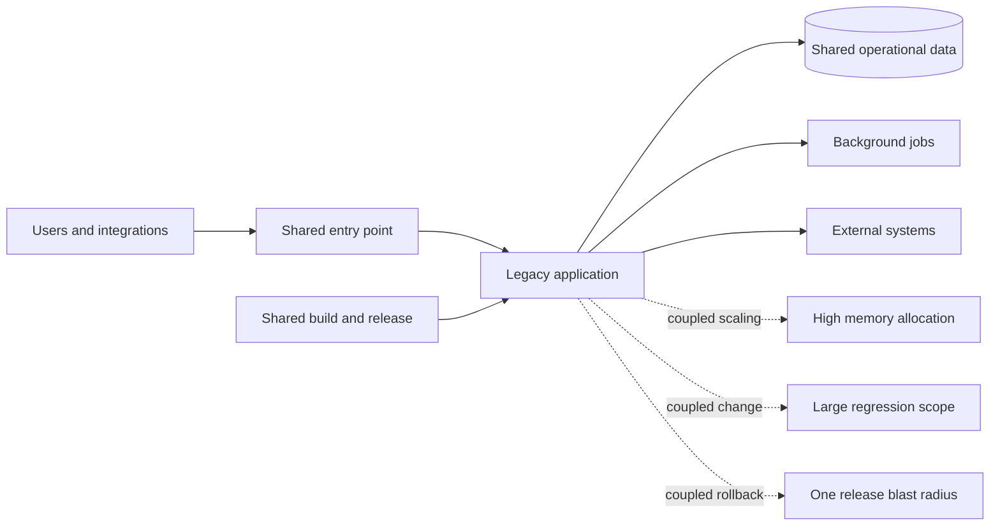

# Discovery and Success Criteria

## Abstract

This phase reconstructs the discovery that preceded the migration: what
changes together, what must remain compatible, what the target scale and peak
demand are, and whether enterprise boundaries and quotas can support them. It
classifies workloads by migration strategy, states each objective and how it
is judged, and separates retained evidence from historical claims throughout.

## Evidence boundary

This case study reconstructs a legacy-application modernization from retained
career records and sanitized implementation repositories. Those sources support
the platform scale, containerization, Helm packaging, CI/CD, and Amazon EKS
target. They do not preserve workshop minutes, a complete pre-migration
inventory, or the cost workbook behind every historical résumé metric.

The public story therefore uses three evidence labels:

- **Verified** — directly supported by retained source or inventory.
- **Historical claim** — recorded in the current résumé but missing the complete
  baseline, window, calculation, or allocation needed for independent replay.
- **Acceptance target** — the gate a delivery should establish before execution;
  it is not presented as a measured result.

All organization, workload, environment, endpoint, and account names are
symbolic.

## Problem statement

`enterprise-platform` represents a large enterprise portfolio containing a
legacy application whose components shared a release path, runtime assumptions,
and operational blast radius. Growth made the release model harder to scale: a
change to one capability could require testing and releasing the whole
application, while vertical resource allocation hid which capabilities drove
memory and compute demand. The target must also fit enterprise account,
network, identity, compliance, availability, quota, financial, and support
boundaries.

The modernization objective was not to rewrite everything. It was to establish
a production-ready EKS platform, separate deployable boundaries where that
created operational value, and move traffic in reversible increments while
preserving data and integration compatibility.

The delivery required two kinds of leadership:

- architecture leadership to turn availability, security, cost, schedule, and
  team-skill constraints into target-state decisions; and
- implementation leadership to containerize workloads, build reusable Helm and
  pipeline patterns, troubleshoot integration failures, and transfer ownership.

## Discovery record

The findings below are a sanitized reconstruction. “Retained evidence” describes
what remains available; it is not a claim that a formal workshop artifact was
produced at the time.

| Question | Finding | Architectural impact | Validation evidence |
|---|---|---|---|
| What changes together? | The legacy path coupled unrelated capabilities to one release and rollback unit | Extract services by business capability and dependency seam, not by code package alone | Final service and chart inventory; historical résumé |
| What must remain compatible? | APIs, asynchronous jobs, and shared data relationships could not all change at once | Use contract tests, backward-compatible schemas, and adapters during coexistence | Retained service dependency map and test/pipeline patterns |
| What is the target scale? | The retained final estate contains more than 20 containerized deployable components | Standardize image, chart, health, resource, and delivery conventions | More than 20 chart-bearing component repositories in the retained snapshot |
| What is the peak runtime demand? | Component count alone does not determine replicas, Jobs, rollout surge, node count, or failure-state capacity | Measure sustainable capacity per Pod and model normal peak, release, maintenance, zone-failure, and recovery concurrency | Workload profiles, load tests, HPA bounds, scheduling worksheet |
| Can the network address the target? | With the default Amazon VPC CNI, ordinary Pods consume VPC subnet addresses and warm capacity can exceed running Pod count | Reconcile Pod demand with instance ENI/IP limits, kubelet `maxPods`, CNI mode, per-AZ subnet space, replacement capacity, and other VPC consumers | Per-AZ IP worksheet, CNI decision, subnet and failure-state tests |
| Can enterprise boundaries and quotas support it? | Trust, regulation, blast radius, lifecycle, account quotas, and operating ownership can require multiple accounts or clusters | Decide account/cluster/tenant boundaries and approve quota increases before dependent waves | Topology ADR, quota register, risk and control approvals |
| What constrains the platform choice? | Multiple runtimes, independent scaling needs, Kubernetes experience, and workload-isolation requirements | Compare EC2, ECS, and EKS; accept EKS operational complexity only where it provides needed controls | Dockerfiles, Helm charts, autoscaling and network-policy templates |
| Where does configuration live? | Runtime-specific endpoints, credentials, and environment values must differ without rebuilding images | Externalize non-secret configuration and reference externally managed Secrets | Helm values and environment-driven application configuration |
| How is a release proved? | A built image or successful pipeline stage does not prove a healthy service | Separate build, render, deploy, rollout, dependency, and traffic gates | Multi-stage pipelines, chart tests, probes, and rollout patterns |
| What cost evidence exists? | The résumé records 40% lower memory and 30% lower compute cost, but the underlying worksheet is not retained | Do not use either percentage as a verified public result; define a reproducible measurement contract | Current résumé plus evidence-gap review |
| Can the customer operate the target? | More services increase ownership and diagnosis demands | Make runbooks, dashboards, rollback exercises, and independent operation part of acceptance | Handoff criteria defined in this case study; historical completion record not retained |

## Current-state architecture

This diagram is a problem model, not a forensic reproduction of the original
network. The defensible facts are the legacy-monolith starting point and the
20-plus-service EKS destination. Exact host counts, instance types, traffic,
latency, release frequency, and outage history are not retained.

## Workload classification

The migration used different strategies for different lifecycle boundaries.
This avoided turning one platform migration into a simultaneous rewrite of
application logic, data, and operations.

| Workload or capability | Strategy | Reason | Exit condition |
|---|---|---|---|
| Stable application capability with a clear boundary | Replatform, then selectively refactor | Container and platform value did not require an immediate rewrite | Runs from an immutable image with independent health and rollback |
| Capability with independent load or release cadence | Refactor | Separate scaling and deployment reduced the monolith blast radius | Contract tests pass and traffic can be routed independently |
| Shared data store during early waves | Retain | Moving compute and data together would compound recovery risk | New services use compatible access paths; later data migration has its own plan |
| Scheduled or background processing | Replatform | Kubernetes Jobs or workers create explicit ownership and retry behavior | Idempotency, retry, and dead-letter behavior are tested |
| Duplicate or unused feature | Retire after observation | Avoid paying to migrate unused behavior | Owner approval, no observed use, and a recoverable archive |
| Commodity capability | Repurchase only after fit analysis | A managed product may reduce ownership, but can introduce lock-in and data movement | Security, integration, cost, and exit requirements are accepted |

## Objectives and success criteria

Targets should be approved before the first production wave. The entries below
separate what the retained evidence proves from the delivery controls that the
historical record cannot quantify.

| Objective | Acceptance test | Evidence status |
|---|---|---|
| Establish independently deployable services | Each in-scope capability has an immutable image, versioned chart, owner, health contract, and rollback revision | Verified for the retained final-state pattern; 20+ components |
| Preserve functional behavior | Critical user journeys and service contracts pass against legacy and EKS paths | Acceptance target; complete historical report not retained |
| Bound downtime | Approve an outage budget and abort threshold per traffic wave | Acceptance target; no public duration claimed |
| Make rollback routine | Restore the previous image and chart revision inside the approved recovery window | Mechanism evidenced; historical timing series not retained |
| Protect service objectives | Error rate, p95 latency, saturation, queue depth, and dependency health stay inside agreed thresholds | Acceptance target; no public SLO result claimed |
| Reduce memory demand | Compare matched workload windows and record aggregate requested and used memory per successful business transaction | Résumé records 40%; calculation not retained, so unverified here |
| Reduce compute cost | Compare allocated EKS compute over matched periods, normalized by business output | Résumé records 30%; allocation and window not retained, so unverified here |
| Pass security gates | No unresolved release-blocking image, dependency, manifest, credential, or access finding | Pipeline capability evidenced; no zero-vulnerability claim |
| Prove operational readiness | On-call team completes deploy, rollback, scale, dependency-failure, and incident exercises without delivery-team intervention | Handoff target; historical sign-off not retained |

## Scope

### In scope

- workload inventory and dependency mapping;
- enterprise portfolio, organizational readiness, business-case, and migration-wave assessment;
- Pod, node, IP, subnet, storage, control-plane, downstream, and service-quota capacity modeling;
- account, Region, cluster, tenant, environment, security, and compliance boundary decisions;
- service-boundary and migration-wave decisions;
- containerization and runtime configuration;
- Amazon EKS foundation and workload identity boundaries;
- reusable Helm charts and CI/CD quality gates;
- incremental traffic movement, verification, and rollback;
- observability, resource ownership, runbooks, and enablement; and
- measurement definitions for reliability, resource use, and cost.

### Deferred or separately governed

- rewriting every capability in a new language or framework;
- changing every data store during the compute migration;
- adopting every possible AWS managed service;
- organization-wide GitOps transformation;
- fleet-wide cost optimization after migration; and
- disaster-recovery implementation beyond migration rollback.

Those deeper concerns have separate case studies: [GitOps platform
modernization](../gitops-platform-modernization/README.md), [EKS reliability and
cost optimization](../eks-reliability-cost-optimization/README.md), and [EKS
disaster recovery](../eks-disaster-recovery/README.md).

## Primary risks and assumptions

| Risk or assumption | Test or mitigation | Owner |
|---|---|---|
| Hidden coupling appears after extraction | Trace calls, compare behavior, and keep an adapter or legacy route until parity passes | Application lead |
| Shared schema change breaks the old path | Expand first, deploy compatible readers, migrate data, then contract | Data owner |
| A pod is Ready but a dependency is wrong | Add synthetic user journeys and downstream checks; do not rely on readiness alone | Service owner |
| EKS adds more operational complexity than the team can absorb | Standardize charts and runbooks, pair during waves, and test independent operation | Platform lead and customer operations |
| Lower requests change HPA behavior or stability | Load-test request and autoscaling changes together | Service and platform owners |
| Peak, rollout, or failure-state Pods exhaust node or subnet IP capacity | Model Pods and CNI address reservations per node and AZ; validate surge, replacement, and zone-loss scenarios | Platform and network owners |
| Required AWS capacity or quota is unavailable when a wave scales | Maintain a regional quota/throttle register and require approved increases or a tested fallback before entry | Platform owner and cloud governance |
| Shared cluster or account boundaries create an unacceptable blast radius | Decide topology from trust, regulation, lifecycle, scale, and recovery independence; use a cluster as the strong isolation boundary | Enterprise, security, and platform architects |
| Migration and optimization results are conflated | Freeze separate baselines and attribute each change to a bounded wave | Program owner and finance partner |

## Exit criteria
Discovery is complete only when every first-wave workload has an owner,
dependency map, data classification, target strategy, acceptance criteria,
rollback path, and evidence location. The approved enterprise assessment must
also reconcile tested replica demand with Pod, node, CNI/IP, per-AZ subnet,
storage, downstream, control-plane, and quota capacity for peak, release,
maintenance, failure, and recovery states. Account, cluster, tenant, identity,
security, compliance, reliability, cost, and operating-model decisions must have
owners and evidence. Unknowns are allowed, but each one must have an owner,
decision deadline, affected wave, and safe fallback before it can affect
production traffic.

## Implemented extension

- [Enterprise migration and Amazon EKS readiness assessment](1-1-enterprise-assessment.md) — portfolio and application assessment, Pod/node/IP capacity, quotas, tenancy, security, reliability, operations, business case, wave scoring, and production entry gates.
- [Migration discovery and tracking tooling](1-5-migration-discovery-and-tracking-tooling.md) — collector selection, portfolio reconciliation, dependency evidence, application grouping, and migration-status governance.
