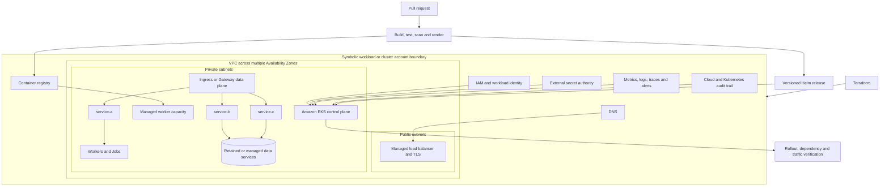

# Target Architecture and Decisions

## Abstract

This phase derives the target from a concrete requirement: more than 20
independently packaged components, multiple runtimes, uneven scaling, and
tenant isolation, all inside approved account, Region, network, compliance,
quota, and support boundaries. It compares EC2, Amazon ECS, and Amazon EKS
before selecting a platform, then records the AWS architecture, traffic,
identity, capacity, and ownership boundaries as decisions with their rejected
alternatives.

## Decision frame

The enterprise target had to support more than 20 independently packaged
components, multiple runtimes, uneven scaling, tenant and workload isolation,
reversible releases, and a team already investing in Kubernetes delivery
patterns. It also had to fit approved account, Region, network, compliance,
quota, failure-domain, and support boundaries. The platform decision followed
those requirements; EKS was not selected simply because Kubernetes was
available.

## Target-platform comparison

| Option | Strengths | Constraints for this migration | Decision |
|---|---|---|---|
| EC2 with an instance-based scheduler | Maximum host control and simplest conceptual continuation from virtual machines | Preserves host patching, placement, and bespoke release automation; weakens per-service portability and scaling consistency | Rejected as the application target; retained only for dependencies that could not yet move |
| Amazon ECS | AWS-native orchestration with a smaller Kubernetes operating surface | Would require a second application and operating model while the retained delivery estate already used Helm and Kubernetes controls | Viable alternative, rejected for this program context |
| Amazon EKS | Portable Kubernetes API, Helm ecosystem, workload-level policy, independent scaling, and a common control plane for mixed runtimes | Adds cluster upgrades, add-ons, capacity, policy, observability, and Kubernetes skill requirements | Selected with standardized platform ownership and handoff gates |

EKS was justified by the aggregate estate. A single small service would not have
earned this complexity.

## Target AWS architecture



This diagram shows one symbolic cluster-account cell. An enterprise deployment
can repeat the cell across accounts, environments, Regions, or isolation
boundaries when required by trust, compliance, lifecycle, quota, or recovery
independence. Only components that answer a requirement are shown. A specific
managed database, CDN, WAF, service mesh, Spot strategy, or GitOps controller is
not claimed as part of the original migration unless separately evidenced.

## Network and traffic boundaries

- Worker nodes and workload endpoints run in private subnets; public exposure is
  through a controlled load-balancing path.
- Security groups and Kubernetes NetworkPolicies restrict flows by purpose.
- DNS and TLS changes are versioned as cutover steps with their own rollback.
- Egress is explicit for package, identity, and required external-service paths;
  unrestricted application egress is not a default.
- Each migration wave exposes only the route or capability being moved. The
  legacy route remains available until the observation gate passes.
- Pod address demand is modeled separately from application replica demand.
  Per-AZ subnet plans include VPC CNI warm allocation, node ENIs, load balancers,
  endpoints, EKS-managed interfaces, upgrade replacement, failure recovery,
  other VPC consumers, and an approved operational reserve.
- Instance types, kubelet `maxPods`, secondary-IP or prefix mode, Security Groups
  for Pods, storage attachments, and resource requests reconcile to one tested
  effective Pod capacity per node pool.

The exact subnet ranges, endpoints, certificate identifiers, and account
details are intentionally excluded.

## Identity and secret boundaries

Human and workload credentials have different lifecycles:

```text
human -> federated AWS role -> cluster authorization -> approved operation
pod   -> Kubernetes ServiceAccount -> workload identity -> scoped AWS API
app   -> Secret reference -> external secret authority -> runtime value
```

Images and Helm values contain no long-lived credentials. Each service receives
its own ServiceAccount and only the AWS permissions required by that workload.
Secret names and configuration structure may be versioned; secret values stay
outside source control and are redacted from logs and pipeline output.

## Capacity and reliability design

The scheduler, autoscaler, and application health contract form one control
loop:

- replica demand is derived from measured sustainable capacity per Pod and an
  availability floor, then tested at normal peak, release surge, maintenance,
  zone failure, and recovery concurrency;
- requests represent schedulable demand and must be based on workload evidence;
- limits protect shared capacity but must not create sustained CPU throttling or
  unsafe memory pressure;
- HPA thresholds are reviewed together with requests because utilization is
  request-relative;
- readiness gates traffic, liveness detects irrecoverable runtime failure, and
  startup probes protect slow initialization;
- multiple replicas, topology spread, and disruption budgets are applied where
  the workload and recovery objective justify them; and
- node and Availability Zone failure tests precede claims of resilience.

The capacity design is accepted only when every scenario fits all applicable
constraints at the same time:

```text
effective Pods per node = minimum of:
  kubelet maxPods
  VPC CNI ENI/IP capacity
  CPU, memory and ephemeral-storage capacity
  ENI, volume, device and tested operating constraints

subnet demand = Pod addresses and CNI warm capacity
              + node and additional ENIs
              + load balancers, endpoints and EKS-managed interfaces
              + shared VPC consumers
              + replacement, failure and growth reserve
```

Capacity is calculated per Availability Zone. Free IPs or nodes in one zone do
not make another zone schedulable. Quota checks use the actual target account
and Region, and an increase is counted only after approval and readback.

Stateful dependencies require separate backup, restore, placement, and data
integrity decisions. Running a stateful component on EKS does not make it
resilient by itself.

## Ownership model

| Layer | Primary owner | Change mechanism | Runtime proof |
|---|---|---|---|
| VPC, EKS, node capacity, IAM | Platform team | Reviewed Terraform plan and apply | AWS inventory plus cluster/node readiness |
| Cluster add-ons and ingress | Platform team | Pinned Helm or infrastructure workflow | Controller readiness and effective traffic |
| Application image | Service team | CI-built immutable digest | Registry metadata and running image digest |
| Application chart and configuration | Service team with platform guardrails | Versioned Helm values and templates | Rendered diff, release revision, and workload spec |
| Credentials | Security or secret-system owner | External rotation workflow | Reference and authorization test, never value output |
| Data schema | Data/application owner | Backward-compatible migration workflow | Schema, integrity, and old/new reader tests |
| DNS and traffic weight | Release owner | Approved cutover step | Real request-path probes and telemetry |
| Service objectives and alerts | Service owner | Versioned monitoring configuration | Dashboard, alert test, and runbook link |

## Key decisions

Each record below states the decision, what it displaced, what it cost, and how
a violation would be caught. Dates are not retained: these decisions predate
this repository and are reconstructed from the retained implementation, so the
record admits the gap rather than inventing a timestamp.

### ADR 1: Replatform before deep refactoring

**Status:** Accepted · **Date:** Not retained, reconstructed from the retained
implementation · **Owner:** Migration architect

**Context:** The legacy path coupled unrelated capabilities to one release and
rollback unit. Shared application, data, and release dependencies meant a
single rewrite could not be validated incrementally, and a failure would have
had no bounded rollback target.

**Decision:** Establish a container and EKS operating contract first, then
extract capabilities in bounded waves.

**Rejected alternatives:** Rewrite the monolith and move platforms in one
event. Rejected because platform risk and application redesign risk would have
arrived together, with no way to attribute a failure to either.

**Tradeoff:** Some services initially carry legacy models or adapters. That is
intentional technical debt, and each item has an owner and a removal criterion.

**Reversal trigger:** A capability whose legacy model blocks its own wave from
meeting acceptance criteria is refactored before migration rather than after.

**Compliance:** Wave entry review rejects a scope that changes platform and
application architecture in the same release. Every retained adapter appears in
the debt register with an owner and exit criterion.

### ADR 2: One independently versioned image and chart per service

**Status:** Accepted · **Date:** Not retained, reconstructed from the retained
implementation · **Owner:** Platform lead

**Context:** More than 20 deployable components had to scale, release, fail,
and roll back independently. A shared artifact makes ownership, resource
attribution, and rollback revision ambiguous at exactly the moment they matter.

**Decision:** Give each deployable component an immutable image, Helm release,
resource contract, health contract, and owner.

**Rejected alternatives:** Keep one large image, or one coupled chart covering
all components. Rejected because a single artifact reintroduces the coupled
release unit the migration existed to remove.

**Tradeoff:** Repository and release count grows, and shared templates plus
policy checks become mandatory to prevent per-service drift.

**Reversal trigger:** If template drift outpaces the value of independence for
a group of components, they are consolidated behind one owner rather than left
to diverge.

**Compliance:** The pipeline rejects a component without its own chart version
and image digest. The release inventory reconciles chart count against the
component register.

### ADR 3: Retain data compatibility during compute migration

**Status:** Accepted · **Date:** Not retained, reconstructed from the retained
implementation · **Owner:** Data owner

**Context:** Several components shared operational data and integration
dependencies. Moving compute and data in the same cutover would have made
rollback depend on a reverse data migration under time pressure.

**Decision:** Use expand-and-contract schemas, compatible clients, and adapters
while the legacy and EKS paths coexist.

**Rejected alternatives:** Move every data store and schema in the same
cutover. Rejected because it converts a routing rollback into a data recovery
operation.

**Tradeoff:** Compatibility code lives longer than the wave that required it,
but rollback stays a traffic decision rather than a restore.

**Reversal trigger:** A schema whose compatibility window cannot close within
the agreed debt horizon is escalated to a dedicated data migration wave.

**Compliance:** Schema changes pass an expand-and-contract review, and contract
tests exercise old and new readers against the same store before the wave.

### ADR 4: Helm as the application release contract

**Status:** Accepted · **Date:** Not retained, reconstructed from the retained
implementation · **Owner:** Platform lead

**Context:** Replicas, image identity, Service definition, configuration,
resources, health, autoscaling, and policy were being set inconsistently per
service, which made release behavior unpredictable across teams.

**Decision:** Standardize those concerns through reviewed charts.

**Rejected alternatives:** Hand-maintained manifests with imperative
per-service commands. Rejected because effective runtime state then has no
reviewable source.

**Tradeoff:** Templates can hide unsafe defaults, so every release must render
and validate the effective manifest rather than trusting the chart.

**Reversal trigger:** A chart abstraction that obscures more than it
standardizes is flattened back to explicit values.

**Compliance:** Every release renders the effective manifest and fails on drift
from the reviewed chart. Imperative cluster changes are detected and reconciled.

### ADR 5: Separate infrastructure and application lifecycles

**Status:** Accepted · **Date:** Not retained, reconstructed from the retained
implementation · **Owner:** Platform lead

**Context:** AWS and EKS foundations change rarely and with wide blast radius,
while application releases change often with narrow blast radius. One pipeline
for both would force every application release through an infrastructure
approval.

**Decision:** Terraform owns AWS and EKS foundations; application releases own
their image and Helm revisions.

**Rejected alternatives:** One pipeline applies infrastructure and every
application in a single blast radius. Rejected because it couples release
cadence to the slowest-moving layer and widens the failure domain.

**Tradeoff:** Cross-layer changes need an explicit compatibility sequence and a
named release owner instead of arriving atomically.

**Reversal trigger:** A change class that repeatedly requires coordinated
cross-layer sequencing is a signal to move that boundary, not to merge the
pipelines.

**Compliance:** Terraform and application pipelines hold separate state,
credentials, and approvers. A pipeline that applies both layers fails review.

### ADR 6: Select enterprise boundaries before sizing the cluster

**Status:** Accepted · **Date:** Not retained, reconstructed from the retained
implementation · **Owner:** Enterprise, security, and platform architects

**Context:** Trust, regulatory scope, blast radius, lifecycle, quota, network,
recovery, and ownership requirements determine how many clusters and accounts
are needed. Sizing a cluster before those are settled produces a number that
must be discarded.

**Decision:** Define account, environment, Region, cluster, tenant, and
namespace boundaries from those requirements before final cluster sizing.

**Rejected alternatives:** Put the entire enterprise portfolio into one shared
cluster and rely on namespaces as the only isolation boundary. Rejected because
a namespace is a logical control, not an equivalent security or lifecycle
boundary.

**Tradeoff:** Multiple cluster-account cells increase platform duplication and
fleet-management work. A single large cluster reduces duplication but increases
shared lifecycle, control-plane, quota, and blast-radius consequences.

**Reversal trigger:** Cells whose isolation requirement no longer applies are
candidates for consolidation, with the accepted blast radius recorded.

**Compliance:** The topology and tenancy decision record must be approved
before cluster sizing is finalized. The quota register is reviewed at every
wave entry.

## Security, reliability, and cost review

This is an architecture review against relevant AWS Well-Architected concerns,
not a claim that a formal Well-Architected Review was performed.

| Concern | Design response | Evidence needed before production |
|---|---|---|
| Least privilege | Service-specific workload identity and namespace authorization | Denied unauthorized action and successful required action |
| Software supply chain | Pinned bases, multi-stage builds, dependency/image/manifest scanning, immutable tags or digests | Signed release evidence and disposition of blocking findings |
| Network isolation | Private workloads, controlled ingress/egress, security groups, NetworkPolicies | Allowed and denied flow tests |
| Availability | Multiple replicas where justified, probes, topology, disruption controls, autoscaling | Load, node-failure, and zone-failure results |
| Recovery | Versioned releases, backward-compatible data change, tested rollback, separate backups | Timed rollback and restore exercises |
| Resource efficiency | Requests from representative percentiles and concurrency; matched cost allocation | Before/after resource and unit-cost worksheet |
| Operability | Standard dashboards, alerts, runbooks, ownership, and escalation | Independent incident and deployment exercises |

## Complexity accepted with EKS

The EKS choice creates continuing obligations: Kubernetes and add-on upgrades,
node capacity, pod scheduling, workload identity, admission and network policy,
observability, backup, and operator training. The target architecture is complete
only when those responsibilities have owners and tested procedures; a healthy
control plane alone is not the outcome.

## Implemented extensions

- [Workload identity and secrets modernization](2-5-workload-identity-and-secrets-modernization.md)
- [Software supply chain and runtime security](2-6-software-supply-chain-and-runtime-security.md)
- [Amazon EKS multi-tenancy and governance](2-7-eks-multi-tenancy-and-governance.md)
- [VMware rehost or relocate bridge to Amazon EKS](2-8-vmware-rehost-relocate-bridge-to-eks.md)
