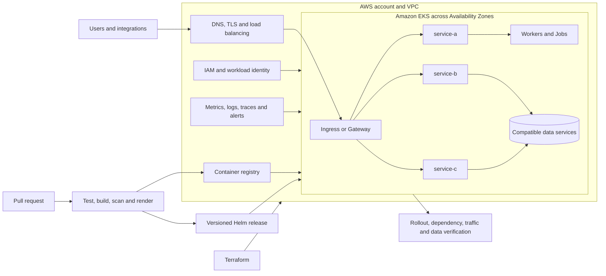

# On-Premises Monolith Migration and Modernization to Amazon EKS

## Abstract

A legacy monolith coupled application capabilities to one release, one scaling
model, and one operational blast radius. This solution replatforms and
selectively refactors it onto Amazon EKS inside a large enterprise portfolio,
where independent delivery must still respect account, network, security,
compliance, quota, reliability, and operating-model constraints.

The approach is incremental: inventory dependencies, establish an EKS
foundation with Terraform, containerize capabilities, standardize releases
with Helm and CI/CD, preserve data compatibility, and move bounded traffic
waves with explicit abort and rollback criteria. No step combines every risk
into one rewrite.

This lifecycle assumes the source has no approved production container image,
Helm release, or Kubernetes operating contract, so containerization and
capability extraction are mandatory work rather than optional steps. If the
source already runs containerized workloads on Kubernetes and only the cluster
platform changes, use the [self-managed Kubernetes to Amazon EKS
solution](../migrate-kubernetes-to-eks/README.md) instead.

## Architecture

The architecture uses symbolic names and excludes internal accounts,
repositories, endpoints, addresses, and customer identifiers.

## Key decisions

Each decision below had a defensible alternative. The reasoning, evidence, and
removal criteria are recorded as ADRs in [target architecture and
decisions](2-target-architecture-and-decisions.md).

| Decision | Rejected alternative | Why it won | What it cost |
|---|---|---|---|
| Amazon EKS as the application platform | Amazon ECS, or EC2 with an instance-based scheduler | Mixed runtimes, uneven scaling, workload-level policy, and an estate already invested in Helm and Kubernetes controls | Cluster upgrades, add-ons, capacity, policy, observability, and Kubernetes skill obligations. A single small service would not have earned this |
| Replatform first, refactor by dependency seam | Rewrite the monolith and change platform in one event | Shared application, data, and release dependencies made a single rewrite hard to validate and impossible to roll back cleanly | Some services carry legacy models and adapters as intentional debt with a named owner and removal criterion |
| Decide account, cluster, and tenant boundaries before sizing | One shared enterprise cluster with namespaces as the isolation boundary | Trust, regulatory scope, blast radius, lifecycle, quota, and recovery independence do not fit inside a namespace | More cluster-account cells mean platform duplication and fleet-management work |
| Retain data compatibility through the compute migration | Move every data store and schema in the same cutover | Rollback stays a routing decision instead of a reverse data migration | Expand-and-contract compatibility code lives longer than the wave that needed it |
| One immutable image and Helm release per component | One large image, or one coupled chart for all components | Makes identity, ownership, resources, health, and rollback revision explicit per component | Repository and release count grows; shared templates and policy checks are required to stop drift |
| Separate infrastructure and application lifecycles | One pipeline applies Terraform and every application together | Blast radius matches the layer that changed, and application teams release without an infrastructure apply | Cross-layer changes need an explicit compatibility sequence and a named release owner |
| Require request-path and data proof above Pod readiness | Treat a successful rollout and Ready Pods as release success | A service passed its rollout while calling a wrong downstream endpoint inherited from a default configuration; readiness could not see it | Synthetic journeys, contract tests, and reconciliation checks must be built and maintained |

The last row is the one to ask about. Adding the dependency to a liveness probe
was rejected: restarting healthy processes would have amplified a configuration
or downstream outage rather than containing it. The correction and its
reasoning are in [cutover, validation, and
results](4-cutover-validation-and-results.md).

## Results and claim boundary

The public evidence supports the platform change and the final service scale.
It does not support replaying every historical percentage.

| Metric | Before | After | Evidence |
|---|---|---|---|
| Application shape | Legacy monolith | 20+ containerized components on EKS | Résumé and sanitized source inventory |
| Delivery mechanism | Coupled legacy delivery | Docker, Terraform, Helm, and CI/CD patterns | Retained source artifacts |
| Memory consumption | Not retained | Not retained | Résumé records 40% lower; calculation not retained |
| Compute cost | Not retained | Not retained | Résumé records 30% lower; allocation and window not retained |

A future verified percentage requires matched periods and a retained
worksheet. The measurement contract, including the normalization formulas and
the required worksheet fields, is defined in [cutover, validation, and
results](4-cutover-validation-and-results.md).

## Phases

0. [Solution context and requirements](0-solution-context-and-requirements.md)
1. [Discovery and success criteria](1-discovery-and-success-criteria.md)
2. [Target architecture and decisions](2-target-architecture-and-decisions.md)
3. [Migration implementation](3-migration-implementation.md)
4. [Cutover, validation, and results](4-cutover-validation-and-results.md)
5. [Operations and handoff](5-operations-and-handoff.md)

## Extensions

Extensions are decision-gated. A design or assessment is not presented as an
implemented production result, and adopting every listed technology is not a
requirement.

| Phase | Extensions |
|---|---|
| 1 Assess | [Enterprise EKS readiness assessment](1-1-enterprise-assessment.md) · [Discovery and tracking tooling](1-5-migration-discovery-and-tracking-tooling.md) |
| 2 Design | [Workload identity and secrets](2-5-workload-identity-and-secrets-modernization.md) · [Supply chain and runtime security](2-6-software-supply-chain-and-runtime-security.md) · [Multi-tenancy and governance](2-7-eks-multi-tenancy-and-governance.md) · [VMware rehost or relocate bridge](2-8-vmware-rehost-relocate-bridge-to-eks.md) |
| 3 Execute | [Testing, CI/CD, and GitOps](3-4-automated-testing-cicd-and-gitops.md) · [Database modernization](3-5-database-modernization.md) · [Serverless and event-driven extraction](3-6-serverless-and-event-driven-extraction.md) · [Service mesh and east-west traffic](3-7-service-mesh-and-east-west-traffic.md) · [Industry-specific workloads](3-8-industry-specific-workload-architecture.md) |
| 4 Validate | [Reliability and disaster recovery](4-3-reliability-and-disaster-recovery-modernization.md) · [NGINX Ingress to Envoy Gateway](4-4-nginx-ingress-to-envoy-gateway-modernization.md) · [Sustainability and resource efficiency](4-5-sustainability-and-resource-efficiency-review.md) |
| 5 Operate | [Karpenter compute and elasticity](5-2-karpenter-compute-and-elasticity-modernization.md) · [Workload autoscaling](5-3-workload-autoscaling-modernization.md) · [FinOps and cost optimization](5-4-eks-finops-and-cost-optimization.md) · [Observability and SRE operating model](5-5-observability-and-sre-operating-model.md) · [Lifecycle and upgrade engineering](5-6-eks-lifecycle-and-upgrade-engineering.md) · [Platform engineering and golden paths](5-7-platform-engineering-and-golden-paths.md) · [Agentic AIOps with Amazon Bedrock](5-8-agentic-aiops-with-amazon-bedrock.md) · [Customer expansion roadmap](5-9-customer-expansion-and-modernization-roadmap.md) |

## Related solutions

[GitOps platform modernization](../gitops-platform-modernization/README.md),
[EKS reliability and cost optimization](../eks-reliability-cost-optimization/README.md),
[EKS disaster recovery](../eks-disaster-recovery/README.md),
[database migration and modernization](../database-migration-modernization/README.md),
[serverless application modernization](../serverless-application-modernization/README.md),
and [Agentic AIOps](../agentic-aiops-bedrock/README.md).
