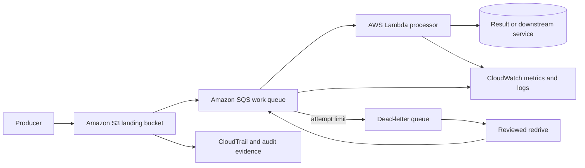

# Serverless Application Modernization

## Abstract

This solution replaces a synchronous report-processing dependency with an
event-driven AWS design: objects arrive in Amazon S3, events are buffered by
Amazon SQS, AWS Lambda validates and processes each object, and failures move to
a dead-letter queue for controlled replay. Amazon CloudWatch provides workload
and business-flow telemetry.

The design addresses duplicate delivery, burst absorption, downstream limits,
poison messages, traceability, and rollback. It is supported by a working
Lambda-based reconciliation component elsewhere in the platform estate and by
an implementation-ready migration lab. It is not presented as a completed
end-to-end customer modernization.

## Evidence standard

| Area | Status | Evidence or limit |
|---|---|---|
| Lambda operating pattern | Partial implementation | A platform reconciliation Lambda demonstrates bounded automation and AWS integration |
| Report-processing architecture | Designed | S3, SQS, Lambda, failure handling, observability, and IAM boundaries are specified |
| Infrastructure templates | Partial | Migration-lab artifacts exist, but a customer deployment record is absent |
| Idempotency and replay tests | Planned acceptance gate | Test contracts are defined; execution evidence is not claimed |
| Performance and cost outcome | Not measured | No production traffic baseline or post-migration result exists |
| Production cutover | Not performed | Cutover, rollback exercise, and operational acceptance remain required |

## Architecture

The queue is the load-leveling and retry boundary. Lambda is stateless and
idempotent. A stable object version or business key prevents duplicate side
effects. Concurrency is capped according to downstream capacity rather than
left to scale without constraint.

## Intended customer outcomes

- Producers no longer wait for synchronous report processing.
- Bursts are buffered and made visible instead of overwhelming consumers.
- Duplicate, failed, and poison events have explicit handling paths.
- Operators can measure backlog age, processing success, throttling, and replay.
- Each component has least-privilege access and a documented data-retention
  boundary.

These are acceptance targets, not claimed measured outcomes.

## Key decisions

| Decision | Reason | Tradeoff |
|---|---|---|
| SQS between S3 and Lambda | Buffer bursts and isolate producer from consumer capacity | Adds asynchronous delay and queue operations |
| Idempotency key from durable business identity | Handle at-least-once delivery safely | Requires a durable deduplication record |
| Bounded retries plus DLQ | Prevent infinite poison-message loops | Requires owned replay operations |
| Reserved concurrency | Protect databases and partner APIs | Backlog may grow during peaks |
| Immutable source object/version | Make replay and audit deterministic | Requires lifecycle and storage controls |
| Separate deployment and release gates | Make cutover reversible | Temporary parallel operation adds complexity |

## Phases

1. [Problem and success criteria](1-problem-and-success-criteria.md)
2. [Architecture and decisions](2-architecture-and-decisions.md)
3. [Implementation](3-implementation.md)
4. [Validation and results](4-validation-and-results.md)
5. [Operations and handoff](5-operations-and-handoff.md)

## References

- AWS Serverless Applications Lens, [Event-driven architectures](https://docs.aws.amazon.com/wellarchitected/latest/serverless-applications-lens/event-driven-architectures.html)
- AWS Lambda Developer Guide, [Best practices for working with AWS Lambda functions](https://docs.aws.amazon.com/lambda/latest/dg/best-practices.html)
- AWS Lambda Developer Guide, [Understanding application design](https://docs.aws.amazon.com/lambda/latest/dg/concepts-application-design.html)
